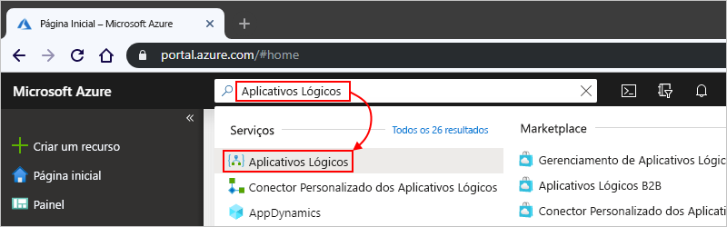
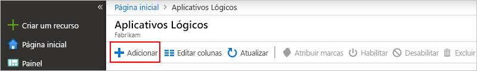
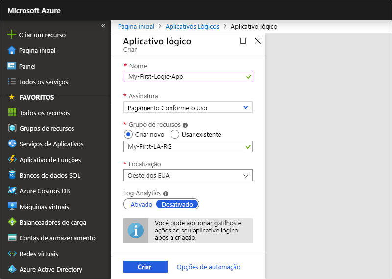
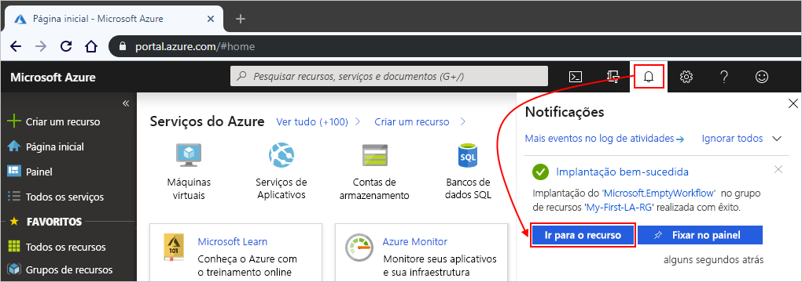
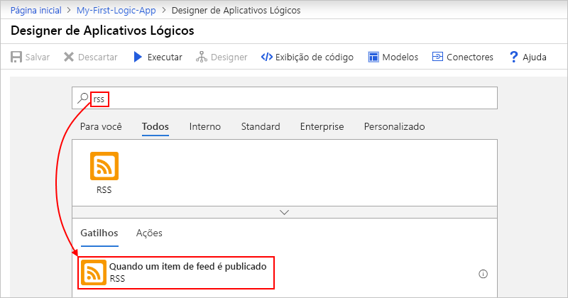
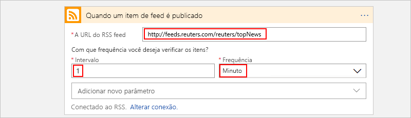
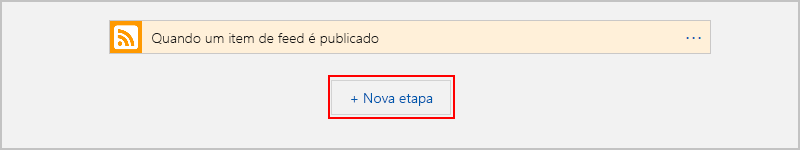
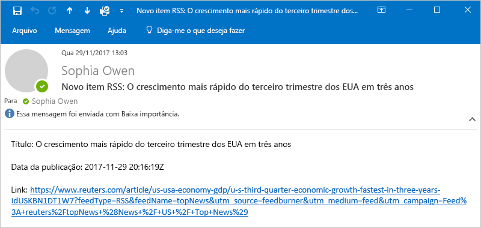
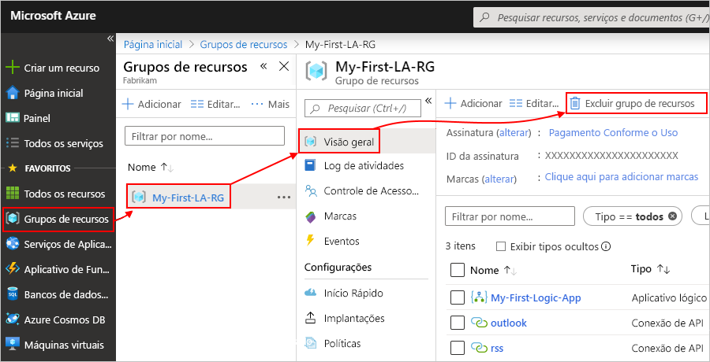
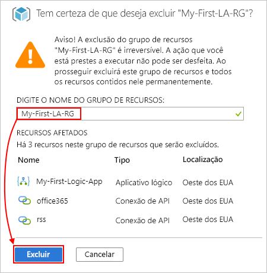

# Início Rápido: Criar seu fluxo de trabalho de Aplicativos Lógicos – portal do Azure

Este guia de início rápido explica como criar seu primeiro fluxo de trabalho em [Aplicativos Lógicos do Azure](logic-apps-overview.md) por meio do [portal do Azure](https://portal.azure.com). Este guia introdutório também explica os conceitos básicos do serviço de Aplicativos Lógicos, incluindo como criar um aplicativo lógico, adicionar um gatilho e uma ação ao seu aplicativo lógico e testá-lo. Siga este início rápido para criar um aplicativo lógico de exemplo que verifica regularmente um RSS feed e envia uma notificação por email quando há novos itens. A seguinte captura de tela mostra o fluxo de trabalho de alto nível deste aplicativo lógico de exemplo:

Se você quiser aprender a criar e gerenciar seu primeiro aplicativo lógico por meio de outras interfaces e aplicativos, confira estes outros guias de início rápido de Aplicativos Lógicos: 

* [Criar e gerenciar aplicativos lógicos usando a CLI do Azure (Interface de linha de comando do Azure)](quickstart-logic-apps-azure-cli.md)
* [Criar e gerenciar aplicativos lógicos no Visual Studio Code](quickstart-create-logic-apps-visual-studio-code.md)
* [Criar e gerenciar aplicativos lógicos no Visual Studio](quickstart-create-logic-apps-with-visual-studio.md)

## Pré-requisitos

* Uma conta e uma assinatura do Azure. Caso não tenha uma, [inscreva-se para obter uma conta do Azure gratuita](https://azure.microsoft.com/free/?WT.mc_id=A261C142F).

* Uma conta de email de um serviço com suporte dos Aplicativos Lógicos (como o Outlook do Office 365 ou o Outlook.com). Para outros fornecedores de email com suporte, [examine a lista de conectores](/connectors/).

    > [!IMPORTANT]
    > Se você estiver usando o [conector do Gmail](/connectors/gmail/), observe que apenas contas do G Suite podem usar esse conector sem restrição nos Aplicativos Lógicos. Se você tiver uma conta do Gmail de consumidor, poderá usar esse conector somente com serviços aprovados pelo Google específicos ou poderá [criar um aplicativo cliente do Google para usar para fazer autenticação com o conector do Gmail](/connectors/gmail/#authentication-and-bring-your-own-application). Para obter mais informações, confira [Políticas de privacidade e segurança de dados para os conectores do Google nos Aplicativos Lógicos do Azure](../connectors/connectors-google-data-security-privacy-policy.md).

* Se o seu aplicativo lógico precisar se comunicar por um firewall que limita o tráfego a endereços IP específicos, esse firewall precisará permitir o acesso *tanto* para os endereços IP de [entrada](logic-apps-limits-and-config.md#inbound) quanto para os de [saída](logic-apps-limits-and-config.md#outbound) usados pelo runtime ou pelo serviço de Aplicativos Lógicos na região do Azure em que o aplicativo lógico existe. Se o seu aplicativo lógico também usar [conectores gerenciados](../connectors/apis-list.md#managed-api-connectors), como o conector Outlook do Office 365 ou SQL, ou usar [conectores personalizados](/connectors/custom-connectors/), o firewall também precisará permitir o acesso para *todos* os [endereços IP de saída do conector gerenciado](logic-apps-limits-and-config.md#outbound) na região do Azure do seu aplicativo lógico.

## Criar seu aplicativo lógico

1. Entre no [portal do Azure](https://portal.azure.com) com suas credenciais da conta do Azure.

1. Na caixa de pesquisa do portal do Azure, insira `logic apps` e selecione **Aplicativos Lógicos**.

   

1. Na página **Aplicativos Lógicos**, selecione **Adicionar**.

   

1. No painel **Aplicativo Lógico**, forneça configurações e detalhes básicos para seu aplicativo lógico. Crie um [grupo de recursos](../azure-resource-manager/management/overview.md#terminology) para os fins deste aplicativo lógico de exemplo.

   | Propriedade | Valor | Descrição |
   |----------|-------|-------------|
   | **Nome** | <*logic-app-name*> | Nome do seu aplicativo lógico, que precisa ser exclusivo em todas as regiões. O nome só pode conter letras, números, hifens (`-`), sublinhados (`_`), parênteses (`(`, `)`) e pontos (`.`). Este exemplo usa "My-First-Logic-App". |
   | **Assinatura** | <*Azure-subscription-name*> | O nome da sua assinatura do Azure. |
   | **Grupo de recursos** | <*Azure-resource-group-name*> | O nome do [grupo de recursos do Azure](../azure-resource-manager/management/overview.md#terminology) no qual você está criando o aplicativo lógico. O nome do grupo de recursos precisa ser exclusivo entre regiões. Este exemplo usa "My-First-LA-RG". |
   | **Localidade** | <*Azure-region*> | A região do Azure em que as informações de seu aplicativo lógico serão armazenadas. Este exemplo usa "Oeste dos EUA". |
   | **Log Analytics** | Desativado | A configuração do log de diagnóstico, que está **Desligada** por padrão. Para este tutorial, mantenha a configuração **Desligada**. |
   ||||

   

1. Quando estiver pronto, selecione **Examinar + Criar**. Confirme os detalhes fornecidos e selecione **Criar**.

1. Após o Azure implantar o aplicativo com êxito, selecione **Ir para o recurso**. Ou você pode encontrar e selecionar seu aplicativo lógico digitando o nome na caixa de pesquisa.

   

   O Designer de Aplicativos Lógicos é exibido e mostra uma página com um vídeo de introdução e os gatilhos normalmente usados. Em **Modelos**, selecione **Aplicativo lógico em branco**.

   

Em seguida, [adicionar um gatilho ao seu aplicativo lógico](#add-rss-trigger).

## Adicionar o gatilho do RSS

Cada aplicativo lógico deve começar com um [gatilho](../logic-apps/logic-apps-overview.md#how-do-logic-apps-work), que é disparado quando um evento específico ocorre ou quando uma condição específica é atendida. Cada vez que o gatilho localiza novos itens, ele é acionado e o mecanismo de Aplicativos Lógicos cria uma instância de aplicativo lógico que inicia e executa o fluxo de trabalho. Se o gatilho não encontrar novos itens, ele não será acionado nem criará uma instância ou executará o fluxo de trabalho nessa verificação.

Neste exemplo de início rápido, depois de [criar um aplicativo lógico](#create-your-logic-app), você adiciona um gatilho que verifica se há novos itens em um RSS feed e dispara quando há novos itens. Você também pode criar aplicativos lógicos com diferentes tipos de gatilhos, como no tutorial para [criar fluxos de trabalho automáticos baseados em aprovação](tutorial-process-mailing-list-subscriptions-workflow.md).

1. No **Designer de Aplicativos Lógicos**, embaixo da caixa de pesquisa, selecione **Todos**.

1. Para encontrar o conector RSS, digite `rss` na caixa de pesquisa. Na lista **Gatilhos**, selecione o gatilho RSS **Quando um item do feed é publicado**.

   

1. Forneça a URL do RSS feed para o gatilho. Em seguida, defina o agendamento do gatilho definindo o intervalo e a frequência.

   | Propriedade | Valor | Descrição |
   | -------- | ----- | ----------- |
   | **A URL do RSS feed** | <*RSS-feed-URL*> | A URL do RSS feed que você deseja monitorar. Este exemplo usa o RSS feed do Wall Street Journal em `https://feeds.a.dj.com/rss/RSSMarketsMain.xml`. No entanto, para os fins deste exemplo, você pode usar qualquer RSS feed que não exija autorização HTTP. Escolha um RSS feed publicado com frequência, para que você possa testar seu aplicativo lógico facilmente mais tarde. |
   | **Intervalo** | 1 | O número de intervalos de espera entre as verificações de RSS feed. Este exemplo usa intervalos de 1 minuto. |
   | **Frequência** | Minuto | A unidade de tempo para cada intervalo entre verificações de RSS feed. Este exemplo usa intervalos de 1 minuto. |
   ||||

   

1. Recolha os detalhes do gatilho por enquanto clicando dentro da barra de título dele.

   

1. Salve seu aplicativo lógico selecionando **Salvar** na barra de ferramentas do designer.

Seu aplicativo lógico agora está ativo, mas ele não faz nada além de verificar o RSS feed. Em seguida, [adicione uma ação](#add-email-action) para definir o que acontecerá quando o gatilho for acionado.

## Selecione a ação "enviar email"

Depois de [adicionar um gatilho para seu aplicativo lógico](#add-rss-trigger), você precisa adicionar uma [ação](../logic-apps/logic-apps-overview.md#logic-app-concepts) para determinar qual será a resposta quando seu aplicativo lógico verificar o RSS feed e um novo item for exibido. Você também pode criar aplicativos lógicos com ações muito mais complexas, como no tutorial para [processar emails com Aplicativos Lógicos, o Azure Functions e o Armazenamento do Azure](./tutorial-process-email-attachments-workflow.md).

> [!NOTE]
> Este exemplo usa o Outlook do Office 365 como o serviço de email. Se você estiver usando outro serviço de email com suporte em seu aplicativo lógico, a interface do usuário poderá parecer diferente. No entanto, os conceitos básicos para se conectar a outro serviço de email permanecem os mesmos.

1. No gatilho **Quando um item do feed é publicado**, selecione **Nova etapa**.

   

1. Em **Escolher uma ação** e embaixo da caixa de pesquisa, selecione **Todos**.

1. Na caixa de pesquisa, insira `send an email` para encontrar conectores que oferecem esta ação. Para filtrar a lista de ações para um aplicativo ou um serviço específico, primeiro selecione o aplicativo ou o serviço em questão.

   Por exemplo, se estiver usando uma conta corporativa ou de estudante da Microsoft e quiser usar o Office 365 Outlook, selecione **Office 365 Outlook**. Ou, se estiver usando um conta Microsoft pessoal, selecione Outlook.com. Este exemplo continua com o Office 365 Outlook:

   

   Agora, você pode encontrar e selecionar com mais facilidade a ação que deseja usar, por exemplo, `send an email`:

   

1. Se seu conector de email solicitar que você faça a autenticação da sua identidade, conclua essa etapa agora. Você precisa criar uma conexão entre seu aplicativo lógico e seu serviço de email para este exemplo funcionar. 

    > [!NOTE]
    > Este exemplo mostra a autenticação manual para o conector do Outlook do Office 365. No entanto, outros conectores podem dar suporte a tipos de autenticação diferentes.
    > Você também pode manipular a autenticação para seus aplicativos lógicos de diferentes maneiras, dependendo de seu caso de uso. Por exemplo, se você usar modelos do Azure Resource Manager para implantação, você poderá parametrizar para aprimorar a segurança em entradas que mudam com frequência, como detalhes de conexão. Para saber mais, consulte esses tópicos:
   > * [Parâmetros de modelo para implantação](../logic-apps/logic-apps-azure-resource-manager-templates-overview.md#template-parameters)
   > * [Autorizar conexões do OAuth](../logic-apps/logic-apps-deploy-azure-resource-manager-templates.md#authorize-oauth-connections)
   > * [Autenticar o acesso com identidades gerenciadas](../logic-apps/create-managed-service-identity.md)
   > * [Autenticar as conexões para a implantação de aplicativo lógico](../logic-apps/logic-apps-azure-resource-manager-templates-overview.md#authenticate-connections)

1. Na ação **Enviar um email**, especifique as informações a serem incluídas na notificação por email.

   1. Na caixa **Para**, insira o endereço de email do destinatário. Para este exemplo, use seu endereço de email.

        > [!NOTE]
        > A lista **Adicionar conteúdo dinâmico** aparece quando você clica dentro da caixa **A** e algumas outras caixas de entrada no Designer de Aplicativos Lógicos. Este exemplo usa o conteúdo dinâmico em uma etapa posterior. A lista **Adicionar conteúdo dinâmico** mostra todas as saídas disponíveis da etapa anterior, que você pode usar como entradas para a ação atual.

   1. Na caixa **Assunto**, insira o assunto para sua notificação por email. Para este exemplo, insira o seguinte texto com um espaço em branco à direita: `New RSS item: `

      

   1. Na lista **Adicionar conteúdo dinâmico**, selecione **Título do feed**, que é a saída do gatilho **Quando um item do feed é publicado**. Sua notificação por email usa essa saída para obter o título do item RSS.

      

      > [!TIP]
      > Na lista de conteúdo dinâmico, se não aparecer nenhuma saída do gatilho **Quando um item do feed é publicado** ao lado do cabeçalho da ação, selecione **Ver mais**.
      > 
      > 

      Quando você tiver acabado, o assunto do email deve ser semelhante ao exemplo a seguir:

      

      Se um loop "For each" for exibido no designer, então você selecionou um token para uma matriz, por exemplo, o token **categories-Item**. Para esses tipos de token, o designer adiciona automaticamente esse loop em torno da ação que faz referência a esse token. Dessa forma, seu aplicativo lógico executará a mesma ação em cada item da matriz. Para remover o loop, selecione as **elipses** (**...**) na barra de título do loop e, em seguida, selecione **Excluir**.

   1. Na caixa **Corpo**, insira o conteúdo do corpo do email. Neste exemplo, o conteúdo inclui três propriedades com um texto descritivo para cada uma: `Title:`, a propriedade **título do feed**; `Date published:`, a propriedade **Feed publicado em**; e `Link:`, a propriedade **Link principal do feed**. Para adicionar linhas em branco em uma caixa de edição, pressione Shift + Enter.

      | Propriedade | Descrição |
      |----------|-------------|
      | **Título do feed** | O título do item |
      | **Feed publicado em** | A data e a hora de publicação do item |
      | **Link principal do feed** | A URL para o item |
      |||

      

1. Salve seu aplicativo lógico. Selecione **Salvar** no menu do designer.

Em seguida, [teste se o aplicativo lógico funciona](#test-logic-app).

## Executar seu aplicativo lógico

Depois de criar seu aplicativo lógico de exemplo, confirme se o fluxo de trabalho está configurado corretamente. Você pode aguardar o aplicativo lógico verificar seu RSS feed com base no agendamento especificado. Ou, então, você pode executar manualmente seu aplicativo lógico selecionando **Executar** na barra de ferramentas do Designer de Aplicativos Lógicos, conforme mostrado na captura de tela a seguir. 

Se o RSS feed possuir novos itens, o seu aplicativo lógico enviará um email para cada novo item. Caso contrário, seu aplicativo lógico aguardará até o próximo intervalo verificar o RSS feed novamente. 

A captura de tela a seguir mostra um exemplo de notificação por email deste aplicativo lógico de exemplo. O email inclui os detalhes de cada item do RSS feed selecionado no designer, bem como o texto descritivo adicionado para cada um.

Se você não estiver recebendo emails de notificação do aplicativo lógico, conforme esperado:

* Verifique o lixo eletrônico ou a pasta de spam da sua conta de email, caso a mensagem tenha sido filtrada incorretamente.
* Verifique se o RSS feed que você está usando tem itens publicados desde a última verificação agendada ou manual.

## Limpar os recursos

Quando você terminar de testar este aplicativo lógico de exemplo, limpe o aplicativo lógico e todos os recursos relacionados excluindo o grupo de recursos criado para este exemplo.

> [!NOTE]
> Ao [excluir um aplicativo lógico](manage-logic-apps-with-azure-portal.md#delete-logic-apps), nenhuma nova execução será instanciada. Todas as execuções em andamento e pendentes serão canceladas. Se você tiver milhares de execuções, o cancelamento poderá demorar um tempo significativo até ser concluído.

1. Na caixa de pesquisa do Azure, insira `resource groups` e selecione **Grupos de recursos**.

   

1. Localize e selecione o grupo de recursos de seu aplicativo lógico. No painel **Visão geral**, selecione **Excluir grupo de recursos**.

   

1. Quando o painel de confirmação for exibido, insira o nome do grupo de recursos e selecione **Excluir**.

   

## Próximas etapas

Neste guia de início rápido, você criou seu primeiro aplicativo lógico no portal do Azure para verificar se um RSS feed tem atualizações em um agendamento e para enviar uma notificação por email sobre cada novo item do feed. 

Para saber como criar fluxos de trabalho baseados em agendamento mais avançados nos Aplicativos Lógicos, confira o seguinte tutorial:

> [!div class="nextstepaction"]
> [Verificar o tráfego com um aplicativo lógico baseado em agendamento](../logic-apps/tutorial-build-schedule-recurring-logic-app-workflow.md)