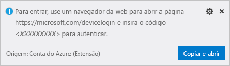
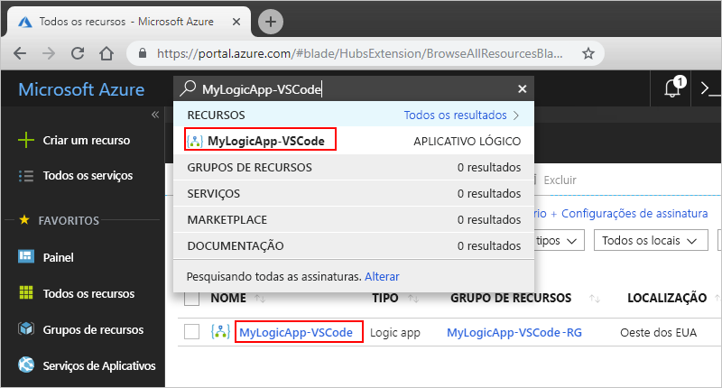

# <a name="quickstart-create-and-manage-logic-app-definitions-by-using-visual-studio-code"></a>Início Rápido: Criar e gerenciar definições de aplicativos lógicos usando o Visual Studio Code

Com o [Azure Logic Apps](../logic-apps/logic-apps-overview.md) e o Visual Studio Code, você pode criar e gerenciar aplicativos lógicos que ajudam a automatizar tarefas, fluxos de trabalho e processos para integrar aplicativos, dados, sistemas e serviços em organizações e empresas. Este início rápido mostra como criar e editar definições de fluxo de trabalho de aplicativo lógico trabalhando com o esquema de definição de fluxo de trabalho em JSON (JavaScript Object Notation) por meio de uma experiência baseada em código. Também é possível trabalhar em aplicativos lógicos existentes já implantados no Azure.

Embora seja possível executar essas mesmas tarefas no [portal do Azure](https://portal.azure.com) e no Visual Studio, você poderá começar mais rapidamente no Visual Studio Code quando já conhecer definições de aplicativo lógico e desejar trabalhar diretamente no código. Por exemplo, é possível desabilitar, habilitar, excluir e atualizar aplicativos lógicos já criados. Além disso, você pode trabalhar em aplicativos lógicos e nas contas de integração de qualquer plataforma de desenvolvimento em que o Visual Studio Code é executado, como Linux, Windows e Mac.

Para este artigo, você pode criar o mesmo aplicativo lógico com base neste [início rápido](../logic-apps/quickstart-create-first-logic-app-workflow.md), que se concentra mais nos conceitos básicos. No Visual Studio Code, o aplicativo lógico se parece com este exemplo:


Antes de começar, verifique se você possui estes itens:

* Se você não tiver uma assinatura do Azure, [inscreva-se em uma conta gratuita do Azure](https://azure.microsoft.com/free/).

* Conhecimento básico sobre [as definições do fluxo de trabalho do aplicativo lógico](../logic-apps/logic-apps-workflow-definition-language.md) e sua estrutura, que usa JSON (JavaScript Object Notation)

  Se você for novo nos Aplicativos Lógicos, experimente este [início rápido](../logic-apps/quickstart-create-first-logic-app-workflow.md) que explica como criar seus primeiros aplicativos lógicos no portal do Azure e se concentra mais nos conceitos básicos.

* Acesso à web para entrar no Azure e sua assinatura do Azure

* Baixe e instale essas ferramentas, caso você ainda não as tenha:

  * [Visual Studio Code versão 1.25.1 ou posterior](https://code.visualstudio.com/), que é gratuito

  * Extensão do Visual Studio Code para Aplicativos Lógicos do Azure

    É possível baixar e instalar essa extensão do [Visual Studio Marketplace](https://marketplace.visualstudio.com/items?itemName=ms-azuretools.vscode-logicapps) ou diretamente do Visual Studio Code. Após instalar, verifique se você recarregou o Visual Studio Code.

    

    Para verificar se a extensão foi instalada corretamente, selecione o ícone do Azure que aparece na barra de ferramentas do código do Visual Studio Code.

    

    Para obter mais informações, consulte [Marketplace de extensão](https://code.visualstudio.com/docs/editor/extension-gallery). Para contribuir com a versão de software livre dessa extensão, visite a [Extensão de Aplicativos Lógicos do Azure para Visual Studio Code no GitHub](https://github.com/Microsoft/vscode-azurelogicapps).

<a name="sign-in-azure"></a>

## <a name="sign-in-to-azure"></a>Entrar no Azure

1. Abra o Visual Studio Code. Na barra de ferramentas Código do Visual Studio, selecione o ícone do Azure.

   

1. Na janela do Azure, em **Aplicativos Lógicos**, selecione **Fazer login no Azure**.

   

   Agora você é solicitado a entrar usando o código de autenticação fornecido.

1. Copie o código de autenticação e, em seguida, selecione **Copiar e Abrir**, o que abre uma nova janela do navegador.

   

1. Insira o código de autenticação. Quando solicitado, selecione **Continuar**.

   

1. Selecione sua conta do Azure. Depois de entrar, você pode fechar o navegador e retornar ao código do Visual Studio.

   Na janela do Azure, o painel Logic Apps e o painel Integration Accounts agora mostram as assinaturas do Azure em sua conta.

   

   Se você não visualizar as assinaturas esperadas, ao lado do rótulo **Aplicativos Lógicos**, selecione **Selecionar inscrições** (ícone de filtro). Localize e selecione as assinaturas que você deseja.

1. Para visualizar quaisquer aplicativos lógicos ou contas de integração existentes na sua assinatura do Azure, expanda sua assinatura.

   

<a name="create-logic-app"></a>

## <a name="create-logic-app"></a>Criar aplicativo lógico

1. Se você não tiver feito login na sua assinatura do Azure de dentro do Visual Studio Code, siga as etapas neste artigo para [entrar agora](#sign-in-azure).

1. No menu de contexto da sua assinatura, selecione **criar**.

   

1. Na lista que mostra os grupos de recursos do Azure em sua assinatura, selecione um grupo de recursos existente ou **Crie um novo grupo de recursos**.

   Este exemplo cria um novo grupo de recursos:

   

1. Forneça um nome para o grupo de recursos do Azure e pressione ENTER.

   

1. Selecione o local do datacenter para onde salvar os metadados do seu aplicativo lógico.

   

1. Forneça um nome para seu aplicativo lógico e pressione ENTER.

   

   Seu novo aplicativo lógico agora aparece na janela do Azure, sob sua assinatura do Azure. Agora você pode começar a criar a definição de fluxo de trabalho de seu aplicativo lógico.

1. No menu de atalho do aplicativo lógico, selecione **Abrir no Editor**.

   

   O Visual Studio Code abre um modelo de definição de fluxo de trabalho de aplicativo lógico (arquivo .logicapp.json) para que você possa começar a criar o fluxo de trabalho do seu aplicativo lógico.

   

1. No arquivo de modelo de definição de fluxo de trabalho do aplicativo lógico, comece a criar a definição de fluxo de trabalho do seu aplicativo lógico.
Para referência técnica, consulte o [esquema de linguagem de definição de fluxo de trabalho para Aplicativos Lógicos do Azure](../logic-apps/logic-apps-workflow-definition-language.md).

   Aqui está um exemplo de definição de lógica. Normalmente, os elementos JSON aparecem em ordem alfabética em cada seção. No entanto, este exemplo mostra esses elementos aproximadamente na ordem em que as etapas do aplicativo lógico aparecem no designer.

   ```json
   {
      "$schema": "https://schema.management.azure.com/providers/Microsoft.Logic/schemas/2016-06-01/workflowdefinition.json#",
      "contentVersion": "1.0.0.0",
      "parameters": {
         "$connections": {
            "defaultValue": {},
            "type": "Object"
         }
      },
      "triggers": {
         "When_a_feed_item_is_published": {
            "recurrence": {
               "frequency": "Minute",
               "interval": 1
            },
            "splitOn": "@triggerBody()?['value']",
            "type": "ApiConnection",
            "inputs": {
               "host": {
                  "connection": {
                     "name": "@parameters('$connections')['rss']['connectionId']"
                  }
               },
               "method": "get",
               "path": "/OnNewFeed",
               "queries": {
                  "feedUrl": "http://feeds.reuters.com/reuters/topNews"
               }
            }
         }
      },
      "actions": {
         "Send_an_email": {
            "runAfter": {},
            "type": "ApiConnection",
            "inputs": {
               "body": {
                  "Body": "Title: @{triggerBody()?['title']}\n\nDate published: @{triggerBody()?['publishDate']}\n\nLink: @{triggerBody()?['primaryLink']}",
                  "Subject": "New RSS item: @{triggerBody()?['title']}",
                  "To": "Sophie.Owen@contoso.com"
               },
               "host": {
                  "connection": {
                     "name": "@parameters('$connections')['outlook']['connectionId']"
                  }
               },
               "method": "post",
               "path": "/Mail"
            }
         }
      },
      "outputs": {}
   }
   ```

1. Quando terminar, salve seu arquivo de definição de aplicativo lógico. Quando o Visual Studio Code solicitar que você confirme o upload de sua definição de aplicativo lógico para sua assinatura do Azure, selecione **Upload**.

   

   Depois que o Visual Studio Code publica seu aplicativo lógico no Azure, você pode encontrar seu aplicativo agora ativo e em execução no portal do Azure.

   

<a name="edit-logic-app"></a>

## <a name="edit-logic-app"></a>Editar aplicativo lógico

Para trabalhar em um aplicativo lógico que é publicado no Azure, você pode abrir a definição do aplicativo lógico usando o Visual Studio Code.

1. Se você não tiver feito login na sua assinatura do Azure de dentro do Visual Studio Code, siga as etapas neste artigo para [entrar agora](#sign-in-azure).

1. Na janela do Azure, em **Aplicativos Lógicos**, expanda sua assinatura do Azure e selecione o aplicativo lógico desejado.

1. No menu do seu aplicativo lógico, selecione **Abrir no Editor**. Ou, ao lado do nome do seu aplicativo lógico, selecione o ícone de edição.

   

   O Visual Studio Code abre o arquivo .logic app.json para sua definição de fluxo de trabalho de aplicativos lógicos.

   

1. Faça suas alterações na definição do seu aplicativo lógico.

1. Quando terminar, salve as alterações.

1. Quando o Visual Studio Code solicitar que você atualize sua definição de aplicativo lógico na sua assinatura do Azure, selecione **Upload**.

   

## <a name="next-steps"></a>Próximas etapas

> [!div class="nextstepaction"]
> * [Criar aplicativos lógicos com o Visual Studio](../logic-apps/quickstart-create-logic-apps-with-visual-studio.md)