# Início Rápido: Criar tarefas automatizadas, processos e fluxos de trabalho com Aplicativos Lógicos do Azure – Visual Studio

Com os [Aplicativos Lógicos do Azure](../logic-apps/logic-apps-overview.md) e o Visual Studio, você pode criar fluxos de trabalho que automatizam tarefas e processos para a integração de aplicativos, dados, sistemas e serviços entre empresas e organizações. Este início rápido mostra como você pode projetar e criar esses fluxos de trabalho criando aplicativos lógicos no Visual Studio e implantando esses aplicativos no Azure. Embora você possa executar essas tarefas no portal do Azure, o Visual Studio permite que você adicione aplicativos lógicos ao controle do código-fonte, publique diferentes versões e crie modelos do Azure Resource Manager para ambientes de implantação diferentes.

Se você não estiver familiarizado com os Aplicativos Lógicos do Azure e deseja apenas os conceitos básicos, experimente o [guia de início rápido para a criação de um aplicativo lógico no portal do Azure](../logic-apps/quickstart-create-first-logic-app-workflow.md). O Designer de Aplicativo Lógico funciona de forma semelhante no portal do Azure e no Visual Studio.

Neste início rápido, você cria o mesmo aplicativo lógico com o Visual Studio como o início rápido do portal do Azure. Você também pode aprender a [criar um aplicativo de exemplo no Visual Studio Code](quickstart-create-logic-apps-visual-studio-code.md) e [criar e gerenciar aplicativos lógicos por meio da CLI do Azure (Interface de linha de comando do Azure)](quickstart-logic-apps-azure-cli.md). Este aplicativo lógico monitora o RSS feed de um site e envia um email para cada novo item nesse feed. Seu aplicativo lógico finalizado se parece com este fluxo de trabalho de alto nível:

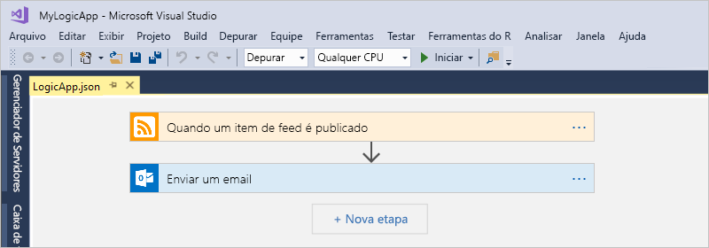

## Pré-requisitos

* Uma conta e uma assinatura do Azure. Se você não tem uma assinatura, [inscreva-se em uma conta gratuita do Azure](https://azure.microsoft.com/free/). Se você tiver uma assinatura do Azure Government, siga estas etapas adicionais para [Configurar o Visual Studio para a Nuvem do Azure Government](#azure-government).

* Baixe e instale essas ferramentas, caso você ainda não as tenha:

  * [Visual Studio 2019, 2017 ou 2015 – Community Edition ou superior](https://aka.ms/download-visual-studio). Este início rápido usa o Visual Studio Community 2017.

    > [!IMPORTANT]
    > Ao instalar o Visual Studio 2019 ou 2017, selecione a carga de trabalho **Desenvolvimento do Azure**.

  * O [SDK do Microsoft Azure para .NET (2.9.1 ou posterior)](https://azure.microsoft.com/downloads/). Saiba mais sobre o [SDK do Azure para .NET](/dotnet/azure/intro).

  * [PowerShell do Azure](https://github.com/Azure/azure-powershell#installation)

  * As Ferramentas dos Aplicativos Lógicos do Azure mais recentes para a extensão do Visual Studio para a versão que você deseja:

    * [Visual Studio 2019](https://aka.ms/download-azure-logic-apps-tools-visual-studio-2019)

    * [Visual Studio 2017](https://aka.ms/download-azure-logic-apps-tools-visual-studio-2017)

    * [Visual Studio 2015](https://aka.ms/download-azure-logic-apps-tools-visual-studio-2015)
  
    Você pode baixar e instalar as Ferramentas dos Aplicativos Lógicos do Azure diretamente do Visual Studio Marketplace ou aprender como [instalar essa extensão de dentro do Visual Studio](/visualstudio/ide/finding-and-using-visual-studio-extensions). Reinicie o Visual Studio após concluir a instalação.

* Acesso à Web ao usar o Designer do Aplicativo Lógico incorporado

  O designer precisa de uma conexão com a Internet para criar recursos no Azure e ler propriedades e dados dos conectores em seu aplicativo lógico.

* Uma conta de email que seja compatível com os Aplicativos Lógicos, como o Outlook para Microsoft 365, o Outlook.com ou o Gmail. Para outros provedores, revise a [lista de conectores aqui](/connectors/). Este exemplo usa o Outlook do Office 365. Se você usar um provedor diferente, as etapas gerais são as mesmos, mas a interface do usuário pode ser ligeiramente diferente.

  > [!IMPORTANT]
  > Se você quiser usar o conector do Gmail, somente as contas comerciais do G Suite poderão usar esse conector sem restrição nos aplicativos lógicos. Se você tiver uma conta de consumidor do Gmail, poderá usar esse conector somente com serviços específicos do Google aprovados ou poderá [criar um aplicativo cliente do Google para usar para autenticação com o conector do Gmail](/connectors/gmail/#authentication-and-bring-your-own-application). Para obter mais informações, confira [Políticas de privacidade e segurança de dados para os conectores do Google nos Aplicativos Lógicos do Azure](../connectors/connectors-google-data-security-privacy-policy.md).

* Se o seu aplicativo lógico precisar se comunicar por um firewall que limita o tráfego a endereços IP específicos, esse firewall precisará permitir o acesso *tanto* para os endereços IP de [entrada](logic-apps-limits-and-config.md#inbound) quanto para os de [saída](logic-apps-limits-and-config.md#outbound) usados pelo runtime ou pelo serviço de Aplicativos Lógicos na região do Azure em que o aplicativo lógico existe. Se o aplicativo lógico também usar [conectores gerenciados](../connectors/managed.md), como o conector Outlook do Office 365 ou do SQL, ou usar [conectores personalizados](/connectors/custom-connectors/), o firewall também precisará permitir o acesso para *todos* os [endereços IP de saída do conector gerenciado](logic-apps-limits-and-config.md#outbound) na região do Azure do aplicativo lógico.

## Configurar o Visual Studio para o Azure Governamental

### Visual Studio 2017

Você pode usar a [extensão do Visual Studio Seletor de Ambiente do Azure](https://devblogs.microsoft.com/azuregov/introducing-the-azure-environment-selector-visual-studio-extension/), que você pode baixar e instalar do [Visual Studio Marketplace](https://marketplace.visualstudio.com/items?itemName=SteveMichelotti.AzureEnvironmentSelector).

### Visual Studio 2019

Para trabalhar com as assinaturas do Azure Government em Aplicativos Lógicos do Azure, você precisa [adicionar um ponto de extremidade de descoberta para a Nuvem do Azure Government ao Visual Studio](../azure-government/documentation-government-connect-vs.md). No entanto, *antes de entrar no Visual Studio com sua conta do Azure Government*, você precisará renomear o arquivo JSON depois de adicionar o ponto de extremidade de descoberta seguindo estas etapas:

1. Feche o Visual Studio.

1. Localize o arquivo JSON gerado chamado `Azure U.S. Government-A3EC617673C6C70CC6B9472656832A26.Configuration` neste local:

   `%localappdata%\.IdentityService\AadConfigurations`
 
1. Renomeie o arquivo JSON como `AadProvider.Configuration.json`.

1. Reinicie o Visual Studio.

1. Continue com as etapas para entrar com sua conta do Azure Government.

Para reverter essa configuração, exclua o arquivo JSON no seguinte local e reinicie o Visual Studio:

`%localappdata%\.IdentityService\AadConfigurations\AadProvider.Configuration.json`

## Criar um projeto do grupo de recursos do Azure

Para começar, crie um [projeto do Grupo de Recursos do Azure](../azure-resource-manager/templates/create-visual-studio-deployment-project.md). Saiba mais sobre [Recursos e grupos de recursos do Azure](../azure-resource-manager/management/overview.md).

1. Inicie o Visual Studio. Faça logon usando sua conta do Azure.

1. No menu **Arquivo**, selecione **Novo** > **Projeto**. (teclado: Ctrl + Shift + N)

   

1. Em **Instalado**, selecione **Visual C#** ou **Visual Basic**. Selecione **Nuvem** > **Grupo de Recursos do Azure**. Nomeie o projeto , por exemplo:

   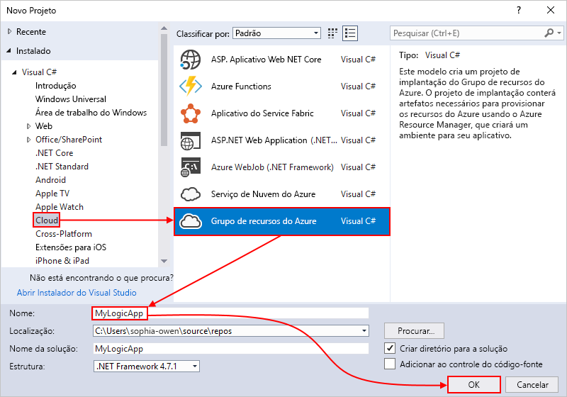

   > [!NOTE]
   > Os nomes dos grupos de recursos podem conter apenas letras, números, pontos (`.`), sublinhados (`_`), hifens (`-`) e parênteses (`(`, `)`), mas não podem *terminar* com pontos (`.`).
   >
   > Se **Nuvem** ou **Grupo de Recursos do Azure** não aparecer, instale o SDK do Azure para o Visual Studio.

   Se você estiver usando o Visual Studio 2019, siga estas etapas:

   1. Na caixa **Criar um novo projeto**, selecione o projeto **Grupo de Recursos do Azure** para Visual C# ou Visual Basic. Selecione **Avançar**.

   1. Forneça um nome para o grupo de recursos do Azure que você deseja usar e outras informações do projeto. Selecione **Criar**.

1. Na lista de modelos, selecione o modelo **Aplicativo Lógico**. Selecione **OK**.

   

   Depois que o Visual Studio cria seu projeto, o Gerenciador de Soluções é aberto e mostra sua solução. Em sua solução, o arquivo **LogicApp.json** não só armazena a definição de aplicativo lógico, mas também é um modelo do Azure Resource Manager que você pode usar para a implantação.

   

## Criar um aplicativo lógico em branco

Quando tiver seu projeto do Grupo de Recursos do Azure, crie seu aplicativo lógico com o modelo **Aplicativo Lógico em Branco**.

1. No Gerenciador de Soluções, abra o menu de atalho do arquivo **LogicApp.json**. Selecione **Abrir com o Designer de Aplicativo Lógico**. (teclado: Ctrl + L)

   

   > [!TIP]
   > Caso não tenha esse comando no Visual Studio 2019, verifique se você tem as atualizações mais recentes do Visual Studio.

   O Visual Studio solicitará sua assinatura do Azure e um grupo de recursos do Azure para criar e implantar recursos para seu aplicativo lógico e conexões.

1. Para **Assinatura**, selecione sua assinatura do Azure. Para **Grupo de recursos**, selecione **Criar Novo** para criar outro grupo de recursos do Azure.

   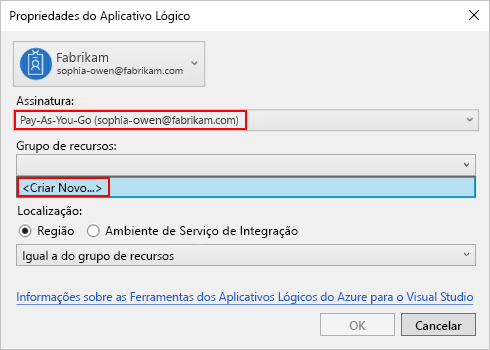

   | Configuração | Valor de exemplo | Descrição |
   | ------- | ------------- | ----------- |
   | Conta de usuário | Fabrikam   sophia-owen@fabrikam.com | A conta que você usou quando entrou no Visual Studio |
   | **Assinatura** | Pré-paga   (sophia-owen@fabrikam.com) | O nome para sua assinatura do Azure e a conta associada |
   | **Grupo de recursos** | MyLogicApp-RG   (Oeste dos EUA) | O grupo de recursos do Azure e a localização para armazenar e implantar recursos do aplicativo lógico |
   | **Localidade** | **Igual ao Grupo de Recursos** | O tipo de local e o local específico para implantar seu aplicativo lógico. O tipo de local é uma região do Azure ou um [ISE (ambiente do serviço de integração)](connect-virtual-network-vnet-isolated-environment.md) existente. 
Para este guia de início rápido, mantenha o tipo de local definido como **Região** e o local definido como **Igual ao Grupo de Recursos**. 
**Observação**: depois de criar seu projeto de grupo de recursos, é possível [alterar o tipo de local e o local](manage-logic-apps-with-visual-studio.md#change-location), mas o tipo de local diferente afeta seu aplicativo lógico de várias maneiras. |
   ||||

1. O Designer de Aplicativos Lógicos abre uma página que mostra um vídeo de introdução e gatilhos normalmente usados. Role para baixo após o vídeo e os gatilhos para **Modelos** e selecione **Aplicativo Lógico em Branco**.

   

## Criar fluxo de trabalho do aplicativo lógico

Em seguida, adicione um [gatilho](../logic-apps/logic-apps-overview.md#logic-app-concepts) RSS que é acionado quando um novo item de feed é exibido. Cada aplicativo lógico começa com um gatilho, que é acionado quando critérios específicos são atendidos. Cada vez que o gatilho é disparado, o mecanismo dos Aplicativos Lógicos cria uma instância de aplicativo lógico que executa o fluxo de trabalho.

1. No Designer do Aplicativo Lógico, na caixa de pesquisa, selecione **Tudo**. Na caixa de pesquisa, digite "rss". Na lista de gatilhos, selecione este gatilho: **Quando um item de feed é publicado**

   

1. Depois que o gatilho aparece no designer, conclua a construção do aplicativo lógico seguindo as etapas do fluxo de trabalho, no [início rápido do portal do Azure](../logic-apps/quickstart-create-first-logic-app-workflow.md#add-rss-trigger), em seguida, retorne a este artigo. Quando terminar, seu aplicativo lógico será semelhante a este exemplo:

   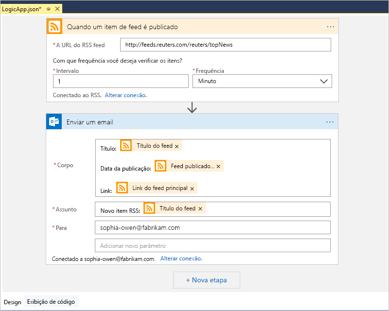

1. Salve sua solução do Visual Studio. (teclado: Ctrl + S)

## Implante o aplicativo lógico para o Azure

Antes de executar e testar seu aplicativo lógico, implante o aplicativo no Azure pelo Visual Studio.

1. No Gerenciador de Soluções, no menu de atalho do projeto, selecione **Implantar** > **Novo**. Se solicitado, entre com sua conta do Azure.

   

1. Para essa implantação, mantenha a assinatura do Azure, o grupo de recursos e outras configurações padrão. Selecione **Implantar**.

   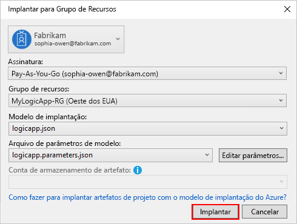

1. Se a caixa **Editar parâmetros** for exibida, forneça um nome de recurso para seu aplicativo lógico. Salve suas configurações.

   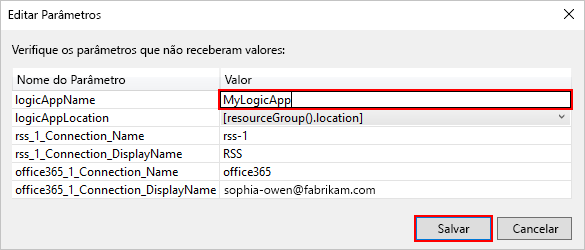

   Ao iniciar a implantação, o status da implantação do aplicativo é exibido na janela **Saída** do Visual Studio. Se o status não aparecer, abra a lista **Mostrar saída de** e selecione o grupo de recursos do Azure.

   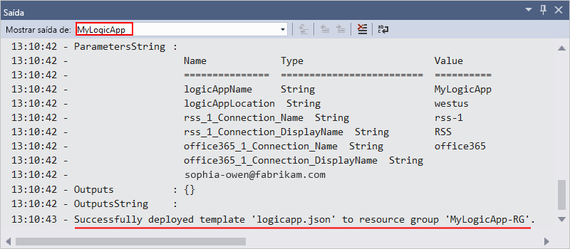

   Se os conectores selecionados precisarem de alguma inserção sua, uma janela do PowerShell abrirá em segundo plano e solicitará as senhas ou chaves secretas necessárias. Depois de inserir essas informações, a implantação continuará.

   

   Após a implantação ser concluída, seu aplicativo lógico estará ativo no portal do Azure e será executado em seu agendamento especificado (a cada minuto). Se o gatilho encontrar novos itens de feed, ele será disparado, o que criará uma instância de fluxo de trabalho que executará as ações do aplicativo lógico. Seu aplicativo lógico enviará um email para cada novo item. Caso contrário, se o gatilho não localizar novos itens, ele não será disparado e ignorará o instanciamento do fluxo de trabalho. O aplicativo lógico aguarda até o próximo intervalo antes de verificar.

   Aqui estão emails de exemplo que esse aplicativo lógico envia. Se você não receber nenhum email, verifique a sua pasta de Lixo eletrônico.

   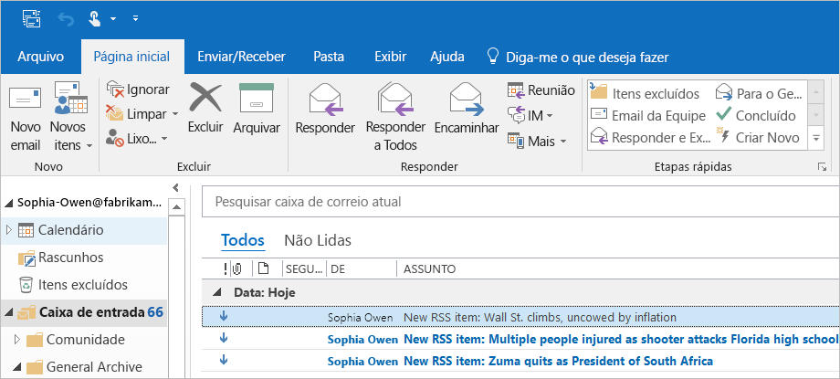

Parabéns, você criou e implantou seu aplicativo lógico com o Visual Studio com sucesso. Para gerenciar seu aplicativo lógico e examinar seu histórico de execução, confira [Gerenciar aplicativos lógicos com o Visual Studio](../logic-apps/manage-logic-apps-with-visual-studio.md).

## Adicionar novo aplicativo lógico

Quando há um projeto existente do Grupo de Recursos do Azure, você pode adicionar um novo aplicativo lógico em branco a esse projeto usando a janela Estrutura de tópicos JSON.

1. No Gerenciador de Soluções, abra o arquivo `<logic-app-name>.json`.

1. No menu **Exibir**, selecione **Outras janelas** > **Estrutura de tópicos JSON**.

1. Para adicionar um recurso ao arquivo de modelo, selecione **Adicionar Recurso**, na parte superior da janela Estrutura de tópicos JSON. Ou, na janela Estrutura de Tópicos JSON, abra o menu de atalho **recursos** e selecione **Adicionar Novo Recurso**.

   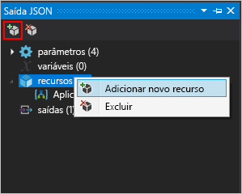

1. Na caixa de diálogo **Adicionar Recurso**, na caixa de pesquisa, localize `logic app` e selecione **Aplicativo Lógico**. Nomeie seu aplicativo lógico e selecione **Adicionar**.

   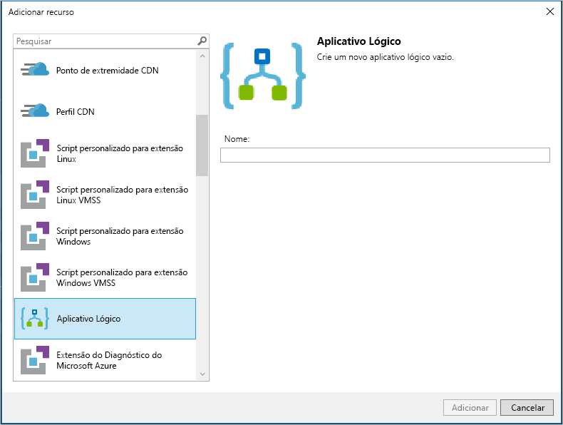

## Limpar os recursos

Quando terminar com seu aplicativo lógico, exclua o grupo de recursos que contém seu aplicativo lógico e os recursos relacionados.

1. Entre no [portal do Azure](https://portal.azure.com) com a mesma conta usada para criar seu aplicativo lógico.

1. No menu do portal do Azure, selecione **Grupos de recursos** ou pesquise e selecione **Grupos de recursos** em qualquer página. Selecione o grupo de recursos do aplicativo lógico.

1. Na página **Visão geral**, selecione **Excluir grupo de recursos**. Insira o nome do grupo de recursos como confirmação e selecione **Excluir**.

   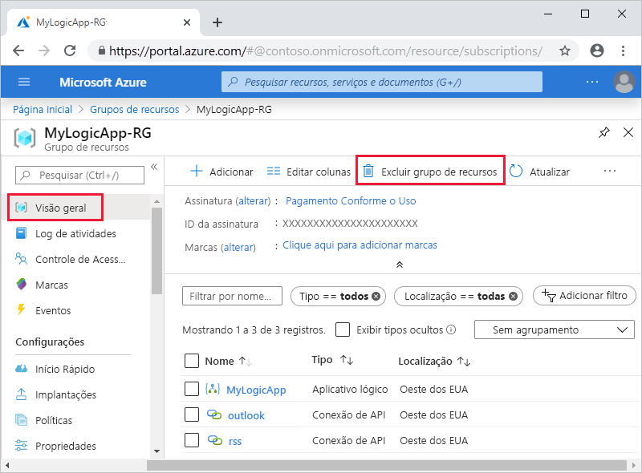

1. Exclua a solução do Visual Studio do computador local.

## Próximas etapas

Neste artigo, você criou, implantou e executou seu aplicativo lógico com o Visual Studio. Para saber mais sobre como gerenciar e executar a implantação avançada para aplicativos lógicos com o Visual Studio, confira estes artigos:

> [!div class="nextstepaction"]
> [Gerenciar aplicativos lógicos no Visual Studio](../logic-apps/manage-logic-apps-with-visual-studio.md)
