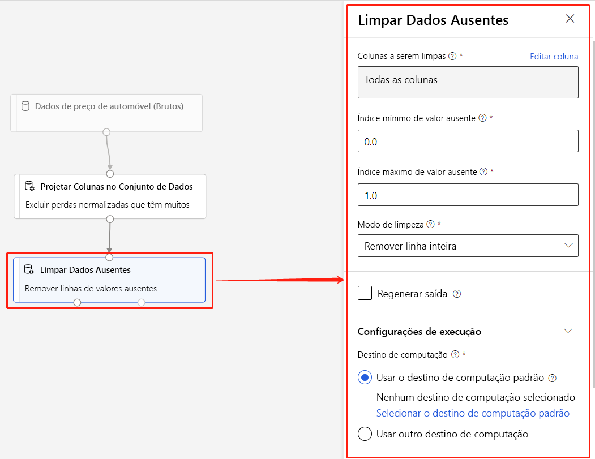

# O que é o designer de Azure Machine Learning (versão prévia)? 
[!INCLUDE [applies-to-skus](../../includes/aml-applies-to-enterprise-sku.md)]

O designer de Azure Machine Learning permite que você conecte visualmente [conjuntos](#datasets) de informações e [módulos](#module) em uma tela interativa para criar modelos de aprendizado de máquina. Para saber como começar a usar o designer, consulte [tutorial: prever o preço do automóvel com o designer](tutorial-designer-automobile-price-train-score.md)

O designer usa seu [espaço de trabalho](concept-workspace.md) Azure Machine Learning para organizar recursos compartilhados, como:

+ [Pipelines](#pipeline)
+ [Conjunto de dados](#datasets)
+ [Recursos de computação](#compute)
+ [Modelos registrados](concept-azure-machine-learning-architecture.md#models)
+ [Pipelines publicados](#publish)
+ [Pontos de extremidade em tempo real](#deploy)

## Treinamento e implantação do modelo

O designer fornece uma tela Visual para criar, testar e implantar modelos de aprendizado de máquina. Com o designer, você pode:

+ Os [conjuntos](#datasets) de Datae os [módulos](#module) de arrastar e soltar na tela.
+ Conecte os módulos juntos para criar um [rascunho de pipeline](#pipeline-draft).
+ Envie uma [execução de pipeline](#pipeline-run) usando os recursos de computação em seu espaço de trabalho Azure Machine Learning.
+ Converta seus **pipelines de treinamento** em **pipelines de inferência**.
+ [Publique](#publish) seus pipelines em um **ponto de extremidade de pipeline** REST para enviar novas execuções de pipeline com parâmetros e conjuntos de os diferentes.
    + Publique um **pipeline de treinamento** para reutilizar um único pipeline para treinar vários modelos durante a alteração de parâmetros e conjuntos de valores.
    + Publicar um **pipeline de inferência de lote** para fazer previsões sobre novos dados usando um modelo treinado anteriormente.
+ [Implante](#deploy) um **pipeline de inferência em tempo real** para um ponto de extremidade em tempo real para fazer previsões sobre novos dados em tempo real.

## Pipeline

Um [pipeline](concept-azure-machine-learning-architecture.md#ml-pipelines) consiste em conjuntos de valores e módulos analíticos, que você conecta juntos. Os pipelines têm muitos usos: você pode criar um pipeline que treina um único modelo ou um que treina vários modelos. Você pode criar um pipeline que faça previsões em tempo real ou em lote, ou então crie um pipeline que limpa apenas os dados. Os pipelines permitem reutilizar seu trabalho e organizar seus projetos.

### Rascunho do pipeline

À medida que você edita um pipeline no designer, seu progresso é salvo como um **rascunho de pipeline**. Você pode editar um rascunho de pipeline a qualquer momento adicionando ou removendo módulos, configurando destinos de computação, criando parâmetros e assim por diante.

Um pipeline válido tem estas características:

* Conjuntos de valores só podem se conectar a módulos.
* Os módulos só podem se conectar a conjuntos de os ou outros módulos.
* Todas as portas de entrada para módulos devem ter alguma conexão com o fluxo de dados.
* Todos os parâmetros necessários para cada módulo devem ser definidos.

Quando você estiver pronto para executar o rascunho do pipeline, envie uma execução de pipeline.

### Execução do pipeline

Cada vez que você executa um pipeline, a configuração do pipeline e seus resultados são armazenados em seu espaço de trabalho como uma **execução de pipeline**. Você pode voltar a qualquer execução de pipeline para inspecioná-lo para fins de solução de problemas ou auditoria. **Clone** uma execução de pipeline para criar um novo rascunho de pipeline para edição.

As execuções de pipeline são agrupadas em [experimentos](concept-azure-machine-learning-architecture.md#experiments) para organizar o histórico de execução. Você pode definir o experimento para cada execução de pipeline. 

## Conjuntos de dados

Um conjunto de dados de aprendizado de máquina facilita o acesso e o trabalho com eles. Vários exemplos de conjuntos de exemplo estão incluídos no designer para experimentar. Você pode [registrar](how-to-create-register-datasets.md) mais conjuntos de informações conforme necessário.

## Módulo

Um módulo é um algoritmo que você pode executar em seus dados. O designer tem vários módulos que variam de funções de entrada de dados até processos de treinamento, pontuação e validação.

Um módulo pode ter um conjunto de parâmetros que você pode usar para configurar os algoritmos internos do módulo. Quando você seleciona um módulo na tela, os parâmetros do módulo são exibidos no painel Propriedades à direita da tela. Você pode modificar os parâmetros nesse painel para ajustar seu modelo. Você pode definir os recursos de computação para módulos individuais no designer. 

Para obter ajuda para navegar pela biblioteca de algoritmos de aprendizado de máquina disponíveis, consulte [visão geral de referência do módulo & do algoritmo](algorithm-module-reference/module-reference.md)

## Recursos de computação

Use os recursos de computação do seu espaço de trabalho para executar seu pipeline e hospedar seus modelos implantados como pontos de extremidade em tempo real ou pontos de extremidade de pipeline (para inferência de lote). Os destinos de computação com suporte são:

| Destino de computação | Treinamento | Implantação |
| ---- |:----:|:----:|
| Computação do Azure Machine Learning | ✓ | |
| Serviço do Kubernetes do Azure | | ✓ |

Os destinos de computação são anexados ao seu [espaço de trabalho do Azure Machine Learning](concept-workspace.md). Você gerencia seus destinos de computação em seu espaço de trabalho em [Azure Machine Learning Studio (clássico)](https://ml.azure.com).

## Implantação

Para executar inferência em tempo real, você deve implantar um pipeline como um **ponto de extremidade em tempo real**. O ponto de extremidade em tempo real cria uma interface entre um aplicativo externo e seu modelo de pontuação. Uma chamada para um ponto de extremidade em tempo real retorna resultados de previsão para o aplicativo em tempo real. Para fazer uma chamada para um ponto de extremidade em tempo real, você passa a chave de API que foi criada quando você implantou o ponto de extremidade. O ponto de extremidade é baseado em REST, uma opção de arquitetura popular para projetos de programação da Web.

Os pontos de extremidade em tempo real devem ser implantados em um cluster do serviço kubernetes do Azure.

Para saber como implantar seu modelo, consulte [tutorial: implantar um modelo de aprendizado de máquina com o designer](tutorial-designer-automobile-price-deploy.md).

## Publicar

Você também pode publicar um pipeline para um **ponto de extremidade de pipeline**. Semelhante a um ponto de extremidade em tempo real, um ponto de extremidade de pipeline permite que você envie novas execuções de pipeline de aplicativos externos usando chamadas REST. No entanto, você não pode enviar ou receber dados em tempo real usando um ponto de extremidade de pipeline.

Os pipelines publicados são flexíveis, eles podem ser usados para treinar ou treinar modelos, [executar inferência de lote](how-to-run-batch-predictions-designer.md), processar novos dados e muito mais. Você pode publicar vários pipelines em um único ponto de extremidade de pipeline e especificar qual versão de pipeline executar.

Um pipeline publicado é executado nos recursos de computação que você define no rascunho do pipeline para cada módulo.

O designer cria o mesmo objeto [PublishedPipeline](https://docs.microsoft.com/python/api/azureml-pipeline-core/azureml.pipeline.core.graph.publishedpipeline?view=azure-ml-py) que o SDK.

## Movendo da interface visual para o designer

A interface visual (versão prévia) foi atualizada e agora é Azure Machine Learning designer (versão prévia). O designer foi reprojetado para usar um back-end baseado em pipeline que se integra totalmente com os outros recursos do Azure Machine Learning. 

Como resultado dessas atualizações, alguns conceitos e termos da interface visual foram alterados ou renomeados. Consulte a tabela abaixo para obter as alterações conceituais mais importantes. 

| Conceito no designer | Anteriormente na interface visual |
| ---- |:----:|
| Rascunho do pipeline | Experimento |
| Ponto de extremidade em tempo real | Serviço Web |

### Migrando para o designer

Você pode converter experimentos de interface visual existentes e serviços Web em pipelines e pontos de extremidade em tempo real no designer. Use as etapas a seguir para migrar seus ativos de interface visual:

[!INCLUDE [migrate from the visual interface](../../includes/aml-vi-designer-migration.md)]

## Próximos passos

* Conheça os conceitos básicos da análise preditiva e do aprendizado de máquina com [o tutorial: prever o preço do automóvel com o designer](tutorial-designer-automobile-price-train-score.md)
* Use um dos exemplos e modifique para a suíte de suas necessidades:

- [Exemplo 1-regressão: prever o preço de um automóvel](how-to-designer-sample-regression-automobile-price-basic.md)
- [Exemplo 2-regressão: comparar algoritmos para previsão de preço de automóvel](how-to-designer-sample-regression-automobile-price-compare-algorithms.md)
- [Exemplo 3-classificação com seleção de recursos: Previsão de renda](how-to-designer-sample-classification-predict-income.md)
- [Exemplo 4-classificação: prever o risco de crédito (sensível ao custo)](how-to-designer-sample-classification-credit-risk-cost-sensitive.md)
- [Exemplo 5-classificação: Previsão de rotatividade](how-to-designer-sample-classification-churn.md)
- [Exemplo 6-classificação: prever atrasos de voo](how-to-designer-sample-classification-flight-delay.md)
- [Exemplo de classificação de texto 7: conjunto de teste da Wikipédia SP 500](how-to-designer-sample-text-classification.md)

