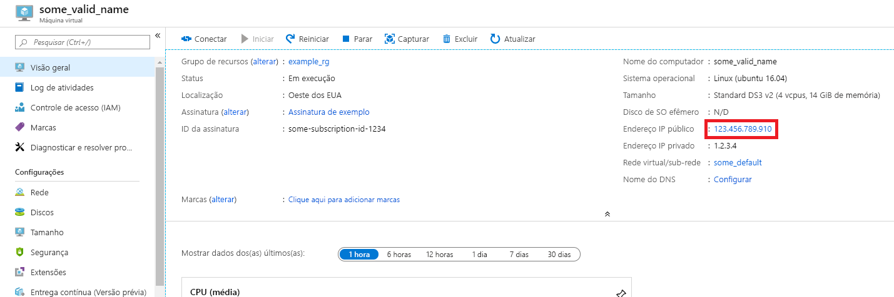
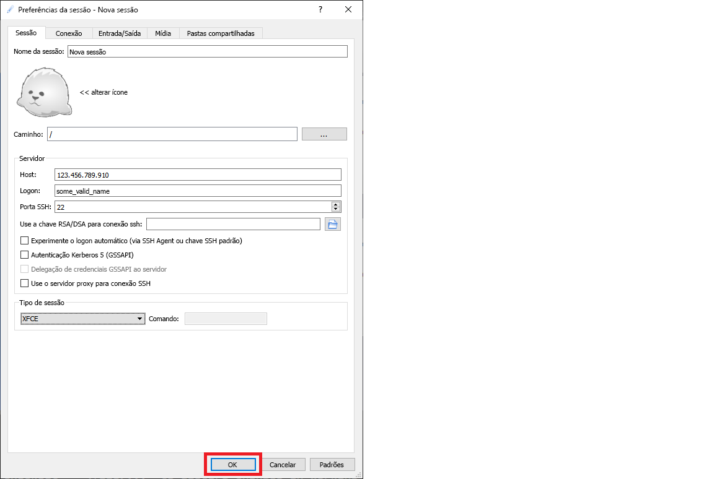

# <a name="quickstart-set-up-the-data-science-virtual-machine-for-linux-ubuntu"></a>Início Rápido: Configurar a Máquina Virtual de Ciência de Dados para Linux (Ubuntu)

Coloque tudo em funcionamento com a Máquina Virtual de Ciência de Dados do Ubuntu 18.04.

## <a name="prerequisites"></a>Pré-requisitos

Para criar uma Máquina Virtual de Ciência de Dados do Ubuntu 18.04, é necessário ter uma assinatura do Azure. [Experimentar o Azure gratuitamente](https://azure.com/free).

>[!NOTE]
>As contas gratuitas do Azure não dão suporte a SKUs de máquina virtual habilitada para GPU.

## <a name="create-your-data-science-virtual-machine-for-linux"></a>Criar sua Máquina Virtual de Ciência de Dados para Linux

Veja as etapas para criar uma instância da Máquina Virtual de Ciência de Dados do Ubuntu 18.04:

1. Vá para o [Portal do Azure](https://portal.azure.com). Você pode ser solicitado a entrar na sua conta do Azure, caso ainda não esteja conectado.
1. Localize a listagem de máquinas virtuais digitando "máquina virtual de ciência de dados" e selecionando "Máquina Virtual de Ciência de Dados – Ubuntu 18.04"

1. Na próxima janela, selecione **Criar**.

1. Você deve ser redirecionado para a folha "Criar uma máquina virtual".
   
1. Insira as seguintes informações para configurar cada etapa do assistente:

    1. **Noções básicas**:
    
       * **Assinatura**: se você tiver mais de uma assinatura, selecione aquela em que o computador será criado e cobrado. Você deve ter privilégios de criação de recurso nessa assinatura.
       * **Grupo de recursos**: crie um novo grupo ou use um existente.
       * **Nome da máquina virtual**: Insira o nome da máquina virtual. Esse nome será usado em seu portal do Azure.
       * **Região**: selecione o datacenter mais apropriado. Para um acesso mais rápido à rede, é o data center que contém a maioria dos seus dados ou que está mais próximo de sua localização física. Leia mais sobre as [Regiões do Azure](https://azure.microsoft.com/global-infrastructure/regions/).
       * **Imagem**: Mantenha o valor padrão.
       * **Size**: essa opção deve ser populada automaticamente com um tamanho apropriado para cargas de trabalho gerais. Leia mais sobre os [tamanhos de VM do Linux no Azure](../../virtual-machines/sizes.md).
       * **Tipo de autenticação**: Para configuração mais rápida, selecione "Senha". 
         
         > [!NOTE]
         > Caso pretenda usar o JupyterHub, selecione "Senha", pois o JupyterHub *não* é configurado para usar chaves públicas SSH.

       * **Nome de usuário**: Insira o nome de usuário do administrador. Você usará esse nome de usuário para fazer logon em sua máquina virtual. Esse nome de usuário não precisa ser igual ao seu nome de usuário do Azure. *Não* use letras em maiúsculas.
         
         > [!IMPORTANT]
         > Se você usar letras em maiúsculas em seu nome de usuário, o JupyterHub não funcionará e você obterá um erro de servidor interno 500.

       * **Senha**: insira a senha que você usará para fazer logon em sua máquina virtual.    
    
   1. Selecione **Examinar + criar**.
   1. **Examinar + criar**
      * Verifique se todas as informações inseridas estão corretas. 
      * Selecione **Criar**.
    
    O provisionamento deve demorar cerca de 5 minutos. O status é exibido no portal do Azure.

## <a name="how-to-access-the-ubuntu-data-science-virtual-machine"></a>Como acessar a Máquina Virtual de Ciência de Dados do Ubuntu

É possível acessar a DSVM do Ubuntu usando três métodos:

  * SSH para sessões de terminal
  * X2Go para sessões gráficas
  * JupyterHub e JupyterLab para notebooks Jupyter

### <a name="ssh"></a>SSH

Se você configurou sua VM com a autenticação SSH, poderá fazer logon usando as credenciais da conta que você criou na seção **Noções básicas** da etapa 3 para a interface do shell de texto. No Windows, é possível baixar uma ferramenta de cliente SSH, como o [PuTTY](https://www.putty.org). Se preferir uma área de trabalho gráfica (Sistema Windows X), você poderá usar o encaminhamento X11 no PuTTY.

> [!NOTE]
> O cliente X2Go apresentou desempenho melhor do que o encaminhamento X11 em testes. Recomendamos o uso do cliente X2Go para uma interface gráfica de área de trabalho.

### <a name="x2go"></a>X2Go

A VM Linux já está provisionada com um servidor X2Go e pronta para aceitar conexões de cliente. Para se conectar à área de trabalho gráfica da VM do Linux, realize o seguinte procedimento em seu cliente:

1. Baixe e instale o cliente X2Go para sua plataforma de cliente [X2Go](https://wiki.x2go.org/doku.php/doc:installation:x2goclient).
1. Anote o endereço IP público da máquina virtual, que pode ser encontrado no portal do Azure abrindo a máquina virtual que você criou.

   

1. Execute o cliente X2Go. Se a janela "Nova Sessão" não aparecer automaticamente, vá para Sessão -> Nova Sessão.

1. Na janela de configuração resultante, insira os seguintes parâmetros de configuração:
   * **Guia Sessão**:
     * **Host**: Insira o endereço IP de sua VM, que você anotou anteriormente.
     * **Logon**: Insira o nome de usuário na VM Linux.
     * **Porta SSH**: Deixe em 22, o valor padrão.
     * **Tipo de Sessão**: Altere o valor para **XFCE**. No momento, a VM Linux dá suporte apenas à área de trabalho XFCE.
   * **Guia Mídia**: Você poderá desligar o suporte a som e impressão de cliente se não precisar usá-los.
   * **Pastas compartilhadas**: use essa guia para adicionar o diretório de computador cliente que você deseja montar na VM. 

   
1. Selecione **OK**.
1. Clique na caixa no painel à direita da janela X2Go para abrir a tela de logon de sua VM.
1. Insira a senha de sua VM.
1. Selecione **OK**.
1. Talvez seja necessário conceder permissão ao X2Go para ignorar o firewall para concluir a conexão.
1. Agora você deve ver a interface gráfica para sua DSVM do Ubuntu. 


### <a name="jupyterhub-and-jupyterlab"></a>JupyterHub e JupyterLab

A DSVM do Ubuntu executa o [JupyterHub](https://github.com/jupyterhub/jupyterhub), um servidor Jupyter multiusuário. Para conectar, execute as seguintes etapas:

   1. Anote o endereço IP público de sua VM, pesquisando e selecionando sua VM no portal do Azure.
      

   1. No computador local, abra um navegador da Web e navegue até https: https:\//seu-IP-de-VM:8000, substituindo "Seu-IP-de-VM" pelo endereço IP que anotou anteriormente.
   1. Seu navegador provavelmente impedirá que você abra a página diretamente, informando que há um erro de certificado. O DSVM está fornecendo segurança por meio de um certificado autoassinado. A maioria dos navegadores permitirá que você clique após esse aviso. Muitos navegadores continuarão a fornecer algum tipo de aviso visual sobre o certificado em toda a sessão da Web.

      >[!NOTE]
      > Se você vir a mensagem de erro `ERR_EMPTY_RESPONSE` no navegador, acesse o computador usando explicitamente o protocolo *HTTPS* – e não o *HTTP* ou apenas o endereço Web. Se você digitar o endereço Web sem `https://` na linha de endereço, a maioria dos navegadores usará como padrão `http` e você verá esse erro.

   1. Insira o nome de usuário e a senha usados para criar a VM e entre. 

      

      >[!NOTE]
      > Se você receber um erro 500 neste estágio, é provável que tenha usado letras maiúsculas em seu nome de usuário. Essa é uma interação conhecida entre o Jupyter Hub e o PAMAuthenticator que ele usa. Se você receber um erro "Não é possível acessar esta página", é provável que suas permissões do Grupo de Segurança de Rede precisem ser ajustadas. No portal do Azure, encontre o recurso de Grupo de Segurança de Rede dentro do Grupo de Recursos. Para acessar o JupyterHub da Internet pública, será preciso que a porta 8000 esteja aberta. (A imagem mostra que essa VM está configurada para acesso just-in-time, o que é altamente recomendado. Confira [Proteja suas portas de gerenciamento com acesso just-in-time](../../security-center/security-center-just-in-time.md).) 

   1. Procure os vários notebooks de exemplo disponíveis.

O JupyterLab, a próxima geração de notebooks Jupyter e JupyterHub, também está disponível. Para acessá-lo, entre no JupyterHub e navegue até a URL https: \//seu-IP-de-VM:8000/usuário/seu-nome-de-usuário/lab, substituindo "seu-nome-de-usuário" pelo nome de usuário que você escolheu ao configurar a VM. Novamente, você pode estar bloqueado inicialmente para acessar o site devido a um erro de certificado.

É possível definir o JupyterLab como o servidor de Notebook padrão adicionando esta linha a `/etc/jupyterhub/jupyterhub_config.py`:

```python
c.Spawner.default_url = '/lab'
```

## <a name="next-steps"></a>Próximas etapas

Veja como você pode continuar seu aprendizado e exploração:

* O passo a passo [Ciência de dados na Máquina Virtual de Ciência de Dados para Linux](linux-dsvm-walkthrough.md) mostra como executar várias tarefas comuns de ciência de dados com a DSVM Linux provisionada aqui. 
* Explore as várias ferramentas de ciência de dados na DSVM experimentando as ferramentas descritas neste artigo. Você também pode executar `dsvm-more-info` no shell contido na máquina virtual para uma introdução básica e ponteiros para obter mais informações sobre as ferramentas instaladas na VM.  
* Saiba como criar soluções de análise sistematicamente usando o [Processo de Ciência de Dados de Equipe](../team-data-science-process/index.yml).
* Visite a [Galeria de IA do Azure](https://gallery.azure.ai/) para obter exemplos de análise de dados e aprendizado de máquina que usam os serviços de IA do Azure.
* Consulte a [documentação de referência](./reference-ubuntu-vm.md) apropriada para esta máquina virtual.