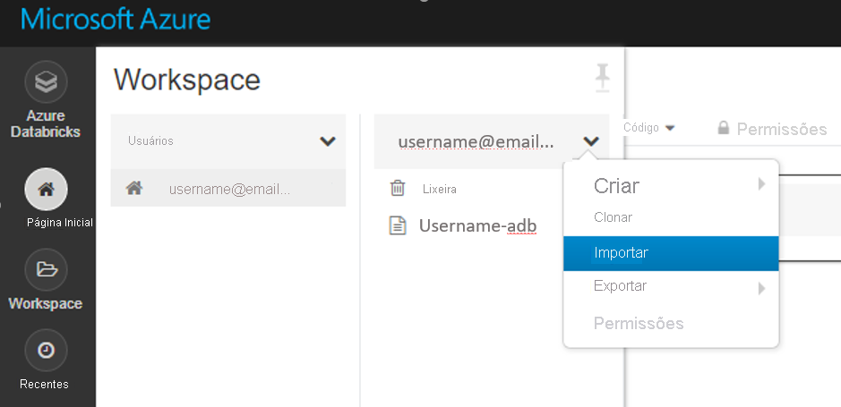
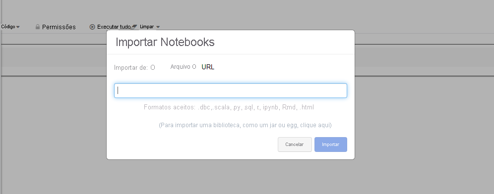

# <a name="set-up-a-development-environment-with-azure-databricks-and-automl-in-azure-machine-learning"></a>Configurar um ambiente de desenvolvimento com Azure Databricks e AutoML no Azure Machine Learning 

Saiba como configurar um ambiente de desenvolvimento no Azure Machine Learning que usa Azure Databricks e o ML automatizado.

Azure Databricks é ideal para executar fluxos de trabalho de aprendizado de máquina com uso intensivo em larga escala na plataforma Apache Spark escalonável na nuvem do Azure. Ele fornece um ambiente de colaboração baseado em notebook com uma CPU ou um cluster de computação baseado em GPU.

Para obter informações sobre outros ambientes de desenvolvimento de aprendizado de máquina, consulte [Configurar o ambiente de desenvolvimento do Python](how-to-configure-environment.md).


## <a name="prerequisite"></a>Pré-requisito

Espaço de trabalho Azure Machine Learning. Se você não tiver uma, poderá criar um Azure Machine Learning espaço de trabalho por meio dos modelos [portal do Azure](how-to-manage-workspace.md), [CLI do Azure](how-to-manage-workspace-cli.md#create-a-workspace)e [Azure Resource Manager](how-to-create-workspace-template.md).


## <a name="azure-databricks-with-azure-machine-learning-and-automl"></a>Azure Databricks com Azure Machine Learning e AutoML

Azure Databricks integra-se com Azure Machine Learning e seus recursos AutoMLs. 

Você pode usar Azure Databricks:

+ Para treinar um modelo usando o Spark MLlib e implantar o modelo em ACI/AKS.
+ Com recursos de [aprendizado de máquina automatizados](concept-automated-ml.md) usando um SDK do Azure ml.
+ Como um destino de computação de um [pipeline de Azure Machine Learning](concept-ml-pipelines.md).

## <a name="set-up-a-databricks-cluster"></a>Configurar um cluster do databricks

Crie um [cluster do databricks](/azure/databricks/scenarios/quickstart-create-databricks-workspace-portal). Algumas configurações se aplicam somente se você instalar o SDK do Machine Learning automatizado no databricks.

**Leva alguns minutos para criar o cluster.**

Use estas configurações:

| Setting |Aplica-se a| Valor |
|----|---|---|
| Nome do cluster |always| nomedoseucluster |
| Versão do Databricks Runtime |always| Tempo de execução 7,1 (escala de 2,21, Spark 3.0.0) – não ML|
| Versão do Python |always| 3 |
| Tipo de trabalho <br>(determina o número máximo de iterações simultâneas) |ML automatizado<br>rápido| Uma VM otimizada para memória é preferível |
| Trabalhos |always| 2 ou superior |
| Habilitar o dimensionamento automático |ML automatizado<br>rápido| Desmarcar |

Aguarde até que o cluster está em execução antes de continuar.

## <a name="add-the-azure-ml-sdk-to-databricks"></a>Adicionar o SDK do ML do Azure ao databricks

Depois que o cluster estiver em execução, [crie uma biblioteca](https://docs.databricks.com/user-guide/libraries.html#create-a-library) para anexar o pacote SDK do Azure Machine Learning apropriado ao cluster. 

Para usar o ML automatizado, pule para [Adicionar o SDK do ml do Azure com AutoML](#add-the-azure-ml-sdk-with-automl-to-databricks).


1. Clique com o botão direito do mouse na pasta do espaço de trabalho atual onde você deseja armazenar a biblioteca. Selecione **criar**  >  **biblioteca**.
    
    > [!TIP]
    > Se você tiver uma versão antiga do SDK, desmarque-a nas bibliotecas instaladas do cluster e mude para Trash. Instale a nova versão do SDK e reinicie o cluster. Se houver um problema após a reinicialização, desanexe e anexe novamente o cluster.

1. Escolha a opção a seguir (não há suporte para outras instalações do SDK)

   |&nbsp;Extras do pacote do SDK &nbsp;|Fonte|Nome do PyPi &nbsp;&nbsp;&nbsp;&nbsp;&nbsp;&nbsp;&nbsp;|
   |----|---|---|
   |Para databricks| Carregar Python Egg ou PyPI | azureml-sdk[databricks]|

   > [!WARNING]
   > Nenhum outro adicional do SDK pode ser instalado. Escolha apenas a `databricks` opção [].

   * Não selecione **anexar automaticamente a todos os clusters**.
   * Selecione  **anexar** ao lado do nome do cluster.

1. Monitorar erros até que o status seja alterado para **anexado**, o que pode levar vários minutos.  Se esta etapa falhar:

   Tente reiniciar o cluster da:
   1. No painel esquerdo, selecione **Clusters**.
   1. Na tabela, selecione o nome do cluster.
   1. Na guia **Bibliotecas**, selecione **Reiniciar**.

   Uma instalação bem-sucedida é semelhante ao seguinte: 

   

## <a name="add-the-azure-ml-sdk-with-automl-to-databricks"></a>Adicionar o SDK do ML do Azure com o AutoML ao databricks
Se o cluster tiver sido criado com Databricks Runtime 7,1 ou superior (*não* ml), execute o seguinte comando na primeira célula do notebook para instalar o SDK do AML.

```
%pip install --upgrade --force-reinstall -r https://aka.ms/automl_linux_requirements.txt
```
Para Databricks Runtime 7,0 e inferior, instale o SDK do Azure Machine Learning usando o [script de inicialização](https://github.com/Azure/MachineLearningNotebooks/blob/master/how-to-use-azureml/azure-databricks/automl/README.md).

### <a name="automl-config-settings"></a>Configurações de configuração do AutoML

Na configuração do AutoML, ao usar Azure Databricks adicione os seguintes parâmetros:

- ```max_concurrent_iterations``` o é baseado no número de nós de trabalho no cluster.
- ```spark_context=sc``` baseia-se no contexto padrão do Spark.

## <a name="ml-notebooks-that-work-with-azure-databricks"></a>Blocos de anotações do ML que funcionam com Azure Databricks

Experimente:
+ Embora muitos blocos de anotações de exemplo estejam disponíveis, **somente [esses blocos de anotações de exemplo](https://github.com/Azure/MachineLearningNotebooks/blob/master/how-to-use-azureml/azure-databricks) funcionam com Azure Databricks.**

+ Importe esses exemplos diretamente do seu espaço de trabalho. Veja abaixo: 
 

+ Saiba como [criar um pipeline com o databricks como a computação de treinamento](./how-to-create-machine-learning-pipelines.md).

## <a name="troubleshooting"></a>Solução de problemas

* **Databricks cancelar uma execução automatizada do Machine Learning**: quando você usa recursos automatizados de aprendizado de máquina no Azure Databricks, para cancelar uma execução e iniciar uma nova execução de experimento, reinicie o cluster Azure Databricks.

* **Databricks >10 iterações para o aprendizado de máquina automatizado**: em configurações automatizadas do Machine Learning, se você tiver mais de 10 iterações, defina `show_output` como `False` ao enviar a execução.

* **Widget do databricks para o SDK do Azure Machine Learning e o aprendizado de máquina automatizado**: o widget do sdk do Azure Machine Learning não tem suporte em um bloco de anotações do databricks porque os notebooks não podem analisar widgets HTML. Você pode exibir o widget no portal usando este código Python na célula Azure Databricks notebook:

    ```
    displayHTML("<a href={} target='_blank'>Azure Portal: {}</a>".format(local_run.get_portal_url(), local_run.id))
    ```

* **Falha ao instalar pacotes**

    A instalação do SDK do Azure Machine Learning falha em Azure Databricks quando mais pacotes são instalados. Alguns pacotes, como `psutil`, podem causar conflitos. Para evitar erros de instalação, instale pacotes congelando a versão da biblioteca. Esse problema está relacionado ao databricks e não ao SDK do Azure Machine Learning. Você também pode experimentar esse problema com outras bibliotecas. Exemplo:
    
    ```python
    psutil cryptography==1.5 pyopenssl==16.0.0 ipython==2.2.0
    ```

    Como alternativa, você pode usar scripts de inicialização se continuar enfrentando problemas de instalação com bibliotecas do Python. Essa abordagem não tem suporte oficial. Para obter mais informações, consulte [scripts de inicialização no escopo do cluster](/azure/databricks/clusters/init-scripts#cluster-scoped-init-scripts).

* **Erro de importação: não é possível importar o nome `Timedelta` de `pandas._libs.tslibs`**: se você vir esse erro ao usar o Machine Learning automatizado, execute as duas linhas a seguir no bloco de anotações:
    ```
    %sh rm -rf /databricks/python/lib/python3.7/site-packages/pandas-0.23.4.dist-info /databricks/python/lib/python3.7/site-packages/pandas
    %sh /databricks/python/bin/pip install pandas==0.23.4
    ```

* **Erro de importação: nenhum módulo chamado ' pandas. Core. Indexes '**: se você vir esse erro ao usar o aprendizado de máquina automatizado:

    1. Execute este comando para instalar dois pacotes no cluster de Azure Databricks:
    
       ```bash
       scikit-learn==0.19.1
       pandas==0.22.0
       ```
    
    1. Desanexe e anexe novamente o cluster ao seu bloco de anotações.
    
    Se essas etapas não resolverem o problema, tente reiniciar o cluster.

* **FailToSendFeather**: se você vir um `FailToSendFeather` erro ao ler dados no cluster Azure Databricks, consulte as seguintes soluções:
    
    * Atualize `azureml-sdk[automl]` o pacote para a versão mais recente.
    * Adicione a `azureml-dataprep` versão 1.1.8 ou superior.
    * Adicione a `pyarrow` versão 0,11 ou superior.
  

## <a name="next-steps"></a>Próximas etapas

- [Treinar um modelo](tutorial-train-models-with-aml.md) em Azure Machine Learning com o conjunto de MNIST.
- Consulte a [referência do SDK do Azure Machine Learning para Python](/python/api/overview/azure/ml/intro).