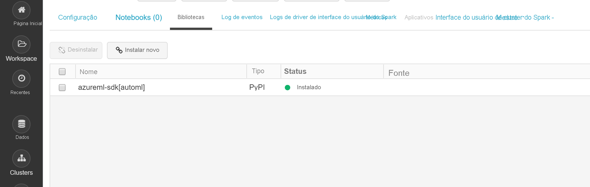

# <a name="configure-a-development-environment-for-azure-machine-learning"></a>Configurar um ambiente de desenvolvimento para Azure Machine Learning
[!INCLUDE [applies-to-skus](../../includes/aml-applies-to-basic-enterprise-sku.md)]

Neste artigo, você aprende a configurar um ambiente de desenvolvimento para trabalhar com o Azure Machine Learning. Azure Machine Learning é agnóstico de plataforma. O único requisito difícil para o seu ambiente de desenvolvimento é o Python 3. Um ambiente isolado como Anaconda ou Virtualenv também é recomendado.

A tabela a seguir mostra cada ambiente de desenvolvimento abordado neste artigo, com os prós e contras.

| Ambiente | Vantagens | Desvantagens |
| --- | --- | --- |
| [Instância de computação de aprendizado de máquina baseada em nuvem (visualização)](#compute-instance) | A maneira mais fácil de começar. Todo o SDK já está instalado em sua VM de espaço de trabalho, e os tutoriais do notebook são pré-clonados e prontos para serem executados. | Falta de controle sobre seu ambiente de desenvolvimento e dependências. Custo adicional incorrido para O Linux VM (VM pode ser interrompido quando não estiver em uso para evitar cobranças). Veja [detalhes de preços](https://azure.microsoft.com/pricing/details/virtual-machines/linux/). |
| [Ambiente local](#local) | Controle total do seu ambiente de desenvolvimento e dependências. Execute com qualquer ferramenta de construção, ambiente ou IDE de sua escolha. | Leva mais tempo para começar. Os pacotes SDK necessários devem ser instalados, e um ambiente também deve ser instalado se você ainda não tiver um. |
| [Azure Databricks](#aml-databricks) | Ideal para executar fluxos de trabalho de aprendizado de máquina com uso intensivo em larga escala na plataforma Apache Spark escalonável. | Exagero para aprendizado de máquina experimental, ou experimentos e fluxos de trabalho em menor escala. Custo adicional incorrido para Azure Databricks. Veja [detalhes de preços](https://azure.microsoft.com/pricing/details/databricks/). |
| [A Máquina Virtual de Ciência de Dados (DSVM)](#dsvm) | Semelhante à instância de computação baseada em nuvem (Python e SDK são pré-instalados), mas com ferramentas adicionais populares de data science e machine learning pré-instaladas. Fácil de dimensionar e combinar com outras ferramentas e fluxos de trabalho personalizados. | Uma experiência de início mais lenta em comparação com a instância de computação baseada em nuvem. |

Este artigo também fornece dicas adicionais de uso para as seguintes ferramentas:

* [Jupyter Notebooks](#jupyter): Se você já está usando o Jnotebook Jupyter, o SDK tem alguns extras que você deve instalar.

* [Visual Studio Code](#vscode): Se você usar o Visual Studio Code, a [extensão Azure Machine Learning](https://marketplace.visualstudio.com/items?itemName=ms-toolsai.vscode-ai) inclui amplo suporte de linguagem para Python, bem como recursos para tornar o trabalho com o Azure Machine Learning muito mais conveniente e produtivo.

## <a name="prerequisites"></a>Pré-requisitos

Um Workspace do Azure Machine Learning. Para criar o espaço de trabalho, consulte [Criar um espaço de trabalho de aprendizado de máquina do Azure](how-to-manage-workspace.md). Um espaço de trabalho é tudo o que você precisa para começar com seu próprio [servidor de notebook baseado em nuvem,](#compute-instance)um [DSVM](#dsvm)ou [Azure Databricks](#aml-databricks).

Para instalar o ambiente SDK para o [seu computador local,](#local) [o servidor Jupyter Notebook](#jupyter) ou o Visual Studio [Code](#vscode) também precisam:

- Ou o gerente de [pacotes Anaconda](https://www.anaconda.com/download/) ou [Miniconda.](https://conda.io/miniconda.html)

- No Linux ou MacOS, será necessário o shell do bash.

    > [!TIP]
    > Se você estiver no Linux ou no macOS e usar um shell diferente do bash (por exemplo, zsh), poderá receber erros ao executar alguns comandos. Para contornar esse problema, use o comando `bash` para iniciar um novo shell do Bash e executar os comandos nele.

- No Windows, você precisa do prompt de comando ou do prompt Anaconda (instalado pelo Anaconda e pelo Miniconda).

## <a name="your-own-cloud-based-compute-instance"></a><a id="compute-instance"></a>Sua própria instância de computação baseada em nuvem

A instância de computação do Azure Machine Learning [(preview)](concept-compute-instance.md) é uma estação de trabalho Segura, baseada em nuvem, que fornece aos cientistas de dados um servidor de notebook Jupyter, o JupyterLab e um ambiente ML totalmente preparado.

Não há nada para instalar ou configurar para uma instância de computação.  Crie um a qualquer momento dentro do seu espaço de trabalho azure Machine Learning. Forneça apenas um nome e especifique um tipo de VM do Azure. Experimente agora com este [Tutorial: Ambiente de configuração e espaço de trabalho](tutorial-1st-experiment-sdk-setup.md).

Saiba mais sobre [as instâncias computacionais](concept-compute-instance.md).

Para parar de incorrer em encargos computacionais, [pare a instância de computação](tutorial-1st-experiment-sdk-train.md#clean-up-resources).

## <a name="data-science-virtual-machine"></a><a id="dsvm"></a>Máquina Virtual de Ciência de Dados

A DSVM é uma imagem de VM (máquina virtual) personalizada. Ela foi projetada para trabalhos de ciência de dados pré-configurados com:

  - Pacotes como TensorFlow, PyTorch, Scikit-learn, XGBoost e o SDK do Azure Machine Learning
  - Ferramentas de ciência de dados populares como o Spark Standalone e Drill
  - Ferramentas do Azure como a CLI do Azure, o AzCopy e o Gerenciador de Armazenamento
  - IDEs (Ambientes de Desenvolvimento Integrados) como o Visual Studio Code e o PyCharm
  - Servidor do Jupyter Notebook

O SDK do Azure Machine Learning funciona na versão da DSVM para Ubuntu ou Windows. Porém, se você também planeja usar a DSVM como um destino de computação, somente o Ubuntu tem suporte.

Para usar o DSVM como ambiente de desenvolvimento:

1. Crie uma DSVM em um dos seguintes ambientes:

    * Portal do Azure:

        * [Criar uma Máquina Virtual de Ciência de Dados do Ubuntu](https://docs.microsoft.com/azure/machine-learning/data-science-virtual-machine/dsvm-ubuntu-intro)

        * [Criar uma Máquina Virtual de Ciência de Dados do Windows](https://docs.microsoft.com/azure/machine-learning/data-science-virtual-machine/provision-vm)

    * CLI do Azure:

        > [!IMPORTANT]
        > * Ao usar a CLI do Azure, primeiro você deverá entrar na assinatura do Azure usando o comando `az login`.
        >
        > * Ao usar os comandos nessa etapa, será necessários fornecer um nome do grupo de recursos, um nome para a VM, um nome de usuário e uma senha.

        * Para criar uma Máquina Virtual de Ciência de Dados do Ubuntu, use o comando a seguir:

            ```azurecli-interactive
            # create a Ubuntu DSVM in your resource group
            # note you need to be at least a contributor to the resource group in order to execute this command successfully
            # If you need to create a new resource group use: "az group create --name YOUR-RESOURCE-GROUP-NAME --location YOUR-REGION (For example: westus2)"
            az vm create --resource-group YOUR-RESOURCE-GROUP-NAME --name YOUR-VM-NAME --image microsoft-dsvm:linux-data-science-vm-ubuntu:linuxdsvmubuntu:latest --admin-username YOUR-USERNAME --admin-password YOUR-PASSWORD --generate-ssh-keys --authentication-type password
            ```

        * Para criar uma Máquina Virtual de Ciência de Dados do Windows, use o comando a seguir:

            ```azurecli-interactive
            # create a Windows Server 2016 DSVM in your resource group
            # note you need to be at least a contributor to the resource group in order to execute this command successfully
            az vm create --resource-group YOUR-RESOURCE-GROUP-NAME --name YOUR-VM-NAME --image microsoft-dsvm:dsvm-windows:server-2016:latest --admin-username YOUR-USERNAME --admin-password YOUR-PASSWORD --authentication-type password
            ```

2. O SDK do Azure Machine Learning já está instalado na DSVM. Para usar o ambiente do Conda que contém o SDK, use um dos seguintes comandos:

    * Para DSVM do Ubuntu:

        ```bash
        conda activate py36
        ```

    * Para DSVM do Windows:

        ```bash
        conda activate AzureML
        ```

1. Para confirmar que você pode acessar o SDK e verificar a versão, use o seguinte código Python:

    ```python
    import azureml.core
    print(azureml.core.VERSION)
    ```

1. Para configurar o DSVM para usar o espaço de trabalho azure Machine Learning, consulte a seção Criar uma seção [de arquivo de configuração de espaço de trabalho.](#workspace)

Para obter mais informações, consulte [Máquinas Virtuais de Ciência de Dados](https://azure.microsoft.com/services/virtual-machines/data-science-virtual-machines/).

## <a name="local-computer"></a><a id="local"></a>Computador local

Quando você estiver usando um computador local (que também pode ser uma máquina virtual remota), crie um ambiente Anaconda e instale o SDK. Aqui está um exemplo:

1. Baixe e [instale o Anaconda](https://www.anaconda.com/distribution/#download-section) (versão Python 3.7) se você ainda não tiver.

1. Abra um prompt anaconda e crie um ambiente com os seguintes comandos:

    Execute o seguinte comando para criar o ambiente.

    ```bash
    conda create -n myenv python=3.6.5
    ```

    Então ative o ambiente.

    ```bash
    conda activate myenv
    ```

    Este exemplo cria um ambiente usando python 3.6.5, mas quaisquer subversões específicas podem ser escolhidas. A compatibilidade com o SDK pode não ser garantida com certas versões principais (3.5+ é recomendado), e é recomendável experimentar uma versão/subversão diferente em seu ambiente Anaconda se você encontrar erros. Levará vários minutos para criar o ambiente enquanto os componentes e pacotes são baixados.

1. Execute os seguintes comandos em seu novo ambiente para habilitar kernels IPython específicos do ambiente. Isso garantirá o comportamento esperado de importação de kernel e pacote ao trabalhar com notebooks Jupyter em ambientes Anaconda:

    ```bash
    conda install notebook ipykernel
    ```

    Em seguida, execute o seguinte comando para criar o kernel:

    ```bash
    ipython kernel install --user --name myenv --display-name "Python (myenv)"
    ```

1. Use os seguintes comandos para instalar pacotes:

    Este comando instala o Base Azure Machine Learning `automl` SDK com notebook e extras. O `automl` extra é uma grande instalação, e pode ser removido dos suportes se você não pretende executar experimentos automatizados de aprendizado de máquina. O `automl` extra também inclui o Azure Machine Learning Data Prep SDK por padrão como uma dependência.

    ```bash
    pip install azureml-sdk[notebooks,automl]
    ```

   > [!NOTE]
   > * Se você receber uma mensagem informando que o PyYAML não pode ser desinstalado, use o seguinte comando:
   >
   >   `pip install --upgrade azureml-sdk[notebooks,automl] --ignore-installed PyYAML`
   >
   > * A partir do macOS Catalina, o zsh (Z Shell) é o shell de logon padrão e o shell interativo. No zsh, use o comando a seguir que escapa os colchetes com "\\" (barra invertida):
   >
   >   `pip install --upgrade azureml-sdk\[notebooks,automl\]`

   Levará vários minutos para instalar o SDK. Para obter mais informações sobre as opções de instalação, consulte o [guia de instalação](https://docs.microsoft.com/python/api/overview/azure/ml/install?view=azure-ml-py).

1. Instale outros pacotes para sua experimentação de aprendizado de máquina.

    Use qualquer um dos seguintes comandos e substitua * \<o novo pacote>* com o pacote que deseja instalar. A instalação de `conda install` pacotes através requer que o pacote faça parte dos canais atuais (novos canais podem ser adicionados no Anaconda Cloud).

    ```bash
    conda install <new package>
    ```

    Alternativamente, você pode instalar `pip`pacotes via .

    ```bash
    pip install <new package>
    ```

### <a name="jupyter-notebooks"></a><a id="jupyter"></a>Jupyter Notebooks

Jupyter Notebooks fazem parte do [Projeto Jupyter](https://jupyter.org/). Eles fornecem uma experiência interativa de codificação, em que você pode criar documentos que combinam código ao vivo com elementos gráficos e texto. O Jupyter Notebook também é uma ótima maneira de compartilhar seus resultados com outras pessoas, já que é possível salvar a saída das seções de código no documento. Você pode instalar os Jupyter Notebooks em uma variedade de plataformas.

O procedimento na seção local do [computador](#local) instala os componentes necessários para a execução de Notebooks Jupyter em um ambiente Anaconda.

Para habilitar esses componentes no ambiente do Jupyter Notebook:

1. Abra um prompt Anaconda e ative seu ambiente.

    ```bash
    conda activate myenv
    ```

1. Clone [o repositório GitHub](https://aka.ms/aml-notebooks) para um conjunto de notebooks de exemplo.

    ```bash
    git clone https://github.com/Azure/MachineLearningNotebooks.git
    ```

1. Inicie o servidor Jupyter Notebook com o seguinte comando:

    ```bash
    jupyter notebook
    ```

1. Para verificar se o Jupyter Notebook pode usar o SDK, crie um **novo** notebook, selecione **Python 3** como seu kernel e execute o seguinte comando em uma célula de notebook:

    ```python
    import azureml.core
    azureml.core.VERSION
    ```

1. Se você encontrar problemas de importação `ModuleNotFoundError`de módulos e receber um , certifique-se de que seu kernel Jupyter está conectado ao caminho correto para o seu ambiente, executando o seguinte código em uma célula Notebook.

    ```python
    import sys
    sys.path
    ```

1. Para configurar o Jupyter Notebook para usar seu espaço de trabalho Azure Machine Learning, vá para a seção Criar uma seção [de arquivo de configuração de espaço de trabalho.](#workspace)

### <a name="visual-studio-code"></a><a id="vscode"></a>Visual Studio Code

Visual Studio Code é um editor de código cross platform muito popular que suporta um extenso conjunto de linguagens e ferramentas de programação através de extensões disponíveis no [mercado visual studio.](https://marketplace.visualstudio.com/vscode) A [extensão Azure Machine Learning](https://marketplace.visualstudio.com/items?itemName=ms-toolsai.vscode-ai) instala a [extensão Python](https://marketplace.visualstudio.com/items?itemName=ms-python.python) para codificação em todos os tipos de ambientes Python (virtual, Anaconda, etc.). Além disso, ele fornece recursos de conveniência para trabalhar com recursos de Machine Learning do Azure e executar experimentos de Machine Learning do Azure, tudo sem sair do Visual Studio Code.

Para usar o Visual Studio Code para desenvolvimento:

1. Instale a extensão Azure Machine Learning para Visual Studio Code, consulte [Azure Machine Learning](https://marketplace.visualstudio.com/items?itemName=ms-toolsai.vscode-ai).

    Para obter mais informações, consulte [Usar o Azure Machine Learning para Visual Studio Code](tutorial-setup-vscode-extension.md).

1. Aprenda a usar o Visual Studio Code para qualquer tipo de desenvolvimento Python, consulte [Comece com o Python no VSCode](https://code.visualstudio.com/docs/python/python-tutorial).

    - Para selecionar o ambiente SDK Python contendo o SDK, abra o CÓDIGO VS e selecione Ctrl+Shift+P (Linux e Windows) ou Command+Shift+P (Mac).
        - A __paleta de comando é__ aberta.

    - Digite __Python: Selecione O interpretador__e selecione o ambiente apropriado

1. Para validar que você pode usar o SDK, crie um novo arquivo Python (.py) que contém o seguinte código:

    ```python
    #%%
    import azureml.core
    azureml.core.VERSION
    ```
    Execute este código clicando no CodeLens "Run cell" ou simplesmente pressione shift-enter.
<a name="aml-databricks"></a>

## <a name="azure-databricks"></a>Azure Databricks
O Azure Databricks é um ambiente baseado em Faíscaapache na nuvem do Azure. Ele fornece um ambiente colaborativo baseado em Notebook com cpu ou cluster de computação baseado em GPU.

Como o Azure Databricks funciona com o Azure Machine Learning:
+ Você pode treinar um modelo usando Spark MLlib e implantar o modelo no ACI/AKS de dentro do Azure Databricks.
+ Você também pode usar recursos [automatizados de aprendizado de máquina](concept-automated-ml.md) em um Azure ML SDK especial com Azure Databricks.
+ Você pode usar o Azure Databricks como um alvo de computação de um [pipeline de Machine Learning do Azure](concept-ml-pipelines.md).

### <a name="set-up-your-databricks-cluster"></a>Configure seu cluster Databricks

Crie um [cluster Databricks](https://docs.microsoft.com/azure/azure-databricks/quickstart-create-databricks-workspace-portal). Algumas configurações só se aplicam se você instalar o SDK para aprendizado automático de máquina em Databricks.
**São necessários alguns minutos para criar o cluster.**

Use estas configurações:

| Configuração |Aplica-se a| Valor |
|----|---|---|
| Nome do cluster |always| nomedoseucluster |
| Databricks Runtime |always|Tempo de execução não-ML 6.5 (scala 2.11, faísca 2.4.3) |
| Versão do Python |always| 3 |
| Trabalhos |always| 2 ou superior |
| Tipos de VM do nó de trabalho <br>(determina o max # de iterações simultâneas) |ML automatizado<br>rápido| Uma VM otimizada para memória é preferível |
| Habilitar o dimensionamento automático |ML automatizado<br>rápido| Desmarcar |

Aguarde até que o cluster está em execução antes de continuar.

### <a name="install-the-correct-sdk-into-a-databricks-library"></a>Instale o SDK correto em uma biblioteca databricks
Uma vez que o cluster esteja em execução, [crie uma biblioteca](https://docs.databricks.com/user-guide/libraries.html#create-a-library) para anexar o pacote SDK de aprendizado de máquina azure apropriado ao seu cluster.

1. Clique com o botão direito do mouse na pasta workspace atual onde deseja armazenar a biblioteca. Selecione **Criar** > **biblioteca**.

1. Escolha **apenas uma** opção (nenhuma outra instalação do SDK é suportada)

   |Extras do&nbsp;&nbsp;pacote SDK|Fonte|Nome&nbsp;PyPi&nbsp;&nbsp;&nbsp;&nbsp;&nbsp;&nbsp;|
   |----|---|---|
   |Para Databricks| Carregar Python Egg ou PyPI | azureml-sdk[databricks]|
   |Para Databricks -com...<br> recursos automatizados de ML| Carregar Python Egg ou PyPI | azureml-sdk[automl]|

   > [!Warning]
   > Nenhum outro sdk extras pode ser instalado. Escolha apenas uma das opções anteriores [databricks] ou [automl].

   * Não selecione **Anexar automaticamente a todos os clusters**.
   * Selecione **Anexar** ao lado do nome do cluster.

1. Monitore se há erros até que o status seja **alterado para Anexo,** o que pode levar vários minutos.  Se esta etapa falhar:

   Tente reiniciar seu cluster por:
   1. No painel esquerdo, selecione **Clusters**.
   1. Na tabela, selecione o nome do cluster.
   1. Na guia **Bibliotecas**, selecione **Reiniciar**.

   Considere também:
   + Na configuração AutoML, ao usar o Azure Databricks, adicione os seguintes parâmetros:
       1. ```max_concurrent_iterations```é baseado no número de nódulos operidiais em seu cluster.
        2. ```spark_context=sc```é baseado no contexto padrão de faísca.
   + Ou, se você tiver uma versão antiga do SDK, desmarque-a das libs instaladas do cluster e mude-se para o lixo. Instale a nova versão do SDK e reinicie o cluster. Se houver um problema após a reinicialização, desconecte-se e reconecte o cluster.

Se a instalação foi bem sucedida, a biblioteca importada deve se parecer com uma delas:

SDK para Databricks **_sem_** aprendizado 

SDK para Databricks **COM** SDK automatizado de aprendizado de 

### <a name="start-exploring"></a>Comece a explorar

Experimente:
+ Embora muitos cadernos de exemplo estejam disponíveis, **apenas [esses notebooks de exemplo](https://github.com/Azure/MachineLearningNotebooks/blob/master/how-to-use-azureml/azure-databricks) funcionam com os Databricks do Azure.**

+ Importe essas amostras diretamente do seu espaço de trabalho. Veja abaixo: 


+ Aprenda a [criar um pipeline com Databricks como o cálculo de treinamento](how-to-create-your-first-pipeline.md).

## <a name="create-a-workspace-configuration-file"></a><a id="workspace"></a>Criar um arquivo de configuração de workspace

O arquivo de configuração do espaço de trabalho é um arquivo JSON que informa ao SDK como se comunicar com o espaço de trabalho do Azure Machine Learning. O arquivo é nomeado *config.json* e tem o seguinte formato:

```json
{
    "subscription_id": "<subscription-id>",
    "resource_group": "<resource-group>",
    "workspace_name": "<workspace-name>"
}
```

Esse arquivo JSON deve estar na estrutura de diretório que contém os scripts Python ou Jupyter Notebooks. Ele pode estar no mesmo diretório, um subdiretório denominado *.azureml* ou em um diretório pai.

Para usar esse arquivo de seu código, use `ws=Workspace.from_config()`. Esse código carrega as informações do arquivo e se conecta ao seu workspace.

É possível criar o arquivo de configuração de três maneiras:

* **Use [ws.write_config](https://docs.microsoft.com/python/api/overview/azure/ml/intro?view=azure-ml-py)**: para escrever um arquivo *config.json.* O arquivo contém as informações de configuração do workspace. É possível baixar ou copiar o *config.json* para outros ambientes de desenvolvimento.

* **Baixe o arquivo**: No [portal Azure,](https://ms.portal.azure.com)selecione **Baixar config.json** na seção **Visão Geral** do seu espaço de trabalho.

     

* **Crie o arquivo de forma programática**: No seguinte trecho de código, você se conecta a um espaço de trabalho fornecendo o ID de assinatura, grupo de recursos e nome do espaço de trabalho. Em seguida, salva a configuração do workspace no arquivo:

    ```python
    from azureml.core import Workspace

    subscription_id = '<subscription-id>'
    resource_group  = '<resource-group>'
    workspace_name  = '<workspace-name>'

    try:
        ws = Workspace(subscription_id = subscription_id, resource_group = resource_group, workspace_name = workspace_name)
        ws.write_config()
        print('Library configuration succeeded')
    except:
        print('Workspace not found')
    ```

    Este código grava o arquivo de configuração no arquivo *.azureml/config.json.*

## <a name="next-steps"></a>Próximas etapas

- [Treine um modelo](tutorial-train-models-with-aml.md) no Azure Machine Learning com o conjunto de dados MNIST
- Veja a referência do [SDK do Azure Machine Learning para Python](https://docs.microsoft.com/python/api/overview/azure/ml/intro?view=azure-ml-py)
