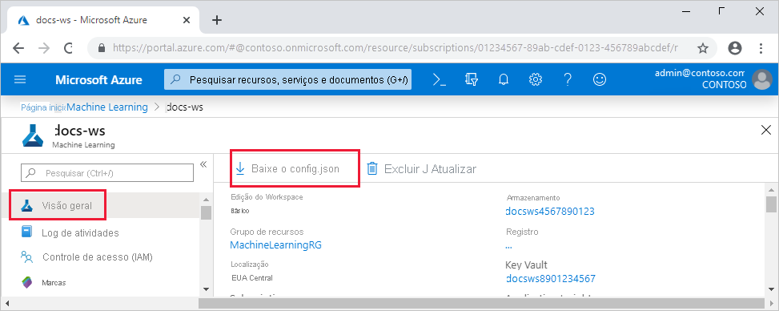

# <a name="set-up-a-python-development-environment-for-azure-machine-learning"></a>Configurar um ambiente de desenvolvimento do Python para Azure Machine Learning

Saiba como configurar um ambiente de desenvolvimento do Python para Azure Machine Learning.

A tabela a seguir mostra cada ambiente de desenvolvimento abordado neste artigo, com os prós e contras.

| Ambiente | Vantagens | Desvantagens |
| --- | --- | --- |
| [Ambiente local](#local) | Controle total do seu ambiente de desenvolvimento e dependências. Execute com qualquer ferramenta de compilação, ambiente ou IDE de sua escolha. | Leva mais tempo para começar. Os pacotes SDK necessários devem ser instalados e um ambiente também deve ser instalado se você ainda não tiver um. |
| [O Máquina Virtual de Ciência de Dados (DSVM)](#dsvm) | Semelhante à instância de computação baseada em nuvem (o Python e o SDK são pré-instalados), mas com uma ciência de dados popular adicional e ferramentas de aprendizado de máquina pré-instaladas. Fácil de dimensionar e combinar com outras ferramentas e fluxos de trabalho personalizados. | Uma experiência de introdução mais lenta em comparação com a instância de computação baseada em nuvem. |
| [Instância de computação do Azure Machine Learning](#compute-instance) | A maneira mais fácil de começar. O SDK completo já está instalado na VM do seu espaço de trabalho, e os tutoriais do notebook são previamente clonados e prontos para serem executados. | Falta de controle sobre seu ambiente de desenvolvimento e dependências. Custo adicional incorrido para a VM do Linux (a VM pode ser interrompida quando não estiver em uso para evitar cobranças). Consulte [detalhes de preço](https://azure.microsoft.com/pricing/details/virtual-machines/linux/). |
| [Azure Databricks](how-to-configure-databricks-automl-environment.md) | Ideal para executar fluxos de trabalho de aprendizado de máquina com uso intensivo em larga escala na plataforma Apache Spark escalonável. | Um exagero para aprendizado de máquina experimental ou experimentos e fluxos de trabalho de escala menor. Custo adicional incorrido para Azure Databricks. Consulte [detalhes de preço](https://azure.microsoft.com/pricing/details/databricks/). |

Este artigo também fornece dicas de uso adicionais para as seguintes ferramentas:

* Jupyter Notebooks: se você já está usando Jupyter Notebooks, o SDK tem alguns recursos extra que você deve instalar.

* Visual Studio Code: se você usar Visual Studio Code, a [extensão Azure Machine Learning](https://marketplace.visualstudio.com/items?itemName=ms-toolsai.vscode-ai) incluirá amplo suporte a idiomas para Python, bem como recursos para tornar o trabalho com os Azure Machine Learning muito mais conveniente e produtivo.

## <a name="prerequisites"></a>Pré-requisitos

* Espaço de trabalho Azure Machine Learning. Se você não tiver uma, poderá criar um Azure Machine Learning espaço de trabalho por meio dos modelos [portal do Azure](how-to-manage-workspace.md), [CLI do Azure](how-to-manage-workspace-cli.md#create-a-workspace)e [Azure Resource Manager](how-to-create-workspace-template.md).

### <a name="local-and-dsvm-only-create-a-workspace-configuration-file"></a><a id="workspace"></a> Somente local e DSVM: criar um arquivo de configuração de espaço de trabalho

O arquivo de configuração do espaço de trabalho é um arquivo JSON que informa ao SDK como se comunicar com seu espaço de trabalho Azure Machine Learning. O arquivo é nomeado *config.json* e tem o seguinte formato:

```json
{
    "subscription_id": "<subscription-id>",
    "resource_group": "<resource-group>",
    "workspace_name": "<workspace-name>"
}
```

Esse arquivo JSON deve estar na estrutura de diretório que contém os scripts Python ou Jupyter Notebooks. Ele pode estar no mesmo diretório, um subdiretório denominado *.azureml* ou em um diretório pai.

Para usar esse arquivo do seu código, use o [`Workspace.from_config`](/python/api/azureml-core/azureml.core.workspace.workspace?view=azure-ml-py#from-config-path-none--auth-none---logger-none---file-name-none-&preserve-view=true) método. Esse código carrega as informações do arquivo e se conecta ao seu workspace.

Crie um arquivo de configuração de espaço de trabalho em um dos seguintes métodos:

* Portal do Azure

    **Baixe o arquivo**: no [portal do Azure](https://ms.portal.azure.com), selecione  **baixar config.jsna** seção **visão geral** do seu espaço de trabalho.

    

* SDK do Python do Azure Machine Learning

    Crie um script para se conectar ao seu Azure Machine Learning espaço de trabalho e use o [`write_config`](/python/api/azureml-core/azureml.core.workspace.workspace?view=azure-ml-py#write-config-path-none--file-name-none-&preserve-view=true) método para gerar o arquivo e salvá-lo como *. azureml/config.jsem*. Certifique-se de substituir `subscription_id` , `resource_group` e `workspace_name` pelo seu próprio.

    ```python
    from azureml.core import Workspace

    subscription_id = '<subscription-id>'
    resource_group  = '<resource-group>'
    workspace_name  = '<workspace-name>'

    try:
        ws = Workspace(subscription_id = subscription_id, resource_group = resource_group, workspace_name = workspace_name)
        ws.write_config()
        print('Library configuration succeeded')
    except:
        print('Workspace not found')
    ```

## <a name="local-computer-or-remote-vm-environment"></a><a id="local"></a>Computador local ou ambiente de VM remota

Você pode configurar um ambiente em um computador local ou máquina virtual remota, como uma instância de computação Azure Machine Learning ou VM de Ciência de Dados. 

Para configurar um ambiente de desenvolvimento local ou VM remota:

1. Crie um ambiente virtual Python (virtualenv, Conda).

    > [!NOTE]
    > Embora não seja necessário, é recomendável usar [Anaconda](https://www.anaconda.com/download/) ou [Miniconda](https://www.anaconda.com/download/) para gerenciar ambientes virtuais do Python e instalar pacotes.

    > [!IMPORTANT]
    > Se você estiver no Linux ou no macOS e usar um shell diferente do bash (por exemplo, zsh), poderá receber erros ao executar alguns comandos. Para contornar esse problema, use o comando `bash` para iniciar um novo shell do Bash e executar os comandos nele.

1. Ative seu ambiente virtual do Python criado recentemente.
1. Instale o [SDK do Azure Machine Learning Python](/python/api/overview/azure/ml/install?preserve-view=true&view=azure-ml-py).
1. Para configurar seu ambiente local para usar seu espaço de trabalho Azure Machine Learning, [crie um arquivo de configuração de espaço de trabalho](#workspace) ou use um existente.

Agora que o seu ambiente local está configurado, você está pronto para começar a trabalhar com Azure Machine Learning. Consulte o [Guia de introdução ao Azure Machine Learning Python](tutorial-1st-experiment-sdk-setup-local.md) para começar.

### <a name="jupyter-notebooks"></a><a id="jupyter"></a>Jupyter Notebooks

Ao executar um servidor de Jupyter Notebook local, é recomendável que você crie um kernel IPython para seu ambiente virtual Python. Isso ajuda a garantir o comportamento esperado do kernel e da importação de pacote.

1. Habilitar kernels IPython específicos do ambiente

    ```bash
    conda install notebook ipykernel
    ```

1. Crie um kernel para seu ambiente virtual Python. Certifique-se de substituir `<myenv>` pelo nome do seu ambiente virtual Python.

    ```bash
    ipython kernel install --user --name <myenv> --display-name "Python (myenv)"
    ```

1. Iniciar o servidor de Jupyter Notebook

Consulte o [repositório Azure Machine Learning notebooks](https://github.com/Azure/MachineLearningNotebooks) para começar a usar os blocos de anotações Azure Machine Learning e Jupyter.

> [!NOTE]
> Um repositório de exemplo voltado para a comunidade pode ser encontrado em https://github.com/Azure/azureml-examples.

### <a name="visual-studio-code"></a><a id="vscode"></a>Visual Studio Code

Para usar Visual Studio Code para desenvolvimento:

1. Instale o [Visual Studio Code](https://code.visualstudio.com/Download).
1. Instale a [extensão de Visual Studio Code de Azure Machine Learning](tutorial-setup-vscode-extension.md) (versão prévia).

Quando tiver a extensão de Visual Studio Code instalada, você poderá gerenciar seus [recursos de Azure Machine Learning](how-to-manage-resources-vscode.md), [executar e depurar experimentos](how-to-debug-visual-studio-code.md)e [implantar modelos treinados](tutorial-train-deploy-image-classification-model-vscode.md).

## <a name="azure-machine-learning-compute-instance"></a><a id="compute-instance"></a>Azure Machine Learning instância de computação

A [instância de computação](concept-compute-instance.md) Azure Machine Learning é uma estação de trabalho do Azure segura e baseada em nuvem que fornece cientistas de dados com um Jupyter Notebook Server, JupyterLab e um ambiente de aprendizado de máquina totalmente gerenciado.

Não há nada para instalar ou configurar para uma instância de computação.  

Crie uma a qualquer momento em seu espaço de trabalho Azure Machine Learning. Forneça apenas um nome e especifique um tipo de VM do Azure. Experimente agora com este [tutorial: configurar o ambiente e o espaço de trabalho](tutorial-1st-experiment-sdk-setup.md).

Para saber mais sobre as instâncias de computação, incluindo como instalar pacotes, confira [criar e gerenciar uma instância de computação Azure Machine Learning](how-to-create-manage-compute-instance.md).

> [!TIP]
> Para evitar incorrer em encargos para uma instância de computação não usada, [interrompa a instância de computação](how-to-create-manage-compute-instance.md#manage).

Além de um Jupyter Notebook Server e JupyterLab, você pode usar instâncias de computação no [recurso de bloco de anotações integrado dentro do Azure Machine Learning Studio](how-to-run-jupyter-notebooks.md).

Você também pode usar a extensão Azure Machine Learning Visual Studio Code para [Configurar uma instância de computação Azure Machine Learning como um servidor Jupyter Notebook remoto](how-to-set-up-vs-code-remote.md#configure-compute-instance-as-remote-notebook-server).

## <a name="data-science-virtual-machine"></a><a id="dsvm"></a>Máquina Virtual de Ciência de Dados

O VM de Ciência de Dados é uma imagem de VM (máquina virtual) personalizada que você pode usar como um ambiente de desenvolvimento. Ele foi projetado para o trabalho de ciência de dados que é uma ferramenta pré-configurada e software como:

  - Pacotes como TensorFlow, PyTorch, Scikit-learn, XGBoost e o SDK do Azure Machine Learning
  - Ferramentas de ciência de dados populares como o Spark Standalone e Drill
  - Ferramentas do Azure como a CLI do Azure, o AzCopy e o Gerenciador de Armazenamento
  - IDEs (Ambientes de Desenvolvimento Integrados) como o Visual Studio Code e o PyCharm
  - Servidor do Jupyter Notebook

Para obter uma lista mais abrangente das ferramentas, consulte o [Guia de ferramentas de VM de ciência de dados](data-science-virtual-machine/tools-included.md).

> [!IMPORTANT]
> Se você planeja usar o VM de Ciência de Dados como um [destino de computação](concept-compute-target.md) para seus trabalhos de treinamento ou inferência, somente o Ubuntu tem suporte.

Para usar o VM de Ciência de Dados como um ambiente de desenvolvimento:

1. Crie um VM de Ciência de Dados usando um dos seguintes métodos:

    * Use o portal do Azure para criar um DSVM do [Ubuntu](data-science-virtual-machine/dsvm-ubuntu-intro.md) ou do [Windows](data-science-virtual-machine/provision-vm.md) .
    * [Crie um VM de ciência de dados usando modelos ARM](data-science-virtual-machine/dsvm-tutorial-resource-manager.md).
    * Usar a CLI do Azure

        Para criar um VM de Ciência de Dados Ubuntu, use o seguinte comando:

        ```azurecli-interactive
        # create a Ubuntu Data Science VM in your resource group
        # note you need to be at least a contributor to the resource group in order to execute this command successfully
        # If you need to create a new resource group use: "az group create --name YOUR-RESOURCE-GROUP-NAME --location YOUR-REGION (For example: westus2)"
        az vm create --resource-group YOUR-RESOURCE-GROUP-NAME --name YOUR-VM-NAME --image microsoft-dsvm:linux-data-science-vm-ubuntu:linuxdsvmubuntu:latest --admin-username YOUR-USERNAME --admin-password YOUR-PASSWORD --generate-ssh-keys --authentication-type password
        ```

        Para criar um DSVM do Windows, use o seguinte comando:

        ```azurecli-interactive
        # create a Windows Server 2016 DSVM in your resource group
        # note you need to be at least a contributor to the resource group in order to execute this command successfully
        az vm create --resource-group YOUR-RESOURCE-GROUP-NAME --name YOUR-VM-NAME --image microsoft-dsvm:dsvm-windows:server-2016:latest --admin-username YOUR-USERNAME --admin-password YOUR-PASSWORD --authentication-type password
        ```

1. Ative o ambiente Conda que contém o SDK do Azure Machine Learning.

    * Para o Ubuntu VM de Ciência de Dados:

        ```bash
        conda activate py36
        ```

    * Para o Windows VM de Ciência de Dados:

        ```bash
        conda activate AzureML
        ```

1. Para configurar o VM de Ciência de Dados para usar seu espaço de trabalho do Azure Machine Learning, [crie um arquivo de configuração do espaço de trabalho](#workspace) ou use um existente.

Semelhante a ambientes locais, você pode usar Visual Studio Code e a [extensão de Visual Studio Code de Azure Machine Learning](#vscode) para interagir com Azure Machine Learning.

Para obter mais informações, consulte [Máquinas Virtuais de Ciência de Dados](https://azure.microsoft.com/services/virtual-machines/data-science-virtual-machines/).


## <a name="next-steps"></a>Próximas etapas

- [Treinar um modelo](tutorial-train-models-with-aml.md) em Azure Machine Learning com o conjunto de MNIST.
- Consulte a [referência do SDK do Azure Machine Learning para Python](/python/api/overview/azure/ml/intro?preserve-view=true&view=azure-ml-py). 