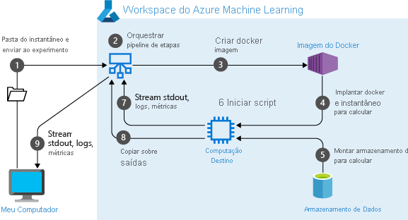

# <a name="create-and-run-machine-learning-pipelines-with-azure-machine-learning-sdk"></a>Crie e execute pipelines de machine learning com o SDK do Azure Machine Learning

Neste artigo, você aprenderá a criar e executar [pipelines de Machine Learning](concept-ml-pipelines.md) usando o [SDK do Azure Machine Learning](/python/api/overview/azure/ml/intro?preserve-view=true&view=azure-ml-py). Use **pipelines ml** para criar um fluxo de trabalho que junte-se a várias fases de ml. Em seguida, publique esse pipeline para acessar ou compartilhar mais tarde com outras pessoas. Acompanhe pipelines ML para ver como seu modelo está sendo executado no mundo real e para detectar descompasso de dados. Os pipelines ML são ideais para cenários de pontuação em lote, usando várias computações, reutilizando etapas em vez de executá-las novamente, bem como compartilhar fluxos de trabalho de AM com outras pessoas.

Este artigo não é um tutorial. Para obter orientação sobre como criar seu primeiro pipeline, consulte [tutorial: criar um pipeline de Azure Machine Learning para a pontuação de lote](tutorial-pipeline-batch-scoring-classification.md) ou [usar o ml automatizado em um pipeline de Azure Machine Learning no Python](how-to-use-automlstep-in-pipelines.md). 

Embora você possa usar um tipo diferente de pipeline chamado de [pipeline do Azure](/azure/devops/pipelines/targets/azure-machine-learning?context=azure%2fmachine-learning%2fservice%2fcontext%2fml-context&preserve-view=true&tabs=yaml&view=azure-devops) para a automação de CI/CD de tarefas do ml, esse tipo de pipeline não é armazenado em seu espaço de trabalho. [Compare esses pipelines diferentes](concept-ml-pipelines.md#which-azure-pipeline-technology-should-i-use).

Os pipelines de ML que você cria são visíveis para os membros do seu [espaço de trabalho](how-to-manage-workspace.md)Azure Machine Learning. 

Os pipelines ML são executados em destinos de computação (consulte [o que são destinos de computação no Azure Machine Learning](./concept-compute-target.md)). Os pipelines podem ler e gravar dados de e para locais de [armazenamento do Azure](../storage/index.yml) com suporte.

Caso não tenha uma assinatura do Azure, crie uma conta gratuita antes de começar. Experimente a [versão gratuita ou paga do Azure Machine Learning](https://aka.ms/AMLFree).

## <a name="prerequisites"></a>Pré-requisitos

* Crie um [Workspace do Azure Machine Learning](how-to-manage-workspace.md) para manter todos os seus recursos de pipeline.

* [Configure seu ambiente de desenvolvimento](how-to-configure-environment.md) para instalar o sdk do Azure Machine Learning ou use uma [instância de computação Azure Machine Learning](concept-compute-instance.md) com o SDK já instalado.

Comece anexando seu espaço de trabalho:

```Python
import azureml.core
from azureml.core import Workspace, Datastore

ws = Workspace.from_config()
```

## <a name="set-up-machine-learning-resources"></a>Configurar recursos de aprendizado de máquina

Crie os recursos necessários para executar um pipeline de ML:

* Configurar um repositório de dados usado para acessar os dados necessários nas etapas de pipeline.

* Configure um `Dataset` objeto para apontar para dados persistentes que residem no, ou que podem ser acessados em um datastore. Configure um `PipelineData` objeto para dados temporários passados entre etapas de pipeline. 

    > [!TIP]
    > Uma experiência aprimorada para passar dados temporários entre etapas de pipeline está disponível na classe de visualização pública,  [`OutputFileDatasetConfig`](/python/api/azureml-core/azureml.data.outputfiledatasetconfig?preserve-view=true&view=azure-ml-py) .  Essa classe é um recurso de visualização [experimental](/python/api/overview/azure/ml/?preserve-view=true&view=azure-ml-py#&preserve-view=truestable-vs-experimental) e pode mudar a qualquer momento.

* Configure os [destinos de computação](concept-azure-machine-learning-architecture.md#compute-targets) em que suas etapas de pipeline serão executadas.

### <a name="set-up-a-datastore"></a>Configurar um repositório de dados

Um repositório de dados armazena os dados para o pipeline acessar. Cada workspace tem um repositório de dados padrão. Você pode registrar armazenamentos de dados adicionais. 

Quando você cria seu espaço de trabalho, [os arquivos do Azure](../storage/files/storage-files-introduction.md) e o [armazenamento de BLOBs do Azure](../storage/blobs/storage-blobs-introduction.md) são anexados ao espaço de trabalho. Um repositório de armazenamento padrão é registrado para se conectar ao armazenamento de BLOBs do Azure. Para saber mais, consulte [Decidindo quando usar Arquivos do Azure, Blobs do Azure ou Discos do Azure](../storage/common/storage-introduction.md). 

```python
# Default datastore 
def_data_store = ws.get_default_datastore()

# Get the blob storage associated with the workspace
def_blob_store = Datastore(ws, "workspaceblobstore")

# Get file storage associated with the workspace
def_file_store = Datastore(ws, "workspacefilestore")

```

As etapas geralmente consomem dados e produzem dados de saída. Uma etapa pode criar dados como um modelo, um diretório com o modelo e arquivos dependentes ou dados temporários. Esses dados então ficam disponíveis para outras etapas posteriores no pipeline. Para saber mais sobre como conectar seu pipeline a seus dados, confira os artigos [como acessar dados](how-to-access-data.md) e [como registrar os DataSets](how-to-create-register-datasets.md). 

### <a name="configure-data-with-dataset-and-pipelinedata-objects"></a>Configurar dados com `Dataset` `PipelineData` objetos e

A maneira preferida de fornecer dados a um pipeline é um objeto [DataSet](/python/api/azureml-core/azureml.core.dataset.Dataset) . O `Dataset` objeto aponta para os dados que residem no ou podem ser acessados por um armazenamento ou por uma URL da Web. A `Dataset` classe é abstrata, portanto, você criará uma instância de um `FileDataset` (referindo-se a um ou mais arquivos) ou um `TabularDataset` que é criado por um ou mais arquivos com colunas delimitadas de dados.


Você cria um `Dataset` usando métodos como [from_files](/python/api/azureml-core/azureml.data.dataset_factory.filedatasetfactory?preserve-view=true&view=azure-ml-py#&preserve-view=truefrom-files-path--validate-true-) ou [from_delimited_files](/python/api/azureml-core/azureml.data.dataset_factory.tabulardatasetfactory?preserve-view=true&view=azure-ml-py#&preserve-view=truefrom-delimited-files-path--validate-true--include-path-false--infer-column-types-true--set-column-types-none--separator------header-true--partition-format-none--support-multi-line-false-).

```python
from azureml.core import Dataset

my_dataset = Dataset.File.from_files([(def_blob_store, 'train-images/')])
```
Dados intermediários (ou a saída de uma etapa) são representados por um objeto [PipelineData](/python/api/azureml-pipeline-core/azureml.pipeline.core.pipelinedata?preserve-view=true&view=azure-ml-py). `output_data1` é produzido como a saída de uma etapa e usado como a entrada de um ou mais etapas futuras. O `PipelineData` introduz uma dependência de dados entre etapas e cria uma ordem de execução implícita no pipeline. Esse objeto será usado mais tarde ao criar etapas de pipeline.

```python
from azureml.pipeline.core import PipelineData

output_data1 = PipelineData(
    "output_data1",
    datastore=def_blob_store,
    output_name="output_data1")

```

> [!TIP]
> A persistência de dados intermediários entre etapas de pipeline também é possível com a classe de visualização pública, [`OutputFileDatasetConfig`](/python/api/azureml-core/azureml.data.outputfiledatasetconfig?preserve-view=true&view=azure-ml-py) . Para obter um exemplo de código usando a `OutputFileDatasetConfig` classe, consulte como [criar um pipeline de ml de duas etapas](https://github.com/Azure/MachineLearningNotebooks/blob/master/how-to-use-azureml/work-with-data/datasets-tutorial/pipeline-with-datasets/pipeline-for-image-classification.ipynb).

> [!TIP]
> Carregue somente arquivos relevantes para o trabalho em questão. Qualquer alteração nos arquivos no diretório de dados será vista como motivo para executar a etapa novamente na próxima vez que o pipeline for executado, mesmo se a reutilização for especificada. 

## <a name="set-up-a-compute-target"></a>Configurar um destino de computação


No Azure Machine Learning, o termo __computação__ (ou __destino de computação__) refere-se a computadores ou clusters que executam as etapas computacionais no pipeline de aprendizado de máquina.   Consulte [destinos de computação para treinamento de modelo](concept-compute-target.md#train) para obter uma lista completa de destinos de computação e [criar destinos de computação](how-to-create-attach-compute-studio.md) para saber como criá-los e anexá-los ao seu espaço de trabalho.   O processo para criar e ou anexar um destino de computação é o mesmo se você estiver treinando um modelo ou executando uma etapa de pipeline. Depois de criar e anexar seu destino de computação, use o objeto `ComputeTarget` em na [etapa do pipeline](#steps).

> [!IMPORTANT]
> Não há suporte para operações de gerenciamento em destinos de computação de dentro de trabalhos remotos. Como os pipelines de aprendizado de máquina são enviados como um trabalho remoto, não use operações de gerenciamento em destinos de computação de dentro do pipeline.

### <a name="azure-machine-learning-compute"></a>Computação do Azure Machine Learning

Você pode criar uma computação do Azure Machine Learning para executar suas etapas. O código para outros destinos de computação é muito semelhante, com parâmetros ligeiramente diferentes, dependendo do tipo. 

```python
from azureml.core.compute import ComputeTarget, AmlCompute

compute_name = "aml-compute"
vm_size = "STANDARD_NC6"
if compute_name in ws.compute_targets:
    compute_target = ws.compute_targets[compute_name]
    if compute_target and type(compute_target) is AmlCompute:
        print('Found compute target: ' + compute_name)
else:
    print('Creating a new compute target...')
    provisioning_config = AmlCompute.provisioning_configuration(vm_size=vm_size,  # STANDARD_NC6 is GPU-enabled
                                                                min_nodes=0,
                                                                max_nodes=4)
    # create the compute target
    compute_target = ComputeTarget.create(
        ws, compute_name, provisioning_config)

    # Can poll for a minimum number of nodes and for a specific timeout.
    # If no min node count is provided it will use the scale settings for the cluster
    compute_target.wait_for_completion(
        show_output=True, min_node_count=None, timeout_in_minutes=20)

    # For a more detailed view of current cluster status, use the 'status' property
    print(compute_target.status.serialize())
```

## <a name="configure-the-training-runs-environment"></a>Configurar o ambiente da execução de treinamento

A próxima etapa é garantir que a execução de treinamento remoto tenha todas as dependências necessárias para as etapas de treinamento. As dependências e o contexto de tempo de execução são definidos criando e configurando um `RunConfiguration` objeto. 

```python
from azureml.core.runconfig import RunConfiguration
from azureml.core.conda_dependencies import CondaDependencies
from azureml.core import Environment 

aml_run_config = RunConfiguration()
# `compute_target` as defined in "Azure Machine Learning compute" section above
aml_run_config.target = compute_target

USE_CURATED_ENV = True
if USE_CURATED_ENV :
    curated_environment = Environment.get(workspace=ws, name="AzureML-Tutorial")
    aml_run_config.environment = curated_environment
else:
    aml_run_config.environment.python.user_managed_dependencies = False
    
    # Add some packages relied on by data prep step
    aml_run_config.environment.python.conda_dependencies = CondaDependencies.create(
        conda_packages=['pandas','scikit-learn'], 
        pip_packages=['azureml-sdk', 'azureml-dataprep[fuse,pandas]'], 
        pin_sdk_version=False)
```

O código acima mostra duas opções para lidar com dependências. Conforme apresentado, com `USE_CURATED_ENV = True` o, a configuração é baseada em um ambiente organizado. Os ambientes estruturados são "prebaked" com bibliotecas entre os dependentes comuns e podem ser significativamente mais rápidos para colocar online. Os ambientes organizados têm imagens do Docker pré-criados no [registro de contêiner da Microsoft](https://hub.docker.com/publishers/microsoftowner). Para obter mais informações, consulte [Azure Machine Learning ambientes organizados](resource-curated-environments.md).

O caminho feito se você alterar `USE_CURATED_ENV` para `False` mostra o padrão para definir explicitamente suas dependências. Nesse cenário, uma nova imagem personalizada do Docker será criada e registrada em um registro de contêiner do Azure em seu grupo de recursos (consulte [introdução aos registros de contêiner do Docker privado no Azure](../container-registry/container-registry-intro.md)). A criação e o registro dessa imagem podem levar alguns minutos.

## <a name="construct-your-pipeline-steps"></a><a id="steps"></a>Construir suas etapas de pipeline

Depois de criar o recurso de computação e o ambiente, você estará pronto para definir as etapas do pipeline. Há muitas etapas internas disponíveis por meio do SDK do Azure Machine Learning, como você pode ver na documentação de [referência do `azureml.pipeline.steps` pacote](/python/api/azureml-pipeline-steps/azureml.pipeline.steps?preserve-view=true&view=azure-ml-py). A classe mais flexível é [PythonScriptStep](/python/api/azureml-pipeline-steps/azureml.pipeline.steps.python_script_step.pythonscriptstep?preserve-view=true&view=azure-ml-py), que executa um script Python.

```python
from azureml.pipeline.steps import PythonScriptStep
dataprep_source_dir = "./dataprep_src"
entry_point = "prepare.py"
# `my_dataset` as defined above
ds_input = my_dataset.as_named_input('input1')

# `output_data1`, `compute_target`, `aml_run_config` as defined above
data_prep_step = PythonScriptStep(
    script_name=entry_point,
    source_directory=dataprep_source_dir,
    arguments=["--input", ds_input.as_download(), "--output", output_data1],
    inputs=[ds_input],
    outputs=[output_data1],
    compute_target=compute_target,
    runconfig=aml_run_config,
    allow_reuse=True
)
```

O código acima mostra uma etapa típica de pipeline inicial. O código de preparação de dados está em um subdiretório (neste exemplo, `"prepare.py"` no diretório `"./dataprep.src"` ). Como parte do processo de criação de pipeline, esse diretório é compactado e carregado no `compute_target` e a etapa executa o script especificado como o valor para `script_name` .

Os `arguments` `inputs` valores,, e `outputs` especificam as entradas e saídas da etapa. No exemplo acima, os dados de linha de base são o `my_dataset` DataSet. Os dados correspondentes serão baixados para o recurso de computação, uma vez que o código especifica como `as_download()` . O script `prepare.py` faz quaisquer tarefas de transformação de dados apropriadas para a tarefa em questão e gera os dados para `output_data1` , do tipo `PipelineData` . Para obter mais informações, consulte [movendo dados para e entre as etapas de pipeline de ml (Python)](how-to-move-data-in-out-of-pipelines.md). 

A etapa será executada no computador definido pelo `compute_target` , usando a configuração `aml_run_config` . 

A reutilização de resultados anteriores ( `allow_reuse` ) é fundamental ao usar pipelines em um ambiente de colaboração, pois eliminar a reversão desnecessária oferece agilidade. Reutilização é o comportamento padrão quando o script_name, as entradas e os parâmetros de uma etapa permanecem os mesmos. Quando a reutilização é permitida, os resultados da execução anterior são enviados imediatamente para a próxima etapa. Se `allow_reuse` for definido como `False` , uma nova execução sempre será gerada para essa etapa durante a execução do pipeline.

É possível criar um pipeline com uma única etapa, mas quase sempre você escolherá dividir seu processo geral em várias etapas. Por exemplo, você pode ter etapas para preparação de dados, treinamento, comparação de modelo e implantação. Por exemplo, alguém pode imaginar que, após o `data_prep_step` especificado acima, a próxima etapa pode ser treinamento:

```python
train_source_dir = "./train_src"
train_entry_point = "train.py"

training_results = PipelineData(name = "training_results", 
                                datastore=def_blob_store,
                                output_name="training_results")

    
train_step = PythonScriptStep(
    script_name=train_entry_point,
    source_directory=train_source_dir,
    arguments=["--prepped_data", output_data1.as_input(), "--training_results", training_results],
    compute_target=compute_target,
    runconfig=aml_run_config,
    allow_reuse=True
)
```

O código acima é muito semelhante ao da etapa de preparação de dados. O código de treinamento está em um diretório separado do código de preparação de dados. A `PipelineData` saída da etapa de preparação de dados `output_data1` é usada como a _entrada_ para a etapa de treinamento. Um novo `PipelineData` objeto `training_results` é criado para manter os resultados de uma comparação subseqüente ou etapa de implantação. 


> [!TIP]
> Para uma experiência aprimorada e a capacidade de gravar dados intermediários de volta em seus armazenamentos no final de sua execução de pipeline, use a classe de visualização pública, [`OutputFileDatasetConfig`](/python/api/azureml-core/azureml.data.outputfiledatasetconfig?preserve-view=true&view=azure-ml-py) . Para obter exemplos de código, consulte como [criar um pipeline ml de duas etapas](https://github.com/Azure/MachineLearningNotebooks/blob/master/how-to-use-azureml/work-with-data/datasets-tutorial/pipeline-with-datasets/pipeline-for-image-classification.ipynb) e [como gravar dados de volta em repositórios de armazenamento após a conclusão da execução](https://github.com/Azure/MachineLearningNotebooks/blob/master/how-to-use-azureml/work-with-data/datasets-tutorial/scriptrun-with-data-input-output/how-to-use-scriptrun.ipynb).

Depois de definir suas etapas, você pode criar o pipeline usando algumas ou todas essas etapas.

> [!NOTE]
> Nenhum arquivo ou dado é carregado para Azure Machine Learning quando você define as etapas ou cria o pipeline. Os arquivos são carregados quando você chama [experimento. Submit ()](/python/api/azureml-core/azureml.core.experiment.experiment?preserve-view=true&view=azure-ml-py#&preserve-view=truesubmit-config--tags-none----kwargs-).

```python
# list of steps to run (`compare_step` definition not shown)
compare_models = [data_prep_step, train_step, compare_step]

from azureml.pipeline.core import Pipeline

# Build the pipeline
pipeline1 = Pipeline(workspace=ws, steps=[compare_models])
```

### <a name="how-python-environments-work-with-pipeline-parameters"></a>Como os ambientes do Python funcionam com parâmetros de pipeline

Conforme discutido anteriormente em [Configurar o ambiente da execução de treinamento, o estado do](#configure-the-training-runs-environment)ambiente e as dependências da biblioteca do Python são especificados usando um `Environment` objeto. Em geral, você pode especificar um existente `Environment` fazendo referência a seu nome e, opcionalmente, uma versão:

```python
aml_run_config = RunConfiguration()
aml_run_config.environment.name = 'MyEnvironment'
aml_run_config.environment.version = '1.0'
```

No entanto, se você optar por usar `PipelineParameter` objetos para definir variáveis dinamicamente em tempo de execução para as etapas do pipeline, não poderá usar essa técnica de fazer referência a um existente `Environment` . Em vez disso, se você quiser usar `PipelineParameter` objetos, deverá definir o `environment` campo de `RunConfiguration` como um `Environment` objeto. É sua responsabilidade garantir que esse um deles `Environment` tenha suas dependências em pacotes python externos definidos corretamente.

### <a name="use-a-dataset"></a>Usar um conjunto de dados 

Conjuntos de dados criados a partir do armazenamento de BLOBs do Azure, arquivos do Azure, Azure Data Lake Storage Gen1, Azure Data Lake Storage Gen2, banco de dados SQL do Azure e Azure Database para PostgreSQL podem ser usados como entrada para qualquer etapa de pipeline. Você pode gravar a saída em um [DataTransferStep](/python/api/azureml-pipeline-steps/azureml.pipeline.steps.datatransferstep?preserve-view=true&view=azure-ml-py), [DatabricksStep](/python/api/azureml-pipeline-steps/azureml.pipeline.steps.databricks_step.databricksstep?preserve-view=true&view=azure-ml-py)ou se quiser gravar dados em um repositório de armazenamento específico usar [PipelineData](/python/api/azureml-pipeline-core/azureml.pipeline.core.pipelinedata?preserve-view=true&view=azure-ml-py). 

> [!IMPORTANT]
> Só há suporte para gravar dados de saída em um datastore usando PipelineData para repositórios de armazenamento de blob do Azure e compartilhamento de arquivos do Azure. 
>
> Para gravar os dados de saída no blob do Azure, o compartilhamento de arquivos do Azure, os repositórios de armazenamento ADLS Gen 1 e ADLS Gen 2 usam a classe de visualização pública, [`OutputFileDatasetConfig`](/python/api/azureml-core/azureml.data.output_dataset_config.outputfiledatasetconfig?preserve-view=true&view=azure-ml-py) .

```python
dataset_consuming_step = PythonScriptStep(
    script_name="iris_train.py",
    inputs=[iris_tabular_dataset.as_named_input("iris_data")],
    compute_target=compute_target,
    source_directory=project_folder
)
```

Em seguida, você recupera o conjunto de os em seu pipeline usando o dicionário de [Run.input_datasets](/python/api/azureml-core/azureml.core.run.run?preserve-view=true&view=azure-ml-py#&preserve-view=trueinput-datasets) .

```python
# iris_train.py
from azureml.core import Run, Dataset

run_context = Run.get_context()
iris_dataset = run_context.input_datasets['iris_data']
dataframe = iris_dataset.to_pandas_dataframe()
```

A linha `Run.get_context()` vale a pena destacar. Essa função recupera um `Run` que representa a execução experimental atual. No exemplo acima, usamos-o para recuperar um conjunto de um DataSet registrado. Outro uso comum do `Run` objeto é recuperar o próprio experimento e o espaço de trabalho no qual o experimento reside: 

```python
# Within a PythonScriptStep

ws = Run.get_context().experiment.workspace
```

Para obter mais detalhes, incluindo maneiras alternativas de passar e acessar dados, consulte [movendo dados para e entre as etapas de pipeline do ml (Python)](how-to-move-data-in-out-of-pipelines.md).

## <a name="caching--reuse"></a>Cache & reutilização  

Para otimizar e personalizar o comportamento de seus pipelines, você pode fazer algumas coisas em cache e reutilização. Por exemplo, você pode optar por:
+ **Desative a reutilização padrão da saída de execução de etapa** definindo `allow_reuse=False` durante a definição da [etapa](/python/api/azureml-pipeline-steps/?preserve-view=true&view=azure-ml-py). A reutilização é a chave ao usar pipelines em um ambiente de colaboração, já que a eliminação de execuções desnecessárias oferece agilidade. No entanto, você pode recusar a reutilização.
+ **Forçar a regeneração de saída para todas as etapas em uma execução** com `pipeline_run = exp.submit(pipeline, regenerate_outputs=False)`

Por padrão, `allow_reuse` as etapas são habilitadas e o `source_directory` especificado na definição da etapa é com hash. Portanto, se o script de uma determinada etapa permanecer igual ( `script_name` , entradas e parâmetros) e nada mais no ` source_directory` tiver sido alterado, a saída de uma etapa anterior será reutilizada, o trabalho não será enviado para a computação e os resultados da execução anterior estarão imediatamente disponíveis para a próxima etapa.

```python
step = PythonScriptStep(name="Hello World",
                        script_name="hello_world.py",
                        compute_target=aml_compute,
                        source_directory=source_directory,
                        allow_reuse=False,
                        hash_paths=['hello_world.ipynb'])
```

## <a name="submit-the-pipeline"></a>Enviar o pipeline

Quando você envia o pipeline, Azure Machine Learning verifica as dependências de cada etapa e carrega um instantâneo do diretório de origem especificado. Se nenhum diretório de origem for especificado, o diretório local atual será carregado. O instantâneo também é armazenado como parte do experimento em seu espaço de trabalho.

> [!IMPORTANT]
> [!INCLUDE [amlinclude-info](../../includes/machine-learning-amlignore-gitignore.md)]
>
> Para obter mais informações, veja [cópias de sombra](concept-azure-machine-learning-architecture.md#snapshots).

```python
from azureml.core import Experiment

# Submit the pipeline to be run
pipeline_run1 = Experiment(ws, 'Compare_Models_Exp').submit(pipeline1)
pipeline_run1.wait_for_completion()
```

Quando você executar um pipeline pela primeira vez, o Azure Machine Learning:

* Baixa o instantâneo do projeto para o destino de computação do armazenamento de Blobs associado ao workspace.
* Cria uma imagem do Docker correspondente a cada etapa no pipeline.
* Baixa a imagem do Docker para cada etapa do destino de computação do registro de contêiner.
* Configura o acesso a `Dataset` objetos e `PipelineData` . Para o `as_mount()` modo de acesso do as, o fusível é usado para fornecer acesso virtual. Se a montagem não for suportada ou se o usuário tiver especificado o acesso como `as_download()` , os dados serão copiados para o destino de computação.

* Executa a etapa no destino de computação especificado na definição da etapa. 
* Cria artefatos como logs, stdout e stderr, métricas e saída especificados pela etapa. Em seguida, esses artefatos são carregados e mantidos no repositório de armazenamento padrão do usuário.



Para obter mais informações, consulte a referência de [classe experimento](/python/api/azureml-core/azureml.core.experiment.experiment?preserve-view=true&view=azure-ml-py) .

## <a name="use-pipeline-parameters-for-arguments-that-change-at-inference-time"></a>Usar parâmetros de pipeline para argumentos que são alterados no momento da inferência

## <a name="view-results-of-a-pipeline"></a>Exibir resultados de um pipeline

Consulte a lista de todos os seus pipelines e seus detalhes de execução no estúdio:

1. Entre no [Estúdio do Azure Machine Learning](https://ml.azure.com).

1. [Exiba seu espaço de trabalho](how-to-manage-workspace.md#view).

1. À esquerda, selecione **pipelines** para ver todas as execuções de pipeline.
 
 
1. Selecione um pipeline específico para ver os resultados da execução.

### <a name="git-tracking-and-integration"></a>Acompanhamento e integração do Git

Quando você inicia uma execução de treinamento em que o diretório de origem é um repositório Git local, as informações sobre o repositório são armazenadas no histórico de execuções. Para obter mais informações, confira [Integração do Git com o Azure Machine Learning](concept-train-model-git-integration.md).

## <a name="next-steps"></a>Próximas etapas

- Para compartilhar seu pipeline com colegas ou clientes, consulte [publicar pipelines do Machine Learning](how-to-deploy-pipelines.md)
- Use [esses blocos de anotações do Jupyter no GitHub](https://aka.ms/aml-pipeline-readme) para explorar ainda mais os pipelines do Machine Learning
- Consulte a ajuda de referência do SDK para o pacote [azureml-pipelines-Core](/python/api/azureml-pipeline-core/?preserve-view=true&view=azure-ml-py) e o pacote [azureml-pipelines-Steps](/python/api/azureml-pipeline-steps/?preserve-view=true&view=azure-ml-py)
- Consulte as dicas de [como fazer](how-to-debug-pipelines.md) para depurar e solucionar problemas de pipelines =
- Saiba como executar notebooks seguindo o artigo [Usar os notebooks do Jupyter para explorar esse serviço](samples-notebooks.md).