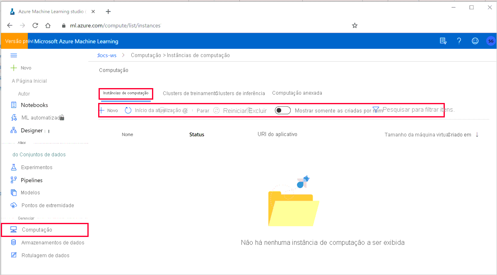

# <a name="create-and-manage-an-azure-machine-learning-compute-instance"></a>Criar e gerenciar uma instância de computação Azure Machine Learning

Saiba como criar e gerenciar uma [instância de computação](concept-compute-instance.md) em seu espaço de trabalho do Azure Machine Learning.

Use uma instância de computação como seu ambiente de desenvolvimento totalmente configurado e gerenciado na nuvem. Para desenvolvimento e teste, você também pode usar a instância como um [destino de computação de treinamento](concept-compute-target.md#train) ou para um [destino de inferência](concept-compute-target.md#deploy).   Uma instância de computação pode executar vários trabalhos em paralelo e tem uma fila de trabalhos. Como um ambiente de desenvolvimento, uma instância de computação não pode ser compartilhada com outros usuários em seu espaço de trabalho.

Neste artigo, você aprenderá como:

* Criar uma instância de computação 
* Gerenciar (Iniciar, parar, reiniciar, excluir) uma instância de computação
* Acessar a janela do terminal 
* Instalar pacotes R ou Python
* Criar novos ambientes ou kernels Jupyter

As instâncias de computação podem executar trabalhos com segurança em um [ambiente de rede virtual](how-to-secure-training-vnet.md), sem exigir que as empresas abram portas SSH. O trabalho é executado em um ambiente em contêiner e empacota suas dependências de modelo em um contêiner do Docker. 

## <a name="prerequisites"></a>Pré-requisitos

* Um Workspace do Azure Machine Learning. Para obter mais informações, consulte [criar um Azure Machine Learning espaço de trabalho](how-to-manage-workspace.md).

* A [extensão CLI do Azure para o serviço Machine Learning](reference-azure-machine-learning-cli.md), o [SDK do Azure Machine Learning Python](/python/api/overview/azure/ml/intro)ou a [extensão Azure Machine Learning Visual Studio Code](tutorial-setup-vscode-extension.md).

## <a name="create"></a>Criar

**Tempo estimado**: aproximadamente 5 minutos.

A criação de uma instância de computação é um processo único para o espaço de trabalho. Você pode reutilizar a computação como uma estação de trabalho de desenvolvimento ou como um destino de computação para treinamento. Você pode ter várias instâncias de computação anexadas ao seu espaço de trabalho.

Os núcleos dedicados por região por cota da família de VMs e a cota regional total, que se aplicam à criação da instância de computação, são unificados e compartilhados com Azure Machine Learning cota de cluster de computação de treinamento. Parar a instância de computação não libera a cota para garantir que você poderá reiniciar a instância de computação. Observe que não é possível alterar o tamanho da máquina virtual da instância de computação depois que ela é criada.

O exemplo a seguir demonstra como criar uma instância de computação:

# <a name="python"></a>[Python](#tab/python)

```python
import datetime
import time

from azureml.core.compute import ComputeTarget, ComputeInstance
from azureml.core.compute_target import ComputeTargetException

# Choose a name for your instance
# Compute instance name should be unique across the azure region
compute_name = "ci{}".format(ws._workspace_id)[:10]

# Verify that instance does not exist already
try:
    instance = ComputeInstance(workspace=ws, name=compute_name)
    print('Found existing instance, use it.')
except ComputeTargetException:
    compute_config = ComputeInstance.provisioning_configuration(
        vm_size='STANDARD_D3_V2',
        ssh_public_access=False,
        # vnet_resourcegroup_name='<my-resource-group>',
        # vnet_name='<my-vnet-name>',
        # subnet_name='default',
        # admin_user_ssh_public_key='<my-sshkey>'
    )
    instance = ComputeInstance.create(ws, compute_name, compute_config)
    instance.wait_for_completion(show_output=True)
```

Para obter mais informações sobre as classes, os métodos e os parâmetros usados neste exemplo, consulte os seguintes documentos de referência:

* [Classe ComputeInstance](/python/api/azureml-core/azureml.core.compute.computeinstance.computeinstance)
* [ComputeTarget. Create](/python/api/azureml-core/azureml.core.compute.computetarget#create-workspace--name--provisioning-configuration-)
* [ComputeInstance.wait_for_completion](/python/api/azureml-core/azureml.core.compute.computeinstance(class)#wait-for-completion-show-output-false--is-delete-operation-false-)


# <a name="azure-cli"></a>[CLI do Azure](#tab/azure-cli)

```azurecli-interactive
az ml computetarget create computeinstance  -n instance -s "STANDARD_D3_V2" -v
```

Para obter mais informações, consulte a referência do [AZ ml computetarget Create computeinstance](/cli/azure/ext/azure-cli-ml/ml/computetarget/create#ext_azure_cli_ml_az_ml_computetarget_create_computeinstance) .

# <a name="studio"></a>[Studio](#tab/azure-studio)

Em seu espaço de trabalho no Azure Machine Learning Studio, crie uma nova instância de computação na seção **computação** ou na seção **blocos de anotações** quando estiver pronto para executar um dos seus blocos de anotações.

Para obter informações sobre como criar uma instância de computação no estúdio, consulte [criar destinos de computação no Azure Machine Learning Studio](how-to-create-attach-compute-studio.md#compute-instance).

---

Você também pode criar uma instância de computação com um [modelo de Azure Resource Manager](https://github.com/Azure/azure-quickstart-templates/tree/master/101-machine-learning-compute-create-computeinstance). 

### <a name="create-on-behalf-of-preview"></a>Criar em nome de (visualização)

Como administrador, você pode criar uma instância de computação em nome de um cientista de dados e atribuir a instância a elas com:
* [Modelo de Azure Resource Manager](https://github.com/Azure/azure-quickstart-templates/tree/master/101-machine-learning-compute-create-computeinstance).  Para obter detalhes sobre como encontrar a Tenantid e o ObjectID necessários neste modelo, consulte [Localizar IDs de objeto de identidade para configuração de autenticação](../healthcare-apis/fhir/find-identity-object-ids.md).  Você também pode encontrar esses valores no portal de Azure Active Directory.
* API REST

O cientista de dados para o qual você cria a instância de computação precisa das seguintes permissões do [Azure RBAC (controle de acesso baseado em função)](../role-based-access-control/overview.md) : 
* *Microsoft. MachineLearningServices/espaços de trabalho/computações/início/ação*
* *Microsoft. MachineLearningServices/espaços de trabalho/computações/parada/ação*
* *Microsoft. MachineLearningServices/espaços de trabalho/computações/reinicialização/ação*
* *Microsoft. MachineLearningServices/espaços de trabalho/computações/applicationaccess/ação*

O cientista de dados pode iniciar, parar e reiniciar a instância de computação. Eles podem usar a instância de computação para:
* Jupyter
* JupyterLab
* RStudio
* Blocos de anotações integrados

## <a name="manage"></a>Gerenciar

Iniciar, parar, reiniciar e excluir uma instância de computação. Uma instância de computação não reduz verticalmente automaticamente, portanto, certifique-se de interromper o recurso para evitar encargos contínuos.

> [!TIP]
> A instância de computação tem um disco de SO de 120 GB. Se você ficar sem espaço em disco, [use o terminal](how-to-access-terminal.md) para limpar pelo menos 1-2 GB antes de parar ou reiniciar a instância de computação.

# <a name="python"></a>[Python](#tab/python)

Nos exemplos abaixo, o nome da instância de computação é **instância**

* Obter status

    ```python
    # get_status() gets the latest status of the ComputeInstance target
    instance.get_status()
    ```

* Stop

    ```python
    # stop() is used to stop the ComputeInstance
    # Stopping ComputeInstance will stop the billing meter and persist the state on the disk.
    # Available Quota will not be changed with this operation.
    instance.stop(wait_for_completion=True, show_output=True)
    ```

* Iniciar

    ```python
    # start() is used to start the ComputeInstance if it is in stopped state
    instance.start(wait_for_completion=True, show_output=True)
    ```

* Reiniciar

    ```python
    # restart() is used to restart the ComputeInstance
    instance.restart(wait_for_completion=True, show_output=True)
    ```

* Excluir

    ```python
    # delete() is used to delete the ComputeInstance target. Useful if you want to re-use the compute name 
    instance.delete(wait_for_completion=True, show_output=True)
    ```

# <a name="azure-cli"></a>[CLI do Azure](#tab/azure-cli)

Nos exemplos abaixo, o nome da instância de computação é **instância**

* Stop

    ```azurecli-interactive
    az ml computetarget stop computeinstance -n instance -v
    ```

    Para obter mais informações, consulte [AZ ml computetarget Stop computeinstance](/cli/azure/ext/azure-cli-ml/ml/computetarget/computeinstance#ext-azure-cli-ml-az-ml-computetarget-computeinstance-stop).

* Iniciar 

    ```azurecli-interactive
    az ml computetarget start computeinstance -n instance -v
    ```

    Para obter mais informações, consulte [AZ ml computetarget Start computeinstance](/cli/azure/ext/azure-cli-ml/ml/computetarget/computeinstance#ext-azure-cli-ml-az-ml-computetarget-computeinstance-start).

* Reiniciar 

    ```azurecli-interactive
    az ml computetarget restart computeinstance -n instance -v
    ```

    Para obter mais informações, consulte [AZ ml computetarget Restart computeinstance](/cli/azure/ext/azure-cli-ml/ml/computetarget/computeinstance#ext-azure-cli-ml-az-ml-computetarget-computeinstance-restart).

* Excluir

    ```azurecli-interactive
    az ml computetarget delete -n instance -v
    ```

    Para obter mais informações, consulte [AZ ml computetarget Delete computeinstance](/cli/azure/ext/azure-cli-ml/ml/computetarget#ext-azure-cli-ml-az-ml-computetarget-delete).

# <a name="studio"></a>[Studio](#tab/azure-studio)

Em seu workspace no Azure Machine Learning Studio, selecione **Computação** e, em seguida, selecione **Instância de Computação** na parte superior.



Você pode executar as seguintes ações:

* Criar uma nova instância de computação 
* Atualize a guia instâncias de computação.
* Iniciar, parar e reiniciar uma instância de computação.  Você paga pela instância sempre que ela estiver em execução. Pare a instância de computação quando você não a estiver usando para reduzir o custo. Parar uma instância de computação a desaloca. Em seguida, inicie-o novamente quando precisar.
* Excluir uma instância de computação.
* Filtre a lista de instâncias de computação para mostrar apenas as que você criou.

Para cada instância de computação em seu espaço de trabalho que você criou (ou que foi criada para você), você pode:

* Acessar o Jupyter, JupyterLab, RStudio na instância de computação
* Efetuar SSH na instância de computação. O acesso SSH é desabilitado por padrão, mas pode ser habilitado no momento da criação da instância de computação. O acesso SSH é por meio do mecanismo de chave pública/privada. A guia fornecerá detalhes para a conexão SSH, como endereço IP, nome de usuário e número da porta.
* Obtenha detalhes sobre uma instância de computação específica, como endereço IP e região.

---


O [RBAC do Azure](../role-based-access-control/overview.md) permite que você controle quais usuários no espaço de trabalho podem criar, excluir, iniciar, parar, reiniciar uma instância de computação. Todos os usuários na função colaborador e proprietário do workspace podem criar, excluir, iniciar, parar e reiniciar instâncias de computação no workspace. No entanto, somente o criador de uma instância de computação específica ou o usuário atribuído se ele foi criado em seu nome, tem permissão para acessar Jupyter, JupyterLab e RStudio nessa instância de computação. Uma instância de computação é dedicada a um único usuário que tem acesso de raiz e pode acessar o terminal por meio de Jupyter/JupyterLab/RStudio. A instância de computação terá entrada de usuário único e todas as ações usarão a identidade desse usuário para o RBAC do Azure e a atribuição de execuções de experimento. O acesso SSH é controlado por meio do mecanismo de chave pública/privada.

Essas ações podem ser controladas pelo RBAC do Azure:
* *Microsoft.MachineLearningServices/workspaces/computes/read*
* *Microsoft.MachineLearningServices/workspaces/computes/write*
* *Microsoft.MachineLearningServices/workspaces/computes/delete*
* *Microsoft. MachineLearningServices/espaços de trabalho/computações/início/ação*
* *Microsoft. MachineLearningServices/espaços de trabalho/computações/parada/ação*
* *Microsoft. MachineLearningServices/espaços de trabalho/computações/reinicialização/ação*

## <a name="next-steps"></a>Próximas etapas

* [Acessar o terminal da instância de computação](how-to-access-terminal.md)
* [Criar e gerenciar arquivos](how-to-manage-files.md)
* [Enviar uma execução de treinamento](how-to-set-up-training-targets.md)
