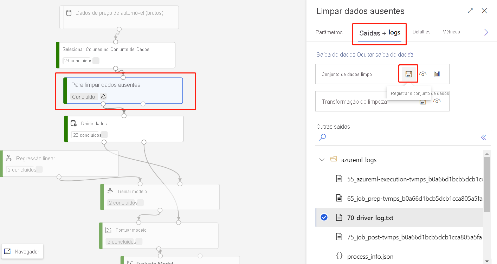

# Importar dados para o designer de Azure Machine Learning

Neste artigo, você aprenderá a importar seus próprios dados para o designer para criar soluções personalizadas. Há duas maneiras de importar dados para o designer: 

* **Conjuntos de dados do Azure Machine Learning** - Registre [conjuntos de dados](concept-data.md#datasets) no Azure Machine Learning para habilitar recursos avançados que ajudam a gerenciar os dados.
* **Módulo Importar Dados** – Use o módulo [Importar Dados](algorithm-module-reference/import-data.md) para acessar diretamente os dados de fontes de dados online.

[!INCLUDE [machine-learning-missing-ui](../../includes/machine-learning-missing-ui.md)]

## Usar conjuntos de dados do Azure Machine Learning

É recomendável que você use [conjuntos de dados](concept-data.md#datasets) para importar para o designer. Quando você registra um conjunto de dados, pode aproveitar ao máximo os recursos avançados, como [controle de versão e acompanhamento](how-to-version-track-datasets.md) e [monitoramento de dados](how-to-monitor-datasets.md).

### Registrar um conjunto de dados

Você pode registrar conjuntos de dados existentes [programaticamente com o SDK](how-to-create-register-datasets.md#datasets-sdk) ou [visualmente no Azure Machine Learning Studio](how-to-connect-data-ui.md#create-datasets).

Além disso, é possível registrar o resultado de qualquer módulo do designer como um conjunto de dados.

1. Selecione o módulo que gera os dados que você deseja registrar.

1. No painel Propriedades, selecione **saídas + logs**  >  **registrar conjunto** de registros.

    

Se os dados de saída do módulo estiverem em um formato tabular, você deverá optar por registrar a saída como um conjunto de dados de **arquivo** ou **tabular**.

 - O conjunto de registros de **arquivo** registra a pasta de saída do módulo como um conjunto de um arquivo. A pasta de saída contém um arquivo de dados e metadados que o designer usa internamente. Selecione esta opção se você quiser continuar a usar o conjunto de entrada registrado no designer. 

 - **DataSet tabular** registra apenas o arquivo de dados de saída do módulo como um DataSet tabular. Esse formato é facilmente consumido por outras ferramentas, por exemplo, no Machine Learning automatizado ou no SDK do Python. Selecione esta opção se você planeja usar o conjunto de DataSet registrado fora do designer.  
 

### Usar um conjunto de dados

Seus conjuntos de valores registrados podem ser encontrados na paleta de módulos, em **DataSets**. Para usar um conjunto de dados, arraste-o e solte-o na tela do pipeline. Em seguida, conecte a porta de saída do conjunto de resultados a outros módulos na tela. 

Se você registrar um conjunto de registros de arquivo, o tipo de porta de saída do conjunto de registros será **AnyDirectory**. Se você registrar um conjunto de registros de tabela, o tipo de porta de saída do conjunto de resultados se **DataFrameDirectory**. Observe que se você conectar a porta de saída do conjunto de resultados a outros módulos no designer, o tipo de porta de conjuntos de valores e módulos precisarão ser alinhados.

> [!NOTE]
> O designer dá suporte ao [controle de versão do conjunto](how-to-version-track-datasets.md)de os. Especifique a versão do conjunto de módulos no painel de propriedades do módulo DataSet.

### Limitações 

- No momento, você só pode visualizar o conjunto de tabelas tabular no designer. Se você registrar um conjunto de registros de arquivo fora do designer, não será possível visualizá-lo na tela do designer.
- Seu conjunto de armazenamento é armazenado na rede virtual (VNet). Se você quiser Visualizar, precisará habilitar a identidade gerenciada do espaço de trabalho do repositório de armazenamento.
    1. Vá para o repositório de armazenamento relacionado e clique em **Atualizar credenciais** 
     :::image type="content" source="./media/resource-known-issues/datastore-update-credential.png" alt-text="Atualizar credenciais":::
    1. Selecione **Sim** para habilitar a identidade gerenciada do espaço de trabalho.
    :::image type="content" source="./media/resource-known-issues/enable-workspace-managed-identity.png" alt-text="Habilitar identidade gerenciada do espaço de trabalho":::

## Importar dados usando o módulo Importar Dados

Embora seja recomendável usar os conjuntos de dados para importar dados, também é possível usar o módulo [Importar Dados](algorithm-module-reference/import-data.md). O módulo Importar Dados ignora o registro do conjunto de dados no Azure Machine Learning e os importa os diretamente de um [armazenamento de dados](concept-data.md#datastores) ou URL de HTTP.

Para obter informações detalhadas sobre como usar o módulo Importar Dados, consulte a [página de referência Importar Dados](algorithm-module-reference/import-data.md).

> [!NOTE]
> Se o conjunto de dados tiver muitas colunas, você poderá encontrar o seguinte erro: "Falha na validação devido à limitação de tamanho". Para evitar isso, [registre o conjunto de dados na interface Conjuntos de dados](how-to-connect-data-ui.md#create-datasets).

## Fontes compatíveis

Esta seção lista as fontes de dados compatíveis com o designer. Os dados são inseridos no designer por meio de um armazenamento de dados ou de um [conjunto de dados tabular](how-to-create-register-datasets.md#dataset-types).

### Fontes de armazenamento de dados
Para obter uma lista das fontes de armazenamento de dados compatíveis, consulte [Acessar dados nos serviços de armazenamento do Azure](how-to-access-data.md#supported-data-storage-service-types).

### Fontes de conjunto de dados tabular

O designer oferece suporte a conjuntos de dados tabulares criados a partir das seguintes fontes:
 * Arquivos delimitados
 * Arquivos JSON
 * Arquivos Parquet
 * Consultas SQL

## Tipos de dados

O designer reconhece internamente os seguintes tipos de dados:

* String
* Integer
* Decimal
* Boolean
* Data

O designer usa um tipo de dados interno chamado para transmitir dados entre módulos. Você pode converter explicitamente os dados no formato de tabela de dados usando o módulo [Converter em conjunto de dados](algorithm-module-reference/convert-to-dataset.md). Qualquer módulo que aceite formatos diferentes do formato interno converterá os dados silenciosamente antes de transmiti-los para o próximo módulo.

## Restrições de dados

Os módulos no designer são limitados pelo tamanho do destino de computação. Em conjuntos de dados maiores, use um recurso de computação do Azure Machine Learning maior. Para obter mais informações sobre a computação do Azure Machine Learning, consulte [O que são os destinos de computação no Azure Machine Learning?](concept-compute-target.md#azure-machine-learning-compute-managed)

## Acessar dados em uma rede virtual

Se o seu espaço de trabalho estiver em uma rede virtual, você deverá executar etapas de configuração adicionais para visualizar dados no designer. Para obter mais informações sobre como usar armazenamentos de dados e conjuntos de dados em uma rede virtual, consulte [usar o Azure Machine Learning Studio em uma rede virtual do Azure](how-to-enable-studio-virtual-network.md).

## Próximas etapas

Aprenda os conceitos básicos do designer com este [tutorial: prever o preço do automóvel com o designer](tutorial-designer-automobile-price-train-score.md).
