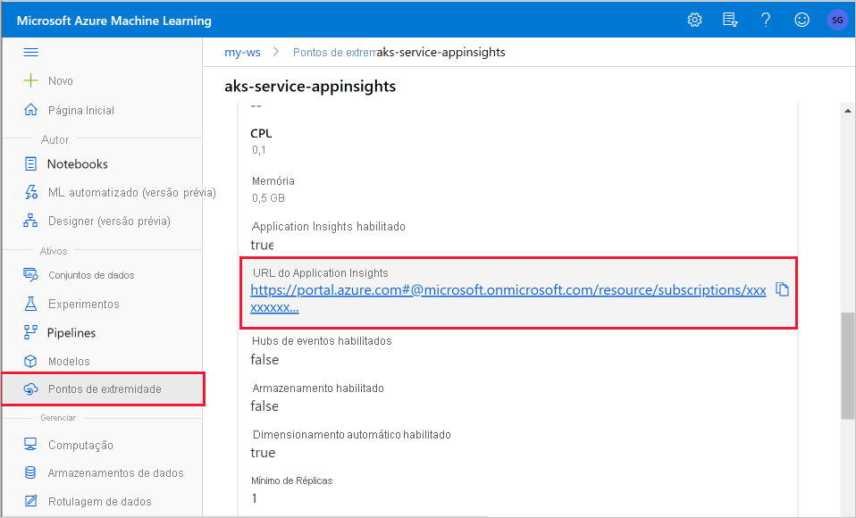
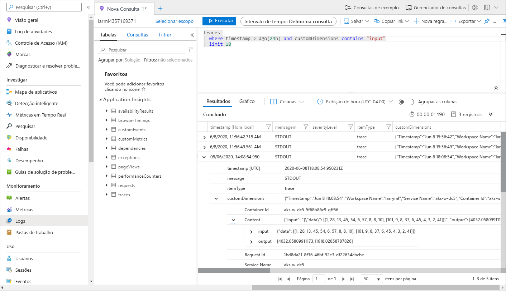

# <a name="monitor-and-collect-data-from-ml-web-service-endpoints"></a>Monitorar e coletar dados de pontos de extremidade de serviço Web do ML


Neste artigo, você aprende a coletar dados de modelos implantados em pontos de extremidade de serviço Web no AKS (serviço de kubernetes do Azure) ou em ACI (instâncias de contêiner do Azure). Use [aplicativo Azure insights](../azure-monitor/app/app-insights-overview.md) para coletar os seguintes dados de um ponto de extremidade:
* Dados de saída
* Respostas
* As taxas, tempos de resposta e taxas de falha de solicitação
* Taxas de dependência, tempos de resposta e taxas de falha
* Exceções

O bloco de anotações [Enable-app-Revisions-in-Production-Service. ipynb](https://github.com/Azure/MachineLearningNotebooks/blob/master/how-to-use-azureml/deployment/enable-app-insights-in-production-service/enable-app-insights-in-production-service.ipynb) demonstra conceitos neste artigo.
 
[!INCLUDE [aml-clone-in-azure-notebook](../../includes/aml-clone-for-examples.md)]
 
## <a name="prerequisites"></a>Pré-requisitos

* Uma assinatura do Azure-Experimente a [versão gratuita ou paga do Azure Machine Learning](https://aka.ms/AMLFree).

* Um workspace do Azure Machine Learning, um diretório local que contém seus scripts e o SDK de Aprendizado de Máquina do Azure para Python instalado. Para saber mais, consulte [como configurar um ambiente de desenvolvimento](how-to-configure-environment.md).

* Um modelo de aprendizado de máquina treinado. Para saber mais, confira o tutorial [treinar modelo de classificação de imagem](tutorial-train-models-with-aml.md) .

<a name="python"></a>

## <a name="configure-logging-with-the-python-sdk"></a>Configurar o registro em log com o SDK do Python

Nesta seção, você aprenderá a habilitar o log do Application insights usando o SDK do Python. 

### <a name="update-a-deployed-service"></a>Atualizar um serviço implantado

Use as etapas a seguir para atualizar um serviço Web existente:

1. Identificar o serviço no seu workspace. O valor de `ws` é o nome do seu espaço de trabalho

    ```python
    from azureml.core.webservice import Webservice
    aks_service= Webservice(ws, "my-service-name")
    ```
2. Atualize seu serviço e habilite insights Aplicativo Azure

    ```python
    aks_service.update(enable_app_insights=True)
    ```

### <a name="log-custom-traces-in-your-service"></a>Rastreamentos de log personalizados em seu serviço

> [!IMPORTANT]
> Aplicativo Azure insights registra apenas as cargas de até 64 KB. Se esse limite for atingido, você poderá ver erros como memória insuficiente ou nenhuma informação pode ser registrada. Se os dados que você deseja registrar em log forem maiores 64 KB, você deverá armazená-los no armazenamento de BLOBs usando as informações em [coletar dados para modelos em produção](how-to-enable-data-collection.md).
>
> Para situações mais complexas, como rastreamento de modelo em uma implantação de AKS, é recomendável usar uma biblioteca de terceiros, como [OpenCensus](https://opencensus.io).

Para registrar rastreamentos personalizados, siga o processo de implantação padrão para AKS ou ACI no documento [como implantar e onde](how-to-deploy-and-where.md) . Em seguida, use as seguintes etapas:

1. Atualize o arquivo de Pontuação adicionando instruções PRINT para enviar dados para Application Insights durante a inferência. Para obter informações mais complexas, como os dados de solicitação e a resposta, use uma estrutura JSON. 

    O arquivo de exemplo a seguir `score.py` registra quando o modelo foi inicializado, entrada e saída durante a inferência e a hora em que ocorrerem erros.

    
    ```python
    import pickle
    import json
    import numpy 
    from sklearn.externals import joblib
    from sklearn.linear_model import Ridge
    from azureml.core.model import Model
    import time

    def init():
        global model
        #Print statement for appinsights custom traces:
        print ("model initialized" + time.strftime("%H:%M:%S"))
        
        # note here "sklearn_regression_model.pkl" is the name of the model registered under the workspace
        # this call should return the path to the model.pkl file on the local disk.
        model_path = Model.get_model_path(model_name = 'sklearn_regression_model.pkl')
        
        # deserialize the model file back into a sklearn model
        model = joblib.load(model_path)
    

    # note you can pass in multiple rows for scoring
    def run(raw_data):
        try:
            data = json.loads(raw_data)['data']
            data = numpy.array(data)
            result = model.predict(data)
            # Log the input and output data to appinsights:
            info = {
                "input": raw_data,
                "output": result.tolist()
                }
            print(json.dumps(info))
            # you can return any datatype as long as it is JSON-serializable
            return result.tolist()
        except Exception as e:
            error = str(e)
            print (error + time.strftime("%H:%M:%S"))
            return error
    ```

2. Atualize a configuração do serviço e certifique-se de habilitar Application Insights.
    
    ```python
    config = Webservice.deploy_configuration(enable_app_insights=True)
    ```

3. Criar uma imagem e implantá-lo no AKS ou ACI. Para obter mais informações, consulte [como implantar e onde](how-to-deploy-and-where.md).


### <a name="disable-tracking-in-python"></a>Desabilitar o controle em Python

Para desabilitar o Aplicativo Azure insights, use o seguinte código:

```python 
## replace <service_name> with the name of the web service
<service_name>.update(enable_app_insights=False)
```

<a name="studio"></a>

## <a name="configure-logging-with-azure-machine-learning-studio"></a>Configurar o registro em log com o Azure Machine Learning Studio

Você também pode habilitar informações de Aplicativo Azure do Azure Machine Learning Studio. Quando você estiver pronto para implantar seu modelo como um serviço Web, use as seguintes etapas para habilitar o Application Insights:

1. Entre no estúdio em https://ml.azure.com .
1. Vá para **modelos** e selecione o modelo que você deseja implantar.
1. Selecione  **+ implantar**.
1. Preencha o formulário **implantar modelo** .
1. Expanda o menu **avançado** .

    
1. Selecione **habilitar diagnóstico de Application insights e coleta de dados**.

    

## <a name="view-metrics-and-logs"></a>Exibir métricas e logs

### <a name="query-logs-for-deployed-models"></a>Logs de consulta para modelos implantados

Os logs de pontos de extremidade em tempo real são dados do cliente. Você pode usar a `get_logs()` função para recuperar logs de um serviço Web implantado anteriormente. Os logs podem conter informações detalhadas sobre quaisquer erros ocorridos durante a implantação.

```python
from azureml.core import Workspace
from azureml.core.webservice import Webservice

ws = Workspace.from_config()

# load existing web service
service = Webservice(name="service-name", workspace=ws)
logs = service.get_logs()
```

Se você tiver vários locatários, talvez seja necessário adicionar o seguinte código de autenticação antes `ws = Workspace.from_config()`

```python
from azureml.core.authentication import InteractiveLoginAuthentication
interactive_auth = InteractiveLoginAuthentication(tenant_id="the tenant_id in which your workspace resides")
```

### <a name="view-logs-in-the-studio"></a>Exibir logs no estúdio

Aplicativo Azure insights armazena seus logs de serviço no mesmo grupo de recursos que o espaço de trabalho Azure Machine Learning. Use as etapas a seguir para exibir seus dados usando o Studio:

1. Vá para o espaço de trabalho Azure Machine Learning no [estúdio](https://ml.azure.com/).
1. Selecione **Pontos de extremidade**.
1. Selecione o serviço implantado.
1. Selecione o link **URL do Application insights** .

    [](././media/how-to-enable-app-insights/appinsightsloc.png#lightbox)

1. Em Application Insights, na guia **visão geral** ou na seção __monitoramento__ , selecione __logs__.

    [](./media/how-to-enable-app-insights/overview.png#lightbox)

1. Para exibir informações registradas no arquivo score.py, examine a tabela de __rastreamentos__ . A consulta a seguir procura logs em que o valor de __entrada__ foi registrado:

    ```kusto
    traces
    | where customDimensions contains "input"
    | limit 10
    ```

   [](././media/how-to-enable-app-insights/model-data-trace.png#lightbox)

Para obter mais informações sobre como usar o Aplicativo Azure insights, consulte [o que é Application insights?](../azure-monitor/app/app-insights-overview.md).

## <a name="web-service-metadata-and-response-data"></a>Metadados do serviço Web e dados de resposta

> [!IMPORTANT]
> Aplicativo Azure insights registra apenas as cargas de até 64 KB. Se esse limite for atingido, você poderá ver erros como memória insuficiente ou nenhuma informação pode ser registrada.

Para registrar informações de solicitação de serviço Web, adicione `print` instruções ao arquivo score.py. Cada `print` instrução resulta em uma entrada na tabela de rastreamento de Application insights sob a mensagem `STDOUT` . Application Insights armazena as `print` saídas de instrução no  `customDimensions` e na `Contents` tabela de rastreamento. A impressão de cadeias de caracteres JSON produz uma estrutura de dados hierárquica na saída de rastreamento em `Contents` .

## <a name="export-data-for-retention-and-processing"></a>Exportar dados para retenção e processamento

>[!Important]
> Aplicativo Azure insights só dá suporte a exportações para o armazenamento de BLOBs. Para obter mais informações sobre os limites dessa implementação, consulte [Exportar telemetria do App insights](../azure-monitor/app/export-telemetry.md#continuous-export-advanced-storage-configuration).

Use Application Insights ' [exportação contínua](../azure-monitor/app/export-telemetry.md) para exportar dados para uma conta de armazenamento de BLOBs em que você pode definir as configurações de retenção. Application Insights exporta os dados no formato JSON. 

:::image type="content" source="media/how-to-enable-app-insights/continuous-export-setup.png" alt-text="Exportação contínua":::

## <a name="next-steps"></a>Próximas etapas

Neste artigo, você aprendeu a habilitar o log e exibir logs para pontos de extremidade de serviço Web. Experimente estes artigos para as próximas etapas:


* [Como implantar um modelo em um cluster AKS](./how-to-deploy-azure-kubernetes-service.md)

* [Como implantar um modelo em instâncias de contêiner do Azure](./how-to-deploy-azure-container-instance.md)

* [MLOps: Gerencie, implante e monitore modelos com Azure Machine Learning](./concept-model-management-and-deployment.md) para saber mais sobre como aproveitar os dados coletados de modelos em produção. Esses dados podem ajudar a melhorar continuamente o processo de aprendizado de máquina.