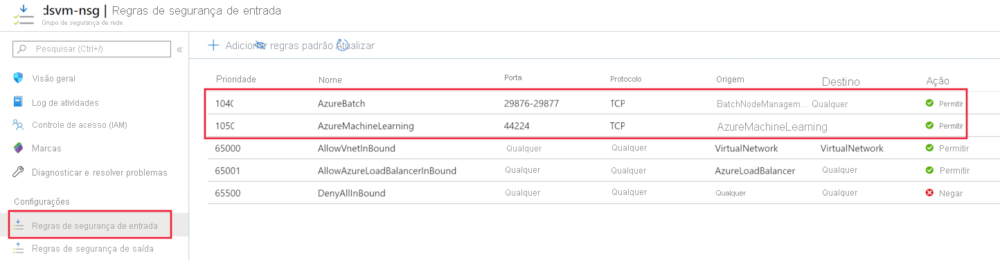

# <a name="secure-azure-ml-experimentation-and-inference-jobs-within-an-azure-virtual-network"></a>Trabalhos de experimentação e inferência do Secure Azure ML dentro de uma Rede Virtual Azure
[!INCLUDE [applies-to-skus](../../includes/aml-applies-to-basic-enterprise-sku.md)]

Neste artigo, você aprenderá como garantir trabalhos de experimentação/treinamento e trabalhos de inferência/pontuação no Azure Machine Learning dentro de uma Rede Virtual Azure (vnet).

Uma **rede virtual** atua como um limite de segurança, isolando seus recursos do Azure da internet pública. Além disso, é possível ingressar em uma rede virtual do Azure na rede local. Ao entrar em redes, você pode treinar seus modelos com segurança e acessar seus modelos implantados para inferência.

O Azure Machine Learning conta com outros serviços do Azure para recursos de computação. Os recursos de [computação, ou metas de computação,](concept-compute-target.md)são usados para treinar e implantar modelos. Os alvos podem ser criados dentro de uma rede virtual. Por exemplo, você pode usar a Microsoft Data Science Virtual Machine para treinar um modelo e, em seguida, implantar o modelo no Azure Kubernetes Service (AKS). Para obter mais informações sobre redes virtuais, consulte [a visão geral da Rede Virtual Do Azure](https://docs.microsoft.com/azure/virtual-network/virtual-networks-overview).

Este artigo também fornece informações detalhadas sobre *configurações avançadas de segurança,* informações que não são necessárias para casos básicos ou experimentais de uso. Algumas seções deste artigo fornecem informações de configuração para uma variedade de cenários. Você não precisa completar as instruções em ordem ou em sua totalidade.

> [!TIP]
> A menos que especificamente chamado, usando recursos como contas de armazenamento ou alvos de computação dentro de uma rede virtual, trabalhará com pipelines de aprendizado de máquina e fluxos de trabalho não pipeline, como corridas de script.

> [!WARNING]
> A Microsoft não oferece suporte ao uso dos recursos do Azure Machine Learning Studio, como ML automatizado, conjuntos de dados, etiquetagem de dados, designer e notebooks, se o armazenamento subjacente tiver rede virtual ativada.

## <a name="prerequisites"></a>Pré-requisitos

+ Um espaço de trabalho de aprendizado de máquina [do Azure.](how-to-manage-workspace.md)

+ Conhecimento geral do [serviço de rede virtual do Azure](https://docs.microsoft.com/azure/virtual-network/virtual-networks-overview) e [da rede IP.](https://docs.microsoft.com/azure/virtual-network/virtual-network-ip-addresses-overview-arm)

+ Uma rede virtual e uma sub-rede pré-existentes para usar com seus recursos de computação.

## <a name="use-a-storage-account-for-your-workspace"></a>Use uma conta de armazenamento para o seu espaço de trabalho

> [!WARNING]
> Se você tiver cientistas de dados que usam o designer de Machine Learning do Azure, eles receberão um erro ao visualizar dados de uma conta de armazenamento dentro de uma rede virtual. O texto a seguir é o erro que eles recebem:
>
> __Erro: Não é possível traçar o perfil deste conjunto de dados. Isso pode ser porque seus dados são armazenados atrás de uma rede virtual ou seus dados não suportam perfil.__

Para usar uma conta de armazenamento do Azure para o espaço de trabalho em uma rede virtual, use as seguintes etapas:

1. Crie um recurso de computação (por exemplo, uma instância ou cluster de cálculo de aprendizado de máquina) atrás de uma rede virtual ou anexe um recurso de computação ao espaço de trabalho (por exemplo, um cluster HDInsight, uma máquina virtual ou um cluster do Serviço Azure Kubernetes). O recurso de computação pode ser para experimentação ou implantação de modelos.

   Para obter mais informações, consulte [a computação Use a Machine Learning,](#amlcompute) [Use uma máquina virtual ou um cluster HDInsight](#vmorhdi)e use as seções [do Serviço Azure Kubernetes](#aksvnet) neste artigo.

1. No portal Azure, vá para o armazenamento anexado ao seu espaço de trabalho.

   [](./media/how-to-enable-virtual-network/workspace-storage.png#lightbox)

1. Na página armazenamento do **Azure,** selecione __Firewalls e redes virtuais__.

   

1. Na página __Firewalls e redes virtuais,__ faça as seguintes ações:
    - Selecione __Redes selecionadas__.
    - Em __redes virtuais,__ selecione o __link Adicionar rede virtual existente.__ Esta ação adiciona a rede virtual onde seu cálculo reside (ver passo 1).

        > [!IMPORTANT]
        > A conta de armazenamento deve estar na mesma rede virtual e sub-rede que as instâncias de computação ou clusters usados para treinamento ou inferência.

    - Selecione __os Permitir serviços confiáveis da Microsoft para acessar essa__ caixa de seleção de conta de armazenamento.

    > [!IMPORTANT]
    > Ao trabalhar com o Azure Machine Learning SDK, seu ambiente de desenvolvimento deve ser capaz de se conectar à Conta de Armazenamento Do Azure. Quando a conta de armazenamento está dentro de uma rede virtual, o firewall deve permitir o acesso a partir do endereço IP do ambiente de desenvolvimento.
    >
    > Para permitir o acesso à conta de armazenamento, visite os __Firewalls e redes virtuais__ para obter a conta de armazenamento *de um navegador web no cliente de desenvolvimento.* Em seguida, use a caixa de seleção __adicionar o endereço IP__ do cliente para adicionar o endereço IP do cliente ao RANGE de __endereços__. Você também pode usar o campo __ADDRESS RANGE__ para inserir manualmente o endereço IP do ambiente de desenvolvimento. Uma vez que o endereço IP do cliente tenha sido adicionado, ele pode acessar a conta de armazenamento usando o SDK.

   [](./media/how-to-enable-virtual-network/storage-firewalls-and-virtual-networks-page.png#lightbox)

> [!IMPORTANT]
> Você pode colocar a _conta de armazenamento padrão_ para o Azure Machine Learning ou contas de armazenamento não _padrão_ em uma rede virtual.
>
> A conta de armazenamento padrão é provisionada automaticamente quando você cria um espaço de trabalho.
>
> Para contas de armazenamento `storage_account` não padrão, o parâmetro na [ `Workspace.create()` função](https://docs.microsoft.com/python/api/azureml-core/azureml.core.workspace(class)?view=azure-ml-py#create-name--auth-none--subscription-id-none--resource-group-none--location-none--create-resource-group-true--sku--basic---friendly-name-none--storage-account-none--key-vault-none--app-insights-none--container-registry-none--cmk-keyvault-none--resource-cmk-uri-none--hbi-workspace-false--default-cpu-compute-target-none--default-gpu-compute-target-none--exist-ok-false--show-output-true-) permite especificar uma conta de armazenamento personalizada pelo ID de recurso do Azure.

## <a name="use-azure-data-lake-storage-gen-2"></a>Use o Azure Data Lake Storage Gen 2

O Azure Data Lake Storage Gen 2 é um conjunto de recursos para análise de big data, construído no armazenamento Azure Blob. Ele pode ser usado para armazenar dados usados para treinar modelos com o Azure Machine Learning. 

Para usar o Data Lake Storage Gen 2 dentro da rede virtual do seu espaço de trabalho azure Machine Learning, use as seguintes etapas:

1. Crie uma conta azure Data Lake Storage gen 2. Para obter mais informações, consulte [Criar uma conta de armazenamento Azure Data Lake Storage Gen2](../storage/blobs/data-lake-storage-quickstart-create-account.md).

1. Use as etapas 2-4 na seção anterior, [Use uma conta de armazenamento para o seu espaço de trabalho,](#use-a-storage-account-for-your-workspace)para colocar a conta na rede virtual.

Ao usar o Azure Machine Learning com data lake storage Gen 2 dentro de uma rede virtual, use a seguinte orientação:

* Se você usar o __SDK para criar um conjunto de dados__, e o sistema executando o código não estiver na rede __virtual,__ use o `validate=False` parâmetro. Esse parâmetro ignora a validação, que falha se o sistema não estiver na mesma rede virtual que a conta de armazenamento. Para obter mais informações, consulte o método [from_files()](https://docs.microsoft.com/python/api/azureml-core/azureml.data.dataset_factory.filedatasetfactory?view=azure-ml-py#from-files-path--validate-true-)

* Ao usar o Azure Machine Learning Compute Instance ou o compute cluster para treinar um modelo usando o conjunto de dados, ele deve estar na mesma rede virtual que a conta de armazenamento.

## <a name="use-a-key-vault-instance-with-your-workspace"></a>Use uma instância de cofre chave com seu espaço de trabalho

A instância do cofre-chave associada ao espaço de trabalho é usada pelo Azure Machine Learning para armazenar as seguintes credenciais:
* A seqüência de conexão de conta de armazenamento associada
* Senhas para instâncias do Azure Container Repository
* Strings de conexão para armazenamentos de dados

Para usar os recursos de experimentação do Azure Machine Learning com o Azure Key Vault atrás de uma rede virtual, use as seguintes etapas:

1. Vá para o cofre chave que está associado com o espaço de trabalho.

   [](./media/how-to-enable-virtual-network/workspace-key-vault.png#lightbox)

1. Na página **Key Vault,** no painel esquerdo, selecione __Firewalls e redes virtuais__.

   

1. Na página __Firewalls e redes virtuais,__ faça as seguintes ações:
    - Em __Permitir acesso de__, clique em __Redes selecionadas__.
    - Em __redes virtuais,__ __selecione Adicionar redes virtuais existentes__ para adicionar a rede virtual onde sua computação de experimento reside.
    - Em __Permitir que serviços confiáveis da Microsoft contornem este firewall,__ selecione __Sim__.

   [](./media/how-to-enable-virtual-network/key-vault-firewalls-and-virtual-networks-page.png#lightbox)

<a id="amlcompute"></a>

## <a name="use-a-machine-learning-compute"></a><a name="compute-instance"></a>Use um computação de aprendizado de máquina

Para usar uma instância de computação do Azure Machine Learning ou um cluster de computação em uma rede virtual, os seguintes requisitos de rede devem ser atendidos:

> [!div class="checklist"]
> * A rede virtual deve estar na mesma assinatura e região que o espaço de trabalho Azure Machine Learning.
> * A sub-rede especificada para a instância de computação ou cluster deve ter endereços IP não atribuídos suficientes para acomodar o número de VMs que são alvo. Se a sub-rede não tiver endereços IP não atribuídos o suficiente, um cluster de computação será parcialmente alocado.
> * Verifique se suas políticas de segurança ou bloqueios na assinatura ou grupo de recursos da rede virtual restringem as permissões para gerenciar a rede virtual. Se você planeja proteger a rede virtual restringindo o tráfego, deixe algumas portas abertas para o serviço de computação. Para obter mais informações, consulte a seção [Portas Necessárias.](#mlcports)
> * Se você vai colocar várias instâncias de computação ou clusters em uma rede virtual, talvez seja necessário solicitar um aumento de cota para um ou mais de seus recursos.
> * Se as contas de armazenamento do Azure para o espaço de trabalho também estiverem protegidas em uma rede virtual, elas devem estar na mesma rede virtual que a instância de computação de aprendizado de máquina do Azure ou cluster. 

> [!TIP]
> A instância de cálculo de aprendizado de máquina ou cluster aloca automaticamente recursos adicionais de rede no grupo de recursos que contém a rede virtual. Para cada instância de computação ou cluster, o serviço aloca os seguintes recursos:
> 
> * Um grupo de segurança de rede
> * Um endereço IP público
> * Um balanceador de carga
> 
> Esses recursos são limitados pelas [cotas de recursos](https://docs.microsoft.com/azure/azure-resource-manager/management/azure-subscription-service-limits) da assinatura.


### <a name="required-ports"></a><a id="mlcports"></a> Portas obrigatórias

Atualmente, a Computação do Machine Learning usa o serviço de Lote do Azure para provisionar VMs na rede virtual especificada. A sub-rede deve permitir a comunicação de entrada do serviço Lote. Você usa esta comunicação para agendar as corridas nos ádegas de machine learning e para se comunicar com o Azure Storage e outros recursos. O serviço Batch adiciona NSGs (Network Security Groups, grupos de segurança de rede) no nível de interfaces de rede (NICs) que são anexadas às VMs. Esses NSGs configuraram automaticamente as regras de entrada e saída para permitir o tráfego a seguir:

- Tráfego tcp de entrada nas portas 29876 e 29877 a partir de uma tag de __serviço__ de __BatchNodeManagement__.

    

- (Opcional) Tráfego tcp de entrada na porta 22 para permitir acesso remoto. Use esta porta somente se quiser se conectar usando SSH no IP público.

- Tráfego de saída em qualquer porta para a rede virtual.

- Tráfego de saída em qualquer porta para a internet.

- Para tráfego TCP de entrada de linha de computação na porta 44224 a partir de uma tag de __serviço__ do __AzureMachineLearning__.

Tenha cuidado se você modificar ou adicionar regras de entrada ou saída nos NSGs configurados em Lote. Se um NSG bloqueia a comunicação com os nós computacionais, o serviço de computação define o estado dos nós computacionais como inutilizáveis.

Você não precisa especificar NSGs no nível da sub-rede, porque o serviço Azure Batch configura seus próprios NSGs. No entanto, se a sub-rede especificada tiver associado NSGs ou um firewall, configure as regras de segurança de entrada e saída como mencionado anteriormente.

A configuração da regra NSG no portal Azure é mostrada nas seguintes imagens:

[](./media/how-to-enable-virtual-network/amlcompute-virtual-network-inbound.png#lightbox)


### <a name="limit-outbound-connectivity-from-the-virtual-network"></a><a id="limiting-outbound-from-vnet"></a>Limitar a conectividade de saída da rede virtual

Se você não quiser usar as regras de saída padrão e quiser limitar o acesso de saída da sua rede virtual, use as seguintes etapas:

- Negar conexão à internet usando as regras do NSG.

- Para uma __instância de computação__ ou um __cluster de computação,__ limite o tráfego de saída aos seguintes itens:
   - Armazenamento azure, usando __a tag__ de serviço de __armazenamento.RegionName__. Onde `{RegionName}` está o nome de uma região azure.
   - Registro de contêineres do Azure, usando __a tag__ de serviço do __AzureContainerRegistry.RegionName__. Onde `{RegionName}` está o nome de uma região azure.
   - Azure Machine Learning, usando __a tag__ de serviço do __AzureMachineLearning__
   - Azure Resource Manager, usando __a tag__ de serviço do __AzureResourceManager__
   - Diretório ativo do Azure, usando __a tag__ de serviço do __AzureActiveDirectory__

A configuração da regra NSG no portal Azure é mostrada na seguinte imagem:

[](./media/how-to-enable-virtual-network/limited-outbound-nsg-exp.png#lightbox)

> [!NOTE]
> Se você planeja usar imagens Docker padrão fornecidas pela Microsoft e habilitar dependências gerenciadas pelo usuário, você também deve usar uma tag de __serviço__ do __MicrosoftContainerRegistry.Region_Name__ (Por exemplo, MicrosoftContainerRegistry.EastUS).
>
> Essa configuração é necessária quando você tem código semelhante aos seguintes trechos como parte de seus scripts de treinamento:
>
> __Treinamento RunConfig__
> ```python
> # create a new runconfig object
> run_config = RunConfiguration()
> 
> # configure Docker 
> run_config.environment.docker.enabled = True
> # For GPU, use DEFAULT_GPU_IMAGE
> run_config.environment.docker.base_image = DEFAULT_CPU_IMAGE 
> run_config.environment.python.user_managed_dependencies = True
> ```
>
> __Treinamento estimador__
> ```python
> est = Estimator(source_directory='.',
>                 script_params=script_params,
>                 compute_target='local',
>                 entry_script='dummy_train.py',
>                 user_managed=True)
> run = exp.submit(est)
> ```

### <a name="user-defined-routes-for-forced-tunneling"></a>Rotas definidas pelo usuário para o túnel forçado

Se você estiver usando um túnel forçado com o Machine Learning Compute, adicione [rotas definidas pelo usuário (UDRs)](https://docs.microsoft.com/azure/virtual-network/virtual-networks-udr-overview) à sub-rede que contém o recurso de computação.

* Estabeleça um UDR para cada endereço IP usado pelo serviço Azure Batch na região onde seus recursos existem. Esses UDRs permitem que o serviço Batch se comunique com os nós computacionais para agendamento de tarefas. Para obter uma lista de endereços IP do serviço Batch, use um dos seguintes métodos:

    * Baixe as [faixas e tags de serviço do Azure IP](https://www.microsoft.com/download/details.aspx?id=56519) e procure no arquivo para `BatchNodeManagement.<region>`, onde `<region>` está a região do Azure.

    * Use o [Azure CLI](https://docs.microsoft.com/cli/azure/install-azure-cli?view=azure-cli-latest) para baixar as informações. O exemplo a seguir baixa as informações do endereço IP e filtra as informações para a região leste dos EUA 2:

        ```azurecli-interactive
        az network list-service-tags -l "East US 2" --query "values[?starts_with(id, 'Batch')] | [?properties.region=='eastus2']"
        ```

* O tráfego de saída para o Azure Storage não deve ser bloqueado pelo seu aparelho de rede local. Especificamente, os URLs estão `<account>.table.core.windows.net` `<account>.queue.core.windows.net`na `<account>.blob.core.windows.net`forma , e .

Quando você adicionar os UDRs, defina a rota para cada prefixo de endereço IP em lote relacionado e defina __o tipo de hop Next__ para __Internet__. A imagem a seguir mostra um exemplo deste UDR no portal Azure:


Para obter mais informações, consulte [Criar um pool de lotes azure em uma rede virtual](../batch/batch-virtual-network.md#user-defined-routes-for-forced-tunneling).

### <a name="create-a-compute-cluster-in-a-virtual-network"></a>Crie um cluster de computação em uma rede virtual

Para criar um cluster Machine Learning Compute, use as seguintes etapas:

1. Faça login no [estúdio azure Machine Learning](https://ml.azure.com/)e selecione sua assinatura e espaço de trabalho.

1. Selecione __Computação__ à esquerda.

1. Selecione __os clusters__ de treinamento __+__ do centro e selecione .

1. Na caixa de diálogo __Novo cluster de treinamento,__ expanda a seção __Configurações Avançadas.__

1. Para configurar esse recurso de computação para usar uma rede virtual, execute as seguintes ações na seção __Configurar rede virtual:__

    1. Na lista de paradas do __grupo Recurso,__ selecione o grupo de recursos que contém a rede virtual.
    1. Na lista de paradas de __rede Virtual,__ selecione a rede virtual que contém a sub-rede.
    1. Na lista de baixa __da sub-rede,__ selecione a sub-rede a ser usada.

   

Também é possível criar um cluster de Computação do Machine Learning, usando o SDK do Azure Machine Learning. O código a seguir cria um novo cluster de Computação do Machine Learning na sub-rede `default` de uma rede virtual chamada `mynetwork`:

```python
from azureml.core.compute import ComputeTarget, AmlCompute
from azureml.core.compute_target import ComputeTargetException

# The Azure virtual network name, subnet, and resource group
vnet_name = 'mynetwork'
subnet_name = 'default'
vnet_resourcegroup_name = 'mygroup'

# Choose a name for your CPU cluster
cpu_cluster_name = "cpucluster"

# Verify that cluster does not exist already
try:
    cpu_cluster = ComputeTarget(workspace=ws, name=cpu_cluster_name)
    print("Found existing cpucluster")
except ComputeTargetException:
    print("Creating new cpucluster")

    # Specify the configuration for the new cluster
    compute_config = AmlCompute.provisioning_configuration(vm_size="STANDARD_D2_V2",
                                                           min_nodes=0,
                                                           max_nodes=4,
                                                           vnet_resourcegroup_name=vnet_resourcegroup_name,
                                                           vnet_name=vnet_name,
                                                           subnet_name=subnet_name)

    # Create the cluster with the specified name and configuration
    cpu_cluster = ComputeTarget.create(ws, cpu_cluster_name, compute_config)

    # Wait for the cluster to be completed, show the output log
    cpu_cluster.wait_for_completion(show_output=True)
```

Quando o processo de criação termina, você treina seu modelo usando o cluster em um experimento. Para obter mais informações, consulte [Selecionar e usar um destino de computação para treinamento](how-to-set-up-training-targets.md).

## <a name="use-azure-databricks"></a>Use a Zure Databricks

Para usar o Azure Databricks em uma rede virtual com seu espaço de trabalho, os seguintes requisitos devem ser atendidos:

> [!div class="checklist"]
> * A rede virtual deve estar na mesma assinatura e região que o espaço de trabalho Azure Machine Learning.
> * Se as contas de armazenamento do Azure para o espaço de trabalho também estiverem protegidas em uma rede virtual, elas devem estar na mesma rede virtual que o cluster Azure Databricks.
> * Além das __sub-redes de databricks-private__ e __databricks-public__ usadas pelo Azure Databricks, a sub-rede __padrão__ criada para a rede virtual também é necessária.

Para obter informações específicas sobre o uso do Azure Databricks com uma rede virtual, consulte [Implantar tijolos de dados do Azure em sua Rede Virtual Do Azure](https://docs.azuredatabricks.net/administration-guide/cloud-configurations/azure/vnet-inject.html).

<a id="vmorhdi"></a>

## <a name="use-a-virtual-machine-or-hdinsight-cluster"></a>Usar uma máquina virtual ou um cluster HDInsight

> [!IMPORTANT]
> O Azure Machine Learning suporta apenas máquinas virtuais que estão executando o Ubuntu.

Para usar uma máquina virtual ou um cluster Azure HDInsight em uma rede virtual com seu espaço de trabalho, use as seguintes etapas:

1. Crie um cluster VM ou HDInsight usando o portal Azure ou o Cli do Azure e coloque o cluster em uma rede virtual Do Zure. Para obter mais informações, consulte os seguintes artigos:
    * [Criar e gerenciar redes virtuais do Azure para VMs do Linux](https://docs.microsoft.com/azure/virtual-machines/linux/tutorial-virtual-network)

    * [Estender HDInsight usando uma rede virtual do Azure](https://docs.microsoft.com/azure/hdinsight/hdinsight-extend-hadoop-virtual-network)

1. Para permitir que o Azure Machine Learning se comunique com a porta SSH na VM ou cluster, configure uma entrada de origem para o grupo de segurança da rede. A porta SSH geralmente é a porta 22. Para permitir o tráfego a partir desta fonte, faça as seguintes ações:

    * Na lista de isto __'Para-baixo',__ selecione 'Tag de serviço '''''''' __Service Tag__

    * Na lista de seleção de __saque__ do serviço Origem, selecione __AzureMachineLearning__.

    * Na lista de __faixas__ de porta __*__ De origem, selecione .

    * Na lista de isto __destino,__ selecione __Qualquer__.

    * Na lista de paradas de __porta Destino,__ selecione __22__.

    * Em __Protocolo,__ selecione __Qualquer__.

    * Em __Ação,__ __selecione Permitir__.

   

    Mantenha as regras de saída padrão para o grupo de segurança da rede. Para obter mais informações, consulte as regras de segurança padrão em [Grupos de segurança](https://docs.microsoft.com/azure/virtual-network/security-overview#default-security-rules).

    Se você não quiser usar as regras de saída padrão e quiser limitar o acesso de saída da sua rede virtual, consulte a conectividade de saída limite da seção [de rede virtual.](#limiting-outbound-from-vnet)

1. Conecte o cluster VM ou HDInsight ao seu espaço de trabalho Azure Machine Learning. Para obter mais informações, consulte [Configurar destinos de computação para treinamento do modelo](how-to-set-up-training-targets.md).

<a id="aksvnet"></a>

## <a name="use-azure-kubernetes-service-aks"></a>Usar o Serviço de Kubernetes do Azure (AKS)

Para adicionar AKS em uma rede virtual ao seu espaço de trabalho, use as seguintes etapas:

> [!IMPORTANT]
> Antes de iniciar o procedimento a seguir, siga os pré-requisitos na [Configuração de rede avançada no Azure Kubernetes Service (AKS)](https://docs.microsoft.com/azure/aks/configure-advanced-networking#prerequisites) e planeje o endereço IP para o seu cluster.
>
> A ocorrência aks e a rede virtual Azure devem estar na mesma região. Se você proteger as contas de armazenamento do Azure usadas pelo espaço de trabalho em uma rede virtual, elas devem estar na mesma rede virtual que a instância AKS.

> [!WARNING]
> O Azure Machine Learning não suporta o uso de um Serviço Azure Kubernetes que tenha um link privado ativado.

1. Faça login no [estúdio azure Machine Learning](https://ml.azure.com/)e selecione sua assinatura e espaço de trabalho.

1. Selecione __Computação__ à esquerda.

1. Selecione clusters de __inferência__ do __+__ centro e selecione .

1. Na caixa de diálogo __''Cluster de nova inferência',__ selecione __Avançado__ na __configuração Rede__.

1. Para configurar esse recurso de computação para usar uma rede virtual, execute as seguintes ações:

    1. Na lista de paradas do __grupo Recurso,__ selecione o grupo de recursos que contém a rede virtual.
    1. Na lista de paradas de __rede Virtual,__ selecione a rede virtual que contém a sub-rede.
    1. Na lista de baixa __da sub-rede,__ selecione a sub-rede.
    1. Na caixa de __intervalo de endereços do Serviço Kubernetes,__ digite a faixa de endereços de serviço Kubernetes. Este intervalo de endereços usa um intervalo IP de notação de roteamento interdomínio de classe (CIDR) para definir os endereços IP disponíveis para o cluster. Não deve se sobrepor a nenhuma faixa ip de sub-rede (por exemplo, 10.0.0.0/16).
    1. Na caixa de endereço IP do __serviço Kubernetes DNS,__ digite o endereço IP do serviço Kubernetes DNS. Esse endereço IP é atribuído ao serviço DNS do Kubernetes. Ele deve estar dentro da faixa de endereço de serviço Kubernetes (por exemplo, 10.0.0.10).
    1. Na caixa de endereços da __ponte Docker,__ digite o endereço da ponte Docker. Esse endereço IP é atribuído à ponte Docker. Ele não deve estar em nenhuma faixa IP de sub-rede, ou na faixa de endereço de serviço Kubernetes (por exemplo, 172.17.0.1/16).

   

1. Certifique-se de que o grupo NSG que controla a rede virtual tenha uma regra de segurança de entrada habilitada para o ponto final de pontuação para que ele possa ser chamado de fora da rede virtual.
   > [!IMPORTANT]
   > Mantenha as regras de saída padrão para o NSG. Para obter mais informações, consulte as regras de segurança padrão em [Grupos de segurança](https://docs.microsoft.com/azure/virtual-network/security-overview#default-security-rules).

   [](./media/how-to-enable-virtual-network/aks-vnet-inbound-nsg-scoring.png#lightbox)

Também é possível usar o SDK do Azure Machine Learning para adicionar o Serviço de Kubernetes do Azure a uma rede virtual. Se você já tiver um cluster AKS em uma rede virtual, anexe-o ao espaço de trabalho conforme descrito em [Como implantar no AKS](how-to-deploy-and-where.md). O código a seguir cria uma `default` nova instância AKS `mynetwork`na sub-rede de uma rede virtual chamada :

```python
from azureml.core.compute import ComputeTarget, AksCompute

# Create the compute configuration and set virtual network information
config = AksCompute.provisioning_configuration(location="eastus2")
config.vnet_resourcegroup_name = "mygroup"
config.vnet_name = "mynetwork"
config.subnet_name = "default"
config.service_cidr = "10.0.0.0/16"
config.dns_service_ip = "10.0.0.10"
config.docker_bridge_cidr = "172.17.0.1/16"

# Create the compute target
aks_target = ComputeTarget.create(workspace=ws,
                                  name="myaks",
                                  provisioning_configuration=config)
```

Quando o processo de criação é concluído, você pode executar inferência, ou pontuação de modelo, em um cluster AKS atrás de uma rede virtual. Para obter mais informações, consulte [Como implantar no AKS](how-to-deploy-and-where.md).

### <a name="use-private-ips-with-azure-kubernetes-service"></a>Use IPs privados com o Serviço Azure Kubernetes

Por padrão, um endereço IP público é atribuído às implantações aks. Ao usar AKS dentro de uma rede virtual, você pode usar um endereço IP privado. Endereços IP privados só são acessíveis de dentro da rede virtual ou redes unidas.

Um endereço IP privado é habilitado pela configuração de AKS para usar um _balanceador de carga interno_. 

> [!IMPORTANT]
> Não é possível habilitar o IP privado ao criar o cluster Azure Kubernetes Service. Ele deve ser ativado como uma atualização para um cluster existente.

O seguinte trecho de código demonstra como **criar um novo cluster AKS**e atualizá-lo para usar um balanceador de carga IP/interno privado:

```python
import azureml.core
from azureml.core.compute.aks import AksUpdateConfiguration
from azureml.core.compute import AksCompute, ComputeTarget

# Verify that cluster does not exist already
try:
    aks_target = AksCompute(workspace=ws, name=aks_cluster_name)
    print("Found existing aks cluster")

except:
    print("Creating new aks cluster")

    # Subnet to use for AKS
    subnet_name = "default"
    # Create AKS configuration
    prov_config = AksCompute.provisioning_configuration(location = "eastus2")
    # Set info for existing virtual network to create the cluster in
    prov_config.vnet_resourcegroup_name = "myvnetresourcegroup"
    prov_config.vnet_name = "myvnetname"
    prov_config.service_cidr = "10.0.0.0/16"
    prov_config.dns_service_ip = "10.0.0.10"
    prov_config.subnet_name = subnet_name
    prov_config.docker_bridge_cidr = "172.17.0.1/16"

    # Create compute target
    aks_target = ComputeTarget.create(workspace = ws, name = "myaks", provisioning_configuration = prov_config)
    # Wait for the operation to complete
    aks_target.wait_for_completion(show_output = True)
    
    # Update AKS configuration to use an internal load balancer
    update_config = AksUpdateConfiguration(None, "InternalLoadBalancer", subnet_name)
    aks_target.update(update_config)
    # Wait for the operation to complete
    aks_target.wait_for_completion(show_output = True)
```

__CLI do Azure__

```azurecli-interactive
az rest --method put --uri https://management.azure.com"/subscriptions/<subscription-id>/resourcegroups/<resource-group>/providers/Microsoft.ContainerService/managedClusters/<aks-resource-id>?api-version=2018-11-19 --body @body.json
```

O conteúdo `body.json` do arquivo referenciado pelo comando é semelhante ao seguinte documento JSON:

```json
{ 
    "location": "<region>", 
    "properties": { 
        "resourceId": "/subscriptions/<subscription-id>/resourcegroups/<resource-group>/providers/Microsoft.ContainerService/managedClusters/<aks-resource-id>", 
        "computeType": "AKS", 
        "provisioningState": "Succeeded", 
        "properties": { 
            "loadBalancerType": "InternalLoadBalancer", 
            "agentCount": <agent-count>, 
            "agentVmSize": "vm-size", 
            "clusterFqdn": "<cluster-fqdn>" 
        } 
    } 
} 
```

> [!NOTE]
> Atualmente, não é possível configurar o balanceador de carga ao executar uma operação __de conexão__ em um cluster existente. Primeiro, você deve anexar o cluster e, em seguida, executar uma operação de atualização para alterar o balanceador de carga.

Para obter mais informações sobre como usar o balanceador de carga interna com AKS, consulte [Use o balanceador de carga interna com o Azure Kubernetes Service](/azure/aks/internal-lb).

## <a name="use-azure-container-instances-aci"></a>Use a ACI (ACI) 'ACO'

As instâncias de contêiner do Azure são criadas dinamicamente ao implantar um modelo. Para permitir que o Azure Machine Learning crie ACI dentro da rede virtual, você deve habilitar a __delegação de sub-rede__ para a sub-rede usada pela implantação.

Para usar a ACI em uma rede virtual para o seu espaço de trabalho, use as seguintes etapas:

1. Para habilitar a delegação de sub-rede em sua rede virtual, use as informações no Adicionar ou remover um artigo [de delegação de sub-rede.](../virtual-network/manage-subnet-delegation.md) Você pode habilitar a delegação ao criar uma rede virtual ou adicioná-la a uma rede existente.

    > [!IMPORTANT]
    > Ao habilitar a `Microsoft.ContainerInstance/containerGroups` delegação, use como __sub-rede Delegado para o__ valor do serviço.

2. Implantar o modelo usando [AciWebservice.deploy_configuration()](https://docs.microsoft.com/python/api/azureml-core/azureml.core.webservice.aci.aciwebservice?view=azure-ml-py#deploy-configuration-cpu-cores-none--memory-gb-none--tags-none--properties-none--description-none--location-none--auth-enabled-none--ssl-enabled-none--enable-app-insights-none--ssl-cert-pem-file-none--ssl-key-pem-file-none--ssl-cname-none--dns-name-label-none--primary-key-none--secondary-key-none--collect-model-data-none--cmk-vault-base-url-none--cmk-key-name-none--cmk-key-version-none--vnet-name-none--subnet-name-none-), use os `vnet_name` parâmetros e. `subnet_name` Defina esses parâmetros para o nome da rede virtual e a sub-rede onde você habilitou a delegação.


## <a name="use-azure-firewall"></a>Use Azure Firewall

Ao usar o Firewall Do Azure, você deve configurar uma regra de rede para permitir o tráfego de e para os seguintes endereços:

- `*.batchai.core.windows.net`
- `ml.azure.com`
- `*.azureml.ms`
- `*.experiments.azureml.net`
- `*.modelmanagement.azureml.net`
- `mlworkspace.azure.ai`
- `*.aether.ms`

Ao adicionar a regra, defina o __Protocolo__ em qualquer e as portas para `*`.

Para obter mais informações sobre a configuração de uma regra de rede, consulte [Implantar e configurar o Firewall Do Azure](/azure/firewall/tutorial-firewall-deploy-portal#configure-a-network-rule).

## <a name="use-azure-container-registry"></a>Usar o Registro de Contêiner do Azure

> [!IMPORTANT]
> O Acr (ACR) do Azure Container Registry (ACR) pode ser colocado dentro de uma rede virtual, no entanto, você deve atender aos seguintes pré-requisitos:
>
> * Seu espaço de trabalho azure Machine Learning deve ser edição Enterprise. Para obter informações sobre atualização, consulte [Upgrade para edição Enterprise](how-to-manage-workspace.md#upgrade).
> * Seu Registro de Contêineres Do Azure deve ser versão Premium . Para obter mais informações sobre como atualizar, consulte [Alterando SKUs](/azure/container-registry/container-registry-skus#changing-skus).
> * O Registro de Contêineres do Azure deve estar na mesma rede virtual e na sub-rede que a conta de armazenamento e os alvos de computação usados para treinamento ou inferência.
> * Seu espaço de trabalho azure Machine Learning deve conter [um cluster de computação azure Machine Learning](how-to-set-up-training-targets.md#amlcompute).
>
>     Quando o ACR está por trás de uma rede virtual, o Azure Machine Learning não pode usá-lo para construir diretamente imagens do Docker. Em vez disso, o cluster de computação é usado para construir as imagens.

1. Para encontrar o nome do Registro de Contêineres Do Azure para o seu espaço de trabalho, use um dos seguintes métodos:

    __Azure portal__

    Na seção visão geral do seu espaço de trabalho, o valor __do Registro__ é vinculado ao Registro de Contêineres do Azure.

    

    __CLI do Azure__

    Se você [tiver instalado a extensão Machine Learning para Azure CLI,](reference-azure-machine-learning-cli.md)você pode usar o `az ml workspace show` comando para mostrar as informações do espaço de trabalho.

    ```azurecli-interactive
    az ml workspace show -w yourworkspacename -g resourcegroupname --query 'containerRegistry'
    ```

    Esse comando retorna um valor semelhante a `"/subscriptions/{GUID}/resourceGroups/{resourcegroupname}/providers/Microsoft.ContainerRegistry/registries/{ACRname}"`. A última parte da seqüência é o nome do Registro de Contêineres Do Azure para o espaço de trabalho.

1. Para limitar o acesso à sua rede virtual, use as etapas em [Configurar acesso à rede para registro](../container-registry/container-registry-vnet.md#configure-network-access-for-registry). Ao adicionar a rede virtual, selecione a rede virtual e a sub-rede para os recursos de Machine Learning do Azure.

1. Use o Azure Machine Learning Python SDK para configurar um cluster de computação para construir imagens docker. O seguinte trecho de código demonstra como fazer isso:

    ```python
    from azureml.core import Workspace
    # Load workspace from an existing config file
    ws = Workspace.from_config()
    # Update the workspace to use an existing compute cluster
    ws.update(image_build_compute = 'mycomputecluster')
    ```

    > [!IMPORTANT]
    > Sua conta de armazenamento, cluster de computação e Registro de Contêineres Do Azul devem estar todos na mesma sub-rede da rede virtual.
    
    Para obter mais informações, consulte a referência do método [update().](https://docs.microsoft.com/python/api/azureml-core/azureml.core.workspace.workspace?view=azure-ml-py#update-friendly-name-none--description-none--tags-none--image-build-compute-none--enable-data-actions-none-)

1. Se você estiver usando o Private Link para o seu espaço de trabalho de aprendizado de máquina do Azure e colocar o Registro de Contêiner do Azure para o seu espaço de trabalho em uma rede virtual, você também deve aplicar o seguinte modelo do Azure Resource Manager. Este modelo permite que seu espaço de trabalho se comunique com o ACR pelo Link Privado.

    ```json
    {
    "$schema": "https://schema.management.azure.com/schemas/2015-01-01/deploymentTemplate.json#",
    "contentVersion": "1.0.0.0",
    "parameters": {
        "keyVaultArmId": {
        "type": "string"
        },
        "workspaceName": {
        "type": "string"
        },
        "containerRegistryArmId": {
        "type": "string"
        },
        "applicationInsightsArmId": {
        "type": "string"
        },
        "storageAccountArmId": {
        "type": "string"
        },
        "location": {
        "type": "string"
        }
    },
    "resources": [
        {
        "type": "Microsoft.MachineLearningServices/workspaces",
        "apiVersion": "2019-11-01",
        "name": "[parameters('workspaceName')]",
        "location": "[parameters('location')]",
        "identity": {
            "type": "SystemAssigned"
        },
        "sku": {
            "tier": "enterprise",
            "name": "enterprise"
        },
        "properties": {
            "sharedPrivateLinkResources":
    [{"Name":"Acr","Properties":{"PrivateLinkResourceId":"[concat(parameters('containerRegistryArmId'), '/privateLinkResources/registry')]","GroupId":"registry","RequestMessage":"Approve","Status":"Pending"}}],
            "keyVault": "[parameters('keyVaultArmId')]",
            "containerRegistry": "[parameters('containerRegistryArmId')]",
            "applicationInsights": "[parameters('applicationInsightsArmId')]",
            "storageAccount": "[parameters('storageAccountArmId')]"
        }
        }
    ]
    }
    ```

## <a name="next-steps"></a>Próximas etapas

* [Configurar ambientes de treinamento](how-to-set-up-training-targets.md)
* [Onde implantar modelos](how-to-deploy-and-where.md)
* [Use o TLS para garantir um serviço web através do Azure Machine Learning](how-to-secure-web-service.md)
