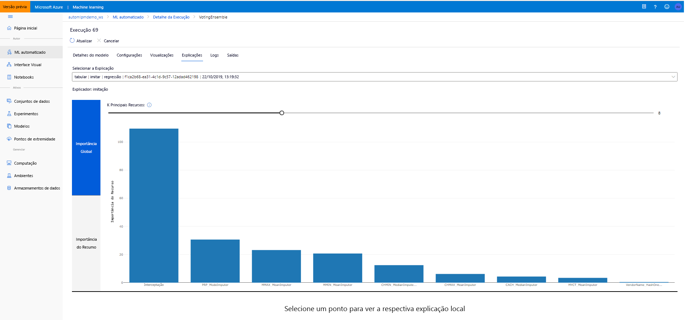

# <a name="model-interpretability-in-automated-machine-learning"></a>Interpretação de modelo no Machine Learning automatizado

[!INCLUDE [applies-to-skus](../../includes/aml-applies-to-basic-enterprise-sku.md)]

Neste artigo, você aprenderá a habilitar os recursos de interpretação para o ML (aprendizado de máquina automatizado) no Azure Machine Learning. O ML automatizado ajuda você a entender a importância bruta e em engenharia dos recursos. Para usar a interpretação de modelo, defina `model_explainability=True` no objeto `AutoMLConfig`.  

Neste artigo, você aprenderá como:

- Execute a interpretabilidade durante o treinamento para o melhor modelo ou qualquer modelo.
- Habilite visualizações para ajudá-lo a ver padrões em dados e explicações.
- Implemente a interpretabilidade durante a inferência ou a pontuação.

## <a name="prerequisites"></a>Pré-requisitos

- Recursos de interpretação. Execute `pip install azureml-interpret azureml-contrib-interpret` para obter os pacotes necessários.
- Conhecimento da criação de experimentos de ML automatizados. Para obter mais informações sobre como usar o SDK do Azure Machine Learning, conclua este [tutorial de modelo de regressão](tutorial-auto-train-models.md) ou veja como [Configurar experimentos de ml automatizados](how-to-configure-auto-train.md).

## <a name="interpretability-during-training-for-the-best-model"></a>Interpretabilidade durante o treinamento para o melhor modelo

Recupere a explicação da `best_run`, que inclui explicações para recursos de engenharia e recursos brutos.

### <a name="download-engineered-feature-importance-from-artifact-store"></a>Baixar a importância de recursos com engenharia da loja de artefatos

Você pode usar `ExplanationClient` para baixar as explicações de recursos de engenharia do repositório de artefatos do `best_run`. Para obter a explicação do conjunto de recursos brutos `raw=True`.

```python
from azureml.contrib.interpret.explanation.explanation_client import ExplanationClient

client = ExplanationClient.from_run(best_run)
engineered_explanations = client.download_model_explanation(raw=False)
print(engineered_explanations.get_feature_importance_dict())
```

## <a name="interpretability-during-training-for-any-model"></a>Interpretabilidade durante o treinamento de qualquer modelo 

Ao computar explicações de modelo e visualizá-las, você não está limitado a uma explicação de modelo existente para um modelo de ML automatizado. Você também pode obter uma explicação para seu modelo com dados de teste diferentes. As etapas nesta seção mostram como computar e visualizar a importância do recurso com engenharia e a importância bruta do recurso com base em seus dados de teste.

### <a name="retrieve-any-other-automl-model-from-training"></a>Recuperar qualquer outro modelo de AutoML do treinamento

```python
automl_run, fitted_model = local_run.get_output(metric='r2_score')
```

### <a name="set-up-the-model-explanations"></a>Configurar as explicações do modelo

Use `automl_setup_model_explanations` para obter as explicações de recursos com engenharia e bruta. O `fitted_model` pode gerar os seguintes itens:

- Dados em destaque de amostras treinadas ou de teste
- Listas de nomes de recursos de engenharia e bruto
- Classes localizáveis em sua coluna rotulada em cenários de classificação

O `automl_explainer_setup_obj` contém todas as estruturas da lista acima.

```python
from azureml.train.automl.automl_explain_utilities import AutoMLExplainerSetupClass, automl_setup_model_explanations

automl_explainer_setup_obj = automl_setup_model_explanations(fitted_model, X=X_train, 
                                                             X_test=X_test, y=y_train, 
                                                             task='classification')
```

### <a name="initialize-the-mimic-explainer-for-feature-importance"></a>Inicializar o explicador de imitação para a importância do recurso

Para gerar uma explicação para modelos AutoML, use a classe `MimicWrapper`. Você pode inicializar o MimicWrapper com estes parâmetros:

- O objeto de instalação do explicador
- Seu espaço de trabalho
- Um modelo LightGBM, que atua como um substituto para o modelo de ML automatizado `fitted_model`

O MimicWrapper também usa o objeto `automl_run` em que as explicações brutas e convertidas serão carregadas.

```python
from azureml.interpret.mimic.models.lightgbm_model import LGBMExplainableModel
from azureml.interpret.mimic_wrapper import MimicWrapper

explainer = MimicWrapper(ws, automl_explainer_setup_obj.automl_estimator, LGBMExplainableModel, 
                         init_dataset=automl_explainer_setup_obj.X_transform, run=automl_run,
                         features=automl_explainer_setup_obj.engineered_feature_names, 
                         feature_maps=[automl_explainer_setup_obj.feature_map],
                         classes=automl_explainer_setup_obj.classes)
```

### <a name="use-mimicexplainer-for-computing-and-visualizing-engineered-feature-importance"></a>Use MimicExplainer para computação e visualização da importância do recurso com engenharia

Você pode chamar o método `explain()` no MimicWrapper com os exemplos de teste transformados para obter a importância do recurso para os recursos de engenharia gerados. Você também pode usar `ExplanationDashboard` para exibir a visualização do painel dos valores de importância do recurso dos recursos de engenharia gerados por featurizers de ML automatizados.

```python
from azureml.contrib.interpret.visualize import ExplanationDashboard
engineered_explanations = explainer.explain(['local', 'global'],              
                                            eval_dataset=automl_explainer_setup_obj.X_test_transform)

print(engineered_explanations.get_feature_importance_dict())
ExplanationDashboard(engineered_explanations, automl_explainer_setup_obj.automl_estimator, automl_explainer_setup_obj.X_test_transform)
```

### <a name="use-mimic-explainer-for-computing-and-visualizing-raw-feature-importance"></a>Usar o explicador de imitação para computação e visualização da importância bruta do recurso

Você pode chamar o método `explain()` em MimicWrapper novamente com os exemplos de teste transformados e configurando `get_raw=True` para obter a importância do recurso para os recursos brutos. Você também pode usar `ExplanationDashboard` para exibir a visualização do painel dos valores de importância do recurso dos recursos brutos.

```python
from azureml.contrib.interpret.visualize import ExplanationDashboard

raw_explanations = explainer.explain(['local', 'global'], get_raw=True, 
                                     raw_feature_names=automl_explainer_setup_obj.raw_feature_names,
                                     eval_dataset=automl_explainer_setup_obj.X_test_transform)

print(raw_explanations.get_feature_importance_dict())
ExplanationDashboard(raw_explanations, automl_explainer_setup_obj.automl_pipeline, automl_explainer_setup_obj.X_test_raw)
```

### <a name="interpretability-during-inference"></a>Interpretabilidade durante a inferência

Nesta seção, você aprenderá a colocar em operação um modelo de ML automatizado com o explicador que foi usado para calcular as explicações na seção anterior.

### <a name="register-the-model-and-the-scoring-explainer"></a>Registrar o modelo e o explicador de Pontuação

Use o `TreeScoringExplainer` para criar o explicador de pontuação que calculará os valores brutos e de importância de recursos em engenharia no tempo de inferência. Você inicializa o explicador de pontuação com o `feature_map` que foi calculado anteriormente. O explicador de Pontuação usa a `feature_map` para retornar a importância bruta do recurso.

Salve o explicador de Pontuação e registre o modelo e o explicador de pontuação com o Serviço Gerenciamento de Modelos. Execute o seguinte código:

```python
from azureml.interpret.scoring.scoring_explainer import TreeScoringExplainer, save

# Initialize the ScoringExplainer
scoring_explainer = TreeScoringExplainer(explainer.explainer, feature_maps=[automl_explainer_setup_obj.feature_map])

# Pickle scoring explainer locally
save(scoring_explainer, exist_ok=True)

# Register trained automl model present in the 'outputs' folder in the artifacts
original_model = automl_run.register_model(model_name='automl_model', 
                                           model_path='outputs/model.pkl')

# Register scoring explainer
automl_run.upload_file('scoring_explainer.pkl', 'scoring_explainer.pkl')
scoring_explainer_model = automl_run.register_model(model_name='scoring_explainer', model_path='scoring_explainer.pkl')
```

### <a name="create-the-conda-dependencies-for-setting-up-the-service"></a>Criar as dependências de Conda para configurar o serviço

Em seguida, crie as dependências de ambiente necessárias no contêiner para o modelo implantado. Observe que o azureml – padrões com a versão > = 1.0.45 deve ser listado como uma dependência Pip, pois ele contém a funcionalidade necessária para hospedar o modelo como um serviço Web.

```python
from azureml.core.conda_dependencies import CondaDependencies

azureml_pip_packages = [
    'azureml-interpret', 'azureml-train-automl', 'azureml-defaults'
]

myenv = CondaDependencies.create(conda_packages=['scikit-learn', 'pandas', 'numpy', 'py-xgboost<=0.80'],
                                 pip_packages=azureml_pip_packages,
                                 pin_sdk_version=True)

with open("myenv.yml","w") as f:
    f.write(myenv.serialize_to_string())

with open("myenv.yml","r") as f:
    print(f.read())

```

### <a name="deploy-the-service"></a>Implantar o serviço

Implante o serviço usando o arquivo Conda e o arquivo de Pontuação das etapas anteriores.

```python
from azureml.core.webservice import Webservice
from azureml.core.webservice import AciWebservice
from azureml.core.model import Model, InferenceConfig
from azureml.core.environment import Environment

aciconfig = AciWebservice.deploy_configuration(cpu_cores=1,
                                               memory_gb=1,
                                               tags={"data": "Bank Marketing",  
                                                     "method" : "local_explanation"},
                                               description='Get local explanations for Bank marketing test data')
myenv = Environment.from_conda_specification(name="myenv", file_path="myenv.yml")
inference_config = InferenceConfig(entry_script="score_local_explain.py", environment=myenv)

# Use configs and models generated above
service = Model.deploy(ws,
                       'model-scoring',
                       [scoring_explainer_model, original_model],
                       inference_config,
                       aciconfig)
service.wait_for_deployment(show_output=True)
```

### <a name="inference-with-test-data"></a>Inferência com dados de teste

Inferência com alguns dados de teste para ver o valor previsto do modelo de ML automatizado. Exiba a importância do recurso projetado para o valor previsto e a importância bruta do recurso para o valor previsto.

```python
if service.state == 'Healthy':
    # Serialize the first row of the test data into json
    X_test_json = X_test[:1].to_json(orient='records')
    print(X_test_json)
    # Call the service to get the predictions and the engineered and raw explanations
    output = service.run(X_test_json)
    # Print the predicted value
    print(output['predictions'])
    # Print the engineered feature importances for the predicted value
    print(output['engineered_local_importance_values'])
    # Print the raw feature importances for the predicted value
    print(output['raw_local_importance_values'])
```

### <a name="visualize-to-discover-patterns-in-data-and-explanations-at-training-time"></a>Visualizar para descobrir padrões em dados e explicações no tempo de treinamento

Você pode visualizar o gráfico de importância do recurso em seu espaço de trabalho no [Azure Machine Learning Studio](https://ml.azure.com). Após a conclusão da execução do ML automatizado, selecione **Exibir detalhes do modelo** para exibir uma execução específica. Selecione a guia **explicações** para ver o painel de visualização de explicação.

[Arquitetura de interpretação de Machine Learning ](./media/how-to-machine-learning-interpretability-automl/automl-explainability.png#lightbox)

## <a name="next-steps"></a>Próximos passos

Para obter mais informações sobre como você pode habilitar as explicações do modelo e a importância dos recursos em áreas do SDK do Azure Machine Learning diferentes do Machine Learning automatizado, consulte o [artigo conceito sobre interpretação](how-to-machine-learning-interpretability.md).
