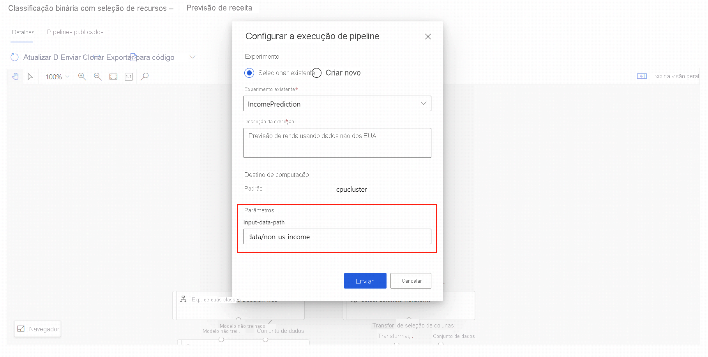

# Usar parâmetros de pipeline para treinar novamente modelos no designer

Neste artigo de instruções, você aprende a usar Azure Machine Learning designer para treinar novamente um modelo de aprendizado de máquina usando parâmetros de pipeline. Você usará pipelines publicados para automatizar seu fluxo de trabalho e definir parâmetros para treinar seu modelo para novos dados. Os parâmetros de pipeline permitem que você reutilize os pipelines existentes para trabalhos diferentes.  

Neste artigo, você aprenderá como:

> [!div class="checklist"]
> * Treinar um modelo de machine learning.
> * Crie um parâmetro de pipeline.
> * Publique seu pipeline de treinamento.
> * Readapte seu modelo com novos parâmetros.

## Pré-requisitos

* Um Workspace do Azure Machine Learning
* Concluir a parte 1 desta série de instruções, [transformar dados no designer](how-to-designer-transform-data.md)

[!INCLUDE [machine-learning-missing-ui](../../includes/machine-learning-missing-ui.md)]

Este artigo também pressupõe que você tenha algum conhecimento sobre a criação de pipelines no designer. Para obter uma introdução guiada, conclua o [tutorial](tutorial-designer-automobile-price-train-score.md). 

### Amostra do pipeline

O pipeline usado neste artigo é uma versão alterada de uma [previsão de renda](samples-designer.md#classification) de pipeline de exemplo na página inicial do designer. O pipeline usa o módulo [Importar Dados](algorithm-module-reference/import-data.md), em vez de usar um conjunto de dados de exemplo para mostrar a você como treinar modelos usando seus próprios dados.

## Criação de um parâmetro de pipeline

Os parâmetros de pipeline são usados para criar pipelines versáteis que podem ser reenviados posteriormente com valores de parâmetro variados. Alguns cenários comuns são a atualização de conjuntos de valores ou alguns hiperparâmetros para novo treinamento. Crie parâmetros de pipeline para definir variáveis dinamicamente em tempo de execução. 

Os parâmetros de pipeline podem ser adicionados à fonte de dados ou parâmetros de módulo em um pipeline. Quando o pipeline é reenviado, os valores desses parâmetros podem ser especificados.

Para este exemplo, você irá alterar o caminho de dados de treinamento de um valor fixo para um parâmetro, para que você possa readaptar seu modelo para dados diferentes. Você também pode adicionar outros parâmetros de módulo como parâmetros de pipeline de acordo com seu caso de uso.

1. Selecione o módulo **Importar Dados**.

    > [!NOTE]
    > Este exemplo usa o módulo Importar Dados para acessar dados em um armazenamento de dados registrado. No entanto, você pode seguir etapas semelhantes se usar padrões de acesso a dados alternativos.

1. No painel de detalhes do módulo à direita da tela, selecione a sua fonte de dados.

1. Digite o caminho para os seus dados. Você também pode selecionar **Procurar caminho** para procurar em sua árvore de arquivos. 

1. Passe com o cursor do mouse sobre o campo **Caminho** e selecione as reticências exibidas acima do campo **Caminho**.

1. Selecione **Adicionar ao parâmetro de pipeline**.

1. Forneça um nome de parâmetro e um valor padrão.

   

1. Clique em **Salvar**.

   > [!NOTE]
   > Você também pode desanexar um parâmetro de módulo do parâmetro de pipeline no painel de detalhes do módulo, semelhante à adição de parâmetros de pipeline.
   >
   > Você pode inspecionar e editar seus parâmetros de pipeline selecionando o ícone de engrenagem de **Configurações** ao lado do título do seu rascunho de pipeline. 
   >    - Depois de desanexar, você pode excluir o parâmetro de pipeline no painel **configurações** .
   >    - Você também pode adicionar um parâmetro de pipeline no painel **configurações** e, em seguida, aplicá-lo em algum parâmetro de módulo.

1. Envie a execução do pipeline.

## Publicação de um pipeline de treinamento

Publique um pipeline em um ponto de extremidade de pipeline para reutilizar facilmente seus pipelines no futuro. Um ponto de extremidade de pipeline cria um ponto de extremidade REST para invocar o pipeline no futuro. Neste exemplo, o ponto de extremidade do pipeline permite reutilizar o pipeline para readaptar um modelo para dados diferentes.

1. Selecione **Publicar** acima da tela do designer.
1. Selecione ou crie um ponto de extremidade de pipeline.

   > [!NOTE]
   > Você pode publicar vários pipelines em um único ponto de extremidade. Cada pipeline em um determinado ponto de extremidade recebe um número de versão, que você pode especificar quando chama o ponto de extremidade do pipeline.

1. Selecione **Publicar**.

## Readaptação do modelo

Agora que você publicou um pipeline de treinamento, use-o para readaptar seu modelo para novos dados. Envie execuções de um ponto de extremidade de pipeline do workspace do estúdio ou programaticamente.

### Enviar execuções usando o portal do estúdio

Use as etapas a seguir para enviar um ponto de extremidade de pipeline com parâmetros executado no portal do estúdio:

1. Acesse a página **Pontos de extremidade** no workspace do estúdio.
1. Selecione a guia **Pontos de extremidade de pipeline**. Em seguida, selecione o ponto de extremidade do pipeline.
1. Selecione a guia **Pipelines publicados**. Em seguida, selecione a versão do pipeline que você deseja executar.
1. Selecione **Enviar**.
1. Na caixa de diálogo de configuração, especifique os valores dos parâmetros para a execução. Para este exemplo, atualize o caminho de dados para treinar seu modelo usando um conjunto de dados que não seja dos EUA.

### Envio de execuções usando código

Encontre o ponto de extremidade de REST de um pipeline publicado no painel de visão geral. É possível readaptar o pipeline publicado chamando o ponto de extremidade.

Para realizar uma chamada REST, você precisa de um cabeçalho de autenticação do tipo portador do OAuth 2.0. Para obter informações sobre como configurar a autenticação do seu workspace e fazer uma chamada REST com parâmetros, veja [Criação de um pipeline do Azure Machine Learning para pontuação em lote](tutorial-pipeline-batch-scoring-classification.md#publish-and-run-from-a-rest-endpoint).

## Próximas etapas

Neste artigo, você aprendeu a criar um ponto de extremidade de pipeline de treinamento com parâmetros usando o designer.

Para obter uma explicação completa de como você pode implantar um modelo para fazer previsões, veja o [tutorial do designer](tutorial-designer-automobile-price-train-score.md) para treinar e implantar um modelo de regressão.
