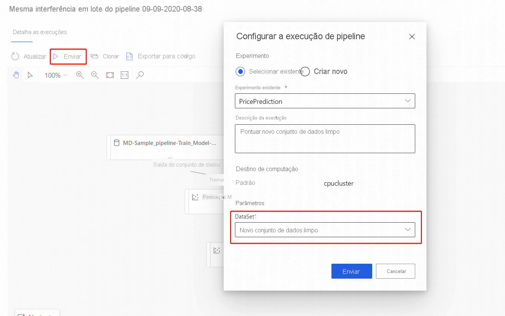

# Executar previsões em lote usando o designer do Azure Machine Learning

Neste artigo, você aprenderá a usar o designer para criar um pipeline de previsão do lote. A previsão de lote permite pontuar continuamente conjuntos de dados de grandes volumes sob demanda usando um serviço Web que pode ser disparado de qualquer biblioteca HTTP.

Nestas instruções, você aprenderá a realizar as seguintes tarefas:

> [!div class="checklist"]
> * Criação e publicação de um pipeline de inferência em lote
> * Consumo de um ponto de extremidade de pipeline
> * Gerenciamento de versões do ponto de extremidade

Para saber como configurar serviços de pontuação de lote usando o SDK, veja as [instruções](./tutorial-pipeline-batch-scoring-classification.md) complementares.

## Pré-requisitos

Estas instruções pressupõem que você já tem um pipeline de treinamento. Para obter uma introdução guiada ao designer, conclua a [primeira parte do tutorial do designer](tutorial-designer-automobile-price-train-score.md). 

[!INCLUDE [machine-learning-missing-ui](../../includes/machine-learning-missing-ui.md)]

## Criar um pipeline de inferência em lote

O pipeline de treinamento deve ser executado pelo menos uma vez para poder criar um pipeline de inferência.

1. Vá até a guia **Designer** em seu workspace.

1. Selecione o pipeline de treinamento que treina o modelo que você deseja usar para fazer a previsão.

1. **Envie** o pipeline.

    

Agora que o pipeline de treinamento foi executado, você pode criar um pipeline de inferência em lote.

1. Ao lado de **Enviar**, selecione a nova lista suspensa **Criação de pipeline de inferência**.

1. Selecione **Pipeline de inferência em lote**.

    
    
O resultado é um pipeline de inferência em lote padrão. 

### Inclusão de um parâmetro do pipeline

Para criar previsões sobre novos dados, conecte-se manualmente a um conjunto de dados diferente nesta exibição de rascunho do pipeline ou crie um parâmetro para o seu conjunto de dados. Parâmetros permitem alterar o comportamento do processo de inferência em lote em tempo de execução.

Nesta seção, você criará um parâmetro de conjunto de dados para especificar um conjunto de dados diferente para o qual serão feitas as previsões.

1. Selecione o módulo do conjunto de dados.

1. Um painel será exibido à direita da tela. Na parte inferior do painel, selecione **Definir como parâmetro de pipeline**.
   
    Insira um nome para o parâmetro ou aceite o valor padrão.

    > [!div class="mx-imgBorder"]
    > 

## Publicar o pipeline de inferência de lote

Agora você está pronto para implantar o pipeline de inferência. Isso implantará o pipeline e o tornará disponível para outras pessoas usarem.

1. Clique no botão **Publicar**.

1. Na caixa de diálogo exibida, expanda a lista suspensa para **PipelineEndpoint** e selecione **Novo PipelineEndpoint**.

1. Forneça um nome e uma descrição opcional para o ponto de extremidade.

    Próximo à parte inferior da caixa de diálogo, você verá o parâmetro configurado com um valor padrão da ID do conjunto de resultados usada durante o treinamento.

1. Selecione **Publicar**.

## Consumo de um ponto de extremidade

Agora, você publicou um pipeline publicado com um parâmetro de conjunto de dados. O pipeline usará o modelo treinado criado no pipeline de treinamento para pontuar o conjunto de dados que você fornece como um parâmetro.

### Enviar uma execução de pipeline 

Nesta seção, você irá configurar uma execução de pipeline manual e alterar o parâmetro de pipeline para pontuar novos dados. 

1. Após a conclusão da implantação, vá para a seção **Pontos de extremidade**.

1. Selecione **Pontos de extremidade do pipeline**.

1. Selecione o nome do ponto de extremidade criado.

1. Selecione **Pipelines publicados**.

    Esta tela mostra todos os pipelines publicados neste ponto de extremidade.

1. Selecione o pipeline publicado.

    A página de detalhes do pipeline mostra um histórico de execução detalhado e as informações da cadeia de conexão para o seu pipeline. 
    
1. Clique no botão **Enviar** para criar uma execução manual do pipeline.

    
    
1. Altere o parâmetro para usar um conjunto de dados diferente.
    
1. Selecione **Enviar** para executar o pipeline.

### Uso do ponto de extremidade de REST

Encontre informações sobre como consumir pontos de extremidade de pipeline e o pipeline publicado na seção **Pontos de extremidade**.

Encontre o ponto de extremidade de REST de um ponto de extremidade de pipeline no painel de visão geral de execução. Quando chama o ponto de extremidade, você consome seu pipeline publicado padrão.

Você também pode consumir um pipeline publicado na página **Pipelines publicados**. Selecione um pipeline publicado e você poderá encontrar o ponto de extremidade REST dele no painel **visão geral do pipeline publicado** à direita do grafo. 

Para realizar uma chamada REST, você precisará de um cabeçalho de autenticação do tipo portador do OAuth 2.0. Confira a [seção do tutorial](tutorial-pipeline-batch-scoring-classification.md#publish-and-run-from-a-rest-endpoint) a seguir para obter mais detalhes sobre como configurar a autenticação para seu workspace e realizar uma chamada REST.

## Controle de versão dos pontos de extremidade

O designer atribui uma versão a cada pipeline subsequente que você publica em um ponto de extremidade. Especifique a versão do pipeline que deseja executar como um parâmetro em sua chamada REST. Se não especificar um número de versão, o designer usará o pipeline padrão.

Quando publica um pipeline, você pode optar por torná-lo o novo pipeline padrão para esse ponto de extremidade.

Você também pode definir um novo pipeline padrão na guia **Pipelines publicados** do ponto de extremidade.

## Limitações

Se você fizer algumas modificações em seu pipeline de treinamento, deverá enviar novamente o pipeline de treinamento, **Atualizar**  o pipeline de inferência e executar o pipeline de inferência novamente.

Observe que somente os modelos serão atualizados no pipeline de inferência, enquanto a transformação de dados não será atualizada.

Para usar a transformação atualizada no pipeline de inferência, você precisa registrar a saída da transformação do módulo de transformação como um conjunto de dados.

Em seguida, substitua manualmente o módulo **td** no pipeline de inferência com o conjunto de dados registrado.

Em seguida, você pode enviar o pipeline de inferência com o modelo e a transformação atualizados e publicar.

## Próximas etapas

Siga o [tutorial](tutorial-designer-automobile-price-train-score.md) do designer para treinar e implantar um modelo de regressão.
''
