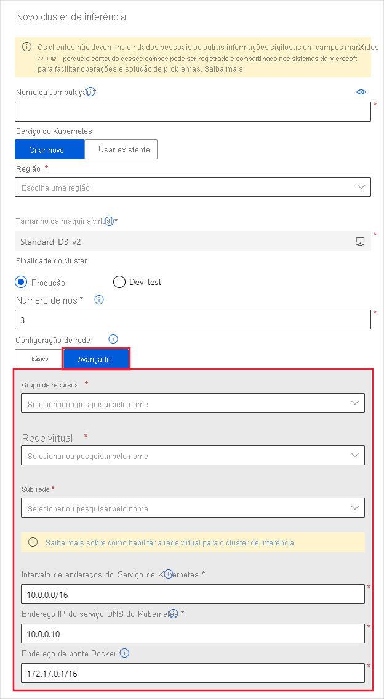
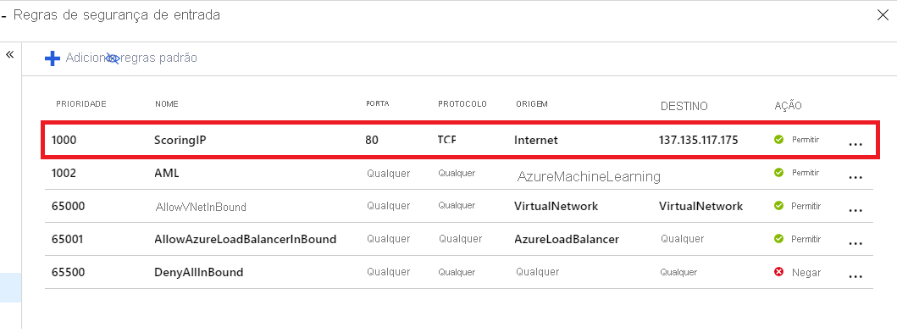

# <a name="secure-an-azure-machine-learning-inferencing-environment-with-virtual-networks"></a>Proteger um ambiente Azure Machine Learning inferência com redes virtuais

Neste artigo, você aprende a proteger ambientes inferência com uma rede virtual no Azure Machine Learning.

Este artigo é a parte quatro de uma série de cinco partes que orienta você pela proteção de um fluxo de trabalho Azure Machine Learning. É altamente recomendável que você leia a [parte um: visão geral da VNet](how-to-network-security-overview.md) para entender a arquitetura geral primeiro. 

Consulte os outros artigos desta série:

[1. visão geral](how-to-network-security-overview.md)  >  [da VNet proteger o espaço de trabalho](how-to-secure-workspace-vnet.md)  >  [3. Proteja o ambiente de treinamento](how-to-secure-training-vnet.md)  >  **4. Proteja o ambiente do inferência**  >  [5. Habilitar a funcionalidade do estúdio](how-to-enable-studio-virtual-network.md)

Neste artigo, você aprenderá a proteger os seguintes recursos do inferência em uma rede virtual:
> [!div class="checklist"]
> - Cluster padrão do AKS (serviço kubernetes do Azure)
> - Cluster AKS privado
> - Cluster AKS com link privado
> - ACI (Instâncias de Contêiner do Azure)

## <a name="prerequisites"></a>Pré-requisitos

+ Leia o artigo [visão geral de segurança de rede](how-to-network-security-overview.md) para entender cenários comuns de rede virtual e a arquitetura de rede virtual geral.

+ Uma rede virtual e sub-rede existentes para usar com seus recursos de computação.

+ Para implantar recursos em uma rede virtual ou sub-rede, sua conta de usuário deve ter permissões para as seguintes ações no controle de acesso baseado em função do Azure (RBAC do Azure):

    - "Microsoft. Network/virtualNetworks/Join/Action" no recurso de rede virtual.
    - "Microsoft. Network/virtualNetworks/sub-rede/junção/ação" no recurso de sub-rede.

    Para obter mais informações sobre o RBAC do Azure com rede, consulte [funções internas de rede](../role-based-access-control/built-in-roles.md#networking)

<a id="aksvnet"></a>

## <a name="azure-kubernetes-service"></a>Serviço de Kubernetes do Azure

Para usar um cluster AKS em uma rede virtual, os requisitos de rede a seguir devem ser atendidos:

> [!div class="checklist"]
> * Siga os pré-requisitos em [Configurar a rede avançada no AKs (serviço de kubernetes do Azure)](../aks/configure-azure-cni.md#prerequisites).
> * A instância AKS e a rede virtual devem estar na mesma região. Se você proteger as contas de armazenamento do Azure usadas pelo espaço de trabalho em uma rede virtual, elas deverão estar na mesma rede virtual que a instância AKS também.

Para adicionar o AKS em uma rede virtual ao seu espaço de trabalho, use as seguintes etapas:

1. Entre no [estúdio do Azure Machine Learning](https://ml.azure.com/) e selecione sua assinatura e workspace.

1. Selecione __Computação__ à esquerda.

1. Selecione __Clusters de inferência__ da central e, em seguida, selecione __+__ .

1. Na caixa de diálogo __Novo cluster de inferência__, selecione __Avançado__ em __Configuração de rede__.

1. Para configurar esse recurso de computação para usar uma rede virtual, execute as seguintes ações:

    1. Na lista suspensa __Grupo de recursos__, selecione o grupo de recursos que contém a rede virtual.
    1. Na lista suspensa __Rede virtual__, selecione a rede virtual que contém a sub-rede.
    1. Na lista suspensa __Sub-rede__, selecione a sub-rede.
    1. Na caixa __Intervalo de endereços do serviço Kubernetes__ , insira o intervalo de endereços do serviço Kubernetes. Esse intervalo de endereços usa um intervalo de IP de notação de Roteamento entre Domínios sem Classificação (CIDR) para definir os endereços IP disponíveis para o cluster. Ele não deve se sobrepor a nenhum intervalo de IP de sub-rede (por exemplo, 10.0.0.0/16).
    1. Na caixa __Endereço IP do serviço DNS do Kubernetes__ , insira o endereço IP do serviço de DNS do Kubernetes. Esse endereço IP é atribuído ao serviço DNS do Kubernetes. Ele deve estar dentro do intervalo de endereços do serviço Kubernetes (por exemplo, 10.0.0.10).
    1. Na caixa __Endereço de ponte do Docker__, insira o endereço da ponte do Docker. Esse endereço IP é atribuído à ponte Docker. Ele não deve estar em nenhum intervalo de IP de sub-rede nem no intervalo de endereços do serviço Kubernetes (por exemplo, 172.17.0.1/16).

   

1. Quando você implanta um modelo como um serviço Web no AKS, um ponto de extremidade de pontuação é criado para lidar com solicitações inferência. Certifique-se de que o grupo NSG que controla a rede virtual tenha uma regra de segurança de entrada habilitada para o endereço IP do ponto de extremidade de Pontuação se você quiser chamá-la de fora da rede virtual.

    Para localizar o endereço IP do ponto de extremidade de pontuação, examine o URI de Pontuação para o serviço implantado. Para obter informações sobre como exibir o URI de pontuação, consulte [consumir um modelo implantado como um serviço Web](how-to-consume-web-service.md#connection-information).

   > [!IMPORTANT]
   > Mantenha as regras de saída padrão para o NSG. Para obter mais informações, consulte as regras de segurança padrão em [Grupos de segurança](../virtual-network/network-security-groups-overview.md#default-security-rules).

   [](./media/how-to-enable-virtual-network/aks-vnet-inbound-nsg-scoring.png#lightbox)

    > [!IMPORTANT]
    > O endereço IP mostrado na imagem para o ponto de extremidade de pontuação será diferente para suas implantações. Embora o mesmo IP seja compartilhado por todas as implantações em um cluster AKS, cada cluster AKS terá um endereço IP diferente.

Também é possível usar o SDK do Azure Machine Learning para adicionar o Serviço de Kubernetes do Azure a uma rede virtual. Se você já tem um cluster do AKS em uma rede virtual, anexe-o ao workspace conforme descrito em [Como implantar no AKS](how-to-deploy-and-where.md). O código a seguir cria uma nova instância de AKS na `default`sub-rede de uma rede virtual nomeada`mynetwork`:

```python
from azureml.core.compute import ComputeTarget, AksCompute

# Create the compute configuration and set virtual network information
config = AksCompute.provisioning_configuration(location="eastus2")
config.vnet_resourcegroup_name = "mygroup"
config.vnet_name = "mynetwork"
config.subnet_name = "default"
config.service_cidr = "10.0.0.0/16"
config.dns_service_ip = "10.0.0.10"
config.docker_bridge_cidr = "172.17.0.1/16"

# Create the compute target
aks_target = ComputeTarget.create(workspace=ws,
                                  name="myaks",
                                  provisioning_configuration=config)
```

Quando o processo de criação for concluído, você pode executar inferência ou pontuação de modelo em um cluster de AKS atrás de uma rede virtual. Para obter mais informações, consulte [Como implantar no AKS](how-to-deploy-and-where.md).

Para obter mais informações sobre como usar o controle de acesso Role-Based com kubernetes, consulte [usar o RBAC do Azure para autorização do kubernetes](../aks/manage-azure-rbac.md).

## <a name="network-contributor-role"></a>Função de colaborador de rede

> [!IMPORTANT]
> Se você criar ou anexar um cluster AKS fornecendo uma rede virtual criada anteriormente, deverá conceder a entidade de serviço (SP) ou a identidade gerenciada para seu cluster AKS a função de _colaborador de rede_ para o grupo de recursos que contém a rede virtual.
>
> Para adicionar a identidade como colaborador de rede, use as seguintes etapas:

1. Para localizar a entidade de serviço ou a ID de identidade gerenciada para AKS, use os seguintes comandos de CLI do Azure. Substitua `<aks-cluster-name>` pelo nome do cluster. Substitua `<resource-group-name>` pelo nome do grupo de recursos que _contém o cluster AKs_:

    ```azurecli-interactive
    az aks show -n <aks-cluster-name> --resource-group <resource-group-name> --query servicePrincipalProfile.clientId
    ``` 

    Se esse comando retornar um valor de `msi` , use o seguinte comando para identificar a ID da entidade de segurança para a identidade gerenciada:

    ```azurecli-interactive
    az aks show -n <aks-cluster-name> --resource-group <resource-group-name> --query identity.principalId
    ```

1. Para localizar a ID do grupo de recursos que contém sua rede virtual, use o comando a seguir. Substitua `<resource-group-name>` pelo nome do grupo de recursos que _contém a rede virtual_:

    ```azurecli-interactive
    az group show -n <resource-group-name> --query id
    ```

1. Para adicionar a entidade de serviço ou a identidade gerenciada como um colaborador de rede, use o comando a seguir. Substituir `<SP-or-managed-identity>` pela ID retornada para a entidade de serviço ou identidade gerenciada. Substituir `<resource-group-id>` pela ID retornada para o grupo de recursos que contém a rede virtual:

    ```azurecli-interactive
    az role assignment create --assignee <SP-or-managed-identity> --role 'Network Contributor' --scope <resource-group-id>
    ```
Para obter mais informações sobre como usar o balanceador de carga interno com o AKS, consulte [Usar o balanceador de carga interno com o Serviço de Kubernetes do Azure](../aks/internal-lb.md).

## <a name="secure-vnet-traffic"></a>Tráfego de VNet seguro

Há duas abordagens para isolar o tráfego de e para o cluster AKS para a rede virtual:

* __Cluster AKs privado__: essa abordagem usa o link privado do Azure para proteger as comunicações com o cluster para operações de implantação/gerenciamento.
* __Balanceador de carga AKs interno__: essa abordagem configura o ponto de extremidade para suas implantações para AKs usar um IP privado dentro da rede virtual.

> [!WARNING]
> O balanceador de carga interno não funciona com um cluster AKS que usa kubenet. Se você quiser usar um balanceador de carga interno e um cluster AKS privado ao mesmo tempo, configure seu cluster AKS privado com o CNI (interface de rede de contêiner do Azure). Para obter mais informações, consulte [Configurar a rede CNI do Azure no serviço kubernetes do Azure](../aks/configure-azure-cni.md).

### <a name="private-aks-cluster"></a>Cluster AKS privado

Por padrão, os clusters AKS têm um plano de controle, ou servidor de API, com endereços IP públicos. Você pode configurar o AKS para usar um plano de controle privado criando um cluster AKS privado. Para obter mais informações, consulte [criar um cluster particular do serviço kubernetes do Azure](../aks/private-clusters.md).

Depois de criar o cluster AKS privado, [anexe o cluster à rede virtual](how-to-create-attach-kubernetes.md) para usar com Azure Machine Learning.

> [!IMPORTANT]
> Antes de usar um cluster AKS habilitado para link privado com Azure Machine Learning, você deve abrir um incidente de suporte para habilitar essa funcionalidade. Para obter mais informações, consulte [gerenciar e aumentar cotas](how-to-manage-quotas.md#private-endpoint-and-private-dns-quota-increases).

### <a name="internal-aks-load-balancer"></a>Balanceador de carga AKS interno

Por padrão, as implantações do AKS usam um [balanceador de carga público](../aks/load-balancer-standard.md). Nesta seção, você aprenderá a configurar o AKS para usar um balanceador de carga interno. Um balanceador de carga interno (ou privado) é usado onde somente os IPs privados são permitidos como front-end. Balanceadores de carga internos são usados para balancear a carga do tráfego dentro de uma rede virtual

Um balanceador de carga privado é habilitado Configurando AKS para usar um _balanceador de carga interno_. 

#### <a name="enable-private-load-balancer"></a>Habilitar o balanceador de carga privado

> [!IMPORTANT]
> Não é possível habilitar o IP privado ao criar o cluster do serviço kubernetes do Azure no Azure Machine Learning Studio. Você pode criar um com um balanceador de carga interno ao usar o SDK do Python ou a extensão CLI do Azure para o aprendizado de máquina.

Os exemplos a seguir demonstram como __criar um novo cluster AKs com um balanceador de carga interno/IP privado__ usando o SDK e a CLI:

# <a name="python"></a>[Python](#tab/python)

```python
import azureml.core
from azureml.core.compute import AksCompute, ComputeTarget

# Verify that cluster does not exist already
try:
    aks_target = AksCompute(workspace=ws, name=aks_cluster_name)
    print("Found existing aks cluster")

except:
    print("Creating new aks cluster")

    # Subnet to use for AKS
    subnet_name = "default"
    # Create AKS configuration
    prov_config=AksCompute.provisioning_configuration(load_balancer_type="InternalLoadBalancer")
    # Set info for existing virtual network to create the cluster in
    prov_config.vnet_resourcegroup_name = "myvnetresourcegroup"
    prov_config.vnet_name = "myvnetname"
    prov_config.service_cidr = "10.0.0.0/16"
    prov_config.dns_service_ip = "10.0.0.10"
    prov_config.subnet_name = subnet_name
    prov_config.load_balancer_subnet = subnet_name
    prov_config.docker_bridge_cidr = "172.17.0.1/16"

    # Create compute target
    aks_target = ComputeTarget.create(workspace = ws, name = "myaks", provisioning_configuration = prov_config)
    # Wait for the operation to complete
    aks_target.wait_for_completion(show_output = True)
```

# <a name="azure-cli"></a>[CLI do Azure](#tab/azure-cli)

```azurecli
az ml computetarget create aks -n myaks --load-balancer-type InternalLoadBalancer
```

> [!IMPORTANT]
> Usando a CLI, você só pode criar um cluster AKS com um balanceador de carga interno. Não há nenhum comando AZ ml para atualizar um cluster existente para usar um balanceador de carga interno.

Para obter mais informações, consulte a referência do [AZ ml computetarget Create AKs](/cli/azure/ext/azure-cli-ml/ml/computetarget/create#ext-azure-cli-ml-az-ml-computetarget-create-aks) .

---

Ao __anexar um cluster existente__ ao seu espaço de trabalho, você deve aguardar até que a operação de anexação configure o balanceador de carga. Para obter informações sobre como anexar um cluster, consulte [anexar um cluster AKs existente](how-to-create-attach-kubernetes.md).

Depois de anexar o cluster existente, você pode atualizar o cluster para usar um balanceador de carga interno/IP privado:

```python
import azureml.core
from azureml.core.compute.aks import AksUpdateConfiguration
from azureml.core.compute import AksCompute

# ws = workspace object. Creation not shown in this snippet
aks_target = AksCompute(ws,"myaks")

# Change to the name of the subnet that contains AKS
subnet_name = "default"
# Update AKS configuration to use an internal load balancer
update_config = AksUpdateConfiguration(None, "InternalLoadBalancer", subnet_name)
aks_target.update(update_config)
# Wait for the operation to complete
aks_target.wait_for_completion(show_output = True)
```

## <a name="enable-azure-container-instances-aci"></a>Habilitar ACI (instâncias de contêiner do Azure)

As Instâncias de Contêiner do Azure são criadas dinamicamente durante a implantação de um modelo. Para habilitar a Azure Machine Learning para criar ACI dentro da rede virtual, você deve habilitar a __delegação de sub-rede__ para a sub-rede usada pela implantação.

> [!WARNING]
> Ao usar instâncias de contêiner do Azure em uma rede virtual, a rede virtual deve ser:
> * No mesmo grupo de recursos que seu espaço de trabalho Azure Machine Learning.
> * Se o seu espaço de trabalho tiver um __ponto de extremidade privado__, a rede virtual usada para instâncias de contêiner do Azure deverá ser a mesma usada pelo ponto de extremidade privado do espaço de trabalho.
>
> Ao usar as instâncias de contêiner do Azure dentro da rede virtual, o ACR (registro de contêiner do Azure) para seu espaço de trabalho não pode estar na rede virtual.

Para usar a ACI em uma rede virtual no seu workspace, siga as seguintes etapas:

1. Para habilitar a delegação de sub-rede em sua rede virtual, use as informações do artigo [Adicionar ou remover uma delegação de sub-rede](../virtual-network/manage-subnet-delegation.md). É possível habilitar a delegação ao criar uma rede virtual ou adicioná-la a uma rede existente.

    > [!IMPORTANT]
    > Ao habilitar a delegação, use `Microsoft.ContainerInstance/containerGroups` como o valor de __Delegar sub-rede ao serviço__.

2. Implante o modelo usando [AciWebservice. deploy_configuration()](/python/api/azureml-core/azureml.core.webservice.aci.aciwebservice#deploy-configuration-cpu-cores-none--memory-gb-none--tags-none--properties-none--description-none--location-none--auth-enabled-none--ssl-enabled-none--enable-app-insights-none--ssl-cert-pem-file-none--ssl-key-pem-file-none--ssl-cname-none--dns-name-label-none--primary-key-none--secondary-key-none--collect-model-data-none--cmk-vault-base-url-none--cmk-key-name-none--cmk-key-version-none--vnet-name-none--subnet-name-none-), use os parâmetros `vnet_name` e `subnet_name`. Defina esses parâmetros para o nome da rede virtual e a sub-rede onde você habilitou a delegação.

## <a name="limit-outbound-connectivity-from-the-virtual-network"></a>Limitar a conectividade de saída da rede virtual

Se você não quiser usar as regras de saída padrão e quiser limitar o acesso de saída de sua rede virtual, deverá permitir o acesso ao registro de contêiner do Azure. Por exemplo, verifique se os NSG (grupos de segurança de rede) contêm uma regra que permite o acesso à marca de serviço __AzureContainerRegistry. RegionName__ , em que ' {RegionName} é o nome de uma região do Azure.

## <a name="next-steps"></a>Próximas etapas

Este artigo é a parte quatro de uma série de redes virtuais de cinco partes. Consulte o restante dos artigos para saber como proteger uma rede virtual:

* [Parte 1: visão geral da rede virtual](how-to-network-security-overview.md)
* [Parte 2: proteger os recursos do espaço de trabalho](how-to-secure-workspace-vnet.md)
* [Parte 3: proteger o ambiente de treinamento](how-to-secure-training-vnet.md)
* [Parte 5: habilitar a funcionalidade do estúdio](how-to-enable-studio-virtual-network.md)