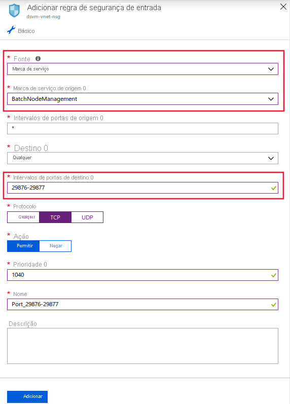
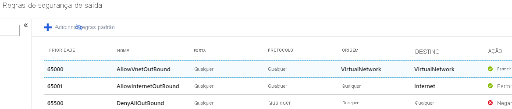
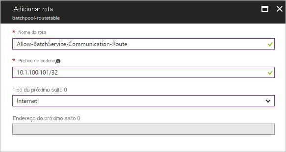
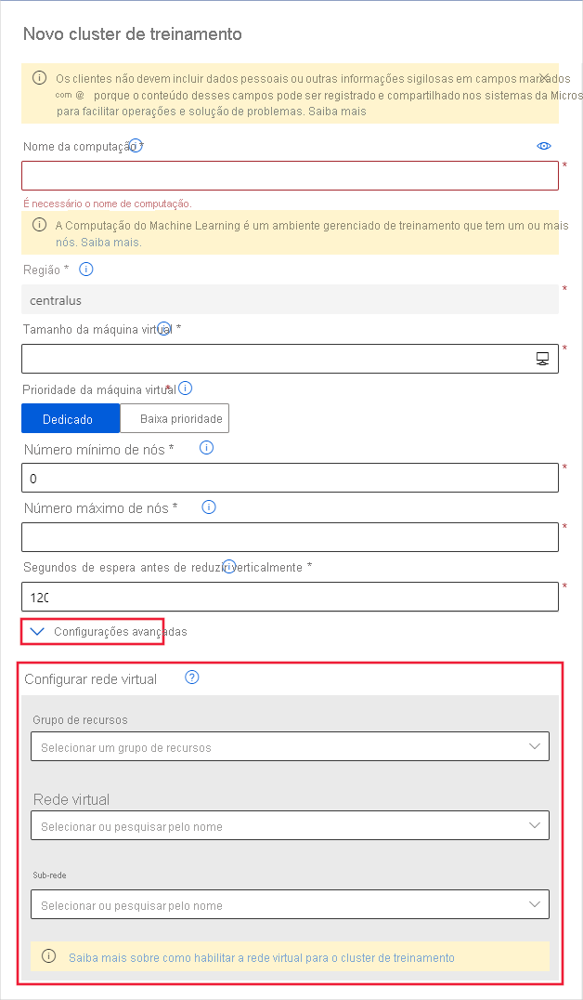
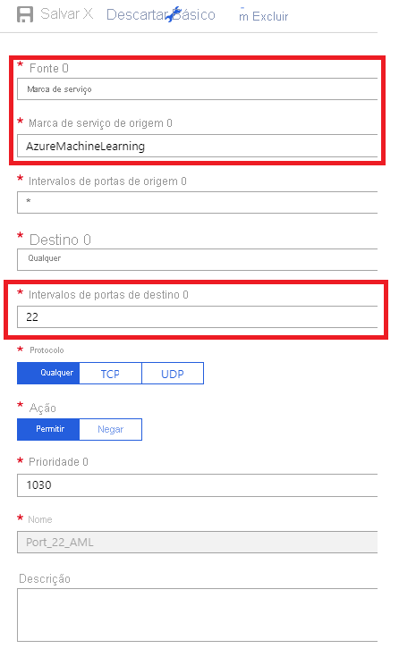

# <a name="secure-an-azure-machine-learning-training-environment-with-virtual-networks"></a>Proteger um ambiente de treinamento Azure Machine Learning com redes virtuais

Neste artigo, você aprende a proteger ambientes de treinamento com uma rede virtual no Azure Machine Learning.

Este artigo é a parte três de uma série de cinco partes que orienta você pela proteção de um fluxo de trabalho Azure Machine Learning. É altamente recomendável que você leia a [parte um: visão geral da VNet](how-to-network-security-overview.md) para entender a arquitetura geral primeiro. 

Consulte os outros artigos desta série:

[1. visão geral da VNet](how-to-network-security-overview.md)  >  [2. Proteja o espaço de trabalho](how-to-secure-workspace-vnet.md)  >  **3. Proteja o ambiente de treinamento**  >  [4. Proteja o ambiente do inferência](how-to-secure-inferencing-vnet.md)   >  [5. Habilitar a funcionalidade do estúdio](how-to-enable-studio-virtual-network.md)

Neste artigo, você aprenderá a proteger os seguintes recursos de computação de treinamento em uma rede virtual:
> [!div class="checklist"]
> - Cluster de computação do Azure Machine Learning
> - Instância de computação do Azure Machine Learning
> - Azure Databricks
> - Máquina Virtual
> - Cluster HDInsight

## <a name="prerequisites"></a>Pré-requisitos

+ Leia o artigo [visão geral de segurança de rede](how-to-network-security-overview.md) para entender cenários comuns de rede virtual e a arquitetura de rede virtual geral.

+ Uma rede virtual e sub-rede existentes para usar com seus recursos de computação.

+ Para implantar recursos em uma rede virtual ou sub-rede, sua conta de usuário deve ter permissões para as seguintes ações no controle de acesso baseado em função do Azure (RBAC do Azure):

    - "Microsoft. Network/virtualNetworks/Join/Action" no recurso de rede virtual.
    - "Microsoft. Network/virtualNetworks/sub-rede/junção/ação" no recurso de sub-rede.

    Para obter mais informações sobre o RBAC do Azure com rede, consulte [funções internas de rede](../role-based-access-control/built-in-roles.md#networking)


## <a name="compute-clusters--instances"></a><a name="compute-instance"></a>Clusters e instâncias de computação 

Para usar um [destino de computação __do__ Azure Machine Learning gerenciado](concept-compute-target.md#azure-machine-learning-compute-managed) ou uma [instância de computação do __Azure Machine Learning__](concept-compute-instance.md) em uma rede virtual, os requisitos de rede a seguir devem ser atendidos:

> [!div class="checklist"]
> * A rede virtual deve estar na mesma assinatura e região que o workspace do Azure Machine Learning.
> * A sub-rede especificada para a instância ou cluster de computação deve ter endereços IP não atribuídos suficientes para acomodar o número de VMs destinadas. Se a sub-rede não tiver endereços IP não atribuídos suficientes, um cluster de cálculo será parcialmente alocado.
> * Verifique se as políticas de segurança, os bloqueios na assinatura da rede virtual ou o grupo de recursos restringem permissões para gerenciar a rede virtual. Se você planeja proteger a rede virtual restringindo o tráfego, deixe algumas portas abertas para o serviço de computação. Para saber mais, consulte a seção [Portas necessárias](#mlcports).
> * Se você for colocar várias instâncias ou clusters de computação em uma rede virtual, talvez seja necessário solicitar um aumento de cota para um ou mais de seus recursos.
> * Se as Contas de Armazenamento do Azure para o workspace também estiverem protegidas em uma rede virtual, elas deverão estar na mesma rede virtual que a instância ou cluster de computação do Azure Machine Learning. 
> * Para que a funcionalidade de Jupyter da instância de computação funcione, verifique se a comunicação do soquete da Web não está desabilitada. Verifique se a sua rede permite conexões WebSocket com *. instances.azureml.net e *. instances.azureml.ms. 
> * Quando a instância de computação é implantada em um espaço de trabalho de link privado, ela só pode ser acessada de dentro da rede virtual. Se você estiver usando o arquivo DNS ou hosts personalizado, adicione uma entrada para `<instance-name>.<region>.instances.azureml.ms` com o endereço IP privado do ponto de extremidade particular do espaço de trabalho. Para obter mais informações, consulte o artigo [DNS personalizado](./how-to-custom-dns.md) .
> * A sub-rede usada para implantar cluster/instância de computação não deve ser delegada a nenhum outro serviço como ACI
> * As políticas de ponto de extremidade de serviço de rede virtual não funcionam para contas de armazenamento do sistema de cluster/instância de computação

    
> [!TIP]
> A instância ou cluster de computação do Machine Learning aloca automaticamente recursos adicionais de rede __no grupo de recursos que contém a rede virtual__. Para cada instância ou cluster de computação, o serviço aloca os seguintes recursos:
> 
> * Um grupo de segurança de rede
> * Um endereço IP público. Se você tiver a política do Azure proibindo a criação de IP público, a implantação de cluster/instâncias falhará
> * Um balanceador de carga
> 
> No caso de clusters, esses recursos são excluídos (e recriados) sempre que o cluster é reduzido para 0 nós. No entanto, para uma instância, os recursos são mantidos até que a instância seja completamente excluída (a interrupção não remove os recursos). 
> Esses recursos são limitados pelas [cotas de recursos](../azure-resource-manager/management/azure-subscription-service-limits.md) da assinatura. Se o grupo de recursos de rede virtual estiver bloqueado, a exclusão do cluster/instância de computação falhará. O balanceador de carga não pode ser excluído até que o cluster/instância de computação seja excluído. Além disso, verifique se não há nenhuma política do Azure que proíba a criação de grupos de segurança de rede.


### <a name="required-ports"></a><a id="mlcports"></a> Portas obrigatórias

Se você planeja proteger a rede virtual restringindo o tráfego de rede de/para a Internet pública, você deve permitir comunicações de entrada do serviço de lote do Azure.

O serviço de Lote adiciona grupos de segurança de rede (NSGs) no nível dos adaptadores de rede (NICs) anexados às VMs. Esses NSGs configuraram automaticamente as regras de entrada e saída para permitir o tráfego a seguir:

- Tráfego TCP de entrada nas portas 29876 e 29877 a partir de uma __Marca de serviço__ de __BatchNodeManagement__. O tráfego por essas portas é criptografado e usado pelo lote do Azure para a comunicação do Agendador/nó.

    

- (Opcional) Tráfego TCP de entrada na porta 22 para permitir acesso remoto. Use essa porta somente se quiser se conectar usando SSH no IP público.

- Tráfego de saída em qualquer porta para a rede virtual.

- Tráfego de saída em qualquer porta para a internet.

- Para o tráfego TCP de entrada da instância de computação na porta 44224 de uma __Marca de serviço__ do __AzureMachineLearning__. O tráfego por essa porta é criptografado e usado pelo Azure Machine Learning para comunicação com aplicativos em execução em instâncias de computação.

> [!IMPORTANT]
> Tenha cuidado se você modificar ou adicionar regras de entrada ou saída nos NSGs configurados em Lote. Se um NSG bloquear a comunicação com os nós de computação, os serviços de computação definem o estado dos nós de computação como inutilizáveis.
>
> Não é necessário especificar NSGs no nível de sub-rede porque o serviço do Lote do Azure configura seus próprios NSGs. No entanto, se a sub-rede que contém o Azure Machine Learning computação tiver associado NSGs ou um firewall, você também deverá permitir o tráfego listado anteriormente.

A configuração da regra de NSG no portal do Azure é mostrada nas seguintes imagens:

:::image type="content" source="./media/how-to-enable-virtual-network/amlcompute-virtual-network-inbound.png" alt-text="As regras de NSG de entrada para Computação do Machine Learning" border="true":::




### <a name="limit-outbound-connectivity-from-the-virtual-network"></a><a id="limiting-outbound-from-vnet"></a> Limitar a conectividade de saída da rede virtual

Se você não quiser usar as regras de saída padrão e quiser limitar o acesso de saída de sua rede virtual, siga as seguintes etapas:

- Negue a conexão de Internet de saída usando as regras de NSG.

- Para uma __instância de computação__ ou um __cluster de cálculo__, limite o tráfego de saída para os seguintes itens:
   - Armazenamento do Azure que usa a __Marca de serviço__ de __Storage.RegionName__. Em que `{RegionName}` é o nome de uma região do Azure.
   - Registro de Contêiner do Azure, usando __Marca de serviço__ de __AzureContainerRegistry.RegionName__. Em que `{RegionName}` é o nome de uma região do Azure.
   - Azure Machine Learning, usando a __Marca de serviço__ de __AzureMachineLearning__
   - Azure Resource Manager, usando a __Marca de serviço__ de __AzureResourceManager__
   - Azure Active Directory, usando a __Marca de serviço__ de __AzureActiveDirectory__

A configuração da regra de NSG no portal do Azure é mostrada na seguinte imagem:

[](./media/how-to-enable-virtual-network/limited-outbound-nsg-exp.png#lightbox)

> [!NOTE]
> Se você planeja usar imagens padrão do Docker fornecidas pela Microsoft e habilitando dependências gerenciadas pelo usuário, você também deve usar as seguintes __marcas de serviço__:
>
> * __MicrosoftContainerRegistry__
> * __AzureFrontDoor.FirstParty__
>
> Essa configuração é necessária quando você tem um código semelhante aos seguintes trechos como parte de seus scripts de treinamento:
>
> __Treinamento do RunConfig__
> ```python
> # create a new runconfig object
> run_config = RunConfiguration()
> 
> # configure Docker 
> run_config.environment.docker.enabled = True
> # For GPU, use DEFAULT_GPU_IMAGE
> run_config.environment.docker.base_image = DEFAULT_CPU_IMAGE 
> run_config.environment.python.user_managed_dependencies = True
> ```
>
> __Treinamento do avaliador__
> ```python
> est = Estimator(source_directory='.',
>                 script_params=script_params,
>                 compute_target='local',
>                 entry_script='dummy_train.py',
>                 user_managed=True)
> run = exp.submit(est)
> ```

### <a name="forced-tunneling"></a>Túnel forçado

Se você estiver usando o [túnel forçado](../vpn-gateway/vpn-gateway-forced-tunneling-rm.md) com Azure Machine Learning computação, deverá permitir a comunicação com a Internet pública da sub-rede que contém o recurso de computação. Essa comunicação é usada para agendamento de tarefas e acesso ao armazenamento do Azure.

Há duas maneiras de fazer isso:

* Use um [NAT de rede virtual](../virtual-network/nat-overview.md). Um gateway NAT fornece conectividade de Internet de saída para uma ou mais sub-redes em sua rede virtual. Para obter informações, consulte [Designing Virtual Networks with NAT gateway Resources](../virtual-network/nat-gateway-resource.md).

* Adicione [UDRs (rotas definidas pelo usuário)](../virtual-network/virtual-networks-udr-overview.md) à sub-rede que contém o recurso de computação. Estabeleça uma UDR para cada endereço IP usado pelo serviço do Lote do Azure na região onde existem seus recursos. Essas UDRs permitem que o serviço de Lote se comunique com os nós de computação para agendamento de tarefas. Além disso, adicione o endereço IP para o serviço de Azure Machine Learning, pois isso é necessário para acessar instâncias de computação. Ao adicionar o IP para o serviço de Azure Machine Learning, você deve adicionar o IP para as regiões __primárias e secundárias__ do Azure. A região primária sendo aquela em que seu espaço de trabalho está localizado.

    Para encontrar a região secundária, confira [garantir a continuidade dos negócios & recuperação de desastre usando regiões emparelhadas do Azure](../best-practices-availability-paired-regions.md#azure-regional-pairs). Por exemplo, se seu serviço de Azure Machine Learning estiver no leste dos EUA 2, a região secundária será EUA Central. 

    Use um dos seguintes métodos para obter uma lista de endereços IP do serviço de Lote e do serviço do Azure Machine Learning:

    * Baixe os [Intervalos de IP do Azure e as Marcas de serviço](https://www.microsoft.com/download/details.aspx?id=56519) e pesquise `BatchNodeManagement.<region>` e `AzureMachineLearning.<region>` no arquivo, em que `<region>` é a sua região do Azure.

    * Use o [CLI do Azure](/cli/azure/install-azure-cli) para baixar as informações. O exemplo a seguir baixa as informações de endereço IP e filtra as informações da região leste dos EUA 2 (primária) e região de EUA Central (secundária):

        ```azurecli-interactive
        az network list-service-tags -l "East US 2" --query "values[?starts_with(id, 'Batch')] | [?properties.region=='eastus2']"
        # Get primary region IPs
        az network list-service-tags -l "East US 2" --query "values[?starts_with(id, 'AzureMachineLearning')] | [?properties.region=='eastus2']"
        # Get secondary region IPs
        az network list-service-tags -l "Central US" --query "values[?starts_with(id, 'AzureMachineLearning')] | [?properties.region=='centralus']"
        ```

        > [!TIP]
        > Se você estiver usando as regiões US-Virgínia, US-Arizona regiões ou China-East-2, esses comandos não retornarão endereços IP. Em vez disso, use um dos links a seguir para baixar uma lista de endereços IP:
        >
        > * [Intervalos de IP do Azure e marcas de serviço para o Azure governamental](https://www.microsoft.com/download/details.aspx?id=57063)
        > * [Intervalos de IP do Azure e marcas de serviço para o Azure China](https://www.microsoft.com//download/details.aspx?id=57062)
    
    Quando você adicionar as UDRs, defina a rota para cada prefixo de endereço IP do Lote relacionado e defina __Próximo tipo de salto__ como __Internet__. A imagem a seguir mostra um exemplo dessa UDR no portal do Azure:

    

    > [!IMPORTANT]
    > Os endereços IP podem mudar ao longo do tempo.

    Além de qualquer UDRs que você definir, o tráfego de saída para o armazenamento do Azure deve ser permitido por meio de seu dispositivo de rede local. Especificamente, as URLs para esse tráfego estão nas seguintes formas: `<account>.table.core.windows.net` , `<account>.queue.core.windows.net` e `<account>.blob.core.windows.net` . 

    Para obter mais informações, consulte [Criar um pool de Lote do Azure em uma rede virtual](../batch/batch-virtual-network.md#user-defined-routes-for-forced-tunneling).

### <a name="create-a-compute-cluster-in-a-virtual-network"></a>Criar um cluster de cálculo em uma rede virtual

Para criar um cluster de Computação do Machine Learning, siga as seguintes etapas:

1. Entre no [estúdio do Azure Machine Learning](https://ml.azure.com/) e selecione sua assinatura e workspace.

1. Selecione __Computação__ à esquerda.

1. Selecione __Clusters de treinamento__ da central e, em seguida, selecione __+__ .

1. Na caixa de diálogo __Novo cluster de treinamento__, expanda a seção __Configurações avançadas__.

1. Para configurar esse recurso de computação para usar uma rede virtual, execute as seguintes ações na seção __Configurar rede virtual__:

    1. Na lista suspensa __Grupo de recursos__, selecione o grupo de recursos que contém a rede virtual.
    1. Na lista suspensa __Rede virtual__, selecione a rede virtual que contém a sub-rede.
    1. Na lista suspensa __Sub-rede__, selecione a sub-rede a ser usada.

   

Também é possível criar um cluster de Computação do Machine Learning, usando o SDK do Azure Machine Learning. O código a seguir cria um novo cluster de Computação do Machine Learning na sub-rede `default` de uma rede virtual chamada `mynetwork`:

```python
from azureml.core.compute import ComputeTarget, AmlCompute
from azureml.core.compute_target import ComputeTargetException

# The Azure virtual network name, subnet, and resource group
vnet_name = 'mynetwork'
subnet_name = 'default'
vnet_resourcegroup_name = 'mygroup'

# Choose a name for your CPU cluster
cpu_cluster_name = "cpucluster"

# Verify that cluster does not exist already
try:
    cpu_cluster = ComputeTarget(workspace=ws, name=cpu_cluster_name)
    print("Found existing cpucluster")
except ComputeTargetException:
    print("Creating new cpucluster")

    # Specify the configuration for the new cluster
    compute_config = AmlCompute.provisioning_configuration(vm_size="STANDARD_D2_V2",
                                                           min_nodes=0,
                                                           max_nodes=4,
                                                           vnet_resourcegroup_name=vnet_resourcegroup_name,
                                                           vnet_name=vnet_name,
                                                           subnet_name=subnet_name)

    # Create the cluster with the specified name and configuration
    cpu_cluster = ComputeTarget.create(ws, cpu_cluster_name, compute_config)

    # Wait for the cluster to be completed, show the output log
    cpu_cluster.wait_for_completion(show_output=True)
```

Após concluir o processo de criação, você treina seu modelo usando o cluster em um experimento. Para obter mais informações, consulte [Selecionar e usar um destino de computação para treinamento](how-to-set-up-training-targets.md).

[!INCLUDE [low-pri-note](../../includes/machine-learning-low-pri-vm.md)]

### <a name="access-data-in-a-compute-instance-notebook"></a>Acessar dados em um bloco de anotações de instância de computação

Se você estiver usando blocos de anotações em uma instância de computação do Azure, certifique-se de que o bloco de anotações esteja sendo executado em um recurso de computação por trás da mesma rede virtual e sub-rede que seus dados. 

Você deve configurar sua instância de computação para estar na mesma rede virtual durante a criação em **Configurações avançadas**  >  **Configurar rede virtual**. Você não pode adicionar uma instância de computação existente a uma rede virtual.

## <a name="azure-databricks"></a>Azure Databricks

Para usar o Azure Databricks em uma rede virtual com seu workspace, os seguintes requisitos devem ser atendidos:

> [!div class="checklist"]
> * A rede virtual deve estar na mesma assinatura e região que o workspace do Azure Machine Learning.
> * Se as Contas de Armazenamento do Azure para o workspace também estiverem protegidas em uma rede virtual, elas deverão estar na mesma rede virtual que o cluster do Azure Databricks.
> * Além das sub-redes __databricks-particular__ e  __databricks-público__ usadas pelos Azure Databricks, a sub-rede __padrão__ criada para a rede virtual também é necessária.

Para obter informações específicas sobre o uso do Azure Databricks com uma rede virtual, consulte [Implantar o Azure Databricks na sua Rede Virtual do Azure](/azure/databricks/administration-guide/cloud-configurations/azure/vnet-inject).

<a id="vmorhdi"></a>

## <a name="virtual-machine-or-hdinsight-cluster"></a>Máquina virtual ou cluster HDInsight

> [!IMPORTANT]
> O Azure Machine Learning dá suporte apenas a máquinas virtuais que executam Ubuntu.

Nesta seção, você aprenderá a usar uma máquina virtual ou um cluster do Azure HDInsight em uma rede virtual com seu espaço de trabalho.

### <a name="create-the-vm-or-hdinsight-cluster"></a>Criar a VM ou o cluster HDInsight

Crie um cluster de VM ou HDInsight usando o portal do Azure ou a CLI do Azure e coloque-o em uma rede virtual do Azure. Para obter mais informações, consulte os seguintes artigos:
* [Criar e gerenciar redes virtuais do Azure para VMs do Linux](../virtual-machines/linux/tutorial-virtual-network.md)

* [Estender HDInsight usando uma rede virtual do Azure](../hdinsight/hdinsight-plan-virtual-network-deployment.md)

### <a name="configure-network-ports"></a>Configurar portas de rede 

Permita que Azure Machine Learning se comunique com a porta SSH na VM ou cluster, configure uma entrada de origem para o grupo de segurança de rede. A porta SSH geralmente é a porta 22. Para permitir o tráfego dessa origem, execute as seguintes ações:

1. Na lista suspensa __Origem__, selecione __Marca de serviço__.

1. Na lista suspensa __Marca de serviço da origem__, selecione __AzureMachineLearning__.

    

1. Na lista suspensa __Intervalos da porta de origem__, selecione __*__ .

1. Na lista suspensa __Destino__, selecione __Qualquer um__.

1. Na lista suspensa __Intervalos da porta de destino__, selecione __22__.

1. Em __Protocolo__, selecione __Qualquer um__.

1. Em __Ação__, selecione __Permitir__.

Mantenha as regras de saída padrão para o grupo de segurança de rede. Para obter mais informações, consulte as regras de segurança padrão em [Grupos de segurança](../virtual-network/network-security-groups-overview.md#default-security-rules).

Se você não quiser usar as regras de saída padrão e quiser limitar o acesso de saída da sua rede virtual, consulte a seção [Limitar a conectividade de saída da rede virtual](#limiting-outbound-from-vnet).

### <a name="attach-the-vm-or-hdinsight-cluster"></a>Anexar a VM ou o cluster HDInsight

Anexe o cluster da VM ou do HDInsight ao seu workspace do Azure Machine Learning. Para obter mais informações, consulte [Configurar destinos de computação para treinamento do modelo](how-to-set-up-training-targets.md).

## <a name="next-steps"></a>Próximas etapas

Este artigo é a parte três de uma série de redes virtuais de cinco partes. Consulte o restante dos artigos para saber como proteger uma rede virtual:

* [Parte 1: visão geral da rede virtual](how-to-network-security-overview.md)
* [Parte 2: proteger os recursos do espaço de trabalho](how-to-secure-workspace-vnet.md)
* [Parte 4: proteger o ambiente inferência](how-to-secure-inferencing-vnet.md)
* [Parte 5: habilitar a funcionalidade do estúdio](how-to-enable-studio-virtual-network.md)
