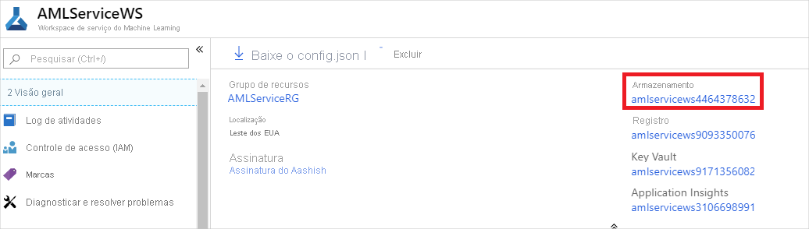
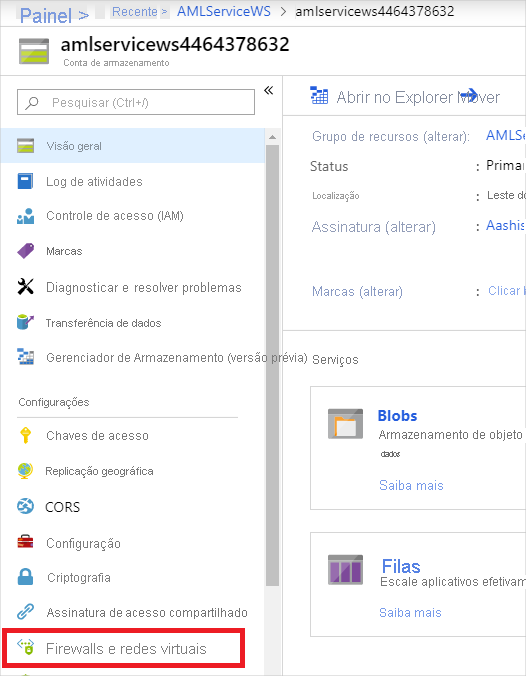
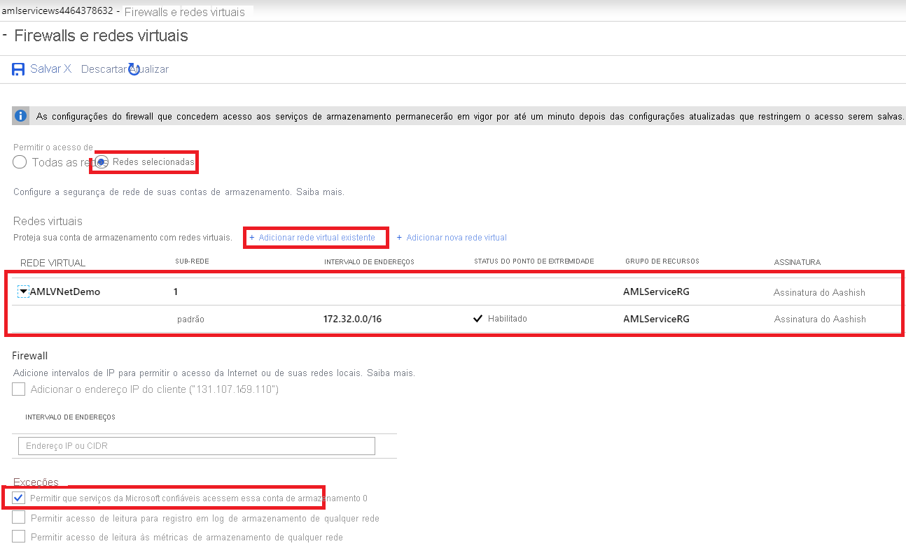
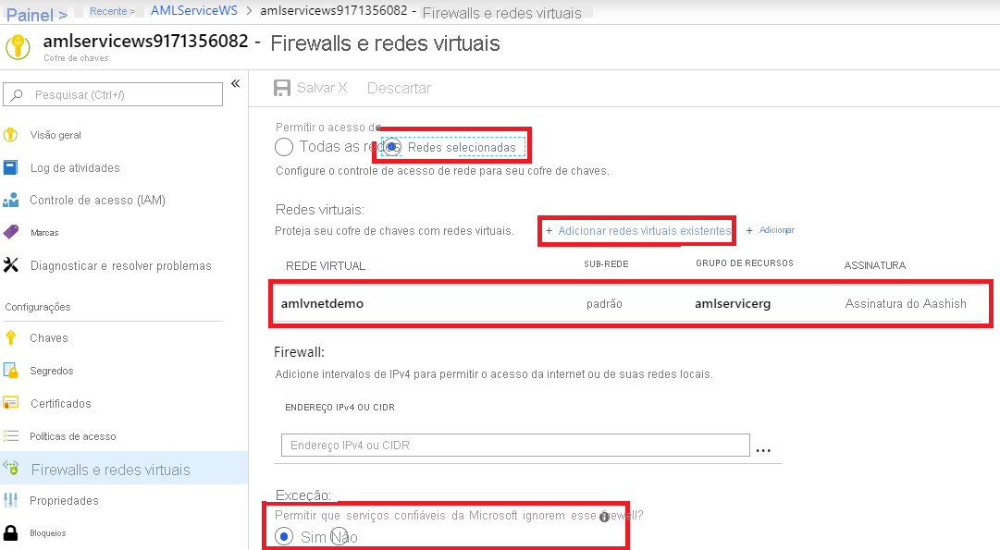

# <a name="secure-an-azure-machine-learning-workspace-with-virtual-networks"></a>Proteger um espaço de trabalho Azure Machine Learning com redes virtuais

Neste artigo, você aprenderá a proteger um espaço de trabalho Azure Machine Learning e seus recursos associados em uma rede virtual.

Este artigo é a parte dois de uma série de cinco partes que orienta você pela proteção de um fluxo de trabalho Azure Machine Learning. É altamente recomendável que você leia a [parte um: visão geral da VNet](how-to-network-security-overview.md) para entender a arquitetura geral primeiro. 

Consulte os outros artigos desta série:

[1. visão geral da VNet](how-to-network-security-overview.md)  >  **2. Proteja o espaço de trabalho**  >  [3. Proteja o ambiente de treinamento](how-to-secure-training-vnet.md)  >  [4. Proteja o ambiente do inferência](how-to-secure-inferencing-vnet.md)  >  [5. Habilitar a funcionalidade do estúdio](how-to-enable-studio-virtual-network.md)

Neste artigo, você aprenderá a habilitar os seguintes recursos de espaços de trabalho em uma rede virtual:
> [!div class="checklist"]
> - Workspace do Azure Machine Learning
> - Contas de armazenamento do Azure
> - Azure Machine Learning de armazenamentos e conjuntos de itens
> - Azure Key Vault
> - Registro de Contêiner do Azure

## <a name="prerequisites"></a>Pré-requisitos

+ Leia o artigo [visão geral de segurança de rede](how-to-network-security-overview.md) para entender cenários comuns de rede virtual e a arquitetura de rede virtual geral.

+ Uma rede virtual e sub-rede existentes para usar com seus recursos de computação.

+ Para implantar recursos em uma rede virtual ou sub-rede, sua conta de usuário deve ter permissões para as seguintes ações no controle de acesso baseado em função do Azure (RBAC do Azure):

    - "Microsoft. Network/virtualNetworks/Join/Action" no recurso de rede virtual.
    - "Microsoft. Network/virtualNetworks/sub-rede/junção/ação" no recurso de sub-rede.

    Para obter mais informações sobre o RBAC do Azure com rede, consulte [funções internas de rede](../role-based-access-control/built-in-roles.md#networking)


## <a name="secure-the-workspace-with-private-endpoint"></a>Proteger o espaço de trabalho com o ponto de extremidade privado

O link privado do Azure permite que você se conecte ao seu espaço de trabalho usando um ponto de extremidade privado. O ponto de extremidade privado é um conjunto de endereços IP privados na sua rede virtual. Você pode, então, limitar o acesso ao seu espaço de trabalho para ocorrer somente nos endereços IP privados. O link privado ajuda a reduzir o risco de vazamento de dados.

Para obter mais informações sobre a configuração de um espaço de trabalho de link privado, consulte [como configurar o link privado](how-to-configure-private-link.md).

> [!Warning]
> Proteger um espaço de trabalho com pontos de extremidade privados não garante a segurança de ponta a ponta por si só. Você deve seguir as etapas no restante deste artigo e a série de VNet para proteger os componentes individuais da sua solução.

## <a name="secure-azure-storage-accounts-with-service-endpoints"></a>Proteger contas de armazenamento do Azure com pontos de extremidade de serviço

O Azure Machine Learning dá suporte a contas de armazenamento configuradas para usar pontos de extremidade de serviço ou pontos de extremidade privados. Nesta seção, você aprenderá a proteger uma conta de armazenamento do Azure usando pontos de extremidade de serviço. Para pontos de extremidade privados, consulte a próxima seção.

Para usar uma conta de armazenamento do Azure para o workspace em uma rede virtual, siga as seguintes etapas:

1. Na portal do Azure, vá para o serviço de armazenamento que você deseja usar em seu espaço de trabalho.

   [](./media/how-to-enable-virtual-network/workspace-storage.png#lightbox)

1. Na página conta de serviço de armazenamento, selecione __rede__.

   

1. Na guia __firewalls e redes virtuais__ , execute as seguintes ações:
    1. Selecione __Redes selecionadas__.
    1. Em __Redes virtuais__, selecione o link __Adicionar rede virtual existente__. Essa ação adiciona a rede virtual onde sua computação reside (consulte a etapa 1).

        > [!IMPORTANT]
        > A conta de armazenamento deve estar na mesma rede virtual e sub-rede que as instâncias ou clusters de computação usados para treinamento ou inferência.

    1. Marque a caixa de seleção __Permitir que serviços confiáveis da Microsoft acessem esta conta de armazenamento__. Essa alteração não dá acesso a todos os serviços do Azure à sua conta de armazenamento.
    
        * Os recursos de alguns serviços, **registrados em sua assinatura**, podem acessar a conta de armazenamento **na mesma assinatura** para operações de seleção. Por exemplo, gravando logs ou criando backups.
        * Os recursos de alguns serviços podem receber acesso explícito à sua conta de armazenamento __atribuindo uma função do Azure__ à sua identidade gerenciada atribuída pelo sistema.

        Para saber mais, consulte [Configurar Redes Virtuais e Firewalls de Armazenamento do Azure](../storage/common/storage-network-security.md#trusted-microsoft-services).

    > [!IMPORTANT]
    > Ao trabalhar com o SDK do Azure Machine Learning, seu ambiente de desenvolvimento deve ter a capacidade de se conectar à Conta de Armazenamento do Azure. O firewall deve permitir o acesso do endereço IP do ambiente de desenvolvimento quando a conta de armazenamento está dentro de uma rede virtual.
    >
    > Para habilitar o acesso à conta de armazenamento, acesse __Firewalls e redes virtuais__ para a conta de armazenamento *de um navegador da Web no cliente de desenvolvimento*. Em seguida, use a caixa de seleção __Adicionar endereço IP do seu cliente__ para adicionar o endereço IP do cliente ao __INTERVALO DE ENDEREÇOS__. Você também pode usar o campo __INTERVALO DE ENDEREÇOS__ para inserir manualmente o endereço IP do ambiente de desenvolvimento. Após adicionar o endereço IP do cliente, ele poderá acessar a conta de armazenamento usando o SDK.

   [](./media/how-to-enable-virtual-network/storage-firewalls-and-virtual-networks-page.png#lightbox)

## <a name="secure-azure-storage-accounts-with-private-endpoints"></a>Proteger contas de armazenamento do Azure com pontos de extremidade privados

O Azure Machine Learning dá suporte a contas de armazenamento configuradas para usar pontos de extremidade de serviço ou pontos de extremidade privados. Se a conta de armazenamento usar pontos de extremidade privados, você deverá configurar dois pontos de extremidade privados para sua conta de armazenamento padrão:
1. Um ponto de extremidade privado com um subrecurso de destino de **blob** .
1. Um ponto de extremidade privado com um subrecurso de destino de **arquivo** (FileShare).


Para configurar um ponto de extremidade privado para uma conta de armazenamento que **não** seja o armazenamento padrão, selecione o tipo de **subrecurso de destino** que corresponde à conta de armazenamento que você deseja adicionar.

Para obter mais informações, consulte [usar pontos de extremidade privados para o armazenamento do Azure](../storage/common/storage-private-endpoints.md)

## <a name="secure-datastores-and-datasets"></a>Repositórios de armazenamento e conjuntos de os seguros

Nesta seção, você aprenderá a usar o repositório de armazenamento e os conjuntos de informações na experiência do SDK com uma rede virtual. Para obter mais informações sobre a experiência do estúdio, consulte [usar o Azure Machine Learning Studio em uma rede virtual](how-to-enable-studio-virtual-network.md).

Para acessar dados usando o SDK, você deve usar o método de autenticação exigido pelo serviço individual no qual os dados são armazenados. Por exemplo, se você registrar um repositório de armazenamento para acessar Azure Data Lake Store Gen2, ainda deverá usar uma entidade de serviço, conforme documentado em [conectar-se aos serviços de armazenamento do Azure](how-to-access-data.md#azure-data-lake-storage-generation-2).

### <a name="disable-data-validation"></a>Desabilitar validação de dados

Por padrão, Azure Machine Learning executa as verificações de validade e credencial de dados quando você tenta acessar dados usando o SDK. Se os dados estiverem atrás de uma rede virtual, Azure Machine Learning não poderá concluir essas verificações. Para ignorar essa verificação, você deve criar repositórios de armazenamento e conjuntos de valores que ignoram a validação.

### <a name="use-datastores"></a>Usar repositórios de armazenamento

 Azure Data Lake Store Gen1 e Azure Data Lake Store Gen2 ignoram a validação por padrão, portanto, nenhuma ação adicional é necessária. No entanto, para os seguintes serviços, você pode usar sintaxe semelhante para ignorar a validação do repositório de armazenamento:

- Armazenamento de Blobs do Azure
- FileShare do Azure
- PostgreSQL
- Banco de Dados SQL do Azure

O exemplo de código a seguir cria um novo armazenamento de BLOBs e conjuntos do Azure `skip_validation=True` .

```python
blob_datastore = Datastore.register_azure_blob_container(workspace=ws,  

                                                         datastore_name=blob_datastore_name,  

                                                         container_name=container_name,  

                                                         account_name=account_name, 

                                                         account_key=account_key, 

                                                         skip_validation=True ) // Set skip_validation to true
```

### <a name="use-datasets"></a>Usar conjuntos de os

A sintaxe para ignorar a validação de DataSet é semelhante para os seguintes tipos de conjunto de conjuntos:
- Arquivo delimitado
- JSON 
- Parquet
- SQL
- Arquivo

O código a seguir cria um novo conjunto de valores e conjuntos de JSON `validate=False` .

```python
json_ds = Dataset.Tabular.from_json_lines_files(path=datastore_paths, 

validate=False) 

```

## <a name="secure-azure-key-vault"></a>Azure Key Vault seguro

Azure Machine Learning usa uma instância de Key Vault associada para armazenar as seguintes credenciais:
* A cadeia de conexão da conta de armazenamento associada
* Senhas para instâncias do Repositório do Contêiner do Azure
* Cadeias de conexão para armazenamento de dados

Para usar os recursos de experimentação do Azure Machine Learning com Azure Key Vault atrás de uma rede virtual, siga as seguintes etapas:

1. Vá para o Key Vault associado ao espaço de trabalho.

1. Na página __Key Vault__ , no painel esquerdo, selecione __rede__.

1. Na guia __firewalls e redes virtuais__ , execute as seguintes ações:
    1. Em __permitir acesso de__, selecione __ponto de extremidade privado e redes selecionadas__.
    1. Em __Redes virtuais__, selecione __Adicionar redes virtuais existentes__ para adicionar a rede virtual onde reside a sua computação de experimentação.
    1. Em __Permitir que serviços confiáveis da Microsoft ignorem esse firewall__, selecione __Sim__.

   [](./media/how-to-enable-virtual-network/key-vault-firewalls-and-virtual-networks-page.png#lightbox)

## <a name="enable-azure-container-registry-acr"></a>Habilitar o ACR (registro de contêiner do Azure)

Para usar o registro de contêiner do Azure dentro de uma rede virtual, você deve atender aos seguintes requisitos:

* O registro de contêiner do Azure deve ser uma versão Premium. Para obter mais informações sobre atualização, consulte [Como alterar SKUs](../container-registry/container-registry-skus.md#changing-tiers).

* Seu Registro de Contêiner do Azure deve estar na mesma rede virtual e sub-rede que a conta de armazenamento e os destinos de computação usados para treinamento ou inferência.

* Seu workspace do Azure Machine Learning deve conter um [cluster de cálculo do Azure Machine Learning](how-to-create-attach-compute-cluster.md).

    Quando o ACR está atrás de uma rede virtual, o Azure Machine Learning não pode usá-lo para criar imagens do Docker diretamente. Em vez disso, o cluster de cálculo é usado para compilar as imagens.

    > [!IMPORTANT]
    > O cluster de computação usado para criar imagens do Docker precisa ser capaz de acessar os repositórios de pacote que são usados para treinar e implantar seus modelos. Talvez seja necessário adicionar regras de segurança de rede que permitam o acesso ao repositórios público, [usar pacotes python privados](how-to-use-private-python-packages.md)ou usar [imagens personalizadas do Docker](how-to-train-with-custom-image.md) que já incluem os pacotes.

Depois que esses requisitos forem atendidos, use as etapas a seguir para habilitar o registro de contêiner do Azure.

> [!TIP]
> Se você não usou um registro de contêiner do Azure existente ao criar o espaço de trabalho, talvez ele não exista. Por padrão, o espaço de trabalho não criará uma instância de ACR até que ela precise de uma. Para forçar a criação de uma, treine ou implante um modelo usando seu espaço de trabalho antes de usar as etapas nesta seção.

1. Localize o nome do registro de contêiner do Azure para seu espaço de trabalho, usando um dos seguintes métodos:

    __Azure portal__

    Na seção de visão geral do seu workspace, o valor do __Registro__ vincula-se ao Registro de Contêiner do Azure.

    :::image type="content" source="./media/how-to-enable-virtual-network/azure-machine-learning-container-registry.png" alt-text="Registro de Contêiner do Azure para o workspace" border="true":::

    __CLI do Azure__

    Se você tiver [instalado a extensão do Machine Learning para CLI do Azure](reference-azure-machine-learning-cli.md), poderá usar o comando `az ml workspace show` para mostrar as informações do workspace.

    ```azurecli-interactive
    az ml workspace show -w yourworkspacename -g resourcegroupname --query 'containerRegistry'
    ```

    Esse comando retorna um valor semelhante a `"/subscriptions/{GUID}/resourceGroups/{resourcegroupname}/providers/Microsoft.ContainerRegistry/registries/{ACRname}"`. A última parte da cadeia de caracteres é o nome do Registro de Contêiner do Azure para o workspace.

1. Limite o acesso à sua rede virtual usando as etapas em [Configurar o acesso à rede para o registro](../container-registry/container-registry-vnet.md#configure-network-access-for-registry). Ao adicionar a rede virtual, selecione a rede virtual e a sub-rede para seus recursos do Azure Machine Learning.

1. Configure o ACR para o espaço de trabalho para [permitir o acesso por serviços confiáveis](../container-registry/allow-access-trusted-services.md).

1. Use o SDK do Python do Azure Machine Learning para configurar um cluster de cálculo para compilar imagens do Docker. O seguinte trecho de código demonstra como fazer isso:

    ```python
    from azureml.core import Workspace
    # Load workspace from an existing config file
    ws = Workspace.from_config()
    # Update the workspace to use an existing compute cluster
    ws.update(image_build_compute = 'mycomputecluster')
    # To switch back to using ACR to build (if ACR is not in the VNet):
    # ws.update(image_build_compute = None)
    ```

    > [!IMPORTANT]
    > A conta de armazenamento, o cluster de cálculo e o Registro de Contêiner do Azure devem estar todos na mesma sub-rede da rede virtual.
    
    Para obter mais informações, consulte a referência do método [update()](/python/api/azureml-core/azureml.core.workspace.workspace#update-friendly-name-none--description-none--tags-none--image-build-compute-none--enable-data-actions-none-).

## <a name="next-steps"></a>Próximas etapas

Este artigo é a parte dois de uma série de redes virtuais de cinco partes. Consulte o restante dos artigos para saber como proteger uma rede virtual:

* [Parte 1: visão geral da rede virtual](how-to-network-security-overview.md)
* [Parte 3: proteger o ambiente de treinamento](how-to-secure-training-vnet.md)
* [Parte 4: proteger o ambiente inferência](how-to-secure-inferencing-vnet.md)
* [Parte 5: habilitar a funcionalidade do estúdio](how-to-enable-studio-virtual-network.md)

Consulte também o artigo sobre como usar o [DNS personalizado](how-to-custom-dns.md) para a resolução de nomes.