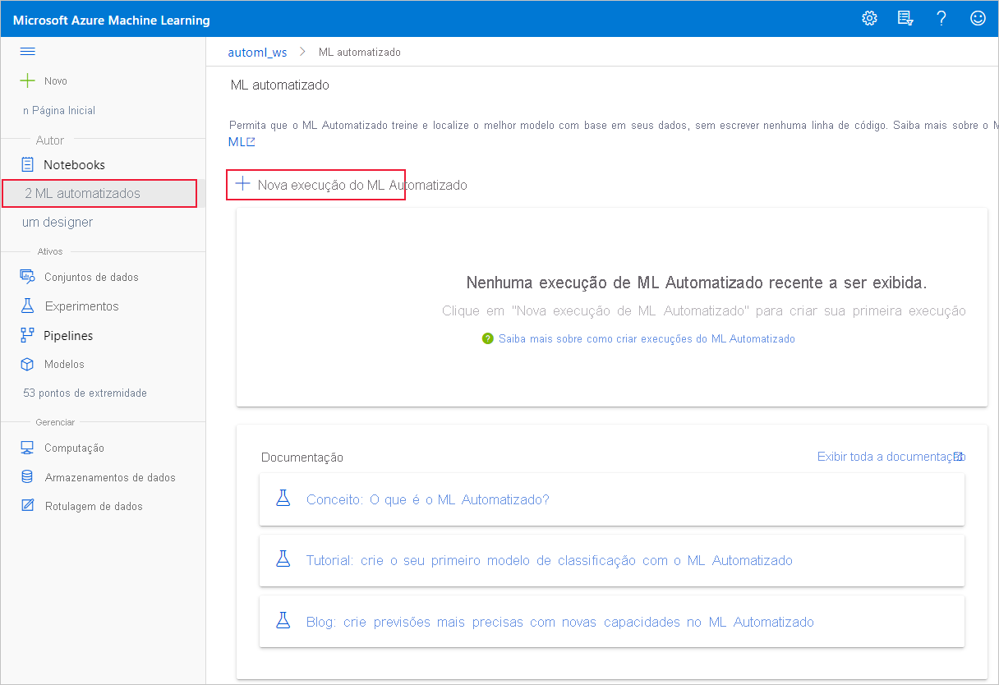

# Criar, revisar e implantar modelos de machine learning automatizado com o Azure Machine Learning

Neste artigo, você aprenderá a criar, explorar e implantar modelos de aprendizado de máquina automatizados sem uma única linha de código no Azure Machine Learning Studio.

O machine learning automatizado é um processo no qual o melhor algoritmo de machine learning a ser usado para seus dados específicos é selecionado para você. Esse processo permite que você gere modelos de machine learning rapidamente. [Saiba mais sobre o machine learning automatizado](concept-automated-ml.md).
 
Para obter um exemplo de ponta a ponta, experimente o [tutorial para criar um modelo de classificação com a interface do ML automatizado do Azure Machine Learning](tutorial-first-experiment-automated-ml.md). 

Para uma experiência baseada em códigos Python, [configure seus experimentos de machine Learning automatizado](how-to-configure-auto-train.md) com o SDK do Azure Machine Learning.

## Pré-requisitos

* Uma assinatura do Azure. Caso não tenha uma assinatura do Azure, crie uma conta gratuita antes de começar. Experimente hoje mesmo a [versão gratuita ou paga do Azure Machine Learning](https://aka.ms/AMLFree).

* Um Workspace do Azure Machine Learning. Confira [Criar um Workspace do Azure Machine Learning](how-to-manage-workspace.md). 

## Introdução

1. Entre no Azure Machine Learning em https://ml.azure.com. 

1. Selecione sua assinatura e seu espaço de trabalho. 

1. Navegue até o painel esquerdo. Selecione **ML Automatizado** na seção **Criar**.

 Caso essa seja a primeira vez que você faz experimentos, você verá uma lista vazia e links para a documentação. 

Caso contrário, você verá uma lista das suas experiências recentes de machine learning automatizado, incluindo aquelas criadas com o SDK. 

## Criar e executar o experimento

1. Selecione **+ Nova execução de ML automatizado** e preencha o formulário.

1. Selecione um conjunto de dados no seu contêiner de armazenamento ou crie um novo. Os conjuntos de dados podem ser criados a partir de arquivos locais, URLs da Web, armazenamento de dados ou Azure Open Datasets. Saiba mais sobre a [criação do conjunto](how-to-create-register-datasets.md)de informações.  

    >[!Important]
    > Requisitos para dados de treinamento:
    >* Os dados devem estar em formato de tabela.
    >* O valor que você quer prever (coluna de destino) deve estar presente nos dados.

    1. Para criar um novo conjunto de um de um arquivo em seu computador local, selecione **+ criar conjunto** de um e, em seguida, selecione **do arquivo local**. 

    1. No formulário **informações básicas** , dê um nome exclusivo ao seu conjunto de dado e forneça uma descrição opcional. 

    1. Selecione **Avançar** para abrir o **Formulário de armazenamento de dados e de seleção de arquivos**. Nesse formulário, você seleciona onde quer carregar seu conjunto de dados, o contêiner de armazenamento padrão que é criado automaticamente com seu espaço de trabalho, ou escolhe um contêiner de armazenamento que deseja usar para o experimento. 
    
        1. Se seus dados estiverem atrás de uma rede virtual, você precisará habilitar a função **ignorar a validação** para garantir que o espaço de trabalho possa acessar seus dados. Para obter mais informações, consulte [usar o Azure Machine Learning Studio em uma rede virtual do Azure](how-to-enable-studio-virtual-network.md). 
    
    1. Selecione **procurar** para carregar o arquivo de dados para o seu DataSet. 

    1. Revise a precisão do formulário de **Configurações e versão prévia**. O formulário é preenchido de forma inteligente com base no tipo de arquivo. 

        Campo| Descrição
        ----|----
        Formato de arquivo| Define o layout e o tipo de dados armazenados em um arquivo.
        Delimitador| Um ou mais caracteres para especificar o limite entre regiões separadas e independentes em texto sem formatação ou outros fluxos de dados.
        Codificação| Identifica qual tabela de esquema de bit para caractere usar para ler seu conjunto de dados.
        Cabeçalhos da coluna| Indica como os cabeçalhos do conjunto de dados, se houver, serão tratados.
        Ignorar linhas | Indica quantas linhas, se houver, serão ignoradas no conjunto de registros.
    
        Selecione **Avançar**.

    1. O formulário **Esquema** é preenchido de forma inteligente com base nas seleções feitas no formulário **Configurações e visualização**. Aqui, configure o tipo de dados para cada coluna, revise os nomes das colunas e selecione quais delas **não incluir** no seu experimento. 
            
        Selecione **Avançar**.

    1. O formulário **Confirmar detalhes** é um resumo das informações previamente preenchidas nos formulários **Informações básicas** e **Configurações e versão prévia**. Você também tem a opção de criar um perfil de dados para o seu conjunto de dados usando uma computação de criação de perfil habilitada. Saiba mais sobre a [criação de perfil de dados](how-to-connect-data-ui.md#profile).

        Selecione **Avançar**.
1. Selecione seu conjunto de dados recém-criado assim que ele aparecer. Você também pode exibir uma versão prévia do conjunto de dados e das estatísticas de amostra. 

1. No formulário **configurar execução** , selecione **criar novo** e insira **tutorial-automl-implantar** para o nome do experimento.

1. Selecione uma coluna de destino, a qual representa a coluna na qual você gostaria de fazer previsões.

1. Selecione uma computação para o trabalho de treinamento e de criação de perfis de dados. Haverá uma lista suspensa contendo suas computações existentes. Para criar uma nova computação, siga as instruções da Etapa 7.

1. Selecione **Criar uma nova computação** para configurar o contexto de computação desse experimento.

    Campo|Descrição
    ---|---
    Nome da computação| Insira um nome exclusivo que identifique o contexto da computação.
    Prioridade da máquina virtual| As máquinas virtuais de baixa prioridade são mais baratas, mas não garantem os nós de computação. 
    Tipo de máquina virtual| Selecione CPU ou GPU para o tipo de máquina virtual.
    Tamanho da máquina virtual| Selecione o tamanho da máquina virtual da computação.
    Mín./máx. de nós| Para analisar os dados, é necessário especificar um ou mais nós. Insira o número máximo de nós da sua computação. Uma Computação do AML tem 6 nós como padrão.
    Configurações avançadas | Essas configurações permitem que você configure uma conta de usuário e uma rede virtual existente para seu experimento. 
    
    Selecione **Criar**. A criação da nova computação pode levar alguns minutos.

    >[!NOTE]
    > O nome da sua computação indicará se a computação que você selecionar/criar é *habilitada para criação de perfil*. (Consulte a seção [criação de perfil de dados](how-to-connect-data-ui.md#profile) para obter mais detalhes.)

    Selecione **Avançar**.

1. No formulário **Tipo de tarefa e configurações**, selecione o tipo de tarefa: classificação, regressão ou previsão. Consulte [tipos de tarefas com suporte](concept-automated-ml.md#when-to-use-automl-classify-regression--forecast) para obter mais informações.

    1. Para **classificação**, você também pode habilitar o aprendizado profundo.
    
        Se o aprendizado profundo estiver habilitado, a validação será limitada à _divisão de train_validation_. [Saiba mais sobre as opções de validação](how-to-configure-cross-validation-data-splits.md).

    1. Para **previsão** , você pode, 
    
        1. Habilite o aprendizado profundo.
    
        1. Selecionar *coluna de tempo*: esta coluna contém os dados de hora a serem usados.

        1. Selecione *previsão horizonte*: indica quantas unidades de tempo (minutos/horas/dias/semanas/meses/anos) o modelo será capaz de prever para o futuro. Quanto mais o modelo for usado para fazer previsões do futuro, menos preciso ele será. [Saiba mais sobre previsão e horizonte de previsão](how-to-auto-train-forecast.md).

1. (Opcional) Exibir definições de configuração adicionais: configurações adicionais que você pode usar para controlar melhor o trabalho de treinamento. Caso contrário, os padrões são aplicados com base na seleção e nos dados de experimento. 

    Configurações adicionais|Descrição
    ------|------
    Métrica principal| Métrica principal usada para a pontuação do seu modelo. [Saiba mais sobre as métricas do modelo](how-to-configure-auto-train.md#primary-metric).
    Explicar o melhor modelo | Selecione para habilitar ou desabilitar o para mostrar explicações para o melhor modelo recomendado.   Essa funcionalidade não está disponível atualmente para [determinados algoritmos de previsão](how-to-machine-learning-interpretability-automl.md#interpretability-during-training-for-the-best-model). 
    Algoritmo bloqueado| Selecione os algoritmos que você deseja excluir do trabalho de treinamento.    A permissão de algoritmos só está disponível para [experimentos do SDK](how-to-configure-auto-train.md#supported-models).   Consulte os [modelos com suporte para cada tipo de tarefa](/python/api/azureml-automl-core/azureml.automl.core.shared.constants.supportedmodels?preserve-view=true&view=azure-ml-py).
    Critério de saída| Quando qualquer um desses critérios for atendido, o trabalho de treinamento é interrompido.   *Tempo do trabalho de treinamento (horas)* : o tempo permitido de execução do trabalho de treinamento.   *Limite de pontuação da métrica*:  pontuação mínima da métrica para todos os pipelines. Isso garante que, caso você tenha uma métrica de destino definida e que deseje alcançar, não gastará mais tempo no trabalho de treinamento do que o necessário.
    Validação| Selecione uma das opções de validação cruzada para ser usada no trabalho de treinamento.   [Saiba mais sobre a validação cruzada](how-to-configure-cross-validation-data-splits.md#prerequisites).   A previsão só dá suporte à validação cruzada de k-fold.
    Simultaneidade| *Máximo de iterações simultâneas*: número máximo de pipelines (iterações) a serem testados no trabalho de treinamento. O trabalho não será executado mais vezes do que o número de iterações especificado. Saiba mais sobre como o ML automatizado executa [várias execuções filhas em clusters](how-to-configure-auto-train.md#multiple-child-runs-on-clusters).

1. Adicional Exibir configurações de personalização: se você optar por habilitar o **personalização automático** no formulário de **definições de configuração adicional, as** técnicas padrão do personalização serão aplicadas. Em **exibir configurações de personalização** , você pode alterar esses padrões e personalizá-los adequadamente. Saiba como [Personalizar o featurizations](#customize-featurization). 

    

## Personalizar o personalização

No formulário **personalização** , você pode habilitar/desabilitar o personalização automático e personalizar as configurações de personalização automática para o experimento. Para abrir esse formulário, consulte a etapa 10 na seção [criar e executar experimento](#create-and-run-experiment) . 

A tabela a seguir resume as personalizações disponíveis no momento por meio do estúdio. 

Coluna| Personalização
---|---
Incluído | Especifica quais colunas incluir para treinamento.
Tipo de recurso| Altere o tipo de valor da coluna selecionada.
Imputar com| Selecione o valor com o qual imputar valores ausentes em seus dados.

## Executar o experimento e exibir os resultados

Selecione **Concluir**, para executar o experimento. O processo de preparação do experimento pode levar até 10 minutos. Os trabalhos de treinamento podem levar mais 2 a 3 minutos para que cada pipeline termine a execução.

> [!NOTE]
> Os algoritmos Automated ML empregam uma aleatoriedade inerente que pode causar uma pequena variação em uma pontuação de métrica final do modelo recomendado, como a precisão. O ML automatizado também realiza operações em dados como o Train-Test Split, a divisão de treinamento ou a validação cruzada quando necessário. Portanto, se você executar um experimento com as mesmas definições de configuração e métrica primária várias vezes, provavelmente verá variação em cada experimento a pontuação de métricas finais devido a esses fatores. 

### Exibir detalhes do experimento

A tela **Executar detalhes** é aberta na guia **Detalhes**. Essa tela mostra um resumo da execução do experimento, incluindo uma barra de status na parte superior, ao lado do número de execução. 

A guia **Modelos** contém uma lista dos modelos criados ordenados pela pontuação da métrica. Por padrão, o modelo com a pontuação mais alta de acordo com a métrica escolhida é exibido no início da lista. Como o trabalho de treinamento testa mais modelos, eles são adicionados à lista. Use isso para obter uma comparação rápida das métricas dos modelos produzidos até agora.

### Exibir detalhes da execução do treinamento

Faça uma busca detalhada em qualquer um dos modelos concluídos para ver os detalhes da execução de treinamento, como um resumo do modelo na guia **modelo** ou nos gráficos de métrica de desempenho na guia **métricas** . [saiba mais sobre gráficos](how-to-understand-automated-ml.md).

## Implantar o seu modelo

Assim que você tiver o melhor modelo em mãos, é hora de implantá-lo como um serviço Web para prever novos dados.

O ML automatizado ajuda a implantar o modelo sem escrever códigos:

1. Você tem algumas opções de implantação: 

    + Opção 1: implante o melhor modelo, de acordo com os critérios de métrica que você definiu. 
        1. Após a conclusão do experimento, navegue até a página de execução pai selecionando **executar 1** na parte superior da tela. 
        1.  Selecione o modelo listado na seção de **Resumo do melhor modelo** . 
        1. Selecione **implantar** na parte superior esquerda da janela. 

    + Opção 2: para implantar uma iteração de modelo específica deste experimento.
        1. Selecione o modelo desejado na guia **Modelos**
        1. Selecione **implantar** na parte superior esquerda da janela.

1. Preencha o painel **Implantar um modelo**.

    Campo| Valor
    ----|----
    Nome| Insira um nome exclusivo para sua implantação.
    Descrição| Insira uma descrição para identificar melhor a finalidade da implantação.
    Tipo de computação| Selecione o tipo de ponto de extremidade que você deseja implantar: *Serviço de Kubernetes do Azure (AKS)* ou *Instância de Contêiner do Azure (ACI)* .
    Nome da computação| *Aplica-se somente ao AKS:* selecione o nome do cluster AKS no qual você deseja fazer a implantação.
    Habilitar autenticação | Selecione para permitir a autenticação baseada em token ou em chave.
    Usar ativos da implantação personalizada| Habilite esse recurso caso queira carregar seu próprio script de pontuação e o arquivo de ambiente. [Saiba mais sobre scripts de pontuação](how-to-deploy-and-where.md).

    >[!Important]
    > Os nomes de arquivo devem ter menos de 32 caracteres e devem começar e terminar com caracteres alfanuméricos. Eles podem conter traços, sublinhados, pontos e caracteres alfanuméricos nas partes do meio. Espaços não são permitidos.

    O menu *Avançado* oferece recursos de implantação padrão, como [coleta de dados](how-to-enable-app-insights.md) e configurações de utilização de recursos. Caso queira substituir esses padrões, você deve fazê-lo nesse menu.

1. Selecione **Implantar**. A implantação pode levar cerca de 20 minutos para ser concluída.
    Depois que a implantação for iniciada, a guia **Resumo do modelo** será exibida. Consulte o progresso da implantação na seção **Status de implantação**. 

Agora você tem um serviço Web operacional para gerar previsões. Você pode testar as previsões por meio de consultas ao serviço de [Suporte ao Azure Machine Learning interno do Power BI](/power-bi/connect-data/service-aml-integrate?context=azure%2fmachine-learning%2fcontext%2fml-context).

## Próximas etapas

* [Saiba como consumir um serviço Web](how-to-consume-web-service.md).
* [Entender os resultados de machine learning automatizado](how-to-understand-automated-ml.md).
* [Saiba mais sobre o machine learning automatizado](concept-automated-ml.md) e o Azure Machine Learning.