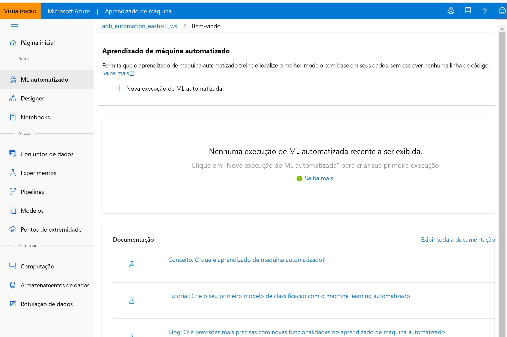

# O que é o Azure Machine Learning Studio?

Neste artigo, você saberá mais sobre o estúdio do Azure Machine Learning, o portal da Web para desenvolvedores cientistas de dados no [Azure Machine Learning](overview-what-is-azure-ml.md). O estúdio combina experiências sem código e code first para obter uma plataforma de ciência de dados inclusiva.

Neste artigo, você aprende:
>[!div class="checklist"]
> - Como [criar projetos de machine learning](#author-machine-learning-projects) no estúdio.
> - Como [gerenciar ativos e recursos](#manage-assets-and-resources) no estúdio.
> - A diferença entre o [Estúdio do Azure Machine Learning e o ML Studio (clássico)](#ml-studio-classic-vs-azure-machine-learning-studio).

É recomendável que você use o navegador mais atualizado compatível com o sistema operacional. Há suporte para os seguintes navegadores:
  * Microsoft Edge (a versão mais recente, não o Microsoft Edge herdado)
  * Safari (última versão, apenas Mac)
  * Chrome (última versão)
  * Firefox (última versão)

## Criar projetos de machine learning

O estúdio oferece várias experiências de criação, dependendo do tipo de projeto e do nível de experiência do usuário.

+ **Notebooks**

  Escreva e execute seu código em [servidores gerenciados do Jupyter Notebook](how-to-run-jupyter-notebooks.md) que estão diretamente integrados no estúdio. 

:::image type="content" source="media/overview-what-is-azure-ml-studio/notebooks.gif" alt-text="Captura de tela: gravar e executar o código em um notebook":::

+ **Designer do Azure Machine Learning**

  Use o designer para treinar e implantar modelos de machine learning sem nenhuma codificação. Arraste e solte conjuntos de dados e módulos para criar pipelines de ML. Experimente o [tutorial do designer](tutorial-designer-automobile-price-train-score.md).

    

+ **Interface do usuário de machine learning automatizado**

  Saiba como criar [experimentos de ML automatizado](tutorial-first-experiment-automated-ml.md) com uma interface fácil de usar. 

  

+ **Rotulagem de dados**

    Use a [rotulagem de dados do Azure Machine Learning](how-to-create-labeling-projects.md) para coordenar com eficiência os projetos de rotulagem de dados.

## Gerenciar ativos e recursos

Gerencie os seus ativos do machine learning diretamente no seu navegador. Os ativos são compartilhados no mesmo workspace entre o SDK e o estúdio para uma experiência simplificada. Use o estúdio para gerenciar:

- Modelos
- Conjunto de dados
- Armazenamentos de dados
- Recursos de computação
- Notebooks
- Testes
- Logs de execução
- Pipelines 
- Pontos de extremidade do pipeline

Mesmo que você seja um desenvolvedor experiente, o estúdio pode simplificar a maneira como você gerencia os recursos do workspace.

## ML Studio (clássico) versus estúdio do Azure Machine Learning

Lançado em 2015, o **ML Studio (clássico)** foi nosso primeiro construtor de machine learning do tipo "arrastar e soltar". 

O **ML Studio (clássico)** é um serviço autônomo que oferece apenas uma experiência visual. O Studio (clássico) não interopera com o Azure Machine Learning.

O **Azure Machine Learning** é um serviço separado e modernizado que fornece uma plataforma de ciência de dados completa. Ele dá suporte a experiências com código baixo e code first.

**O estúdio do Azure Machine Learning** é um portal da Web *no* Azure Machine Learning que contém opções de código baixo e sem código para criação de projetos e gerenciamento de ativos. 

Recomendamos que novos usuários escolham o **Azure Machine Learning**, em vez do ML Studio (clássico), para o intervalo mais recente de ferramentas de ciência de dados. Se você for um usuário existente do ML Studio (clássico), considere [migrar para Azure Machine Learning](classic/migrate-overview.md).

Estes são alguns dos benefícios de mudar para o Azure Machine Learning:

- Clusters de cálculo escalonáveis para treinamento em grande escala.
- Segurança e governança corporativas.
- Interoperável com ferramentas de software livre populares.
- MLOps de ponta a ponta.

### Comparação de recursos

[!INCLUDE [aml-compare-classic](../../includes/machine-learning-compare-classic-aml.md)]

## Solução de problemas

* **Itens da interface do usuário ausentes no estúdio**: o controle de acesso baseado em função do Azure pode ser usado para restringir ações que podem ser executadas com o Azure Machine Learning. Essas restrições podem impedir que itens da interface do usuário apareçam no Estúdio do Azure Machine Learning. Por exemplo, caso seja atribuída a você uma função que não pode criar uma instância de computação, a opção para criá-la não será exibida no estúdio. Para obter mais informações, confira [Gerenciar usuários e funções](how-to-assign-roles.md).

## Próximas etapas

Visite o [estúdio](https://ml.azure.com) ou explore as diferentes opções de criação com estes tutoriais:  

- + [Comece a usar seu próprio ambiente de desenvolvimento](tutorial-1st-experiment-sdk-setup-local.md)
  + [Use blocos de anotações do Jupyter em uma instância de computação para treinar e implantar modelos](tutorial-1st-experiment-sdk-setup.md)
  + [Usar o machine learning automatizado para treinar e implantar modelos](tutorial-first-experiment-automated-ml.md)  
  + [Usar o designer para treinar e implantar modelos](tutorial-designer-automobile-price-train-score.md)
  + [Usar o estúdio em uma rede virtual segura](how-to-enable-studio-virtual-network.md)