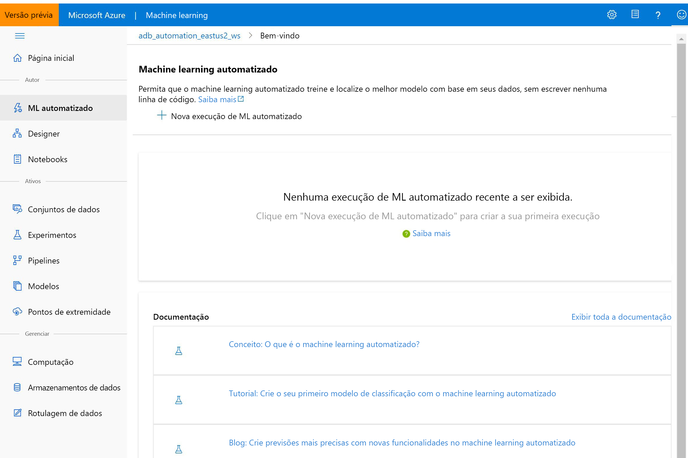

# O que é o Azure Machine Learning?

Neste artigo, você aprenderá sobre o Azure Machine Learning, um ambiente baseado em nuvem que pode ser usado para treinar, implantar, automatizar, gerenciar e rastrear modelos de ML. 

O Azure Machine Learning pode ser usado para qualquer tipo de aprendizado de máquina, desde ML clássico até aprendizado profundo, aprendizado supervisionado e não supervisionado. Se você preferir escrever código Python ou R ou opções de código zero/código baixo, como o [designer](ui-tutorial-automobile-price-train-score.md), você pode criar, treinar e rastrear modelos de aprendizado de máquina e aprendizado profundo altamente precisos em um workspace do Azure Machine Learning. 

Inicie o treinamento do seu computador local e expanda para a nuvem. 

O serviço também interopera com ferramentas open-source populares, como PyTorch, TensorFlow e scikit-learn.

> [!VIDEO https://channel9.msdn.com/Events/Connect/Microsoft-Connect--2018/D240/player]

> [!Tip]
> **Avaliação gratuita!**  Se você não tiver uma assinatura do Azure, crie uma conta gratuita antes de começar. Experimente hoje mesmo a [versão gratuita ou paga do Azure Machine Learning](https://aka.ms/AMLFree). Você recebe créditos para gastar em serviços do Azure. Depois que eles forem utilizados, você poderá manter a conta e usar os [serviços gratuitos do Azure](https://azure.microsoft.com/free/). Seu cartão de crédito nunca será cobrado, a menos que você altere explicitamente suas configurações, solicitando esse tipo de cobrança.

## O que aprendizado da máquina?

O Machine Learning é uma técnica da ciência de dados que permite que os computadores usem os dados existentes para prever tendências, resultados e comportamentos futuros. Usando o aprendizado de máquina, os computadores aprendem sem serem explicitamente programados.

As estimativas ou previsões de aprendizado de máquina podem tornar aplicativos e dispositivos mais inteligentes. Por exemplo, quando você faz compras online, o aprendizado de máquina ajuda a recomendar outros produtos que podem lhe agradar com base no que você já comprou. Ou, ao passar seu cartão de crédito, o aprendizado de máquina compara a transação com um banco de dados de transações e ajuda a detectar fraudes. E, quando o aspirador de pó robô aspira uma sala, o aprendizado de máquina ajuda a decidir se o trabalho está concluído.

## Ferramentas de Machine Learning ideais para cada tarefa 

O Azure Machine Learning fornece todas as ferramentas que desenvolvedores de ferramentas e cientistas de dados precisam para seus fluxos de trabalho de aprendizado de máquina, incluindo:
+ O [Azure Machine Learning Designer](ui-tutorial-automobile-price-train-score.md) (versão prévia): arraste e solte módulos para compilar seus experimentos e, depois, implante pipelines.

+ Notebooks Jupyter: use nossos [notebooks de exemplo](https://aka.ms/aml-notebooks) ou crie seus próprios notebooks para aproveitar nossas amostras de <a href="https://docs.microsoft.com/python/api/overview/azure/ml/intro?view=azure-ml-py" target="_blank">SDK para Python</a> em seu aprendizado de máquina. 

+ Scripts R ou notebooks nos quais você usa o <a href="https://azure.github.io/azureml-sdk-for-r/reference/index.html" target="_blank">SDK para R</a> para escrever seu próprio código ou usar os módulos do R no designer.

+ [Extensão do Visual Studio Code](how-to-vscode-tools.md)

+ [CLI de aprendizado de máquina](reference-azure-machine-learning-cli.md)

+ Estruturas open-source como PyTorch, TensorFlow e scikit-learn, entre muitas outras

Você pode até mesmo usar [MLflow para controlar as métricas e implantar modelos](how-to-use-mlflow.md) ou Kubeflow para [compilar pipelines de fluxo de trabalho de ponta a ponta](https://www.kubeflow.org/docs/azure/).

## Criar modelos de ML em Python ou R

Inicie o treinamento em seu computador local usando o <a href="https://docs.microsoft.com/python/api/overview/azure/ml/intro?view=azure-ml-py" target="_blank">SDK de Python</a> ou o <a href="https://azure.github.io/azureml-sdk-for-r/reference/index.html" target="_blank">SDK de R</a> do Azure Machine Learning. Em seguida, você pode expandir para a nuvem. 

Com muitos [destinos de computação](how-to-set-up-training-targets.md) disponíveis, como a Computação do Azure Machine Learning e o [Azure Databricks](/azure/azure-databricks/what-is-azure-databricks), além de [serviços avançados de ajuste de hiperparâmetro](how-to-tune-hyperparameters.md), você pode criar modelos melhores com mais rapidez usando o poder da nuvem.

Também é possível [automatizar o treinamento e o ajuste do modelo](tutorial-auto-train-models.md) usando o SDK.

## Criar modelos de ML com ferramentas sem código

Para treinamento e implantação sem código ou com pouco código, experimente:

+ **Azure Machine Learning Designer (versão prévia)**

  Use o designer para preparar dados, treinar, testar, implantar, gerenciar e rastrear modelos de aprendizado de máquina sem escrever nenhum código. Não há necessidade de programação; conecte visualmente os conjuntos de dados e módulos para construir seu modelo.   Experimente o [tutorial do designer](tutorial-designer-automobile-price-train-score.md).

  Saiba mais no [artigo de visão geral do Azure Machine Learning Designer](concept-designer.md). 

  

+ **Interface do usuário de machine learning automatizado**

  Como criar [experimentos de machine learning automatizado](tutorial-first-experiment-automated-ml.md) na interface fácil de usar. 

  

## MLOps: Gerenciamento de implantação e ciclo de vida
Quando você tem o modelo certo, é possível usá-lo facilmente em um serviço Web, em um dispositivo IoT ou do Power BI. Para obter mais informações, confira o artigo [Como e onde implantar](how-to-deploy-and-where.md).

Em seguida, você pode gerenciar seus modelos implantados usando o [SDK do Azure Machine Learning para Python](https://aka.ms/aml-sdk), o [Azure Machine Learning Studio](https://ml.azure.com) ou a [CLI de aprendizado de máquina](reference-azure-machine-learning-cli.md).

Esses modelos podem ser consumidos e retornar previsões em [tempo real](how-to-consume-web-service.md) ou [assincronamente](how-to-run-batch-predictions.md) em grandes quantidades de dados.

E com [pipelines de aprendizado de máquina](concept-ml-pipelines.md) avançados, é possível colaborar em cada etapa desde a preparação de dados, do treinamento do modelo e da avaliação, por meio da implantação. Os pipelines permitem:

* Automatizar o processo de aprendizado de máquina de ponta a ponta na nuvem
* Reutilizar os componentes e apenas executar as etapas novamente quando necessário
* Usar diferentes recursos de computação em cada etapa
* Executar tarefas de pontuação em lote

Se você quiser usar scripts para automatizar seu fluxo de trabalho de aprendizado de máquina, a [interface de linha de comando de aprendizado de máquina](reference-azure-machine-learning-cli.md) fornecerá ferramentas de linha de comando que executam tarefas comuns, como enviar uma execução de treinamento ou implantar um modelo.

Para começar a usar o Azure Machine Learning, confira [Próximas etapas](#next-steps).

## Edições Básico e Enterprise

O Azure Machine Learning oferece duas edições personalizadas para suas necessidades de aprendizado de máquina:
+ Básico (geralmente disponível)
+ Enterprise (versão prévia)

Essas edições determinam quais ferramentas de aprendizado de máquina estão disponíveis para desenvolvedores e cientistas de dados no workspace deles.   

Os workspaces do plano Básico permitem que você continue usando o Azure Machine Learning e pague apenas pelos recursos do Azure consumidos durante o processo de aprendizado de máquina. Os workspaces da edição Enterprise serão cobrados somente pelo consumo do Azure enquanto a edição estiver em versão prévia. Saiba mais sobre o que está disponível [ na visão geral e na página de preços](https://azure.microsoft.com/pricing/details/machine-learning/) do Azure Machine Learning. 

Você atribui a edição sempre que cria um workspace. E os workspaces já existentes foram convertidos para o plano Básico para você. O Básico inclui todos os recursos que já estavam disponíveis de modo geral a partir de outubro de 2019. Quaisquer experimentos nesses workspaces criados com os recursos da edição Enterprise continuarão disponíveis para você em somente leitura até que você atualize para a Enterprise. Saiba como [atualizar um workspace de Básico para Enterprise](how-to-manage-workspace.md#upgrade). 

Os clientes são responsáveis pelos custos relacionados a computação e a outros recursos do Azure durante esse período.

## Próximas etapas

- Crie seu primeiro experimento com seu método preferencial:
  + [Usar notebooks do Python para treinar e implantar modelos de Machine Learning](tutorial-1st-experiment-sdk-setup.md)
  + [Usar R Markdown para treinar e implantar modelos de Machine Learning](tutorial-1st-r-experiment.md) 
  + [Usar machine learning automatizado para treinar e implantar modelos de Machine Learning](  tutorial-first-experiment-automated-ml.md) 
  + [Usar os recursos de arrastar e soltar do designer para treinar e implantar](tutorial-designer-automobile-price-train-score.md) 
  + [Usar a interface de linha de comando de aprendizado de máquina para treinar e implantar um modelo](tutorial-train-deploy-model-cli.md)

- Saiba mais sobre [pipelines de aprendizado de máquina](/azure/machine-learning/service/concept-ml-pipelines) para compilar, otimizar e gerenciar cenários de aprendizado de máquina.

- Leia o artigo detalhado [Arquitetura e conceitos do Azure Machine Learning](concept-azure-machine-learning-architecture.md).
