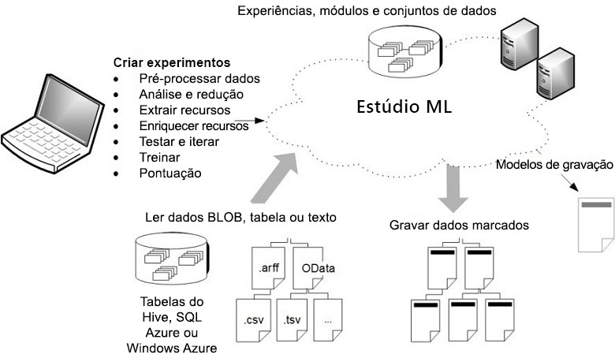

# O que é Machine Learning Studio (clássico)?

[!INCLUDE [Designer notice](../../../includes/designer-notice.md)]

O Microsoft Azure Machine Learning Studio (clássico) é uma ferramenta colaborativa do tipo "arrastar e soltar", que você pode usar para criar, testar e implantar soluções de análise preditiva em seus dados. O Azure Machine Learning Studio (clássico) publica modelos como serviços Web que podem ser facilmente consumidos por aplicativos personalizados ou ferramentas de BI como o Excel.

O Machine Learning Studio (clássico) é onde a ciência de dados, as análises preditivas, os recursos de nuvem e seus dados se encontram.

## O workspace interativo do Machine Learning Studio (clássico)
Para desenvolver um modelo de análise preditiva, normalmente você usa dados de uma ou mais fontes, transforma e os analisa por meio de várias funções estatísticas e de manipulação de dados, além de gerar um conjunto de resultados. Desenvolver um modelo como este é um processo iterativo. À medida que você modifica as diversas funções e seus parâmetros, seus resultados convergem até que você esteja satisfeito, com um modelo treinado e eficiente.

O Azure Machine Learning Studio (clássico) oferece um workspace visual e interativo para compilar, testar e iterar em um modelo de análise preditivo. Você arrasta e solta ***conjuntos de dados*** e ***módulos*** de análise em telas interativas conectando-as para formar um ***teste***, o qual você executa no Azure Machine Learning Studio (clássico). Para iterar em seu design de modelo, você edita o teste, salva uma cópia, se desejado, e executa-o novamente. Quando você estiver pronto, você poderá converter seu ***teste de treinamento*** em uma ***experiência preditiva*** e, em seguida, publicá-la como um ***serviço Web*** para que seu modelo possa ser acessado por outras pessoas.

Não há necessidade de programação, conecte visualmente os conjuntos de dados e módulos para construir seu modelo de análise preditivo.

## Qual é a diferença entre o Machine Learning Studio (clássico) e o Azure Machine Learning?

O[ Azure Machine Learning](../overview-what-is-azure-ml.md) fornece SDKs **-e-** uma interface visual (versão prévia) para preparar dados rapidamente e treinar e implantar modelos de machine learning. O designer oferece uma experiência do tipo "arrastar e soltar" semelhante para o Studio (clássico). No entanto, ao contrário da plataforma de computação proprietária do Studio, o designer (clássico) usa seus próprios recursos de computação e é totalmente integrada ao Azure Machine Learning.

Veja uma comparação rápida:

|| Machine Learning Studio (clássico) | Azure Machine Learning |
|---| --- | --- |
| Interface de "arrastar e soltar" | Sim | Sim - [Azure Machine Learning Designer (versão prévia)](../concept-designer.md) |
| Experimento | Escalável (limite de 10 GB para dados de treinamento) | Escala com destino de computação |
| Módulos para interface do tipo "arrastar e soltar" | Muitos | Conjunto inicial de [módulos populares](../algorithm-module-reference/module-reference.md)|
|Destinos de computação de treinamento| Destino de computação proprietário, apenas suporte à CPU| Dá suporte à computação do Azure Machine Learning, GPU ou CPU e VMs de notebook. ([Outros serviços de computação](../concept-compute-target.md#train) com suporte no SDK)|
|Inferência de destinos de computação| Formato do serviço Web proprietário, não personalizável |  AKS e Computação AML  ([Outros serviços de computação](../how-to-deploy-and-where.md) com suporte no SDK) |
| Pipeline de ML | Sem suporte | [Pipelines](../concept-ml-pipelines.md) com suporte |
| MLOps | Gerenciamento e implantação de modelos básicos | Implantação configurável - modelo e controle de versão e acompanhamento do pipeline |
| Formato do modelo | Formato proprietário, somente Studio (clássico) | Formato padrão dependendo do tipo de trabalho de treinamento |
|Treinamento de modelo automatizado e ajuste de hiperparâmetro | Não | Ainda não está no designer   ([Compatível com o SDK do Python e a página de aterrissagem do workspace](../concept-automated-ml.md)) | 

Experimente o designer com Tutorial[: Prever preço de automóvel com o designer](../tutorial-designer-automobile-price-train-score.md)

> [!NOTE]
> Os modelos criados no Studio (clássico) não podem ser implantados nem gerenciados pelo Azure Machine Learning. No entanto, os modelos criados e implantados no designer podem ser gerenciados por meio do Workspace do Azure Machine Learning.

## Baixe o diagrama de visão geral do Machine Learning Studio (clássico)
Baixe o diagrama de **Visão geral de recursos do Microsoft Azure Machine Learning Studio (clássico)** e obtenha uma exibição de alto nível dos recursos do Machine Learning Studio (clássico). Para mantê-lo próximo, imprima o diagrama em tamanho tabloide (11 x 17 polegadas).

**Baixe aqui o diagrama: [Visão geral dos recursos do Microsoft Azure Machine Learning (clássico) Studio](https://download.microsoft.com/download/C/4/6/C4606116-522F-428A-BE04-B6D3213E9E52/ml_studio_overview_v1.1.pdf)** 

## Componentes de um teste do Studio (clássico)
Um teste consiste em conjuntos de dados que fornecem dados para módulos analíticos, os quais você conecta para construir um modelo de análise preditiva. Especificamente, um teste válido possui três características:

* O teste tem no mínimo um conjunto de dados e um módulo.
* Os conjuntos de dados podem ser conectados somente aos módulos.
* Os módulos podem ser conectados a conjuntos de dados ou a outros módulos.
* Todas as portas de entrada dos módulos devem ter uma conexão com o fluxo de dados.
* Todos os parâmetros necessários para cada módulo devem estar configurados.

Você pode criar uma experiência do zero, ou você pode usar uma experiência de exemplo existente como um modelo. Para saber mais, confira [Copiar os testes de amostra para criar novos experimentos do aprendizado de máquina](sample-experiments.md).

Para obter um exemplo de criação de um teste, consulte [Criar um teste simples no Azure Machine Learning Studio (clássico)](create-experiment.md).

Para obter uma explicação mais completa da criação de uma solução de análise preditiva, consulte [Desenvolver uma solução preditiva com o Azure Machine Learning Studio (clássico)](tutorial-part1-credit-risk.md).

### Conjunto de dados
Um conjunto de dados inclui dados que foram atualizados no Machine Learning Studio (clássico), de forma que possam ser usados no processo de modelagem. Alguns conjuntos de dados de amostra estão incluídos no Machine Learning Studio (clássico), com os quais você pode testar, além de ser possível também carregar mais conjuntos de dados, caso necessário. Aqui estão alguns exemplos dos conjuntos de dados incluídos:

* **Dados MPG para vários automóveis** – valores MPG (milhas por galão) para automóveis identificados por número de cilindros, cavalo-vapor, etc.
* **Dados de câncer de mama** – dados de diagnósticos de câncer de mama
* **Dados de incêndios em florestas** – tamanhos dos incêndios em floresta na região nordeste de Portugal

Conforme você cria um teste, pode escolher na lista de conjunto de dados disponíveis à esquerda da tela.

Para obter uma lista de conjuntos de dados de exemplo incluídos no Machine Learning Studio (clássico), consulte [Usar os conjuntos de dados de exemplo no Azure Machine Learning Studio (clássico)](use-sample-datasets.md).

### Módulos
Um módulo é um algoritmo que você pode executar em seus dados. O Azure Machine Learning Studio (clássico) tem uma série de módulos, desde funções de entrada até treinamento, pontuação e processos de validação. Aqui estão alguns exemplos dos módulos incluídos:

* [Converter em ARFF][convert-to-arff] – converte um conjunto de dados serializados do .NET no ARFF (Formato de Arquivo de Atributo-Relação).
* [Calcular Estatísticas Elementares][elementary-statistics] – calcula as estatísticas elementares como média, desvio padrão etc.
* [Regressão Linear][linear-regression] – cria um modelo online de regressão linear com base em gradiente descendente.
* [Modelo de Pontuação][score-model] – pontua uma classificação treinada ou modelo de regressão.

À medida que você compila um teste, você pode escolher a partir da lista de módulos à esquerda das telas.

Um módulo pode ter um conjunto de parâmetros que você pode usar para configurar os algoritmos internos do módulo. Ao selecionar um módulo nas telas, os parâmetros do módulo são exibidos no painel **Propriedades** à direita das telas. Você pode modificar os parâmetros nesse painel para ajustar seu modelo.

Para obter ajuda sobre navegação através da grande biblioteca de algoritmos de aprendizado de máquina disponíveis, consulte [Como escolher algoritmos para o Microsoft Azure Machine Learning Studio (clássico)](algorithm-choice.md).

## Implantando um serviço Web de análise preditiva
Quando seu modelo de análise preditiva estiver pronto, você pode implantá-lo como um serviço Web diretamente no Machine Learning Studio (clássico). Para obter mais informações sobre esse processo, consulte [Implantar um serviço Web do Azure Machine Learning](deploy-a-machine-learning-web-service.md).

## Próximas etapas
Você pode aprender os fundamentos da análise preditiva e aprendizado de máquina usando um [guia de início rápido passo a passo](create-experiment.md) e [aproveitando os exemplos](sample-experiments.md).

<!-- Module References -->
[convert-to-arff]: https://msdn.microsoft.com/library/azure/62d2cece-d832-4a7a-a0bd-f01f03af0960/
[elementary-statistics]: https://msdn.microsoft.com/library/azure/3086b8d4-c895-45ba-8aa9-34f0c944d4d3/
[linear-regression]: https://msdn.microsoft.com/library/azure/31960a6f-789b-4cf7-88d6-2e1152c0bd1a/
[score-model]: https://msdn.microsoft.com/library/azure/401b4f92-e724-4d5a-be81-d5b0ff9bdb33/
