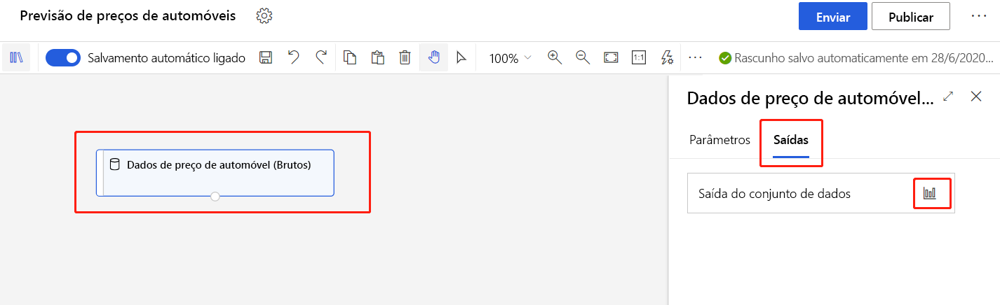
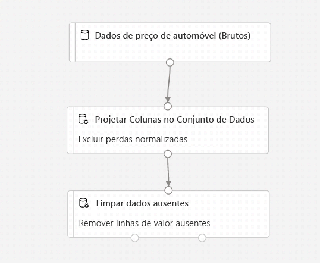
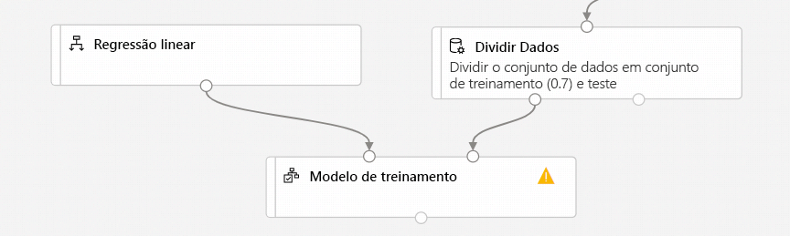
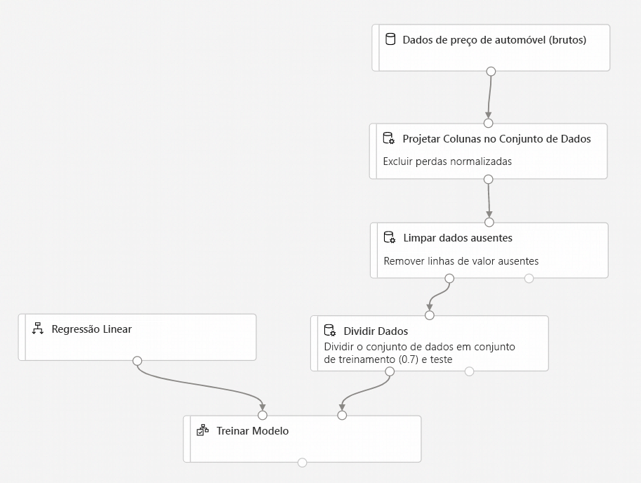
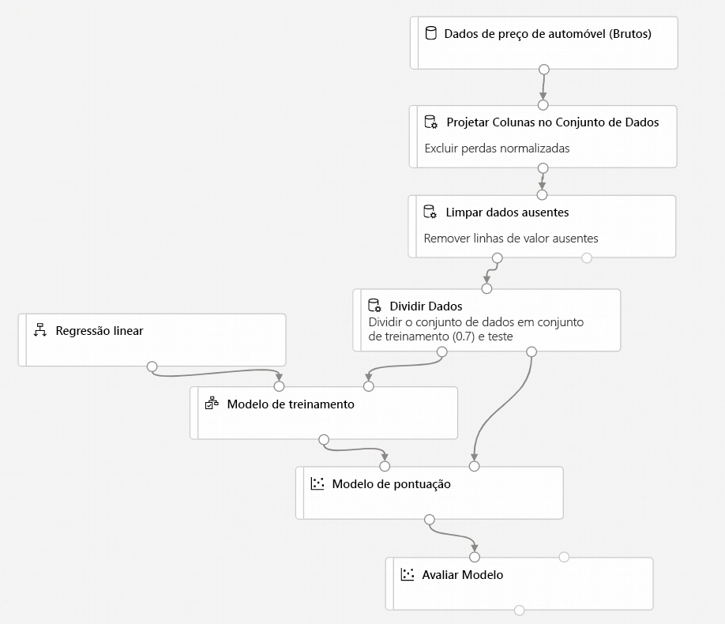
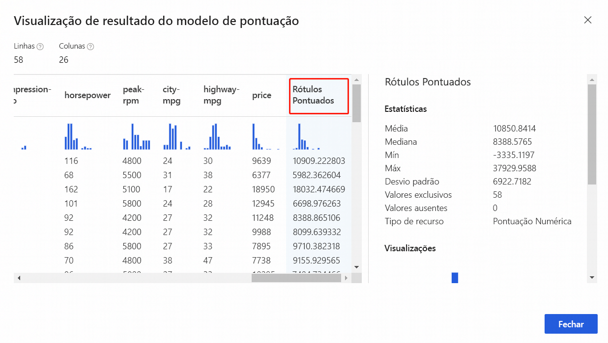

# Tutorial: Prever preço de automóvel com o designer
[!INCLUDE [applies-to-skus](../../includes/aml-applies-to-enterprise-sku.md)]

Neste tutorial de duas partes, você aprende a usar o designer do Azure Machine Learning para desenvolver e implantar uma solução de análise preditiva que prevê o preço de qualquer carro. 

Na primeira parte, você configurará o ambiente, arrastará e soltará módulos em uma tela interativa e os conectará entre si para criar um pipeline do Azure Machine Learning.

Na primeira parte do tutorial, você aprenderá a:

> [!div class="checklist"]
> * Criar um pipeline.
> * Importar dados.
> * Preparar os dados.
> * Treinar um modelo de machine learning.
> * Avaliar um modelo de machine learning.

Na [segunda parte](tutorial-designer-automobile-price-deploy.md) do tutorial, você aprenderá a implantar seu modelo preditivo como um ponto de extremidade de inferência em tempo real para prever o preço de qualquer carro com base nas especificações técnicas enviadas. 

> [!NOTE]
>Uma versão concluída deste tutorial está disponível como um pipeline de exemplo.
>
>Para encontrá-lo, acesse o designer em seu workspace. Na seção **Novo pipeline**, selecione **Amostra 1 – Regressão: Previsão de Preços de Automóveis (Básica)** .

## Criar um novo pipeline

Os pipelines do Azure Machine Learning organizam várias etapas dependentes do aprendizado de máquina e do processamento de dados em um único recurso. Os pipelines ajudam você a organizar, gerenciar e reutilizar fluxos de trabalho de aprendizado de máquina complexos entre projetos e usuários. Para criar um pipeline do Azure Machine Learning, você precisa de um workspace do Azure Machine Learning. Nesta seção, você aprenderá a criar esses dois recursos.

### Criar um novo workspace

Caso você tenha um workspace do Azure Machine Learning com uma edição Enterprise, [passe para a próxima seção](#create-the-pipeline).

[!INCLUDE [aml-create-portal](../../includes/aml-create-in-portal-enterprise.md)]

### Criar o pipeline

1. Entre em [ml.azure.com](https://ml.azure.com) e selecione o workspace com o qual deseja trabalhar.

1. Selecione **Designer**.

    

1. Selecione **Módulos predefinidos e fáceis de usar**.

1. Selecione o nome do pipeline padrão **Pipeline-Created-on** na parte superior da tela. Renomeie-o para algo significativo. Um exemplo é *Previsão de preços de automóveis*. O nome não precisa ser exclusivo.

## Importar dados

Há vários conjuntos de dados de exemplo incluídos no designer para que você possa fazer experimentos. Neste tutorial, use os **Dados de preços de automóveis (brutos)** . 

1. À esquerda da tela do pipeline há uma paleta de conjuntos de dados e módulos. Selecione **Conjuntos de Dados** e, em seguida, veja a seção **Amostras** para ver os conjuntos de dados de exemplo disponíveis.

1. Selecione o conjunto de dados **Dados de preços de automóveis (Brutos)** e arraste-o para a tela.

   

### Visualizar os dados

Você pode visualizar os dados para entender o conjunto de dados que será usado.

1. Selecione o módulo **Dados de preço de automóvel (brutos)** .

1. No painel de propriedades à direita da tela, selecione **Saídas**.

1. Selecione o ícone de grafo para visualizar os dados.

    

1. Selecione as diferentes colunas na janela de dados para exibir informações sobre cada um.

    Cada linha representa um automóvel e as variáveis associadas a cada automóvel aparecem como colunas. Há 205 linhas e 26 colunas nesse conjunto de dados.

## Preparar dados

Os conjuntos de dados normalmente exigem algum pré-processamento antes da análise. Talvez você tenha observado alguns valores ausentes quando inspecionou o conjunto de dados. Esses valores ausentes precisam ser limpos para que o modelo possa analisar os dados corretamente.

### Remover uma coluna

Quando treina um modelo, você precisa fazer algo sobre os dados que estão faltando. Nesse conjunto de dados, a coluna **normalized-losses** tem muitos valores ausentes; portanto, exclua por completo essa coluna do modelo.

1. Insira **Selecionar** na caixa de pesquisa, na parte superior da paleta, para encontrar o módulo **Selecionar Colunas no Conjunto de Dados**.

1. Arraste o módulo **Selecionar Colunas no Conjunto de Dados** para a tela. Solte o módulo embaixo do módulo do conjunto de dados.

1. Conecte o conjunto de dados **Dados de preços de automóveis (Brutos)** ao módulo **Selecionar Colunas no Conjunto de Dados**. Arraste da porta de saída do conjunto de dados, que é o pequeno círculo na parte inferior do conjunto de dados na tela, até a porta de entrada do módulo **Selecionar colunas no conjunto de dados**, que é o pequeno círculo na parte superior do módulo.

    > [!TIP]
    > Crie um fluxo de dados por meio do seu pipeline quando você conectar a porta de saída de um módulo a uma porta de entrada de outro.
    >

    

1. Selecione o módulo **Selecionar colunas no conjunto de dados**.

1. No painel de propriedades à direita da tela, selecione **Parâmetros** > **Editar coluna**.

1. Selecione o **+** para adicionar uma nova regra.

1. No menu suspenso, selecione **Excluir** e **Nomes de coluna**.
    
1. Insira *normalized-losses* na caixa de texto.

1. No canto inferior direito, selecione **Salvar** para fechar o seletor de coluna.

    
        
    O painel de propriedades mostra que a coluna **normalized-losses** foi excluída.

1. Selecione o módulo **Selecionar colunas no conjunto de dados**. 

1. No painel de propriedades, selecione **Parâmetros** > **Comentário** e insira *Excluir perdas normalizadas*.

### Limpar dados ausentes

Seu conjunto de dados ainda tem valores ausentes após a remoção da coluna **normalized-losses**. Você pode remover os dados ausentes restantes usando o módulo **Limpar Dados Ausentes**.

> [!TIP]
> Limpar os valores ausentes dos dados de entrada é um pré-requisito para usar a maioria dos módulos do designer.

1. Insira **Limpar** na caixa de pesquisa para encontrar o módulo **Limpar Dados Ausentes**.

1. Arraste o módulo **Limpar Dados Ausentes** para a tela do pipeline. Conecte-o ao módulo **Selecionar Colunas no Conjunto de Dados**. 

1. No painel de propriedades, selecione **Remover linha inteira** em **Modo de limpeza**.

1. Na caixa **Comentário** do painel de propriedades, insira *Remover linhas com valores ausentes*. 

    Agora, seu pipeline deve ser semelhante ao seguinte:
    
    

## Treinar um modelo de machine learning

Agora que os dados foram processados, você poderá treinar um modelo preditivo.

### Selecionar um algoritmo

*Classificação* e *regressão* são dois tipos de técnicas de algoritmo de machine learning supervisionado. A classificação prevê uma resposta com base em um conjunto definido de categorias, por exemplo, uma cor como vermelho, azul ou verde. A regressão é usada para prever um número.

Como você deseja prever o preço, que é um número, use um algoritmo de regressão. Para este exemplo, você usará um modelo de regressão linear.

### Dividir os dados

Divida seus dados em dois conjunto de dados separados para treinar o modelo e testá-lo.

1. Insira **dividir dados** na caixa de pesquisa para encontrar o módulo **Dividir Dados**. Conecte-o à porta esquerda do módulo **Limpar Dados Ausentes**.

1. Selecione o módulo **Dividir dados**.

1. No painel de propriedades, defina a **Fração de linhas no primeiro conjunto de dados de saída** como 0,7.

    Essa opção divide 70% dos dados para treinar o modelo e 30% para testá-lo.

1. Na caixa **Comentário** do painel de propriedades, insira *Dividir o conjunto de dados em um conjunto de treinamento (0,7) e um conjunto de teste (0,3)* .

### Treinar o modelo

Treine o modelo fornecendo a ele um conjunto de dados que inclua o preço. O modelo examina os dados e procura correlações entre os recursos de um carro e o preço para construir um modelo.

1. Para selecionar o algoritmo de aprendizado, limpe a caixa de pesquisa da paleta de módulos.

1. Expanda **Algoritmos de Machine Learning**.
    
    Essa opção exibe várias categorias de módulos que podem ser usados para inicializar algoritmos de aprendizado.

1. Selecione **Regressão** > **Regressão Linear** e arraste-a para a tela do pipeline.

1. Encontre e arraste o módulo **Treinar Modelo** para a tela do pipeline. 

1. Conecte a saída do módulo **Regressão Linear** à entrada esquerda do módulo **Treinar Modelo**.

1. Conecte-se a saída dos dados de treinamento (porta esquerda) do módulo **Dividir Dados** à entrada à direita do módulo **Treinar Modelo**.

    

1. Selecione o módulo **Treinar Modelo**.

1. No painel de propriedades, escolha o seletor **Editar coluna**.

1. Na caixa de diálogo **Coluna de rótulo**, expanda o menu suspenso e selecione **Nomes de colunas**. 

1. Na caixa de texto, digite *preço*. O preço é o valor que o modelo vai prever.

    Seu pipeline deve ter esta aparência:

    

## Avaliar um modelo de machine learning

Depois de treinar o modelo usando 70% dos dados, você poderá usá-lo para pontuar os outros 30% e ver se o modelo funciona corretamente.

1. Insira *pontuar modelo* na caixa de pesquisa para encontrar o módulo **Pontuar Modelo**. Arraste o módulo para a tela do pipeline. 

1. Conecte a saída do módulo **Treinar Modelo** à porta de entrada esquerda do módulo **Pontuar Modelo**. Conecte a saída de dados de teste (porta direita) do módulo **Dividir Dados** à porta de entrada direita do módulo **Pontuar Modelo**.

1. Insira *avaliar* na caixa de pesquisa para encontrar o módulo **Avaliar Modelo**. Arraste o módulo para a tela do pipeline. 

1. Conecte a saída do módulo **Pontuar Modelo** à entrada esquerda do módulo **Avaliar Modelo**. 

    O pipeline final deve ser semelhante ao seguinte:

    

### Executar o pipeline

[!INCLUDE [aml-ui-create-training-compute](../../includes/aml-ui-create-training-compute.md)]

### Exibir os resultados

Depois que a execução for concluída, você poderá exibir os resultados da execução do pipeline. 

1. Selecione o módulo **Pontuar Modelo** para exibir a saída.

1. No painel de propriedades, selecione **Saídas** > **Visualizar**.

    Aqui você poderá ver os preços previstos e os preços reais dos dados de teste.

    

1. Selecione o módulo **Avaliar Modelo** para exibir a saída.

1. No painel de propriedades, selecione **Saída** > **Visualizar**.

As seguintes estatísticas são mostradas para o modelo:

* **MAE (Média de Erros Absolutos)** : A média de erros absolutos. Um erro é a diferença entre o valor previsto e o valor real.
* **RMSE (Raiz Quadrada da Média de Erros Quadrados)** : a raiz quadrada da média de erros quadrados de previsões feitas no conjunto de dados de teste.
* **Erro absoluto relativo**: a média de erros absolutos relativos à diferença absoluta entre os valores reais e a média de todos os valores reais.
* **Erro ao quadrado relativo**: a média de erros quadrados relativos à diferença quadrada entre os valores reais e a média de todos os valores reais.
* **Coeficiente de determinação**: Também conhecida como o valor de R-quadrado, essa métrica estatística indica se o modelo se ajusta bem aos dados.

Para cada estatística de erro, menos é melhor. Um valor menor indica que as previsões estão mais próximas dos valores reais. Quanto ao coeficiente de determinação, quanto mais próximo o valor estiver de um (1), melhores serão as previsões.

## Limpar os recursos

[!INCLUDE [aml-ui-cleanup](../../includes/aml-ui-cleanup.md)]

## Próximas etapas

Na primeira parte deste tutorial, você concluiu as seguintes tarefas:

* Criar um pipeline
* Preparar os dados
* Treinar o modelo
* Pontuar e avaliar o modelo

Na segunda parte, você aprenderá a implantar seu modelo como um ponto de extremidade em tempo real.

> [!div class="nextstepaction"]
> [Continuar a implantação de modelos](tutorial-designer-automobile-price-deploy.md)
