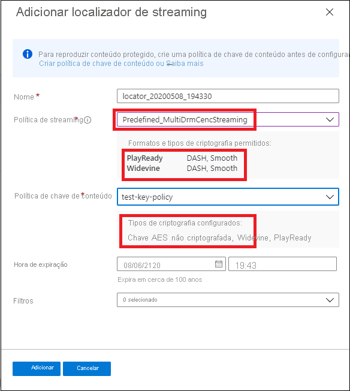

# Início Rápido: Usar o portal para criptografar o conteúdo

[!INCLUDE [media services api v3 logo](./includes/v3-hr.md)]

Use os Serviços de Mídia do Azure para ajudar a proteger sua mídia desde o momento que ela sai do seu computador até o armazenamento, o processamento e a entrega. Com os Serviços de Mídia, é possível entregar o conteúdo ao vivo e sob demanda criptografado dinamicamente com a criptografia AES (AES-128) ou qualquer um dos três principais sistemas DRM (gerenciamento de direitos digitais): Microsoft PlayReady, Google Widevine e Apple FairPlay. Os serviços de mídia também fornecem um serviço de distribuição de chaves AES e licenças DRM (PlayReady, Widevine e FairPlay) para os clientes autorizados. 
 
Para especificar opções de criptografia (se houver) no fluxo, use uma **política de streaming** e associe-a ao localizador de streaming. Crie a **política de chave de conteúdo** para configurar como a chave de conteúdo (que fornece acesso seguro aos seus **ativos**) é entregue aos clientes finais. Você precisará definir os requisitos (as restrições) na política de chave de conteúdo que precisam ser atendidos para que as chaves com a configuração especificada sejam entregues aos clientes. 

> [!NOTE]
> A política de chave de conteúdo não é necessária para streaming ou download não criptografado.

Quando um fluxo é solicitado por um player, os Serviços de Mídia usam a chave especificada para criptografar dinamicamente o conteúdo usando a chave não criptografada AES ou a criptografia DRM. Para descriptografar o fluxo, o player solicita a chave do serviço de entrega de chave dos Serviços de Mídia ou do serviço de entrega de chaves especificado. Para decidir se o usuário está autorizado a obter a chave, o serviço avalia a **política de chave de conteúdo** que você especificou para a chave.

Este início rápido mostra como criar uma política de chave de conteúdo na qual você especifica qual criptografia deve ser aplicada ao ativo quando ele é transmitido. O início rápido também mostra como definir a criptografia configurada no ativo.

### Pré-leitura sugerida

* [Criptografia dinâmica e entrega de chave](drm-content-protection-concept.md)
* [Localizadores de streaming](stream-streaming-locators-concept.md)
* [Políticas de streaming](stream-streaming-policy-concept.md)
* [Políticas de chave de conteúdo](drm-content-key-policy-concept.md)

## Pré-requisitos

Carregar e processar seu conteúdo conforme descrito em [Gerenciar ativos no portal do Azure](asset-create-asset-upload-portal-quickstart.md)

## Criar uma política de chave de conteúdo

Crie a **política de chave de conteúdo** para configurar como a chave de conteúdo (que fornece acesso seguro aos seus **ativos**) é entregue aos clientes finais.

1. Entre no [Portal do Azure](https://portal.azure.com/).
1. Localize e clique na sua conta dos Serviços de Mídia.
1. Selecione **Políticas de chave de conteúdo (novo)** .
1. Selecione **+ Adicionar política de chave de conteúdo** na parte superior da janela. 

A janela **Criar uma política de chave de conteúdo** será exibida. Nessa janela, escolha as opções de criptografia. Opte por proteger sua mídia escolhendo o DRM (gerenciamento de direitos digitais), a criptografia AES ou ambos.  

Se você escolher uma das opções do DRM ou uma opção de chave não criptografada AES-128, recomendaremos que você especifique como deseja configurar as restrições. Você pode optar por ter uma restrição aberta ou de token. Para obter uma explicação detalhada, confira [Como controlar o acesso ao conteúdo](drm-content-protection-concept.md#controlling-content-access).

### Adicionar uma chave de conteúdo do DRM

Opte por proteger seu conteúdo com o Microsoft PlayReady e/ou o Google Widevine ou o Apple FairPlay. Cada tipo de entrega de licença verificará as chaves de conteúdo com base nas suas credenciais em um formato criptografado.

#### Modelos de licença

Para obter detalhes sobre os modelos de licença, confira:

* [Modelo de licença do Google Widevine](drm-widevine-license-template-concept.md)

    > [!NOTE]
    > Você pode criar um modelo de licença vazio sem valores, apenas "{}". Em seguida, é criado um modelo de licença com os padrões. O padrão funciona na maioria dos casos.
* [Requisitos e configuração de licença do Apple FairPlay](drm-fairplay-license-overview.md)
* [Modelo de licença PlayReady](drm-playready-license-template-concept.md)

### Adicionar uma chave AES não criptografada

Você também pode adicionar uma criptografia de chave não criptografada AES-128 ao conteúdo. A chave de conteúdo é transmitida para o cliente em um formato não criptografado.

## Criar um localizador de streaming para o ativo

1. Localize e clique na sua conta dos Serviços de Mídia.
1. Selecione **Ativos (novo)** .
1. Na lista de ativos, selecione aquele que deseja criptografar.  
1. Na seção **Localizador de streaming** do ativo selecionado, selecione **+ Adicionar um localizador de streaming**. 
1. Selecione uma **política de streaming** apropriada para a **política de chave de conteúdo** configurada.

    O tópico [Políticas de streaming](stream-streaming-policy-concept.md) fornece detalhes sobre qual política de streaming corresponde à qual política de chave de conteúdo.
1. Depois de selecionar a política de streaming apropriada, selecione a política de chave de conteúdo na lista suspensa.
1. Selecione **Adicionar** para adicionar o localizador de streaming ao ativo.

    Isso vai publicar o ativo e gerar as URLs de streaming.

## Limpar os recursos

Se você pretende experimentar outros guias de início rápido, deve ater-se aos recursos criados. Caso contrário, acesse o portal do Azure, navegue até os grupos de recursos, selecione o grupo de recursos no qual você executou este guia de início rápido e exclua todos os recursos.

## Próximas etapas

[Gerenciar ativos](asset-create-asset-upload-portal-quickstart.md)
