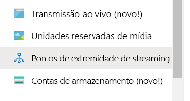
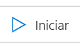
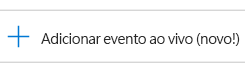
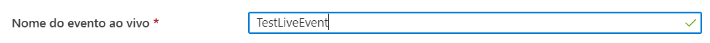
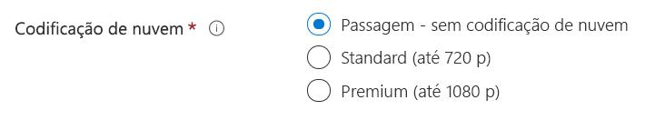
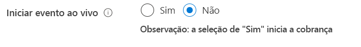
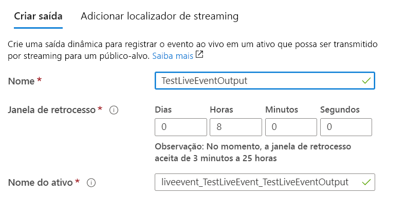
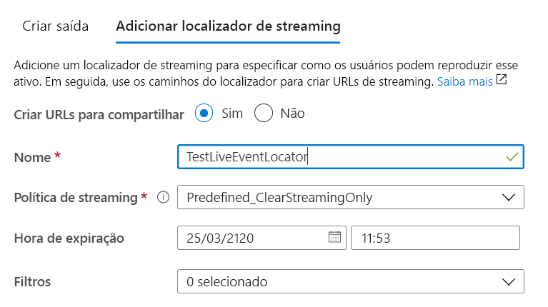

# Criar uma transmissão ao vivo dos Serviços de Mídia do Azure com o OBS

[!INCLUDE [media services api v3 logo](./includes/v3-hr.md)]

Este guia de início rápido ajudará você a criar um Evento ao Vivo dos Serviços de Mídia usando o portal do Azure e o OBS (Open Broadcasting Studio). Ele pressupõe que você tenha uma assinatura do Azure e que tenha criado uma conta dos Serviços de Mídia.

Neste início rápido, abordaremos:

- Como configurar um codificador local com o OBS.
- Como configurar uma transmissão ao vivo.
- Como configurar saídas de transmissão ao vivo.
- Como executar um ponto de extremidade de streaming padrão.
- Como usar o Player de Mídia do Azure para ver a transmissão ao vivo e a saída sob demanda.

## Pré-requisitos

Se você não tiver uma assinatura do Azure, crie uma [conta gratuita](https://azure.microsoft.com/free/) antes de começar.

## Entre no Portal do Azure

Abra seu navegador da Web e vá até o [portal do Microsoft Azure](https://portal.azure.com/). Insira suas credenciais para entrar no portal. A exibição padrão é o painel de serviço.

## Configurar um codificador local usando o OBS

1. Baixe e instale o OBS para o seu sistema operacional no [site do Open Broadcaster Software](https://obsproject.com/).
1. Inicie o aplicativo e mantenha-o aberto.

## Executar o ponto de extremidade de streaming padrão

1. Selecione **Pontos de extremidade de streaming** na listagem dos Serviços de Mídia.

   
1. Se o status do ponto de extremidade de streaming padrão for parado, selecione-o. Essa etapa leva você à página desse ponto de extremidade.
1. Selecione **Iniciar**.

   

## Configurar uma transmissão ao vivo dos Serviços de Mídia do Azure

1. Vá até a conta dos Serviços de Mídia do Azure no portal e, em seguida, selecione **Transmissão ao vivo** na listagem dos **Serviços de Mídia**.

   
1. Selecione **Adicionar evento ao vivo** para criar um evento de transmissão ao vivo.

   
1. Insira um nome para o novo evento, como *TestLiveEvent*, na caixa **Nome do evento ao vivo**.

   
1. Insira uma descrição opcional do evento na caixa **Descrição**.
1. Selecione a opção **Passagem – sem codificação de nuvem**.

   
1. Selecione a opção **RTMP**.
1. Verifique se a opção **Não** está selecionada para **Iniciar evento ao vivo**, a fim de evitar a cobrança pelo evento ao vivo antes que ele esteja pronto. (A cobrança começará quando o evento ao vivo for iniciado.)

   
1. Selecione o botão **Examinar + criar** para examinar as configurações.
1. Selecione o botão **Criar** para criar o evento ao vivo. Você retornará à listagem do evento ao vivo.
1. Clique no link para acessar o evento ao vivo criado. Observe que o evento está parado.
1. Mantenha esta página aberta no navegador. Voltaremos a ele mais tarde.

## Configurar uma transmissão ao vivo usando o OBS Studio

O OBS começa com uma cena padrão, mas sem entradas selecionadas.

   

### Adicionar uma fonte de vídeo

1. No painel **Fontes**, clique no ícone **Adicionar** para selecionar um novo dispositivo de origem. O menu **Fontes** será aberto.

1. Selecione **Dispositivo de Captura de Vídeo** no menu do dispositivo de origem. O menu **Criar/Selecionar Origem** será aberto.

   

1. Clique no botão de opção **Adicionar Existente**, depois em **OK**. O menu **Propriedades do Dispositivo de Vídeo** será aberto.

   

1. Na lista suspensa **Dispositivo**, selecione a saída de vídeo que você deseja usar para a difusão. Mantenha o restante das configurações por enquanto, depois clique em **OK**. A fonte de entrada será adicionada ao painel **Fontes** e a exibição de entrada de vídeo aparecerá na área **Visualização**.

   

### Adicionar uma fonte de áudio

1. No painel **Fontes**, clique no ícone **Adicionar** para selecionar um novo dispositivo de origem. O menu do dispositivo de origem será aberto.

1. Selecione **Captura de Entrada de Áudio** no menu do dispositivo de origem. O menu **Criar/Selecionar Origem** será aberto.

   

1. Clique no botão de opção **Adicionar Existente**, depois em **OK**. O menu **Propriedades para Captura de Entrada de Áudio** será aberto.

   

1. Na lista suspensa **Dispositivo**, selecione o dispositivo de captura de áudio que você deseja usar para a difusão. Mantenha o restante das configurações por enquanto, depois clique em OK. O dispositivo de captura de áudio será adicionado ao painel mixer de áudio.

   

### Configurar definições de streaming e codificação avançada no OBS

No procedimento seguinte, você voltará aos Serviços de Mídia do Azure no navegador para copiar a URL de entrada a fim de inseri-la nas configurações de saída:

1. Na página dos Serviços de Mídia do Azure do portal, selecione **Iniciar** para iniciar o evento de transmissão ao vivo. (A cobrança será iniciada agora.)

   
1. Defina a alternância **RTMP** como **RTMPS**.
1. Na caixa **URL de Entrada**, copie a URL para sua área de transferência.

   

1. Alterne para o aplicativo OBS.

1. Clique no botão **Configurações** do painel **Controles**. As opções de Configurações serão abertas.

   

1. Selecione **Stream** no menu **Configurações**.

1. Na lista suspensa **Serviço**, selecione Mostrar tudo e, em seguida, selecione **Personalizado...** .

1. No campo **Servidor**, cole a URL RTMPS que você copiou para a área de transferência.

1. Insira algo no campo **Chave de stream**.  Não importa realmente o que é, mas precisa ter um valor.

    

1. Selecione **Saída** no menu **Configurações**.

1. Selecione a lista suspensa **Modo de Saída** na parte superior da página e escolha **Avançado** para acessar todas as configurações disponíveis do codificador.

1. Selecione a guia **Streaming** para configurar o codificador.

1. Selecione o codificador direito para seu sistema.  Caso o hardware seja compatível com uma aceleração da GPU, escolha entre NVIDIA **NVENC** H.264 ou Intel **QuickSync** H.264. Caso o sistema não tenha uma GPU compatível, selecione a opção de codificador de software chamada **X264**.

#### Configurações do codificador X264

1. Caso tenha selecionado a opção de codificação **X264**, selecione a caixa **Redimensionar Saída**. Selecione a opção 1920x1080 caso esteja usando um Evento ao Vivo Premium nos Serviços de Mídia ou 1280x720 caso esteja usando um Evento ao Vivo Standard (720P).  Caso esteja usando um evento ao vivo de passagem, será possível escolher a resolução disponível.

1. Defina a **Taxa de bits** entre 1500 Kbps e 4000 Kbps. Recomendamos usar 2500 Kbps caso esteja usando um Evento ao Vivo de codificação Standard de 720P. Recomendamos usar 4000 Kbps, caso esteja usando um Evento ao Vivo Premium de 1080P. Talvez você queira ajustar a taxa de bits em sua rede com base nas funcionalidades e na largura de banda da CPU disponíveis para obter a configuração de qualidade desejada.

1. Insira *2* no campo **Intervalo do quadro-chave**. O valor definirá o intervalo do quadro chave como 2 segundos, que controla o tamanho final dos fragmentos entregues por HLS ou DASH dos Serviços de Mídia. Nunca defina o intervalo do quadro chave como superior a 4 segundos.  Caso esteja identificando uma alta latência durante a transmissão, recomendamos verificar a configuração ou informar aos usuários do aplicativo para sempre definir esse valor como 2 segundos. Ao tentar obter uma entrega dinâmica com latência mais baixa, será possível optar por definir esse valor como no mínimo 1 segundo.

1. ALTERNATIVA: defina a Predefinição de Uso da CPU como **veryfast** e execute alguns experimentos para conferir se a CPU local pode lidar com a combinação de taxas de bits e a predefinição com uma sobrecarga suficiente. Tente evitar configurações que resultarão em uma CPU média superior a 80% para impedir que problemas ocorram durante a transmissão ao vivo. É possível executar um teste usando as configurações predefinidas **mais rápido** e **rápido** até obter limitações da CPU para aprimorar a qualidade.

   

1. Mantenha o restante das configurações inalteradas, depois clique em **OK**.

#### Configurações do codificador NVIDIA NVENC

1. Caso tenha selecionado a opção **NVENC** de codificação da GPU, marque a caixa **Redimensionar Saída** e selecione 1920x1080 caso esteja usando um Evento ao Vivo Premium nos Serviços de Mídia ou 1280x720 caso esteja usando um Evento ao Vivo Standard (720P). Caso esteja usando um evento ao vivo de passagem, será possível escolher uma resolução disponível.

1. Defina o **Controle de Taxa** como CBR para obter uma taxa de bits constante.

1. Defina a **Taxa de bits** entre 1500 Kbps e 4000 Kbps. Recomendamos usar 2500 Kbps caso esteja usando um Evento ao Vivo de codificação Standard de 720P. Recomendamos usar 4000 Kbps, caso esteja usando um Evento ao Vivo Premium de 1080P. É possível optar por ajustar essa taxa com base nas funcionalidades e na largura de banda da CPU disponíveis em sua rede para obter a configuração de qualidade desejada.

1. Defina o **Intervalo do quadro-chave** como 2 segundos, conforme indicado acima nas opções de X264. Não exceda 4 segundos, pois isso poderá afetar a latência de sua transmissão ao vivo de modo significativo.

1. Defina a **Predefinição** como Baixa Latência, Desempenho de Baixa Latência ou Qualidade de Baixa Latência, dependendo da velocidade da CPU de seu computador local. Experimente usar essas configurações para obter um equilíbrio mais adequado entre a qualidade e a utilização da CPU em seu hardware.

1. Caso esteja usando uma configuração de hardware mais avançada, defina o **Perfil** como "principal" ou "importante".

1. Mantenha a **Previsão** desmarcada. Caso tenha um computador muito avançado, será possível verificar isso.

1. Mantenha o **Ajuste psico-visual** desmarcado. Caso tenha um computador muito avançado, será possível verificar isso.

1. Defina a **GPU** como 0 para decidir de modo automático quais GPUs alocar. É possível restringir o uso da GPU, se você desejar.

1. Definir o número **Máximo de quadros B** como 2

   

#### Configurações do codificador Intel QuickSync

1. Caso tenha selecionado a opção **QuickSync** de codificação da GPU, marque a caixa **Redimensionar Saída** e selecione 1920x1080 caso esteja usando um Evento ao Vivo Premium nos Serviços de Mídia ou 1280x720 caso esteja usando um Evento ao Vivo Standard (720P). Caso esteja usando um evento ao vivo de passagem, será possível escolher uma resolução disponível.

1. Defina o **Uso de Destino** como "equilibrado" ou execute ajustes conforme necessário com base no carregamento combinado de CPU e GPU. Faça ajustes conforme necessário e execute um teste para obter uma utilização máxima de CPU de 80% em média com a qualidade que seu hardware é capaz de produzir. Caso tenha um hardware mais restrito, execute um teste com "rápido" ou altere para "muito rápido" caso esteja tendo problemas de desempenho.

1. Caso esteja usando uma configuração de hardware mais avançada, defina o **Perfil** como "principal" ou "importante".

1. Defina o **Intervalo do quadro-chave** como 2 segundos, conforme indicado acima nas opções de X264. Não exceda 4 segundos, pois isso poderá afetar a latência de sua transmissão ao vivo de modo significativo.

1. Defina o **Controle de Taxa** como CBR para obter uma taxa de bits constante.

1. Defina a **Taxa de bits** entre 1500 Kbps e 4000 Kbps.  Recomendamos usar 2500 Kbps caso esteja usando um Evento ao Vivo de codificação Standard de 720P. Recomendamos usar 4000 Kbps, caso esteja usando um Evento ao Vivo Premium de 1080P. É possível optar por ajustar essa taxa com base nas funcionalidades e na largura de banda da CPU disponíveis em sua rede para obter a configuração de qualidade desejada.

1. Defina a **Latência** como "baixa".

1. Defina os **Quadros B** como 2.

1. Mantenha os **Aprimoramentos Subjetivos de Vídeo** desmarcados.

   

### Definir configurações de áudio

No próximo procedimento, você ajustará as configurações de codificação de áudio.

1. Selecione a guia Saída->Áudio em Configurações.

1. Defina a Taxa 1 da **Taxa de Bits de Áudio** como 128 Kbps.

   

1. Em Configurações, selecione a guia Áudio.

1. Defina a **Taxa de Exemplo** como 44.1 kHz.

   

### Iniciar o streaming

1. No painel **Controles**, clique em **Iniciar Streaming**.

    

2. Alterne para a tela de eventos ao vivo dos Serviços de Mídia do Azure no navegador e clique no link **Recarregar Player**. Agora você deve ver seu stream no player de visualização.

## Configurar saídas

Essa parte vai configurar as saídas e permitir que você salve uma gravação da transmissão ao vivo.  

> [!NOTE]
> Para transmitir essa saída, o ponto de extremidade de streaming precisa estar em execução. Confira a seção [Executar o ponto de extremidade de streaming padrão](#run-the-default-streaming-endpoint) posterior.

1. Selecione o link **Criar saídas** abaixo do visualizador de vídeo de **Saídas**.
1. Se desejar, edite o nome da saída na caixa **Nome** para algo mais amigável, de modo que seja fácil encontrá-la posteriormente.

   
1. Deixe todas as outras caixas inalteradas por enquanto.
1. Selecione **Avançar** para adicionar um localizador de streaming.
1. Se desejar, altere o nome do localizador para algo mais amigável.

   
1. Mantenha todos os outros campos desta tela inalterados por enquanto.
1. Selecione **Criar**.

## Reproduzir a difusão de saída usando o Player de Mídia do Azure

1. Copie a URL de streaming no player de vídeo de **Saída**.
1. Em um navegador da Web, abra a [Demonstração do Player de Mídia do Azure](https://ampdemo.azureedge.net/azuremediaplayer.html).
1. Cole a URL de streaming na caixa **URL** do Player de Mídia do Azure.
1. Selecione o botão **Atualizar Player**.
1. Selecione o ícone **Reproduzir** do vídeo para ver a transmissão ao vivo.

## Parar a difusão

Quando considerar que transmitiu conteúdo suficiente, pare a difusão.

1. No portal, selecione **Parar**.

1. No OBS, selecione o botão **Interromper Streaming** no painel **Controles**. Essa etapa interrompe a difusão do OBS.

## Reproduzir a saída sob demanda usando o Player de Mídia do Azure

A saída que você criou agora está disponível para streaming sob demanda, desde que o ponto de extremidade de streaming esteja em execução.

1. Vá até a listagem dos Serviços de Mídia e selecione **Ativos**.
1. Encontre a saída do evento que você criou anteriormente e selecione o link para o ativo. A página da saída do ativo é aberta.
1. Copie a URL de streaming no player de vídeo do ativo.
1. Volte para o Player de Mídia do Azure no navegador e cole a URL de streaming na caixa de URL.
1. Selecione **Atualizar Player**.
1. Selecione o ícone **Reproduzir** do vídeo para ver o ativo sob demanda.

## Limpar os recursos

> [!IMPORTANT]
> Pare os serviços. Após ter concluído as etapas deste início rápido, interrompa o evento ao vivo e o ponto de extremidade de streaming ou você continuará sendo cobrado pelo tempo em que eles permanecerem em execução. Para interromper o evento ao vivo, confira as etapas 2 e 3 do procedimento [Parar a difusão](#stop-the-broadcast).

Para interromper o ponto de extremidade de streaming:

1. Na listagem dos Serviços de Mídia, selecione **Pontos de extremidade de streaming**.
2. Selecione o ponto de extremidade de streaming padrão iniciado anteriormente. Essa etapa abre a página do ponto de extremidade.
3. Selecione **Interromper**.

> [!TIP]
> Caso não deseje manter os ativos desse evento, exclua-os para evitar a cobrança pelo armazenamento.

## Próximas etapas

> [!div class="nextstepaction"]
> [Eventos e saídas ao vivo nos Serviços de Mídia](./live-event-outputs-concept.md)
