# Criar uma transmissão ao vivo dos Serviços de Mídia do Azure

[!INCLUDE [media services api v3 logo](./includes/v3-hr.md)]

Este guia de início rápido ajudará você a criar uma transmissão ao vivo dos Serviços de Mídia do Azure usando o portal do Azure e o Telestream Wirecast. Ele pressupõe que você tenha uma assinatura do Azure e que tenha criado uma conta dos Serviços de Mídia.

Se você não tiver uma assinatura do Azure, crie uma [conta gratuita](https://azure.microsoft.com/free/) antes de começar.

## Entre no Portal do Azure

Abra seu navegador da Web e vá até o [portal do Microsoft Azure](https://portal.azure.com/). Insira suas credenciais para entrar no portal. A exibição padrão é o painel de serviço.

Neste início rápido, abordaremos:

- Como configurar um codificador local com uma avaliação gratuita do Telestream Wirecast.
- Como configurar uma transmissão ao vivo.
- Como configurar saídas de transmissão ao vivo.
- Como executar um ponto de extremidade de streaming padrão.
- Como usar o Player de Mídia do Azure para ver a transmissão ao vivo e a saída sob demanda.

Para simplificar, usaremos uma predefinição de codificação dos Serviços de Mídia do Azure no Wirecast, uma codificação de nuvem de passagem e o RTMP.

## Configurar um codificador local usando o Wirecast

1. Baixe e instale o Wirecast para seu sistema operacional no [site do Telestream](https://www.telestream.net).
1. Inicie o aplicativo e use seu endereço de email favorito para registrar o produto. Mantenha o aplicativo aberto.
1. No email que receber, verifique seu endereço de email. Em seguida, o aplicativo iniciará a avaliação gratuita.
1. Recomendável: Assista ao tutorial em vídeo na tela de abertura do aplicativo.

## Configurar uma transmissão ao vivo dos Serviços de Mídia do Azure

1. Vá até a conta dos Serviços de Mídia do Azure no portal e, em seguida, selecione **Transmissão ao vivo** na listagem dos **Serviços de Mídia**.

   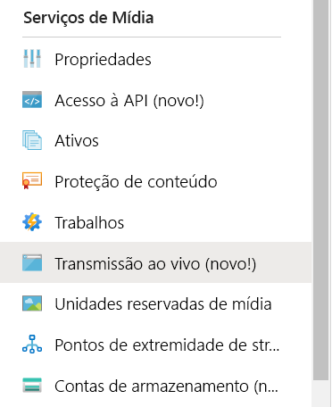
1. Selecione **Adicionar evento ao vivo** para criar um evento de transmissão ao vivo.

   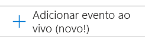
1. Insira um nome para o novo evento, como *TestLiveEvent*, na caixa **Nome do evento ao vivo**.

   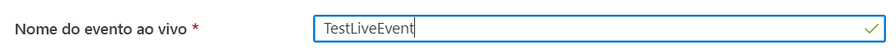
1. Insira uma descrição opcional do evento na caixa **Descrição**.
1. Selecione a opção **Passagem – sem codificação de nuvem**.

   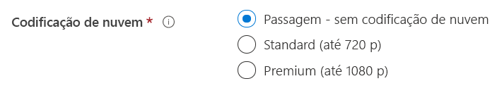
1. Selecione a opção **RTMP**.
1. Verifique se a opção **Não** está selecionada para **Iniciar evento ao vivo**, a fim de evitar a cobrança pelo evento ao vivo antes que ele esteja pronto. (A cobrança começará quando o evento ao vivo for iniciado.)

   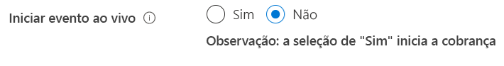
1. Selecione o botão **Examinar + criar** para examinar as configurações.
1. Selecione o botão **Criar** para criar o evento ao vivo. Você retornará à listagem do evento ao vivo.
1. Selecione o link para o evento ao vivo recém-criado. Observe que o evento está parado.
1. Mantenha esta página aberta no navegador. Voltaremos a ele mais tarde.

## Configurar uma transmissão ao vivo usando o Wirecast Studio

1. No aplicativo Wirecast, selecione **Criar Documento Vazio** no menu principal e, em seguida, selecione **Continuar**.

   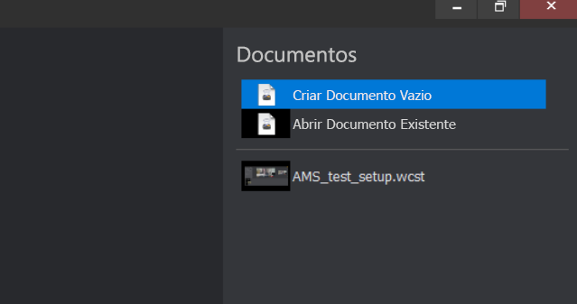
1. Focalize a primeira camada na área de **Camadas do Wirecast**.  Selecione o ícone **Adicionar** exibido e selecione a entrada de vídeo que deseja transmitir.

   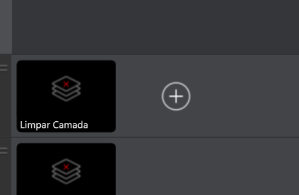

   A caixa de diálogo **Camada Mestre 1** é aberta.
1. Selecione **Captura de Vídeo** no menu e, em seguida, selecione a câmera que deseja usar.

   

   A exibição da câmera aparece na área de visualização.
1. Focalize a segunda camada na área de **Camadas do Wirecast**. Selecione o ícone **Adicionar** exibido e selecione a entrada de áudio que deseja transmitir. A caixa de diálogo **Camada Mestre 2** é aberta.
1. Selecione **Captura de áudio** no menu e, em seguida, selecione a entrada de áudio que deseja usar.

   
1. No menu principal, selecione **Configurações de saída**. A caixa de diálogo **Selecione um Destino de Saída** é exibida.
1. Selecione **Serviços de Mídia do Azure** na lista suspensa **Destino**. A configuração de saída dos Serviços de Mídia do Azure popula automaticamente a *maioria* das configurações de saída.

   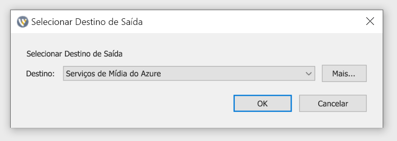

No procedimento seguinte, você voltará aos Serviços de Mídia do Azure no navegador para copiar a URL de entrada a fim de inseri-la nas configurações de saída:

1. Na página dos Serviços de Mídia do Azure do portal, selecione **Iniciar** para iniciar o evento de transmissão ao vivo. (A cobrança será iniciada agora.)

   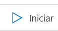
2. Clique na alternância **Seguro/Não seguro** para defini-lo como **Não seguro**. Esta etapa configura o protocolo como RTMP em vez de RTMPS.
3. Na caixa **URL de Entrada**, copie a URL para sua área de transferência.

   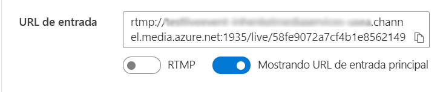
4. Alterne para o aplicativo do Wirecast e cole a **URL de Entrada** na caixa **Endereço** nas configurações de saída.

   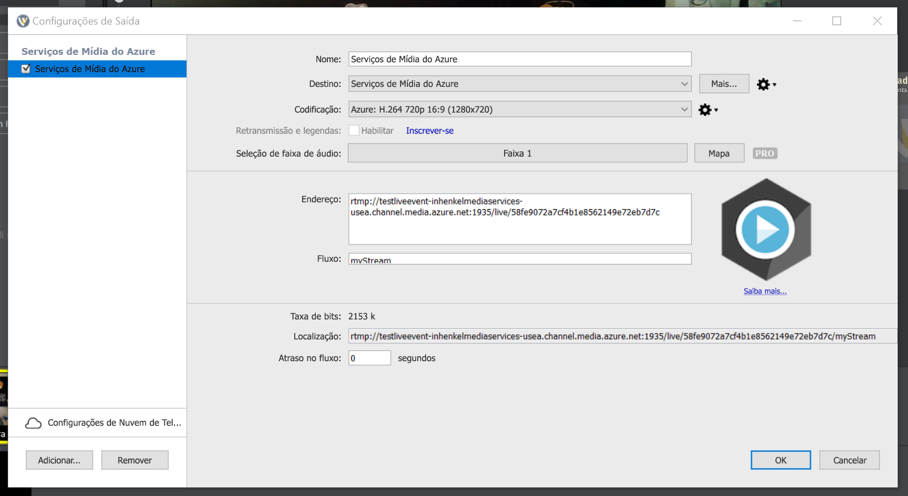
5. Selecione **OK**.

## Configurar saídas

Essa parte vai configurar as saídas e permitir que você salve uma gravação da transmissão ao vivo.  

> [!NOTE]
> Para transmitir essa saída, o ponto de extremidade de streaming precisa estar em execução. Confira a seção [Executar o ponto de extremidade de streaming padrão](#run-the-default-streaming-endpoint) posterior.

1. Selecione o link **Criar saídas** abaixo do visualizador de vídeo de **Saídas**.
1. Se desejar, edite o nome da saída na caixa **Nome** para algo mais amigável, de modo que seja fácil encontrá-la posteriormente.
   
   
1. Deixe todas as outras caixas inalteradas por enquanto.
1. Selecione **Avançar** para adicionar um localizador de streaming.
1. Se desejar, altere o nome do localizador para algo mais amigável.
   
   
1. Mantenha todos os outros campos desta tela inalterados por enquanto.
1. Selecione **Criar**.

## Iniciar a difusão

1. No Wirecast, selecione **Saída** > **Iniciar/Parar Transmissão** > **Iniciar os Serviços de Mídia do Azure: Serviços de Mídia do Azure** no menu principal.

   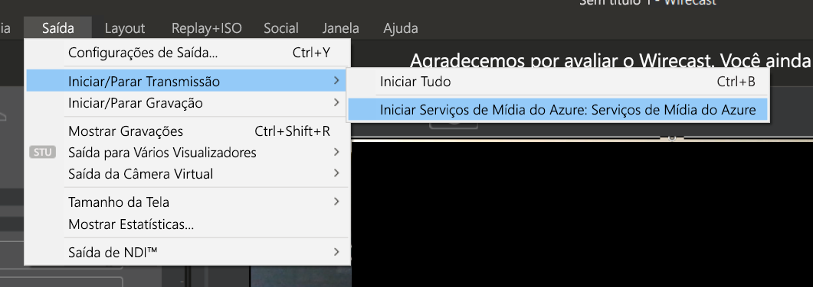

   Quando o fluxo for enviado para o evento ao vivo, a janela **Ao vivo** no Wirecast aparecerá no player de vídeo na página do evento ao vivo nos Serviços de Mídia do Azure.

1. Selecione o botão **Ir** na janela de visualização para começar a transmitir o vídeo e o áudio selecionados para as camadas do Wirecast.

   

   > [!TIP]
   > Se houver um erro, tente recarregar o player selecionando o link **Recarregar player** acima dele.

## Executar o ponto de extremidade de streaming padrão

1. Selecione **Pontos de extremidade de streaming** na listagem dos Serviços de Mídia.

   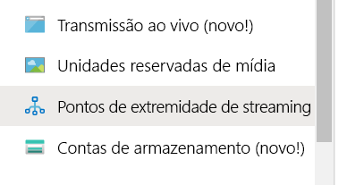
1. Se o status do ponto de extremidade de streaming padrão for parado, selecione-o. Essa etapa leva você à página desse ponto de extremidade.
1. Selecione **Iniciar**.
   
   

## Reproduzir a difusão de saída usando o Player de Mídia do Azure

1. Copie a URL de streaming no player de vídeo de **Saída**.
1. Em um navegador da Web, abra a [Demonstração do Player de Mídia do Azure](https://ampdemo.azureedge.net/azuremediaplayer.html).
1. Cole a URL de streaming na caixa **URL** do Player de Mídia do Azure.
1. Selecione o botão **Atualizar Player**.
1. Selecione o ícone **Reproduzir** do vídeo para ver a transmissão ao vivo.

## Parar a difusão

Quando considerar que transmitiu conteúdo suficiente, pare a difusão.

1. No Wirecast, selecione o botão **Difusão**. Essa etapa para a difusão do Wirecast.
1. No portal, selecione **Parar**. Você recebe uma mensagem de aviso informando que a transmissão ao vivo será interrompida e a saída se tornará um ativo sob demanda.
1. Selecione **Parar** na mensagem de aviso. Agora, o Player de Mídia do Azure também mostra um erro, pois a transmissão ao vivo não está mais disponível.

## Reproduzir a saída sob demanda usando o Player de Mídia do Azure

A saída que você criou agora está disponível para streaming sob demanda, desde que o ponto de extremidade de streaming esteja em execução.

1. Vá até a listagem dos Serviços de Mídia e selecione **Ativos**.
1. Encontre a saída do evento que você criou anteriormente e selecione o link para o ativo. A página da saída do ativo é aberta.
1. Copie a URL de streaming no player de vídeo do ativo.
1. Volte para o Player de Mídia do Azure no navegador e cole a URL de streaming na caixa de URL.
1. Selecione **Atualizar Player**.
1. Selecione o ícone **Reproduzir** do vídeo para ver o ativo sob demanda.

## Limpar os recursos

> [!IMPORTANT]
> Pare os serviços. Após ter concluído as etapas deste início rápido, interrompa o evento ao vivo e o ponto de extremidade de streaming ou você continuará sendo cobrado pelo tempo em que eles permanecerem em execução. Para interromper o evento ao vivo, confira as etapas 2 e 3 do procedimento [Parar a difusão](#stop-the-broadcast).

Para interromper o ponto de extremidade de streaming:

1. Na listagem dos Serviços de Mídia, selecione **Pontos de extremidade de streaming**.
2. Selecione o ponto de extremidade de streaming padrão iniciado anteriormente. Essa etapa abre a página do ponto de extremidade.
3. Selecione **Interromper**.

> [!TIP]
> Caso não deseje manter os ativos desse evento, exclua-os para evitar a cobrança pelo armazenamento.

## Próximas etapas
> [!div class="nextstepaction"]
> [Eventos e saídas ao vivo nos Serviços de Mídia](./live-events-outputs-concept.md)
