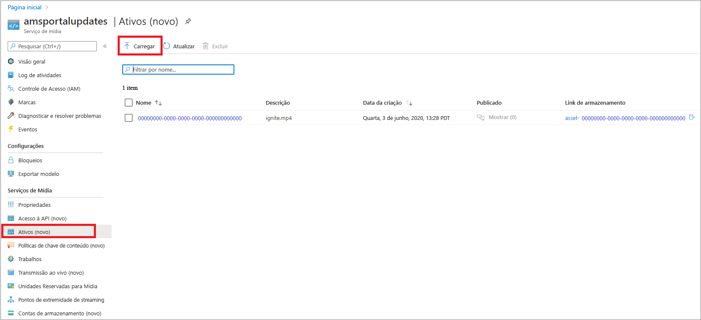
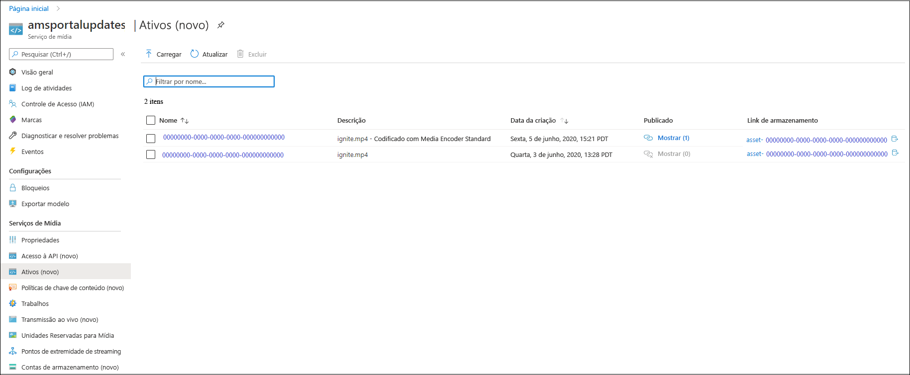
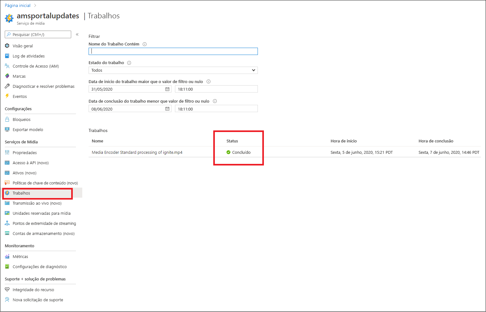
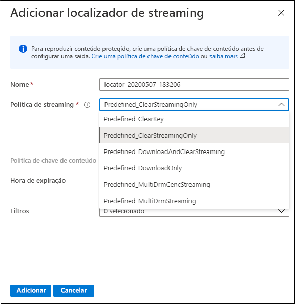
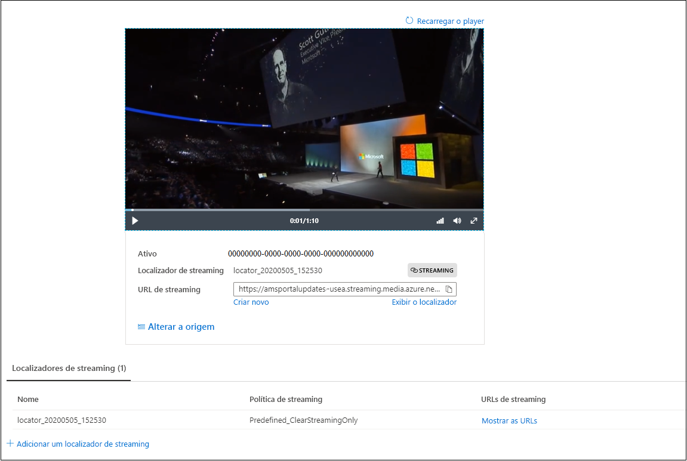

# Início Rápido: Carregar, codificar e transmitir o conteúdo com o portal

[!INCLUDE [media services api v3 logo](./includes/v3-hr.md)]

Este início rápido mostra como usar o portal do Azure para carregar, codificar e transmitir o conteúdo com os Serviços de Mídia do Azure.
  
## Visão geral

* Para começar a gerenciar, criptografar, codificar, analisar e transmitir o conteúdo de mídia no Azure, você precisará criar uma conta dos Serviços de Mídia e carregar seu arquivo de mídia digital de alta qualidade em um **ativo**. 
    
    > [!NOTE]
    > Se o vídeo foi carregado anteriormente na conta dos Serviços de Mídia por meio da API dos Serviços de Mídia v3 ou se o conteúdo foi gerado com base em uma saída dinâmica, você não verá os botões **Codificar**, **Analisar** ou **Criptografar** no portal do Azure. Use as APIs dos Serviços de Mídia v3 para executar essas tarefas.

    Examine o seguinte: 

  * [Upload e armazenamento na nuvem](storage-account-concept.md)
  * [Conceito de ativos](assets-concept.md)
* Depois de carregar seu arquivo de mídia digital de alta qualidade em um ativo (um ativo de entrada), você poderá processá-lo (codificá-lo ou analisá-lo). O conteúdo processado é enviado para outro ativo (ativo de saída). 
    * [Codifique](encoding-concept.md) o arquivo carregado em formatos que possam ser reproduzidos em uma ampla variedade de navegadores e dispositivos.
    * [Analise](analyzing-video-audio-files-concept.md) o arquivo carregado. 

        Atualmente, ao usar o portal do Azure, você pode fazer o seguinte: gerar um TTML e arquivos de legenda oculta WebVTT. Os arquivos nesses formatos podem ser usados para tornar os arquivos de áudio e vídeo acessíveis para pessoas com deficiência auditiva. Você também pode extrair palavras-chave do conteúdo.

        Para obter uma experiência sofisticada que permita extrair insights dos seus arquivos de vídeo e áudio, use as predefinições dos Serviços de Mídia v3 (conforme descrito no [Tutorial: Analisar vídeos com os Serviços de Mídia v3](analyze-videos-tutorial-with-api.md)).  Caso deseje insights mais detalhados, use o [Video Indexer](../video-indexer/index.yml) diretamente.    
* Depois que o conteúdo é processado, você pode entregar o conteúdo de mídia para os players cliente. Para disponibilizar vídeos no ativo de saída aos clientes para reprodução, você precisará criar um **localizador de streaming**. Ao criar o **localizador de streaming**, especifique uma **política de streaming**. As **políticas de streaming** permitem que você defina protocolos de streaming e opções de criptografia (se houver) para os **localizadores de streaming**.
    
    Examine:

    * [Localizadores de streaming](streaming-locators-concept.md)
    * [Políticas de streaming](streaming-policy-concept.md)
    * [Empacotamento e entrega](dynamic-packaging-overview.md)
    * [Filtros](filters-concept.md)
* Proteja seu conteúdo criptografando-o com a criptografia AES (AES-128) ou/e qualquer um dos três principais sistemas de DRM: Microsoft PlayReady, Google Widevine e Apple FairPlay. O início rápido [Criptografar o conteúdo com o portal do Azure](encrypt-content-quickstart.md) mostra como configurar a proteção de conteúdo.
        
## Pré-requisitos

[!INCLUDE [quickstarts-free-trial-note](../../../includes/quickstarts-free-trial-note.md)]

[Criar uma conta dos Serviços de Mídia](create-account-howto.md)

## Carregar

1. Entre no [Portal do Azure](https://portal.azure.com/).
1. Localize e clique na sua conta dos Serviços de Mídia.
1. Selecione **Ativos (novo)** .
1. Selecione **Carregar** na parte superior da janela. 
1. Arraste e solte um arquivo ou navegue até um arquivo que deseje carregar.

Se você navegar até a janela de ativos, verá que um novo ativo foi adicionado à lista:

## Codificar

1. Selecione **Ativos (novo)** .
1. Selecione o novo ativo (adicionado na última etapa).
1. Clique em **Codificar** na parte superior da janela.

    A seleção desse botão inicia o trabalho de codificação. Quando é concluído com êxito, ele gera um ativo de saída que traz o conteúdo codificado.

Se você navegar até a janela de ativos, verá que o ativo de saída foi adicionado à lista:

## Monitorar o andamento do trabalho

Para ver o status do trabalho, navegue até **Trabalhos**. O trabalho normalmente passa pelos seguintes estados: Agendado, Na fila, Processando e Concluído (o estado final). Se o trabalho encontrar um erro, você receberá o estado Erro.

## Publicação e streaming

Para publicar um ativo, agora você precisará adicionar um localizador de streaming ao ativo.

### Localizador de streaming 

1. Na seção **Localizador de streaming**, selecione **+ Adicionar um localizador de streaming**.
    Isso vai publicar o ativo e gerar as URLs de streaming.

    > [!NOTE]
    > Caso deseje que o fluxo seja criptografado, você precisará criar uma política de chave de conteúdo e defini-la no localizador de streaming. Para obter detalhes, confira [Criptografar o conteúdo com o portal do Azure](encrypt-content-quickstart.md).
1. Na janela **Adicionar o localizador de streaming**, escolha uma das políticas de streaming predefinidas. Para obter informações detalhadas, confira [Políticas de streaming](streaming-policy-concept.md)

    

Depois que o ativo for publicado, transmita-o diretamente no portal. 

Ou então, copie a URL de streaming e use-a no player cliente.

> [!NOTE]
> Verifique se o [ponto de extremidade de streaming](streaming-endpoint-concept.md) está em execução. Quando você cria uma conta dos Serviços de Mídia pela primeira vez, o ponto de extremidade de streaming padrão é criado e é mostrado em um estado parado; portanto, você precisará iniciá-lo para transmitir o conteúdo. Você só é cobrado quando o ponto de extremidade de streaming está no estado de execução.

## Recursos de limpeza

Se você pretende experimentar outros guias de início rápido, deve ater-se aos recursos criados. Caso contrário, acesse o portal do Azure, navegue até os grupos de recursos, selecione o grupo de recursos no qual você executou este guia de início rápido e exclua todos os recursos.

## Próximas etapas

[Usar o portal para criptografar o conteúdo](encrypt-content-quickstart.md)
