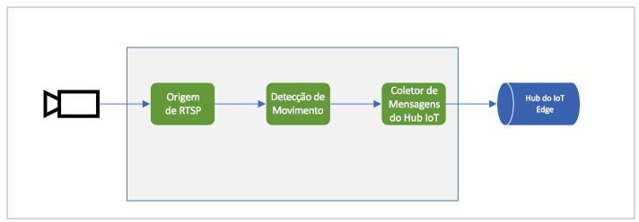

# <a name="quickstart-detect-motion-and-emit-events"></a>Início Rápido: Detectar movimento e emitir eventos

Este guia de início rápido orienta você pelas etapas para começar a usar a Análise de Vídeo ao vivo no IoT Edge. Ele usa uma VM do Azure como dispositivo IoT Edge e uma transmissão de vídeo ao vivo simulada. Depois de concluir as etapas de instalação, você poderá executar um fluxo de vídeo ao vivo simulado por meio de um grafo de mídia que detecta e relata qualquer movimento nesse fluxo. O diagrama a seguir mostra uma representação gráfica desse grafo de mídia.

 

Este artigo é baseado no [código de exemplo](https://github.com/Azure-Samples/live-video-analytics-iot-edge-csharp) escrito em C#.

## <a name="prerequisites"></a>Pré-requisitos

* Uma conta do Azure com uma assinatura ativa. [Crie uma conta gratuita](https://azure.microsoft.com/free/?WT.mc_id=A261C142F) se não tiver uma.
* [Visual Studio Code](https://code.visualstudio.com/) com as extensões a seguir:
    * [Ferramentas do Azure IoT](https://marketplace.visualstudio.com/items?itemName=vsciot-vscode.azure-iot-tools)
    * [C#](https://marketplace.visualstudio.com/items?itemName=ms-dotnettools.csharp)
* [SDK do .NET Core 3.1](https://dotnet.microsoft.com/download/dotnet-core/3.1). 

> [!TIP]
> Talvez você receba um prompt para instalar o Docker enquanto estiver instalando a extensão do Azure IoT Tools. Você pode ignorar o prompt.

## <a name="set-up-azure-resources"></a>Configurar recursos do Azure

Este tutorial requer os seguintes recursos do Azure:

* Hub IoT
* Conta de armazenamento
* Conta dos Serviços de Mídia do Azure
* VM do Linux no Azure, com o [runtime do IoT Edge](https://docs.microsoft.com/azure/iot-edge/how-to-install-iot-edge-linux) instalado

Para este início rápido, recomendamos que você use o [Script de instalação de recursos da Análise Dinâmica de Vídeo](https://github.com/Azure/live-video-analytics/tree/master/edge/setup) para implantar os recursos necessários em sua assinatura do Azure. Para fazer isso, siga estas etapas:

1. Abra o [Azure Cloud Shell](https://shell.azure.com).
1. Se estiver usando Cloud Shell pela primeira vez, você receberá um prompt para selecionar uma assinatura a fim de criar uma conta de armazenamento e um compartilhamento de Arquivos do Microsoft Azure. Selecione **Criar armazenamento** para criar uma conta de armazenamento para suas informações de sessão do Cloud Shell. Essa conta de armazenamento é separada da conta que o script criará para usar com sua conta dos Serviços de Mídia do Azure.
1. No menu suspenso no lado esquerdo da janela do Cloud Shell, selecione **Bash** como seu ambiente.

    

1. Execute o comando a seguir.

    ```
    bash -c "$(curl -sL https://aka.ms/lva-edge/setup-resources-for-samples)"
    ```

    Se o script for concluído com êxito, você verá todos os recursos necessários em sua assinatura.

1. Após a conclusão do script, clique nas chaves para expor a estrutura de pastas. Você verá alguns arquivos no diretório *~/clouddrive/lva-sample*. Os itens de interesse neste guia de início rápido são:

     * ***~/clouddrive/lva-sample/edge-deployment/.env*** – este arquivo contém propriedades que o Visual Studio Code usa para implantar módulos em um dispositivo de borda.
     * ***~/clouddrive/lva-sample/appsetting.json*** – o Visual Studio Code usa este arquivo para executar o código de exemplo.
     
Você precisará desses arquivos para configurar o ambiente de desenvolvimento no Visual Studio Code na próxima seção. Talvez você queira copiá-los para um arquivo local por enquanto.

 

## <a name="set-up-your-development-environment"></a>Configurar seu ambiente de desenvolvimento

1. Clone o repositório deste local: https://github.com/Azure-Samples/live-video-analytics-iot-edge-csharp.
1. No Visual Studio Code, abra a pasta na qual o repositório foi baixado.
1. No Visual Studio Code, navegue até a pasta *src/cloud-to-device-console-app*. Lá, crie um arquivo e dê a ele o nome *appsettings.json*. Esse arquivo vai conter as configurações necessárias para executar o programa.
1. Copie o conteúdo do arquivo *~/clouddrive/lva-sample/appsettings.json* que você gerou anteriormente neste início rápido.

    O texto deve ser semelhante à saída a seguir.

    ```
    {  
        "IoThubConnectionString" : "HostName=xxx.azure-devices.net;SharedAccessKeyName=iothubowner;SharedAccessKey=XXX",  
        "deviceId" : "lva-sample-device",  
        "moduleId" : "lvaEdge"  
    }
    ```
1. Vá até a pasta *src/edge* e crie um arquivo chamado *.env*.
1. Copie o conteúdo do arquivo */clouddrive/lva-sample/edge-deployment/.env*. O texto deve ser semelhante ao código a seguir.

    ```
    SUBSCRIPTION_ID="<Subscription ID>"  
    RESOURCE_GROUP="<Resource Group>"  
    AMS_ACCOUNT="<AMS Account ID>"  
    IOTHUB_CONNECTION_STRING="HostName=xxx.azure-devices.net;SharedAccessKeyName=iothubowner;SharedAccessKey=xxx"  
    AAD_TENANT_ID="<AAD Tenant ID>"  
    AAD_SERVICE_PRINCIPAL_ID="<AAD SERVICE_PRINCIPAL ID>"  
    AAD_SERVICE_PRINCIPAL_SECRET="<AAD SERVICE_PRINCIPAL ID>"  
    INPUT_VIDEO_FOLDER_ON_DEVICE="/home/lvaadmin/samples/input"  
    OUTPUT_VIDEO_FOLDER_ON_DEVICE="/home/lvaadmin/samples/input"
    APPDATA_FOLDER_ON_DEVICE="/var/local/mediaservices"
    CONTAINER_REGISTRY_USERNAME_myacr="<your container registry username>"  
    CONTAINER_REGISTRY_PASSWORD_myacr="<your container registry username>"      
    ```

## <a name="examine-the-sample-files"></a>Examinar os arquivos de exemplo

1. No Visual Studio Code, vá até *src/edge*. Você verá o arquivo *.env* e alguns arquivos do modelo de implantação.

    O modelo de implantação refere-se ao manifesto de implantação do dispositivo de borda, onde são usadas variáveis para algumas propriedades. O arquivo *.env* contém os valores dessas variáveis.
1. Vá até a pasta *src/cloud-to-device-console-app*. Aqui, você vê o arquivo *appsettings.json* e alguns outros arquivos:

    * ***c2d-console-app.csproj*** – o arquivo de projeto para o Visual Studio Code.
    * ***operations.json*** – uma lista das operações que você deseja que o programa execute.
    * ***Program.cs*** – o código do programa de exemplo. Esse código:
    
      * Carrega as configurações do aplicativo.
      * Invoca métodos diretos que são expostos pela Análise Dinâmica de Vídeo no módulo do IoT Edge. Use o módulo para analisar fluxos de vídeo ao vivo invocando seus [métodos diretos](direct-methods.md).
      * Pausa para você examinar a saída do programa na janela **TERMINAL** e os eventos gerados pelo módulo na janela **SAÍDA**.
      * Invoca métodos diretos para limpar recursos.   

## <a name="generate-and-deploy-the-deployment-manifest"></a>Gerar e implantar o manifesto de implantação

O manifesto de implantação define quais módulos são implantados em um dispositivo de borda. Ele também define as configurações desses módulos. 

Siga estas etapas para gerar o manifesto no arquivo de modelo e implantá-lo no dispositivo de borda.

1. Abra o Visual Studio Code.
1. Ao lado do painel **HUB IOT DO AZURE**, selecione o ícone **Mais ações** para definir a cadeia de conexão do Hub IoT. Copie a cadeia de caracteres do arquivo *src/cloud-to-device-console-app/appsettings.json*. 

    

1. Clique com o botão direito do mouse em **src/edge/deployment.template.json** e selecione **Gerar Manifesto de Implantação do IoT Edge**.

    

    Esta ação deve criar um arquivo de manifesto chamado *deployment.amd64.json* na pasta *src/edge/config*.
1. Clique com o botão direito do mouse em **src/edge/config/deployment.amd64.json**, selecione **Criar Implantação para Dispositivo Único** e selecione o nome do dispositivo de borda.

    

1. Quando receber um prompt para selecionar um dispositivo do Hub IoT, escolha **lva-sample-device** no menu suspenso.
1. Após cerca de 30 segundos, no canto inferior esquerdo da janela, atualize o Hub IoT do Azure. Agora, o dispositivo de borda mostra os seguintes módulos implantados:

    * Análise Dinâmica de Vídeo no IoT Edge (nome do módulo `lvaEdge`)
    * Simulador RTSP (Real-Time Streaming Protocol) (nome do módulo `rtspsim`)

O módulo do simulador RTSP simula um fluxo de vídeo ao vivo usando um arquivo de vídeo que foi copiado para o dispositivo de borda quando você executou o [script de instalação de recursos da Análise Dinâmica de Vídeo](https://github.com/Azure/live-video-analytics/tree/master/edge/setup). 

Neste estágio, os módulos estão implantados, mas nenhum grafo de mídia está ativo.

## <a name="prepare-to-monitor-events"></a>Preparar-se para monitorar eventos

Você usará o módulo da Análise Dinâmica de Vídeo no IoT Edge para detectar movimento no fluxo de vídeo ao vivo de entrada e enviar eventos para o Hub IoT. Para ver esses eventos, siga estas etapas:

1. Abra o painel do Explorer no Visual Studio Code e procure pelo Hub IoT do Azure no canto inferior esquerdo.
1. Expanda o nó **Dispositivos**.
1. Clique com o botão direito do mouse em **lva-sample-device** e selecione **Iniciar Monitoramento de Ponto de Extremidade de Evento Interno**.

    

## <a name="run-the-sample-program"></a>Executar o programa de exemplo

Siga estas etapas para executar o código de exemplo:

1. No Visual Studio Code, navegue até *src/cloud-to-device-console-app/operations.json*.
1. Sob o nó **GraphTopologySet**, verifique se você vê o seguinte valor:

    `"topologyUrl" : "https://raw.githubusercontent.com/Azure/live-video-analytics/master/MediaGraph/topologies/motion-detection/topology.json"`
1. Sob os nós **GraphInstanceSet** e **GraphTopologyDelete**, verifique se o valor de `topologyName` corresponde ao valor da propriedade `name` na topologia do grafo:

    `"topologyName" : "MotionDetection"`
    
1. Inicie uma sessão de depuração pressionando F5. A janela **TERMINAL** exibirá algumas mensagens.
1. O arquivo *operations.json* começa com chamadas para `GraphTopologyList` e `GraphInstanceList`. Se você limpou os recursos após a conclusão dos inícios rápidos anteriores, esse processo retornará listas vazias e, em seguida, pausará. Para continuar, pressione Enter.

    ```
    --------------------------------------------------------------------------
    Executing operation GraphTopologyList
    -----------------------  Request: GraphTopologyList  --------------------------------------------------
    {
        "@apiVersion": "1.0"
    }
    ---------------  Response: GraphTopologyList - Status: 200  ---------------
    {
        "value": []
    }
    --------------------------------------------------------------------------
    Executing operation WaitForInput
    Press Enter to continue
    ```

    A janela **TERMINAL** mostra o próximo conjunto de chamadas de método direto:
     
     * Uma chamada para `GraphTopologySet` que usa o `topologyUrl` anterior
     * Uma chamada para `GraphInstanceSet` que usa o seguinte corpo:
     
         ```
         {
           "@apiVersion": "1.0",
           "name": "Sample-Graph",
           "properties": {
             "topologyName": "MotionDetection",
             "description": "Sample graph description",
             "parameters": [
               {
                 "name": "rtspUrl",
                 "value": "rtsp://rtspsim:554/media/camera-300s.mkv"
               },
               {
                 "name": "rtspUserName",
                 "value": "testuser"
               },
               {
                 "name": "rtspPassword",
                 "value": "testpassword"
               }
             ]
           }
         }
         ```
     
     * Uma chamada para `GraphInstanceActivate` que inicia a instância do grafo e o fluxo de vídeo
     * Uma segunda chamada para `GraphInstanceList` que mostra que a instância do grafo está em estado de execução
1. A saída na janela **TERMINAL** pausa em `Press Enter to continue`. Não pressione Enter ainda. Role para cima para ver os conteúdos da resposta JSON para os métodos diretos que você invocou.
1. Alterne para a janela **SAÍDA** no Visual Studio Code. Você verá mensagens que o módulo da Análise Dinâmica de Vídeo no IoT Edge está enviando para o Hub IoT. A próxima seção deste início rápido aborda essas mensagens.
1. O grafo de mídia continua sendo executado e imprimindo resultados. O simulador RTSP mantém o loop do vídeo de origem. Para interromper o grafo de mídia, volte para a janela **TERMINAL** e selecione Enter. 

    A próxima série de chamadas limpa os recursos:
     * Uma chamada para `GraphInstanceDeactivate` desativa a instância do grafo.
     * Uma chamada para `GraphInstanceDelete` exclui a instância.
     * Uma chamada para `GraphTopologyDelete` exclui a topologia.
     * Uma chamada final para `GraphTopologyList` mostra que a lista está vazia.

## <a name="interpret-results"></a>Interpretar os resultados

Quando você executa o grafo de mídia, os resultados do nó do processador de detecção de movimento passam para o Hub IoT por meio do nó do coletor do Hub IoT. As mensagens que você vê na janela **SAÍDA** do Visual Studio Code contêm uma seção `body` e uma seção `applicationProperties`. Para obter mais informações, confira [Criar e ler mensagens do Hub IoT](https://docs.microsoft.com/azure/iot-hub/iot-hub-devguide-messages-construct).

Nas mensagens a seguir, o módulo da Análise Dinâmica de Vídeo define as propriedades do aplicativo e o conteúdo do corpo.

### <a name="mediasessionestablished-event"></a>Evento MediaSessionEstablished

Quando a instância de um grafo de mídia é criada, o nó de origem RTSP tenta se conectar com o servidor RTSP em execução no contêiner rtspsim-live555. Se a conexão for bem-sucedida, o evento a seguir será impresso.

```
[IoTHubMonitor] [9:42:18 AM] Message received from [lvaedgesample/lvaEdge]:  
{  
"body": {
"sdp": "SDP:\nv=0\r\no=- 1586450538111534 1 IN IP4 xxx.xxx.xxx.xxx\r\ns=Matroska video+audio+(optional)subtitles, streamed by the LIVE555 Media Server\r\ni=media/camera-300s.mkv\r\nt=0 0\r\na=tool:LIVE555 Streaming Media v2020.03.06\r\na=type:broadcast\r\na=control:*\r\na=range:npt=0-300.000\r\na=x-qt-text-nam:Matroska video+audio+(optional)subtitles, streamed by the LIVE555 Media Server\r\na=x-qt-text-inf:media/camera-300s.mkv\r\nm=video 0 RTP/AVP 96\r\nc=IN IP4 0.0.0.0\r\nb=AS:500\r\na=rtpmap:96 H264/90000\r\na=fmtp:96 packetization-mode=1;profile-level-id=4D0029;sprop-parameter-sets={SPS}\r\na=control:track1\r\n"  
},  
"applicationProperties": {  
    "dataVersion": "1.0",  
    "topic": "/subscriptions/{subscriptionID}/resourceGroups/{name}/providers/microsoft.media/mediaservices/hubname",  
    "subject": "/graphInstances/GRAPHINSTANCENAMEHERE/sources/rtspSource",  
    "eventType": "Microsoft.Media.MediaGraph.Diagnostics.MediaSessionEstablished",  
    "eventTime": "2020-04-09T16:42:18.1280000Z"  
    }  
}
```

Na saída anterior: 
* A mensagem é um evento de diagnóstico, `MediaSessionEstablished`. Ela indica que o nó de origem RTSP (o assunto) se conectou com o simulador RTSP e começou a receber um feed ao vivo (simulado).
* Em `applicationProperties`, `subject` faz referência ao nó na topologia do grafo do qual a mensagem foi gerada. Nesse caso, a mensagem é originada do nó de origem RTSP.
* Em `applicationProperties`, `eventType` indica que este é um evento de diagnóstico.
* O valor `eventTime` indica a hora em que o evento ocorreu.
* A seção `body` contém dados sobre o evento de diagnóstico. Nesse caso, os dados compreendem os detalhes do [SDP (Session Description Protocol)](https://en.wikipedia.org/wiki/Session_Description_Protocol).


### <a name="motiondetection-event"></a>Evento MotionDetection

Quando o movimento é detectado, o módulo da Análise Dinâmica de Vídeo no IoT Edge envia um evento de inferência. O `type` é definido como `motion` para indicar que se trata de um resultado do processador de detecção de movimento. O valor `eventTime` informa quando (em UTC) o movimento ocorreu. 

Veja um exemplo dessa mensagem:

```
  {  
  "body": {  
    "timestamp": 142843967343090,
    "inferences": [  
      {  
        "type": "motion",  
        "motion": {  
          "box": {  
            "l": 0.573222,  
            "t": 0.492537,  
            "w": 0.141667,  
            "h": 0.074074  
          }  
        }  
      }  
    ]  
  },  
  "applicationProperties": {  
    "topic": "/subscriptions/{subscriptionID}/resourceGroups/{name}/providers/microsoft.media/mediaservices/hubname",  
    "subject": "/graphInstances/GRAPHINSTANCENAME/processors/md",  
    "eventType": "Microsoft.Media.Graph.Analytics.Inference",  
    "eventTime": "2020-04-17T20:26:32.7010000Z",
    "dataVersion": "1.0"  
  }  
}  
```

Neste exemplo: 

* Em `applicationProperties`, `subject` faz referência ao nó do grafo de mídia no qual a mensagem foi gerada. Nesse caso, a mensagem é originada do nó processador de detecção de movimento.
* Em `applicationProperties`, `eventType` indica que este é um evento de análise.
* O valor `eventTime` é a hora em que o evento ocorreu.
* O valor `body` são dados sobre o evento de análise. Nesse caso, o evento é um evento de inferência, portanto, o corpo contém dados de `timestamp` e `inferences`.
* Os dados `inferences` indicam que o `type` é `motion`. Ele tem dados adicionais sobre esse evento `motion`.
* a seção `box` contém as coordenadas de uma caixa delimitadora em volta do objeto móvel. Os valores são normalizados pela largura e pela altura do vídeo em pixels. Para este exemplo, a largura é 1920 e a altura é 1080.

    ```
    l - distance from left of image
    t - distance from top of image
    w - width of bounding box
    h - height of bounding box
    ```
    
## <a name="clean-up-resources"></a>Limpar os recursos

Se você pretende experimentar outros inícios rápidos, mantenha os recursos criados. Caso contrário, no portal do Azure, navegue até seus grupos de recursos, selecione o grupo de recursos no qual você executou este início rápido e exclua todos os recursos.

## <a name="next-steps"></a>Próximas etapas

Execute os outros guias de início rápido, como a detecção de um objeto em um feed de vídeo ao vivo.        
