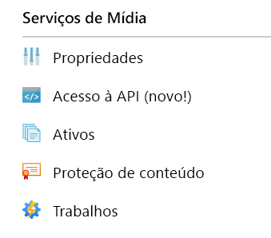
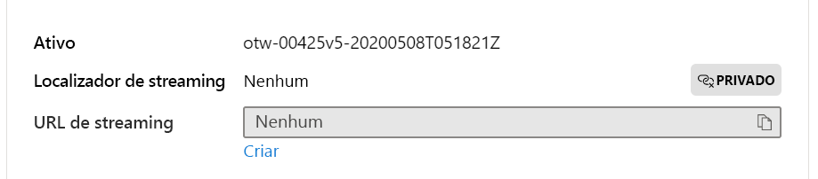

# <a name="quickstart-detect-motion-record-video-to-media-services"></a>Início Rápido: Detectar movimento e gravar vídeo em Serviços de Mídia

Este artigo explica como usar a Análise de Vídeo ao vivo no IoT Edge para [gravação baseada em evento](event-based-video-recording-concept.md). Ele usa uma VM Linux no Azure como dispositivo IoT Edge e uma transmissão de vídeo ao vivo simulada. Essa transmissão de vídeo é analisada quanto à presença de objetos em movimento. Quando o movimento é detectado, os eventos são enviados para o Hub IoT do Azure, e a parte relevante da transmissão de vídeo é gravada como um ativo nos Serviços de Mídia do Azure.

Este artigo se baseia no [início rápido Introdução](get-started-detect-motion-emit-events-quickstart.md).

## <a name="prerequisites"></a>Pré-requisitos

* Uma conta do Azure com uma assinatura ativa. [Crie uma conta gratuitamente](https://azure.microsoft.com/free/?WT.mc_id=A261C142F).
  > [!NOTE]
  > Você precisará ter uma assinatura do Azure com permissões para criar entidades de serviço (a **função de proprietário** fornece isso). Caso não tenha as permissões corretas, entre em contato com o administrador da conta para conceder a você as permissões corretas. 
* [Visual Studio Code](https://code.visualstudio.com/) em seu computador com a [extensão do Azure IoT Tools](https://marketplace.visualstudio.com/items?itemName=vsciot-vscode.azure-iot-tools).
* Se você não tiver concluído o [início rápido de Introdução](get-started-detect-motion-emit-events-quickstart.md) anteriormente, siga as etapas abaixo:
    * [Configurar recursos do Azure](get-started-detect-motion-emit-events-quickstart.md#set-up-azure-resources)
    * [Implantar módulos](get-started-detect-motion-emit-events-quickstart.md#deploy-modules-on-your-edge-device)
    * [Configurar o Visual Studio Code](get-started-detect-motion-emit-events-quickstart.md#configure-the-azure-iot-tools-extension)
    > [!TIP]
    > Se você tiver problemas com os recursos do Azure que são criados, confira nosso **[guia de solução de problemas](troubleshoot-how-to.md#common-error-resolutions)** para resolver alguns problemas encontrados com frequência.
## <a name="review-the-sample-video"></a>Examinar o vídeo de exemplo

Como parte das etapas acima para configurar os recursos do Azure, um vídeo (curto) de um estacionamento será copiado para a VM Linux no Azure que está sendo usada como o dispositivo IoT Edge. Esse arquivo de vídeo será usado para simular uma transmissão ao vivo para este tutorial.

Use um aplicativo como o [VLC Player](https://www.videolan.org/vlc/), inicie-o, clique em `Ctrl+N` e cole o link [do vídeo de exemplo de estacionamento](https://lvamedia.blob.core.windows.net/public/lots_015.mkv) para iniciar a reprodução. Na marca de aproximadamente 5 segundos, um carro branco percorre o estacionamento.
> [!VIDEO https://www.microsoft.com/en-us/videoplayer/embed/RE4LUbN]

Ao concluir as etapas abaixo, você terá usado a Análise de Vídeo ao vivo no IoT Edge para detectar esse movimento do carro e gravar um clipe de vídeo começando na marca de cerca de 5 segundos. O diagrama a seguir é a representação visual do fluxo geral.

> [!div class="mx-imgBorder"]
> :::image type="content" source="./media/quickstarts/topology.svg" alt-text="Gravação de vídeo baseada em evento em Ativos baseados em eventos em movimento":::

## <a name="use-direct-method-calls"></a>Usar chamadas de método direto

Você pode usar o módulo para analisar transmissões de vídeo ao vivo invocando os métodos diretos dele. Leia [Métodos Diretos para Análise de Vídeo ao vivo no IoT Edge](direct-methods.md) para entender todos os métodos diretos fornecidos pelo módulo. 

1. No Visual Studio Code, abra a guia **Extensões** (ou pressione CTRL + SHIFT + X) e pesquise pelo Hub IoT do Azure.
1. Clique com o botão direito do mouse e selecione **Configurações da Extensão**.

    > [!div class="mx-imgBorder"]
    > :::image type="content" source="./media/run-program/extensions-tab.png" alt-text="Configurações da Extensão":::
1. Pesquise e habilite “Mostrar Mensagem Detalhada”.

    > [!div class="mx-imgBorder"]
    > :::image type="content" source="./media/run-program/show-verbose-message.png" alt-text="Mostrar Mensagem Detalhada":::

### <a name="invoke-graphtopologylist"></a>Invocar GraphTopologyList
Esta etapa enumera todas as [topologias de grafo](media-graph-concept.md#media-graph-topologies-and-instances) no módulo.

1. Clique com o botão direito do mouse no módulo "lvaEdge" e selecione "Invocar Método Direto do Módulo" no menu de contexto.
1. Você verá uma caixa de edição aparecer no meio, na parte superior, da janela do Visual Studio Code. Insira "GraphTopologyList" na caixa de edição e pressione Enter.
1. Em seguida, copie e cole o conteúdo JSON abaixo na caixa de edição e pressione Enter.
    
```
{
    "@apiVersion" : "2.0"
}
```

Em alguns segundos, você verá a janela SAÍDA no pop-up do Visual Studio Code com a resposta a seguir
    
```
[DirectMethod] Invoking Direct Method [GraphTopologyList] to [lva-sample-device/lvaEdge] ...
[DirectMethod] Response from [lva-sample-device/lvaEdge]:
{
  "status": 200,
  "payload": {
    "value": []
  }
}
```
    
A resposta acima é esperada pois nenhuma topologia de grafo foi criada.

### <a name="invoke-graphtopologyset"></a>Invocar GraphTopologySet

Usando as mesmas etapas que aquelas descritas para invocar GraphTopologyList, você pode invocar GraphTopologySet para definir uma [topologia de grafo](media-graph-concept.md#media-graph-topologies-and-instances) usando o JSON a seguir como o conteúdo. Você criará uma topologia de grafo nomeada como "EVRtoAssetsOnMotionDetection".

```
{
    "@apiVersion": "2.0",
    "name": "EVRtoAssetsOnMotionDetection",
    "properties": {
      "description": "Event-based video recording to Assets based on motion events",
      "parameters": [
        {
            "name": "rtspUserName",
            "type": "String",
            "description": "rtsp source user name.",
            "default": "dummyUserName"
        },
        {
            "name": "rtspPassword",
            "type": "String",
            "description": "rtsp source password.",
            "default" : "dummyPassword"
        },
        {
            "name": "rtspUrl",
            "type": "String",
            "description": "rtsp Url"
        },
        {
            "name": "motionSensitivity",
            "type": "String",
            "description": "motion detection sensitivity",
            "default" : "medium"
        },
        {
            "name": "hubSinkOutputName",
            "type": "String",
            "description": "hub sink output name",
            "default" : "iothubsinkoutput"
        }                              
    ],         

      "sources": [
        {
          "@type": "#Microsoft.Media.MediaGraphRtspSource",
          "name": "rtspSource",
          "endpoint": {
            "@type": "#Microsoft.Media.MediaGraphUnsecuredEndpoint",
            "url": "${rtspUrl}",
            "credentials": {
              "@type": "#Microsoft.Media.MediaGraphUsernamePasswordCredentials",
              "username": "${rtspUserName}",
              "password": "${rtspPassword}"
            }
          }
        }
      ],
      "processors": [
        {
          "@type": "#Microsoft.Media.MediaGraphMotionDetectionProcessor",
          "name": "motionDetection",
          "sensitivity": "${motionSensitivity}",
          "inputs": [
            {
              "nodeName": "rtspSource"
            }
          ]
        },
        {
          "@type": "#Microsoft.Media.MediaGraphSignalGateProcessor",
          "name": "signalGateProcessor",
          "inputs": [
            {
              "nodeName": "motionDetection"
            },
            {
              "nodeName": "rtspSource"
            }
          ],
          "activationEvaluationWindow": "PT1S",
          "activationSignalOffset": "PT0S",
          "minimumActivationTime": "PT30S",
          "maximumActivationTime": "PT30S"
        }
      ],
      "sinks": [
        {
          "@type": "#Microsoft.Media.MediaGraphAssetSink",
          "name": "assetSink",
          "assetNamePattern": "sampleAssetFromEVR-LVAEdge-${System.DateTime}",
          "segmentLength": "PT0M30S",
          "localMediaCacheMaximumSizeMiB": "2048",
          "localMediaCachePath": "/var/lib/azuremediaservices/tmp/",
          "inputs": [
            {
              "nodeName": "signalGateProcessor"
            }
          ]
        },
        {
          "@type": "#Microsoft.Media.MediaGraphIoTHubMessageSink",
          "name": "hubSink",
          "hubOutputName": "${hubSinkOutputName}",
          "inputs": [
            {
              "nodeName": "motionDetection"
            }
          ]
        }
      ]
    }
}
```

O conteúdo JSON acima resulta na criação de uma topologia de grafo que define cinco parâmetros (quatro dos quais têm valores padrão). A topologia tem um nó de origem ([origem RTSP](media-graph-concept.md#rtsp-source)), dois nós de processador ([processador de detecção de movimento](media-graph-concept.md#motion-detection-processor) e [processador da porta de sinal](media-graph-concept.md#signal-gate-processor)) e dois nós de coletor (coletor do Hub IoT e [coletor de ativos](media-graph-concept.md#asset-sink)). A representação visual da topologia é mostrada acima.

Em poucos segundos, você verá a resposta a seguir na janela de **SAÍDA**.

```
[DirectMethod] Invoking Direct Method [GraphTopologySet] to [lva-sample-device/lvaEdge] ...
[DirectMethod] Response from [lva-sample-device/lvaEdge]:
{
  "status": 201,
  "payload": {
    "systemData": {
      "createdAt": "2020-05-12T22:05:31.603Z",
      "lastModifiedAt&quot;: &quot;2020-05-12T22:05:31.603Z"
    },
    "name": "EVRtoAssetsOnMotionDetection",
    "properties": {
      "description": "Event-based video recording to assets based on motion events",
      "parameters": [
        {
          "name": "rtspUserName",
          "type": "String",
          "description": "rtsp source user name.",
          "default&quot;: &quot;dummyUserName"
        },
        {
          "name": "rtspPassword",
          "type": "String",
          "description": "rtsp source password.",
          "default&quot;: &quot;dummyPassword"
        },
        {
          "name": "rtspUrl",
          "type": "String",
          "description&quot;: &quot;rtsp Url"
        },
        {
          "name": "motionSensitivity",
          "type": "String",
          "description": "motion detection sensitivity",
          "default&quot;: &quot;medium"
        },
        {
          "name": "hubSinkOutputName",
          "type": "String",
          "description": "hub sink output name",
          "default&quot;: &quot;iothubsinkoutput"
        }
      ],
      "sources": [
        {
          "@type": "#Microsoft.Media.MediaGraphRtspSource",
          "name": "rtspSource",
          "transport": "Tcp",
          "endpoint": {
            "@type": "#Microsoft.Media.MediaGraphUnsecuredEndpoint",
            "url": "${rtspUrl}",
            "credentials": {
              "@type": "#Microsoft.Media.MediaGraphUsernamePasswordCredentials",
              "username": "${rtspUserName}",
              "password&quot;: &quot;${rtspPassword}"
            }
          }
        }
      ],
      "processors": [
        {
          "@type": "#Microsoft.Media.MediaGraphMotionDetectionProcessor",
          "sensitivity": "${motionSensitivity}",
          "name": "motionDetection",
          "inputs": [
            {
              "nodeName": "rtspSource",
              "outputSelectors": []
            }
          ]
        },
        {
          "@type": "#Microsoft.Media.MediaGraphSignalGateProcessor",
          "activationEvaluationWindow": "PT1S",
          "activationSignalOffset": "PT0S",
          "minimumActivationTime": "PT30S",
          "maximumActivationTime": "PT30S",
          "name": "signalGateProcessor",
          "inputs": [
            {
              "nodeName": "motionDetection",
              "outputSelectors": []
            },
            {
              "nodeName": "rtspSource",
              "outputSelectors": []
            }
          ]
        }
      ],
      "sinks": [
        {
          "@type": "#Microsoft.Media.MediaGraphAssetSink",
          "localMediaCachePath": "/var/lib/azuremediaservices/tmp/",
          "localMediaCacheMaximumSizeMiB": "2048",
          "segmentLength": "PT0M30S",
          "assetNamePattern": "sampleAssetFromEVR-LVAEdge-${System.DateTime}",
          "name": "assetSink",
          "inputs": [
            {
              "nodeName": "signalGateProcessor",
              "outputSelectors": []
            }
          ]
        },
        {
          "@type": "#Microsoft.Media.MediaGraphIoTHubMessageSink",
          "hubOutputName": "${hubSinkOutputName}",
          "name": "hubSink",
          "inputs": [
            {
              "nodeName": "motionDetection",
              "outputSelectors": []
            }
          ]
        }
      ]
    }
  }
}
```

O status retornado é 201, indicando que uma nova topologia de grafo foi criada. Experimente os seguintes métodos diretos como próximas etapas:

* Invoque GraphTopologySet novamente e verifique se o código de status retornado é 200. O código de status 200 indica que uma topologia de grafo existente foi atualizada com êxito.
* Invoque GraphTopologySet novamente, mas altere a cadeia de caracteres de descrição. Verifique se o código de status na resposta é 200 e se a descrição foi atualizada para o novo valor.
* Invoque GraphTopologyList, conforme descrito na seção anterior, e verifique se agora você pode ver a topologia de grafo "EVRtoAssetsOnMotionDetection" no conteúdo retornado.

### <a name="invoke-graphtopologyget"></a>Invocar GraphTopologyGet

Agora invoque GraphTopologyGet com o conteúdo a seguir
```

{
    "@apiVersion" : "2.0",
    "name&quot; : &quot;EVRtoAssetsOnMotionDetection"
}
```

Em poucos segundos, você deverá ver a reposta a seguir na janela de Saída

```
[DirectMethod] Invoking Direct Method [GraphTopologyGet] to [lva-sample-device/lvaEdge] ...
[DirectMethod] Response from [lva-sample-device/lvaEdge]:
{
  "status": 200,
  "payload": {
    "systemData": {
      "createdAt": "2020-05-12T22:05:31.603Z",
      "lastModifiedAt&quot;: &quot;2020-05-12T22:05:31.603Z"
    },
    "name": "EVRtoAssetsOnMotionDetection",
    "properties": {
      "description": "Event-based video recording to Assets based on motion events",
      "parameters": [
        {
          "name": "rtspUserName",
          "type": "String",
          "description": "rtsp source user name.",
          "default&quot;: &quot;dummyUserName"
        },
        {
          "name": "rtspPassword",
          "type": "String",
          "description": "rtsp source password.",
          "default&quot;: &quot;dummyPassword"
        },
        {
          "name": "rtspUrl",
          "type": "String",
          "description&quot;: &quot;rtsp Url"
        },
        {
          "name": "motionSensitivity",
          "type": "String",
          "description": "motion detection sensitivity",
          "default&quot;: &quot;medium"
        },
        {
          "name": "hubSinkOutputName",
          "type": "String",
          "description": "hub sink output name",
          "default&quot;: &quot;iothubsinkoutput"
        }
      ],
      "sources": [
        {
          "@type": "#Microsoft.Media.MediaGraphRtspSource",
          "name": "rtspSource",
          "transport": "Tcp",
          "endpoint": {
            "@type": "#Microsoft.Media.MediaGraphUnsecuredEndpoint",
            "url": "${rtspUrl}",
            "credentials": {
              "@type": "#Microsoft.Media.MediaGraphUsernamePasswordCredentials",
              "username": "${rtspUserName}",
              "password&quot;: &quot;${rtspPassword}"
            }
          }
        }
      ],
      "processors": [
        {
          "@type": "#Microsoft.Media.MediaGraphMotionDetectionProcessor",
          "sensitivity": "${motionSensitivity}",
          "name": "motionDetection",
          "inputs": [
            {
              "nodeName": "rtspSource",
              "outputSelectors": []
            }
          ]
        },
        {
          "@type": "#Microsoft.Media.MediaGraphSignalGateProcessor",
          "activationEvaluationWindow": "PT1S",
          "activationSignalOffset": "PT0S",
          "minimumActivationTime": "PT30S",
          "maximumActivationTime": "PT30S",
          "name": "signalGateProcessor",
          "inputs": [
            {
              "nodeName": "motionDetection",
              "outputSelectors": []
            },
            {
              "nodeName": "rtspSource",
              "outputSelectors": []
            }
          ]
        }
      ],
      "sinks": [
        {
          "@type": "#Microsoft.Media.MediaGraphAssetSink",
          "localMediaCachePath": "/var/lib/azuremediaservices/tmp/",
          "localMediaCacheMaximumSizeMiB": "2048",
          "segmentLength": "PT0M30S",
          "assetNamePattern": "sampleAssetFromEVR-LVAEdge-${System.DateTime}",
          "name": "assetSink",
          "inputs": [
            {
              "nodeName": "signalGateProcessor",
              "outputSelectors": []
            }
          ]
        },
        {
          "@type": "#Microsoft.Media.MediaGraphIoTHubMessageSink",
          "hubOutputName": "${hubSinkOutputName}",
          "name": "hubSink",
          "inputs": [
            {
              "nodeName": "motionDetection",
              "outputSelectors": []
            }
          ]
        }
      ]
    }
  }
}
```

Observe as seguintes propriedades no conteúdo de resposta:

* O código de status é 200, indicando êxito.
* O conteúdo tem o carimbo de data/hora "created" e "lastModified".

### <a name="invoke-graphinstanceset"></a>Invocar GraphInstanceSet

Em seguida, crie uma instância de grafo que faça referência à topologia do grafo acima. Conforme explicado [aqui](media-graph-concept.md#media-graph-topologies-and-instances), as instâncias de grafo permitem analisar transmissões de vídeo ao vivo de muitas câmeras com a mesma topologia de grafo.

Agora invoque o método direto GraphInstanceSet com o seguinte conteúdo:

```
{
    "@apiVersion" : "2.0",
    "name" : "Sample-Graph-2",
    "properties" : {
        "topologyName" : "EVRtoAssetsOnMotionDetection",
        "description" : "Sample graph description",
        "parameters" : [
            { "name" : "rtspUrl", "value" : "rtsp://rtspsim:554/media/lots_015.mkv" }
        ]
    }
}
```

Observe o seguinte:

* O conteúdo acima especifica o nome da topologia de grafo (EVRtoAssetsOnMotionDetection) para o qual a instância de grafo precisa ser criada.
* O conteúdo contém um valor de parâmetro para "rtspUrl", que não tinha um valor padrão no conteúdo da topologia.

Em poucos segundos, você verá a resposta a seguir na janela Saída:

```
[DirectMethod] Invoking Direct Method [GraphInstanceSet] to [lva-sample-device/lvaEdge] ...
[DirectMethod] Response from [lva-sample-device/lvaEdge]:
{
  "status": 201,
  "payload": {
    "systemData": {
      "createdAt": "2020-05-12T23:30:20.666Z",
      "lastModifiedAt&quot;: &quot;2020-05-12T23:30:20.666Z"
    },
    "name": "Sample-Graph-2",
    "properties": {
      "state": "Inactive",
      "description": "Sample graph description",
      "topologyName": "EVRtoAssetsOnMotionDetection",
      "parameters": [
        {
          "name": "rtspUrl",
          "value&quot;: &quot;rtsp://rtspsim:554/media/lots_015.mkv"
        }
      ]
    }
  }
}
```

Observe as seguintes propriedades no conteúdo de resposta:

* O código de status é 201, indicando que uma instância foi criada.
* O estado é "Inativo", indicando que a instância do grafo foi criada, mas não ativada. Para obter mais informações, confira estados de [grafo de mídia](media-graph-concept.md).

Experimente os seguintes métodos diretos como próximas etapas:

* Invoque GraphInstanceSet novamente com o mesmo conteúdo e observe que o código de status retornado agora é 200.
* Invoque o GraphInstanceSet novamente, mas com uma descrição diferente e observe a descrição atualizada no conteúdo da resposta, indicando que a instância do grafo foi atualizada com êxito.
* Invoque GraphInstanceSet, mas altere o nome para "Sample-Graph-3" e observe o conteúdo de resposta. Observe que uma instância de grafo é criada (ou seja, o código de status é 201). Lembre-se de limpar essas instâncias duplicadas quando terminar o início rápido.

### <a name="prepare-for-monitoring-events"></a>Preparar-se para eventos de monitoramento

O grafo de mídia que você criou usa o nó do processador de detecção de movimento para detectar o movimento, e esses eventos são retransmitidos para o Hub IoT. Para se preparar para a observação desses eventos, siga estas etapas

1. Abra o painel do Explorer no Visual Studio Code e procure por Hub IoT do Azure, no canto inferior esquerdo.
1. Expanda o nó Dispositivos
1. Clique com o botão direito do mouse em lva-sample-device e escolha a opção "Iniciar Monitoramento de Eventos Interno"

    
    
    > [!NOTE]
    > Talvez você precise fornecer informações sobre o ponto de extremidade interno para o Hub IoT. Para obter essas informações, no portal do Azure, navegue até o Hub IoT e procure a opção **Pontos de extremidade internos** no painel de navegação à esquerda. Clique nele e procure o **Ponto de extremidade compatível com hub de eventos** na seção **Ponto de extremidade compatível com hub de eventos**. Copie e use o texto na caixa. O ponto de extremidade será parecido com este:  
        ```
        Endpoint=sb://iothub-ns-xxx.servicebus.windows.net/;SharedAccessKeyName=iothubowner;SharedAccessKey=XXX;EntityPath=<IoT Hub name>
        ```
    Em segundos, você verá as seguintes mensagens na janela de SAÍDA:

```
[IoTHubMonitor] Start monitoring message arrived in built-in endpoint for all devices ...
[IoTHubMonitor] Created partition receiver [0] for consumerGroup [$Default]
[IoTHubMonitor] Created partition receiver [1] for consumerGroup [$Default]
[IoTHubMonitor] Created partition receiver [2] for consumerGroup [$Default]
[IoTHubMonitor] Created partition receiver [3] for consumerGroup [$Default]
```

### <a name="invoke-graphinstanceactivate"></a>Invocar GraphInstanceActivate

Agora ative a instância do grafo, que inicia a transmissão de vídeo ao vivo por meio do módulo. Invoque o método direto GraphInstanceActivate com o seguinte conteúdo:

```
{
    "@apiVersion" : "2.0",
    "name" : "Sample-Graph-2"
}
```

Em poucos segundos, você deverá ver a reposta a seguir na janela de SAÍDA

```
[DirectMethod] Invoking Direct Method [GraphInstanceActivate] to [lva-sample-device/lvaEdge] ...
[DirectMethod] Response from [lva-sample-device/lvaEdge]:
{
  "status": 200,
  "payload": null
}
```

O código de status 200 no conteúdo da resposta indica que a instância do grafo foi ativada com êxito.

### <a name="invoke-graphinstanceget"></a>Invocar GraphInstanceGet

Agora invoque o método direto GraphInstanceGet com o seguinte conteúdo:

```
{
    "@apiVersion" : "2.0",
    "name&quot; : &quot;Sample-Graph-2"
}
```

Em poucos segundos, você deverá ver a reposta a seguir na janela de SAÍDA

```
[DirectMethod] Invoking Direct Method [GraphInstanceGet] to [lva-sample-device/lvaEdge] ...
[DirectMethod] Response from [lva-sample-device/lvaEdge]:
{
  "status": 200,
  "payload": {
    "systemData": {
      "createdAt": "2020-05-12T23:30:20.666Z",
      "lastModifiedAt&quot;: &quot;2020-05-12T23:30:20.666Z"
    },
    "name": "Sample-Graph-2",
    "properties": {
      "state": "Active",
      "description": "Sample graph description",
      "topologyName": "EVRtoAssetsOnMotionDetection",
      "parameters": [
        {
          "name": "rtspUrl",
          "value&quot;: &quot;rtsp://rtspsim:554/media/lots_015.mkv"
        }
      ]
    }
  }
}
```

Observe as seguintes propriedades no conteúdo de resposta:

* O código de status é 200, indicando êxito.
* O estado é "Ativo", indicando que a instância do grafo agora está no estado "Ativo".

## <a name="observe-results"></a>Observar os resultados

A instância do grafo que você criou e ativou acima usa o nó do processador de detecção de movimento para detectar o movimento na transmissão de vídeo ao vivo de entrada e envia eventos para o coletor do Hub IoT. Esses eventos são retransmitidos para o Hub IoT, que agora podem ser observados. Você verá as mensagens a seguir na janela de SAÍDA

```
[IoTHubMonitor] [4:33:04 PM] Message received from [lva-sample-device/lvaEdge]:
{
  "body": {
    "sdp&quot;: &quot;SDP:\nv=0\r\no=- 1589326384077235 1 IN IP4 XXX.XX.XX.XXX\r\ns=Matroska video+audio+(optional)subtitles, streamed by the LIVE555 Media Server\r\ni=media/lots_015.mkv\r\nt=0 0\r\na=tool:LIVE555 Streaming Media v2020.04.12\r\na=type:broadcast\r\na=control:*\r\na=range:npt=0-73.000\r\na=x-qt-text-nam:Matroska video+audio+(optional)subtitles, streamed by the LIVE555 Media Server\r\na=x-qt-text-inf:media/lots_015.mkv\r\nm=video 0 RTP/AVP 96\r\nc=IN IP4 0.0.0.0\r\nb=AS:500\r\na=rtpmap:96 H264/90000\r\na=fmtp:96 packetization-mode=1;profile-level-id=640028;sprop-parameter-sets=XXXXXXXXXXXXXXXXXXXXXXXXXXXXXXXXXXX\r\na=control:track1\r\n"
  },
  "applicationProperties": {
    "topic": "/subscriptions/{subscriptionId}/resourceGroups/{resourceGroupName}/providers/microsoft.media/mediaservices/{amsAccountName}",
    "subject": "/graphInstances/Sample-Graph-2/sources/rtspSource",
    "eventType": "Microsoft.Media.Graph.Diagnostics.MediaSessionEstablished",
    "eventTime": "2020-05-12T23:33:04.077Z",
    "dataVersion": "1.0"
  }
}
[IoTHubMonitor] [4:33:09 PM] Message received from [lva-sample-device/lvaEdge]:
{
  "body": {
    "timestamp": 143039375044290,
    "inferences": [
      {
        "type": "motion",
        "motion": {
          "box": {
            "l": 0.48954,
            "t": 0.140741,
            "w": 0.075,
            "h": 0.058824
          }
        }
      }
    ]
  },
  "applicationProperties": {
    "topic": "/subscriptions/{subscriptionId}/resourceGroups/{resourceGroupName}/providers/microsoft.media/mediaservices/{amsAccountName}",
    "subject": "/graphInstances/Sample-Graph-2/processors/md",
    "eventType": "Microsoft.Media.Graph.Analytics.Inference",
    "eventTime": "2020-05-12T23:33:09.381Z",
    "dataVersion&quot;: &quot;1.0"
  }
}
```

Observe as propriedades a seguir nas mensagens acima

* Cada mensagem contém uma seção “body” e uma seção “applicationproperties”. Para entender o que essas seções representam, leia o artigo [Criar e ler mensagem do Hub IoT](../../iot-hub/iot-hub-devguide-messages-construct.md).
* A primeira mensagem é um Evento de diagnóstico, MediaSessionEstablished, informando que o nó de Origem RTSP (assunto) foi capaz de estabelecer conexão com o simulador RTSP e começar a receber um feed ao vivo (simulado).
* O "assunto" em applicationProperties faz referência ao nó na topologia do grafo da qual a mensagem foi gerada. Nesse caso, a mensagem é originada do nó de origem RTSP.
* "eventType" em applicationProperties indica que se trata de um evento de diagnóstico.
* "eventTime" indica a hora em que o evento ocorreu.
* "body" contém dados sobre o evento de diagnóstico – é a mensagem [SDP](https://en.wikipedia.org/wiki/Session_Description_Protocol).
* A segunda mensagem é um evento de Análise. Você pode verificar se ela é enviada aproximadamente 5 segundos após a mensagem MediaSessionEstablished, que corresponde ao atraso entre o início do vídeo e quando o carro percorre o estacionamento.
* O "assunto" em applicationProperties faz referência ao nó do processador de detecção de movimento no grafo, que gerou essa mensagem
* O evento é um evento de inferência e, portanto, o corpo contém dados de "carimbo de data/hora" e "inferências".
* A seção "inferências" indica que o "tipo" é "movimento" e tem dados adicionais sobre o evento de "movimento".

A próxima mensagem que você verá é mostrada a seguir.

```
[IoTHubMonitor] [4:33:10 PM] Message received from [lva-sample-device/lvaEdge]:
{
  "body": {
    "outputType": "assetName",
    "outputLocation&quot;: &quot;sampleAssetFromEVR-LVAEdge-20200512T233309Z"
  },
  "applicationProperties": {
    "topic": "/subscriptions/{subscriptionId}/resourceGroups/{resourceGroupName}/providers/microsoft.media/mediaservices/{amsAccountName}",
    "subject": "/graphInstances/Sample-Graph-2/sinks/assetSink",
    "eventType": "Microsoft.Media.Graph.Operational.RecordingStarted",
    "eventTime": "2020-05-12T23:33:10.392Z",
    "dataVersion&quot;: &quot;1.0"
  }
}
```

* A terceira mensagem é um Evento operacional. Você pode verificar se ela é enviada quase imediatamente após a mensagem de detecção de movimento, que atua como o gatilho para iniciar a gravação.
* O "assunto" em applicationProperties faz referência ao nó do coletor de ativos no grafo, que gerou essa mensagem.
* O corpo contém informações sobre o local de saída, que, nesse caso, é o nome do ativo do Serviço de Mídia do Azure no qual o vídeo é gravado. Anote esse valor – você o usará posteriormente no início rápido.

Na topologia, o nó do processador da porta de sinal foi configurado com tempos de ativação de 30 segundos, que significa que a topologia de grafo gravará cerca de 30 segundos de vídeo no ativo. Enquanto o vídeo está sendo gravado, o nó do processador de detecção de movimento continuará emitindo Eventos de inferência, que aparecerão na janela de SAÍDA. Depois desse tempo, você verá a seguinte mensagem de erro.

```
[IoTHubMonitor] [4:33:31 PM] Message received from [lva-sample-device/lvaEdge]:
{
  "body": {
    "outputType": "assetName",
    "outputLocation&quot;: &quot;sampleAssetFromEVR-LVAEdge-20200512T233309Z"
  },
  "applicationProperties": {
    "topic": "/subscriptions/{subscriptionId}/resourceGroups/{resourceGroupName}/providers/microsoft.media/mediaservices/{amsAccountName}",
    "subject": "/graphInstances/Sample-Graph-2/sinks/assetSink",
    "eventType": "Microsoft.Media.Graph.Operational.RecordingAvailable",
    "eventTime": "2020-05-12T23:33:31.051Z",
    "dataVersion&quot;: &quot;1.0"
  }
}
```

* Essa mensagem também é um Evento operacional. O evento, RecordingAvailable, indica que dados suficientes foram escritos no Ativo para players/clientes iniciarem a reprodução do vídeo
* O "assunto" em applicationProperties faz referência ao nó do coletor de ativos no grafo, que gerou essa mensagem
* O corpo contém informações sobre o local de saída, que, nesse caso, é o nome do ativo do Serviço de Mídia do Azure no qual o vídeo é gravado.

Se você deixar a instância do grafo continuar sendo executada, você verá esta mensagem.

```
[IoTHubMonitor] [4:33:40 PM] Message received from [lva-sample-device/lvaEdge]:
{
  "body": {
    "outputType": "assetName",
    "outputLocation&quot;: &quot;sampleAssetFromEVR-LVAEdge-20200512T233309Z"
  },
  "applicationProperties": {
    "topic": "/subscriptions/{subscriptionId}/resourceGroups/{resourceGroupName}/providers/microsoft.media/mediaservices/{amsAccountName}",
    "subject": "/graphInstances/Sample-Graph-2/sinks/assetSink",
    "eventType": "Microsoft.Media.Graph.Operational.RecordingStopped",
    "eventTime": "2020-05-12T23:33:40.014Z",
    "dataVersion&quot;: &quot;1.0"
  }
}
```

* Essa mensagem também é um Evento operacional. O evento, RecordingStopped, indica que a gravação foi interrompida.
* Observe que decorreram cerca de 30 segundos desde o evento RecordingStarted, correspondendo aos valores dos tempos de ativação no nó do processador da porta do sinal.
* O "assunto" em applicationProperties faz referência ao nó do coletor de ativos no grafo, que gerou essa mensagem.
* O corpo contém informações sobre o local de saída, que, nesse caso, é o nome do ativo do Serviço de Mídia do Azure no qual o vídeo é gravado.

Se você permitir que a instância de grafo continue sendo executada, o simulador RTSP atingirá o final do arquivo de vídeo e será parado/desconectado. O nó de origem RTSP será reconectado ao simulador e o processo será repetido.
    
## <a name="invoke-additional-direct-method-calls-to-clean-up"></a>Invocar chamadas de método direto adicionais para limpeza

Agora invoque métodos diretos para desativar e excluir a instância de grafo (nessa ordem).

### <a name="invoke-graphinstancedeactivate"></a>Invocar GraphInstanceDeactivate

Invoque o método direto GraphInstanceDeactivate com o seguinte conteúdo:

```
{
    "@apiVersion" : "2.0",
    "name" : "Sample-Graph-2"
}
```

Em poucos segundos, você deverá ver a reposta a seguir na janela de SAÍDA.

```
[DirectMethod] Invoking Direct Method [GraphInstanceDeactivate] to [lva-sample-device/lvaEdge] ...
[DirectMethod] Response from [lva-sample-device/lvaEdge]:
{
  "status": 200,
  "payload": null
}
```

O código de status 200 indica que a instância do grafo foi desativada com êxito.

Experimente o seguinte como próximas etapas:

* Invoque GraphInstanceGet conforme indicado nas seções anteriores e observe o valor de "state".

### <a name="invoke-graphinstancedelete"></a>Invocar GraphInstanceDelete

Invoque o método direto GraphInstanceDelete com o conteúdo a seguir

```
{
    "@apiVersion" : "2.0",
    "name&quot; : &quot;Sample-Graph-2"
}
```

Em poucos segundos, você deverá ver a reposta a seguir na janela de SAÍDA.

```
[DirectMethod] Invoking Direct Method [GraphInstanceDelete] to [lva-sample-device/lvaEdge] ...
[DirectMethod] Response from [lva-sample-device/lvaEdge]:
{
  "status": 200,
  "payload": null
}
```

O código de status 200 na resposta indica que a instância do grafo foi excluída com êxito.

### <a name="invoke-graphtopologydelete"></a>Invocar GraphTopologyDelete

Invoque o método direto GraphTopologyDelete com o seguinte conteúdo:

```
{
    "@apiVersion" : "2.0",
    "name&quot; : &quot;EVRtoAssetsOnMotionDetection"
}
```

Em poucos segundos, você deverá ver a reposta a seguir na janela de SAÍDA

```
[DirectMethod] Invoking Direct Method [GraphTopologyDelete] to [lva-sample-device/lvaEdge] ...
[DirectMethod] Response from [lva-sample-device/lvaEdge]:
{
  "status": 200,
  "payload": null
}
```

O código de status de 200 indica que a topologia MediaGraph foi excluída com êxito.

Experimente os seguintes métodos diretos como próximas etapas:

* Invoque GraphTopologyList e observe que não há topologias de grafo no módulo.
* Invoque GraphInstanceList com o mesmo conteúdo que GraphTopologyList e observe que não há instâncias de grafo enumeradas.

## <a name="playing-back-the-recorded-video"></a>Reproduzir o vídeo gravado

Em seguida, você pode usar o portal do Azure para reproduzir o vídeo que você gravou.

1. Faça logon no [portal do Azure](https://portal.azure.com/), digite "Serviços de Mídia" na caixa de pesquisa.
1. Localize sua conta dos Serviços de Mídia do Azure e abra-a.
1. Localize e selecione a entrada Ativos na listagem Serviços de Mídia.

    
1. Se este início rápido for seu primeiro uso dos Serviços de Mídia do Azure, somente os ativos gerados neste guia de início rápido serão listados e você poderá escolher o mais antigo.
1. Caso contrário, use o nome do ativo que foi fornecido como o outputLocation nos Eventos operacionais acima.
1. Na página de detalhes que é aberta, clique no link "Criar" logo abaixo da caixa de texto URL de Streaming.

    
1. No painel aberto para "Adicionar localizador de streaming", aceite os padrões e pressione "Adicionar" na parte inferior.
1. Na página Detalhes do ativo, o player de vídeo agora deve carregar para o primeiro quadro do vídeo e você pode pressionar o botão reproduzir. Verifique se você vê a parte do vídeo em que o carro está se movendo pelo estacionamento.

    

> [!NOTE]
> Como o vídeo ao vivo simulado é iniciado quando você ativa o grafo, os valores de hora do dia não são relevantes e não são expostos por meio deste atalho do player. O tutorial sobre gravação e reprodução de vídeo contínuas mostra como você pode exibir os carimbos de data/hora.

## <a name="clean-up-resources"></a>Limpar os recursos

Se você não vai continuar usando este aplicativo, exclua os recursos que você criou neste guia de início rápido.

## <a name="next-steps"></a>Próximas etapas

* Saiba como invocar [métodos diretos](direct-methods.md) da Análise de Vídeo ao vivo no IoT Edge programaticamente.
* Saiba mais sobre as mensagens de diagnóstico.    
