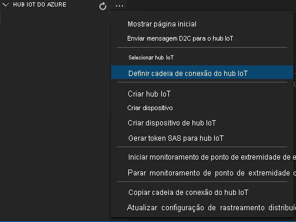
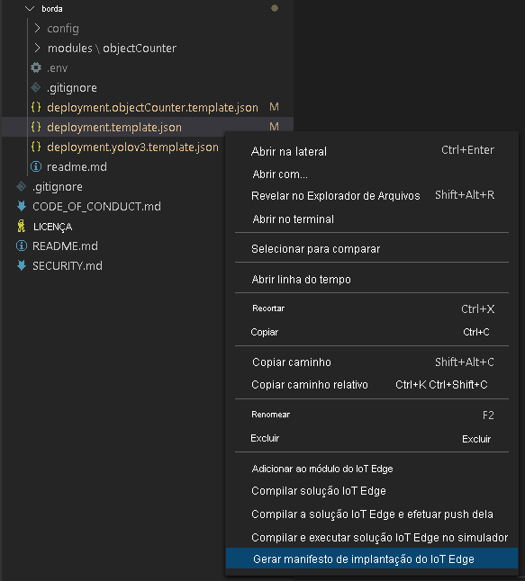
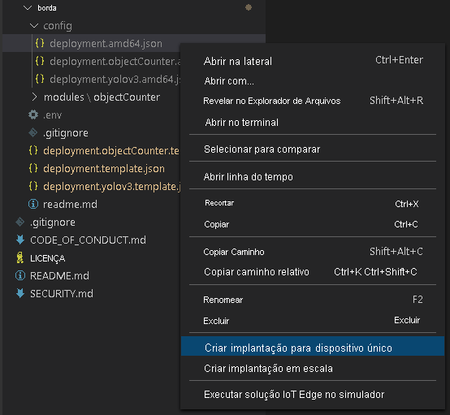

O manifesto de implantação define quais módulos são implantados em um dispositivo de borda. Ele também define as configurações desses módulos. 

Siga estas etapas para gerar o manifesto no arquivo de modelo e implantá-lo no dispositivo de borda.

1. Abra o Visual Studio Code.
1. Ao lado do painel **HUB IOT DO AZURE**, selecione o ícone **Mais ações** para definir a cadeia de conexão do Hub IoT. Copie a cadeia de caracteres do arquivo *src/cloud-to-device-console-app/appsettings.json*. 

    

> [!NOTE]
> Talvez você precise fornecer informações do ponto de extremidade interno para o Hub IoT. Para obter essas informações, no portal do Azure, navegue até o Hub IoT e procure a opção **Pontos de extremidade internos** no painel de navegação à esquerda. Clique nele e procure o **Ponto de extremidade compatível com hub de eventos** na seção **Ponto de extremidade compatível com hub de eventos**. Copie e use o texto na caixa. O ponto de extremidade será algo parecido com isto:  
    ```
    Endpoint=sb://iothub-ns-xxx.servicebus.windows.net/;SharedAccessKeyName=iothubowner;SharedAccessKey=XXX;EntityPath=<IoT Hub name>
    ```

1. Clique com o botão direito do mouse em **src/edge/deployment.template.json** e selecione **Gerar Manifesto de Implantação do IoT Edge**.

    

    Esta ação deve criar um arquivo de manifesto chamado *deployment.amd64.json* na pasta *src/edge/config*.
1. Clique com o botão direito do mouse em **src/edge/config/deployment.amd64.json**, selecione **Criar Implantação para Dispositivo Único** e selecione o nome do dispositivo de borda.

    

1. Quando receber um prompt para selecionar um dispositivo do Hub IoT, escolha **lva-sample-device** no menu suspenso.
1. Após cerca de 30 segundos, no canto inferior esquerdo da janela, atualize o Hub IoT do Azure. Agora, o dispositivo de borda mostra os seguintes módulos implantados:

    * Análise Dinâmica de Vídeo no IoT Edge (nome do módulo `lvaEdge`)
    * Simulador RTSP (Real-Time Streaming Protocol) (nome do módulo `rtspsim`)

O módulo do simulador RTSP simula um fluxo de vídeo ao vivo usando um arquivo de vídeo que foi copiado para o dispositivo de borda quando você executou o [script de instalação de recursos da Análise Dinâmica de Vídeo](https://github.com/Azure/live-video-analytics/tree/master/edge/setup). 

> [!NOTE]
> Se você estiver usando o próprio dispositivo de borda em vez de um provisionado pelo nosso script de instalação, acesse o dispositivo de borda e execute os seguintes comandos com **direitos de administrador**, para efetuar pull e armazenar o arquivo de vídeo de exemplo usado neste guia de início rápido:  

```
mkdir /home/lvaedgeuser/samples      
mkdir /home/lvaedgeuser/samples/input    
curl https://lvamedia.blob.core.windows.net/public/camera-300s.mkv > /home/lvaedgeuser/samples/input/camera-300s.mkv  
chown -R lvalvaedgeuser:localusergroup /home/lvaedgeuser/samples/  
```
Neste estágio, os módulos estão implantados, mas nenhum grafo de mídia está ativo.
