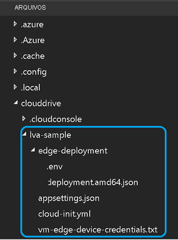

Este tutorial requer os seguintes recursos do Azure:

* Hub IoT
* Conta de armazenamento
* Conta dos Serviços de Mídia do Azure
* VM do Linux no Azure, com o [runtime do IoT Edge](../../../../../iot-edge/how-to-install-iot-edge.md) instalado

Para este início rápido, recomendamos que você use o [Script de instalação de recursos da Análise Dinâmica de Vídeo](https://github.com/Azure/live-video-analytics/tree/master/edge/setup) para implantar os recursos necessários em sua assinatura do Azure. Para fazer isso, siga estas etapas:

1. Abra o [Azure Cloud Shell](https://ms.portal.azure.com/#cloudshell/).
    > [!div class="mx-imgBorder"]
    > :::image type="content" source="../../../media/quickstarts/cloud-shell.png" alt-text="Cloud Shell":::
1. Se estiver usando Cloud Shell pela primeira vez, você receberá um prompt para selecionar uma assinatura a fim de criar uma conta de armazenamento e um compartilhamento de Arquivos do Microsoft Azure. Selecione **Criar armazenamento** para criar uma conta de armazenamento para suas informações de sessão do Cloud Shell. Essa conta de armazenamento é separada da conta que o script criará para usar com sua conta dos Serviços de Mídia do Azure.
1. No menu suspenso no lado esquerdo da janela do Cloud Shell, selecione **Bash** como seu ambiente.

    
1. Execute o comando a seguir.

    ```
    bash -c "$(curl -sL https://aka.ms/lva-edge/setup-resources-for-samples)"
    ```
    
    Após a conclusão bem-sucedida do script, você deverá ver todos os recursos necessários em sua assinatura. Um total de 12 recursos serão configurados pelo script:
    1. **Ponto de extremidade de streaming**: isso ajudará na reprodução do ativo do AMS gravado.
    1. **Máquina virtual**: essa é uma máquina virtual que funcionará como seu dispositivo de borda.
    1. **Disco**: esse é um disco de armazenamento anexado à máquina virtual para armazenar mídia e artefatos.
    1. **Grupo de segurança de rede**: usado para filtrar o tráfego de rede entre os recursos do Azure em uma rede virtual do Azure.
    1. **Adaptador de rede**: permite que uma Máquina Virtual do Azure se comunique com a Internet, o Azure e outros recursos.
    1. **Conexão do bastion**: permite que você se conecte à máquina virtual usando o navegador e o portal do Azure.
    1. **Endereço IP público**: permite que os recursos do Azure se comuniquem com a Internet e os serviços do Azure voltados ao público
    1. **Rede virtual**: permite a comunicação segura mútua de muitos tipos de recursos do Azure, como a sua máquina virtual, bem como com a Internet e as redes locais. Saiba mais sobre [Redes virtuais](../../../../../virtual-network/virtual-networks-overview.md)
    1. **Hub IoT**: funciona como um hub central de mensagens para comunicação bidirecional entre o aplicativo de IoT, os módulos do IoT Edge e os dispositivos gerenciados por ele.
    1. **Conta do serviço de mídia**: ajuda a gerenciar e transmitir o conteúdo de mídia no Azure.
    1. **Conta de armazenamento**: você precisa ter uma conta de armazenamento Primária e pode ter quantas contas de armazenamento Secundárias quiser associadas à sua conta dos Serviços de Mídia. Para obter mais informações, confira [Contas do Armazenamento do Azure com as contas dos Serviços de Mídia do Azure](../../../../latest/storage-account-concept.md).
    1. **Registro de contêiner**: ajuda a armazenar e gerenciar suas imagens particulares de contêiner do Docker e artefatos relacionados.
1. Após a conclusão do script, clique nas chaves para expor a estrutura de pastas. Você verá alguns arquivos no diretório *~/clouddrive/lva-sample*. Os itens de interesse neste guia de início rápido são:

     * ***~/clouddrive/lva-sample/edge-deployment/.env*** – este arquivo contém propriedades que o Visual Studio Code usa para implantar módulos em um dispositivo de borda.
     * ***~/clouddrive/lva-sample/appsetting.json*** – o Visual Studio Code usa este arquivo para executar o código de exemplo.
     
    Você precisará desses arquivos para configurar o ambiente de desenvolvimento no Visual Studio Code na próxima seção. Talvez você queira copiá-los para um arquivo local por enquanto.
    
    

> [!TIP]
> Se você tiver problemas com os recursos do Azure que são criados, confira nosso **[guia de solução de problemas](../../../troubleshoot-how-to.md#common-error-resolutions)** para resolver alguns problemas encontrados com frequência.