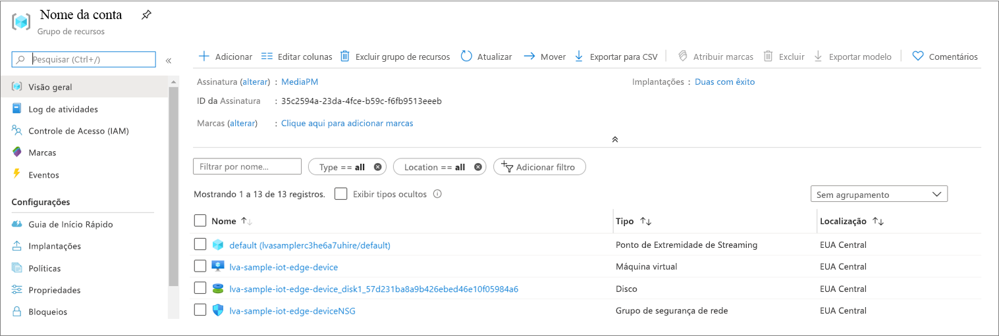
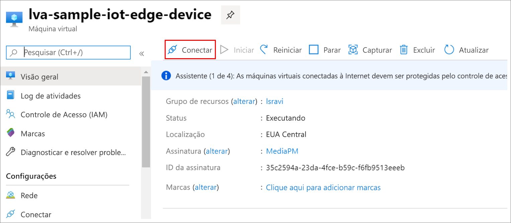

Os arquivos MP4 são gravados em um diretório no dispositivo de borda que você configurou no arquivo *.env* usando a chave OUTPUT_VIDEO_FOLDER_ON_DEVICE. Se você usou o valor padrão, os resultados devem estar na pasta */var/media/* .

Para reproduzir o clipe MP4:

1. Acesse o grupo de recursos, localize a VM e conecte-se usando o Azure Bastion.

    
    
    
1. Entre usando as credenciais que foram geradas quando você [configurou os recursos do Azure](../../../detect-motion-emit-events-quickstart.md#set-up-azure-resources). 
1. No prompt de comando, vá para o diretório relevante. A localização padrão é */var/media*. Você deve ver os arquivos MP4 no diretório.

     

1. Use a [Cópia Segura (CSP)](../../../../../virtual-machines/linux/copy-files-to-linux-vm-using-scp.md) para copiar os arquivos para o computador local. 
1. Execute os arquivos usando o [VLC media player](https://www.videolan.org/vlc/) ou qualquer outro player de MP4.
