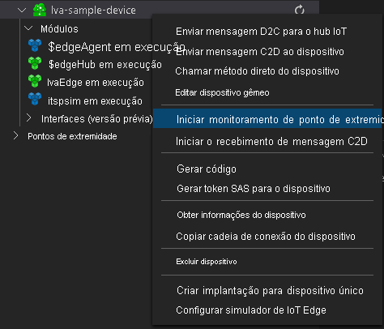

Verifique se você concluiu as etapas para [Preparar-se para monitorar eventos](../../../detect-motion-emit-events-quickstart.md#prepare-to-monitor-events).



> [!NOTE]
> Talvez você precise fornecer informações sobre o ponto de extremidade interno para o Hub IoT. Para obter essas informações, no portal do Azure, navegue até o Hub IoT e procure a opção **Pontos de extremidade internos** no painel de navegação à esquerda. Clique nele e procure o **Ponto de extremidade compatível com hub de eventos** na seção **Ponto de extremidade compatível com hub de eventos**. Copie e use o texto na caixa. O ponto de extremidade será parecido com este:  
    ```
    Endpoint=sb://iothub-ns-xxx.servicebus.windows.net/;SharedAccessKeyName=iothubowner;SharedAccessKey=XXX;EntityPath=<IoT Hub name>
    ```
