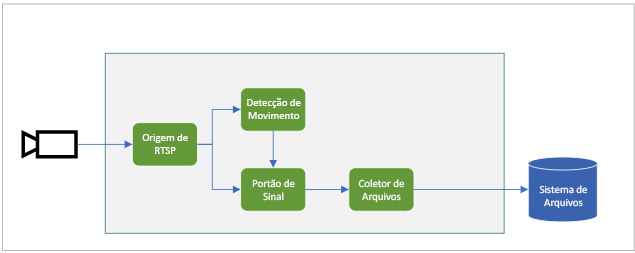

O diagrama anterior mostra como os sinais fluem neste guia de início rápido. [Um módulo de borda](https://github.com/Azure/live-video-analytics/tree/master/utilities/rtspsim-live555) simula uma câmera IP que hospeda um servidor RTSP (Real-Time Streaming Protocol). Um nó de [origem RTSP](../../../media-graph-concept.md#rtsp-source) efetua pull do feed de vídeo desse servidor e envia quadros de vídeo para o nó do [processador de detecção de movimento](../../../media-graph-concept.md#motion-detection-processor). A origem RTSP envia os mesmos quadros de vídeo para um nó do [processador de porta de sinal](../../../media-graph-concept.md#signal-gate-processor), que permanece fechado até que seja disparado por um evento.

Quando o processador de detecção de movimento detecta o movimento no vídeo, ele envia um evento para o nó do processador de porta de sinal, disparando-o. A porta é aberta durante o tempo configurado, enviando quadros de vídeo para o nó do [coletor de arquivos](../../../media-graph-concept.md#file-sink). O nó do coletor grava o vídeo como um arquivo MP4 no sistema de arquivos local de seu dispositivo de borda. O arquivo é salvo no local configurado.

Neste guia de início rápido, você vai:

1. Criar e implantar o grafo de mídia.
1. Interpretar os resultados.
1. Limpar os recursos.
