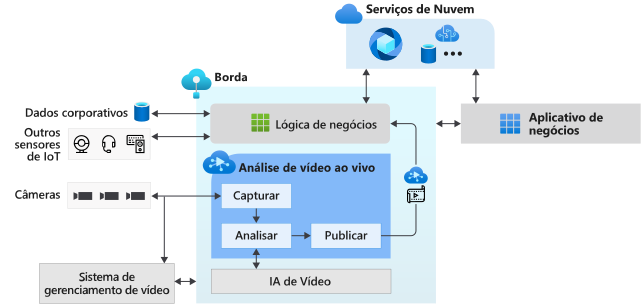

# O que é a Análise de Vídeo ao vivo no IoT Edge? (versão prévia)

A Análise de Vídeo ao vivo no IoT Edge fornece uma plataforma para criar aplicativos de vídeo inteligentes que abrangem a borda e a nuvem. A plataforma oferece a capacidade de capturar, gravar e analisar vídeos ao vivo, juntamente com a publicação dos resultados (análise de vídeo e/ou vídeo) nos serviços do Azure (na nuvem e/ou na borda). A plataforma pode ser usada para aprimorar soluções de IoT com análise de vídeo. A funcionalidade Análise de Vídeo ao vivo no IoT Edge pode ser combinada com outros módulos do Azure IoT Edge, como Stream Analytics no IoT Edge, Serviços Cognitivos no IoT Edge, bem como serviços do Azure na nuvem, como Serviços de Mídia, Hub de Eventos, Serviços Cognitivos etc. para criar aplicativos híbridos e sofisticados (por exemplo, borda + nuvem).

A Análise de Vídeo ao vivo no IoT Edge foi projetada para ser uma plataforma extensível, permitindo conectar diferentes módulos de borda de análise de vídeo (como contêineres dos Serviços Cognitivos, módulos de borda personalizados criados por você com modelos de machine learning de software livre ou modelos personalizados treinados com seus próprios dados) e usá-los para analisar o vídeo ao vivo sem se preocupar com a complexidade de criar e executar um pipeline de vídeo ao vivo.

## Acelerar o desenvolvimento de soluções de IoT 

As soluções de IoT que combinam a análise de vídeo com sinais de outros sensores de IoT e/ou dados da empresa podem ajudar você a automatizar ou semiautomatizar decisões de negócios, o que resulta em melhorias na produtividade. A Análise de Vídeo ao Vivo no IoT Edge permite que você crie essas soluções mais rapidamente. Você pode se concentrar na criação dos módulos de análise de vídeo e na lógica específica para a sua empresa e permitir que a plataforma oculte as complexidades do gerenciamento e da execução de um pipeline de vídeo.

Com a Análise de Vídeo ao vivo no IoT Edge, você pode continuar a usar [câmeras CCTV](https://en.wikipedia.org/wiki/Closed-circuit_television_camera) com os [VMS (sistemas de gerenciamento de vídeo)](https://en.wikipedia.org/wiki/Video_management_system) existentes e criar aplicativos de análise de vídeo de maneira independente. A Análise de Vídeo ao vivo no IoT Edge pode ser usada em conjunto com SDKs e kits de ferramentas de pesquisa visual computacional para criar soluções de IoT de ponta. O diagrama abaixo ilustra isso.

## Ambientes compatíveis

Há suporte para ambientes Linux x86-64 e ARM64.
> [!NOTE]
> O suporte para dispositivos ARM64 está disponível em builds `1.0.4` e mais recentes.
> O suporte para executar o runtime do Azure IoT Edge em dispositivos ARM64 está em [versão prévia pública](https://azure.microsoft.com/support/legal/preview-supplemental-terms/).

## Introdução

Leia os seguintes artigos conceituais e experimente um início rápido para executar a detecção de movimento em um feed de vídeo ao vivo.

### Conceitos

* [Grafo de mídia](media-graph-concept.md)
* [Gravação de vídeo](video-recording-concept.md)
* [Reprodução de vídeo](video-playback-concept.md)
* [Gravação de vídeo contínua](continuous-video-recording-concept.md)
* [Gravação de vídeo baseada em eventos](event-based-video-recording-concept.md)
* [Análise de Vídeo ao vivo sem gravação de vídeo](analyze-live-video-concept.md)

## Próximas etapas

* Siga o tutorial [Início rápido: Execute a Análise de Vídeo ao vivo com seu próprio modelo](use-your-model-quickstart.md) para ver como você executar a detecção de movimento em um feed de vídeo ao vivo.
* Examinar e [terminologia](terminology.md)
* Explorar o [Material de software livre da Análise de Vídeo ao vivo](https://github.com/Azure/live-video-analytics)

