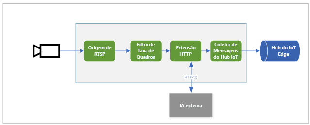

# <a name="quickstart-analyze-live-video-by-using-your-own-model"></a>Início Rápido: Analisar vídeo ao vivo usando seu próprio modelo

Este início rápido mostra como usar a Análise Dinâmica de Vídeo no IoT Edge para analisar um feed de vídeo ao vivo de uma câmera IP (simulada). Você verá como aplicar um modelo pesquisa visual computacional para detectar objetos. Um subconjunto dos quadros no feed de vídeo ao vivo é enviado para um serviço de inferência. Os resultados são enviados ao Hub do IoT Edge. 

Este início rápido usa uma VM do Azure como dispositivo do IoT Edge e um fluxo de vídeo ao vivo simulado. Ele é baseado em um código de exemplo escrito em C# e no início rápido [Detectar movimento e emitir eventos](detect-motion-emit-events-quickstart.md). 

## <a name="prerequisites"></a>Pré-requisitos

* Uma conta do Azure que inclua uma assinatura ativa. [Crie uma conta gratuita](https://azure.microsoft.com/free/?WT.mc_id=A261C142F) se não tiver uma.
* [Visual Studio Code](https://code.visualstudio.com/) com as extensões a seguir:
    * [Ferramentas do Azure IoT](https://marketplace.visualstudio.com/items?itemName=vsciot-vscode.azure-iot-tools)
    * [C#](https://marketplace.visualstudio.com/items?itemName=ms-dotnettools.csharp)
* [SDK do .NET Core 3.1](https://dotnet.microsoft.com/download/dotnet-core/3.1).
* Se não tiver concluído o início rápido [detectar eventos de movimento e emissão](detect-motion-emit-events-quickstart.md), não deixe de [configurar os recursos do Azure](detect-motion-emit-events-quickstart.md#set-up-azure-resources).

> [!TIP]
> Ao instalar o Azure IoT Tools, talvez você receba um prompt para instalar o Docker. Você pode ignorar o prompt.

## <a name="review-the-sample-video"></a>Examinar o vídeo de exemplo
Quando você configura os recursos do Azure, um vídeo curto do tráfego em uma rodovia é copiado para a VM Linux no Azure que você está usando como o dispositivo do IoT Edge. Este guia de início rápido usa o arquivo de vídeo para simular uma transmissão ao vivo.

Abra um aplicativo como o [VLC Media Player](https://www.videolan.org/vlc/). Selecione `Ctrl+N` e cole um link para [o vídeo de exemplo de cruzamento de rodovias](https://lvamedia.blob.core.windows.net/public/camera-300s.mkv) para iniciar a reprodução. Você vê uma gravação de muitos veículos que se movimentam no tráfego de uma rodovia.

Neste início rápido, você usará a Análise Dinâmica de Vídeo no IoT Edge para detectar objetos, como veículos e pessoas. Você publicará os eventos de inferência associados no Hub do IoT Edge.

## <a name="overview"></a>Visão geral



O diagrama mostra como os sinais fluem neste guia de início rápido. Um [módulo de borda](https://github.com/Azure/live-video-analytics/tree/master/utilities/rtspsim-live555) simula uma câmera IP que hospeda um servidor RTSP (Real-Time Streaming Protocol). Um nó de [origem RTSP](media-graph-concept.md#rtsp-source) efetua pull do feed de vídeo desse servidor e envia quadros de vídeo para o nó do [processador de filtro de taxa de quadros](media-graph-concept.md#frame-rate-filter-processor). Esse processador limita a taxa de quadros do fluxo de vídeo que alcança o nó do [processador de extensão HTTP](media-graph-concept.md#http-extension-processor). 

O nó de extensão HTTP desempenha a função de um proxy. Ele converte os quadros de vídeo no tipo de imagem especificado. Em seguida, ele retransmite a imagem por REST para outro módulo de borda que executa um modelo de IA por trás de um ponto de extremidade HTTP. Neste exemplo, esse módulo de borda é criado usando o modelo [YOLOv3](https://github.com/Azure/live-video-analytics/tree/master/utilities/video-analysis/yolov3-onnx), que é capaz de detectar diversos tipos de objetos. O nó de processador de extensão HTTP reúne os resultados da detecção e publica eventos no nó do [coletor do Hub IoT](media-graph-concept.md#iot-hub-message-sink). Em seguida, o nó envia esses eventos para o [Hub do IoT Edge](../../iot-edge/iot-edge-glossary.md#iot-edge-hub).

Neste guia de início rápido, você vai:

1. Criar e implantar o grafo de mídia.
1. Interpretar os resultados.
1. Limpar os recursos.


## <a name="create-and-deploy-the-media-graph"></a>Criar e implantar o grafo de mídia
    
### <a name="examine-and-edit-the-sample-files"></a>Examinar e editar os arquivos de exemplo

Como parte dos pré-requisitos, você baixou o código de exemplo para uma pasta. Siga estas etapas para examinar e editar os arquivos de exemplo.

1. No Visual Studio Code, vá até *src/edge*. Você verá seu arquivo *.env* e alguns arquivos do modelo de implantação.

    O modelo de implantação se refere ao manifesto de implantação do dispositivo de borda. Ele inclui alguns valores de espaço reservado. O arquivo *.env* inclui os valores dessas variáveis.

1. Vá até a pasta *src/cloud-to-device-console-app*. Aqui, você vê o arquivo *appsettings.json* e alguns outros arquivos:

    * ***c2d-console-app.csproj*** – o arquivo de projeto para o Visual Studio Code.
    * ***operations.json*** – uma lista das operações que você deseja que o programa execute.
    * ***Program.cs*** – o código do programa de exemplo. Esse código:

        * Carrega as configurações do aplicativo.
        * Invoca métodos diretos expostos pelo módulo da Análise Dinâmica de Vídeo no IoT Edge. Use o módulo para analisar fluxos de vídeo ao vivo invocando seus [métodos diretos](direct-methods.md).
        * Pausa para você examinar a saída do programa na janela **TERMINAL** e os eventos que foram gerados pelo módulo na janela **SAÍDA**.
        * Invoca métodos diretos para limpar recursos.


1. Edite o arquivo *operations.json*:
    * Altere o link para a topologia do grafo:

        `"topologyUrl" : "https://raw.githubusercontent.com/Azure/live-video-analytics/master/MediaGraph/topologies/httpExtension/topology.json"`

    * Em `GraphInstanceSet`, edite o nome da topologia de grafo para corresponder ao valor no link anterior:

      `"topologyName" : "InferencingWithHttpExtension"`

    * Em `GraphTopologyDelete`, edite o nome:

      `"name": "InferencingWithHttpExtension"`

### <a name="generate-and-deploy-the-iot-edge-deployment-manifest"></a>Gerar e implantar o manifesto de implantação do IoT Edge

1. Clique com o botão direito do mouse no arquivo *src/edge/ deployment.yolov3.template.json* e selecione **Gerar o Manifesto de Implantação do IoT Edge**.

      

    O arquivo de manifesto *deployment.yolov3.amd64.json* é criado na pasta *src/edge/config*.

1. Se você concluiu o início rápido [Detectar movimento e emitir eventos](detect-motion-emit-events-quickstart.md), ignore esta etapa. 

    Caso contrário, ao lado do painel **HUB IOT DO AZURE** no canto inferior esquerdo, selecione o ícone **Mais ações** e, em seguida, selecione **Definir Cadeia de Conexão do Hub IoT**. Você pode copiar a cadeia de caracteres do arquivo *appsettings.json*. Ou, para garantir que configurou o Hub IoT adequado dentro do Visual Studio Code, use o [comando Selecionar Hub IoT](https://github.com/Microsoft/vscode-azure-iot-toolkit/wiki/Select-IoT-Hub).
    
    

1. Clique com o botão direito do mouse em *src/edge/config/ deployment.yolov3.amd64.json* e selecione **Criar Implantação para Dispositivo Único**. 

    

1. Quando receber um prompt para selecionar um dispositivo do Hub IoT, selecione **lva-sample-device**.
1. Após cerca de 30 segundos, no canto inferior esquerdo da janela, atualize o Hub IoT do Azure. Agora, o dispositivo de borda mostra os seguintes módulos implantados:

    * O módulo da Análise Dinâmica de Vídeo, chamado `lvaEdge`
    * Um módulo chamado `rtspsim`, que simula um servidor RTSP e atua como a origem de um feed de vídeo ao vivo
    > [!NOTE]
    > Se você estiver usando o próprio dispositivo de borda em vez de um provisionado pelo nosso script de instalação, acesse o dispositivo de borda e execute os seguintes comandos com **direitos de administrador**, para efetuar pull e armazenar o arquivo de vídeo de exemplo usado neste guia de início rápido:  

    ```
    mkdir /home/lvaadmin/samples
    mkdir /home/lvaadmin/samples/input    
    curl https://lvamedia.blob.core.windows.net/public/camera-300s.mkv > /home/lvaadmin/samples/input/camera-300s.mkv  
    chown -R lvaadmin /home/lvaadmin/samples/  
    ```
    * O módulo `yolov3`, que é o modelo de detecção de objetos YoloV3 que aplica a Pesquisa Visual Computacional às imagens e retorna várias classes de tipos de objetos
 
      

### <a name="prepare-to-monitor-events"></a>Preparar-se para monitorar eventos

Clique com o botão direito do mouse no dispositivo de Análise Dinâmica de Vídeo e selecione **Iniciar Monitoramento de Ponto de Extremidade de Evento Interno**. Essa etapa é necessária para monitorar os eventos do Hub IoT na janela **SAÍDA** do Visual Studio Code. 

 

### <a name="run-the-sample-program"></a>Executar o programa de exemplo

1. Para iniciar uma sessão de depuração, pressione F5. Você verá mensagens impressas na janela **TERMINAL**.
1. O código *operations.json* começa fazendo chamadas para os métodos diretos `GraphTopologyList` e `GraphInstanceList`. Se você limpou os recursos após a conclusão dos inícios rápidos anteriores, esse processo retornará listas vazias e, em seguida, pausará. Para continuar, pressione Enter.

   ```
   --------------------------------------------------------------------------
   Executing operation GraphTopologyList
   -----------------------  Request: GraphTopologyList  --------------------------------------------------
   {
   "@apiVersion": "1.0"
   }
   ---------------  Response: GraphTopologyList - Status: 200  ---------------
   {
   "value": []
   }
   --------------------------------------------------------------------------
   Executing operation WaitForInput
   Press Enter to continue
   ```

    A janela **TERMINAL** mostra o próximo conjunto de chamadas de método direto:

     * Uma chamada para `GraphTopologySet` que usa o `topologyUrl` anterior
     * Uma chamada para `GraphInstanceSet` que usa o seguinte corpo:

         ```
         {
           "@apiVersion": "1.0",
           "name": "Sample-Graph-1",
           "properties": {
             "topologyName": "InferencingWithHttpExtension",
             "description": "Sample graph description",
             "parameters": [
               {
                 "name": "rtspUrl",
                 "value": "rtsp://rtspsim:554/media/camera-300s.mkv"
               },
               {
                 "name": "rtspUserName",
                 "value": "testuser"
               },
               {
                 "name": "rtspPassword",
                 "value": "testpassword"
               }
             ]
           }
         }
         ```

     * Uma chamada para `GraphInstanceActivate` que inicia a instância do grafo e o fluxo de vídeo
     * Uma segunda chamada para `GraphInstanceList` que mostra que a instância do grafo está em estado de execução
1. A saída na janela **TERMINAL** pausa em um prompt `Press Enter to continue`. Não pressione Enter ainda. Role para cima para ver os conteúdos da resposta JSON para os métodos diretos que você invocou.
1. Alterne para a janela **SAÍDA** no Visual Studio Code. Você verá mensagens que o módulo da Análise Dinâmica de Vídeo no IoT Edge está enviando para o Hub IoT. A próxima seção deste início rápido aborda essas mensagens.
1. O grafo de mídia continua sendo executado e imprimindo resultados. O simulador RTSP mantém o loop do vídeo de origem. Para interromper o grafo de mídia, volte para a janela **TERMINAL** e selecione Enter. 

    A próxima série de chamadas limpa os recursos:
      * Uma chamada para `GraphInstanceDeactivate` desativa a instância do grafo.
      * Uma chamada para `GraphInstanceDelete` exclui a instância.
      * Uma chamada para `GraphTopologyDelete` exclui a topologia.
      * Uma chamada final para `GraphTopologyList` mostra que a lista está vazia.

## <a name="interpret-results"></a>Interpretar os resultados

Quando você executa o grafo de mídia, os resultados do nó do processador de extensão HTTP passam para o Hub IoT por meio do nó do coletor do Hub IoT. As mensagens que você vê na janela **SAÍDA** contêm uma seção `body` e uma seção `applicationProperties`. Para obter mais informações, confira [Criar e ler mensagens do Hub IoT](../../iot-hub/iot-hub-devguide-messages-construct.md).

Nas mensagens a seguir, o módulo da Análise Dinâmica de Vídeo define as propriedades do aplicativo e o conteúdo do corpo. 

### <a name="mediasessionestablished-event"></a>Evento MediaSessionEstablished

Quando a instância de um grafo de mídia é criada, o nó de origem RTSP tenta se conectar com o servidor RTSP em execução no contêiner rtspsim-live555. Se a conexão for bem-sucedida, o evento a seguir será impresso. O tipo de evento é `Microsoft.Media.MediaGraph.Diagnostics.MediaSessionEstablished`.

```
[IoTHubMonitor] [9:42:18 AM] Message received from [lvaedgesample/lvaEdge]:
{
  "body": {
    "sdp": "SDP:\nv=0\r\no=- 1586450538111534 1 IN IP4 nnn.nn.0.6\r\ns=Matroska video+audio+(optional)subtitles, streamed by the LIVE555 Media Server\r\ni=media/camera-300s.mkv\r\nt=0 0\r\na=tool:LIVE555 Streaming Media v2020.03.06\r\na=type:broadcast\r\na=control:*\r\na=range:npt=0-300.000\r\na=x-qt-text-nam:Matroska video+audio+(optional)subtitles, streamed by the LIVE555 Media Server\r\na=x-qt-text-inf:media/camera-300s.mkv\r\nm=video 0 RTP/AVP 96\r\nc=IN IP4 0.0.0.0\r\nb=AS:500\r\na=rtpmap:96 H264/90000\r\na=fmtp:96 packetization-mode=1;profile-level-id=4D0029;sprop-parameter-sets=Z00AKeKQCgC3YC3AQEBpB4kRUA==,aO48gA==\r\na=control:track1\r\n"
  },
  "applicationProperties": {
    "dataVersion": "1.0",
    "topic": "/subscriptions/{subscriptionID}/resourceGroups/{name}/providers/microsoft.media/mediaservices/hubname",
    "subject": "/graphInstances/GRAPHINSTANCENAMEHERE/sources/rtspSource",
    "eventType": "Microsoft.Media.MediaGraph.Diagnostics.MediaSessionEstablished",
    "eventTime": "2020-04-09T16:42:18.1280000Z"
  }
}
```

Nesta mensagem, observe estes detalhes:

* A mensagem é um evento de diagnóstico. `MediaSessionEstablished` indica que o nó de origem RTSP (o assunto) se conectou com o simulador RTSP e começou a receber um feed ao vivo (simulado).
* Em `applicationProperties`, `subject` indica que a mensagem foi gerada do nó de origem RTSP no grafo de mídia.
* Em `applicationProperties`, `eventType` indica que este é um evento de diagnóstico.
* O `eventTime` indica a hora em que o evento ocorreu.
* O `body` contém dados sobre o evento de diagnóstico. Nesse caso, os dados compreendem os detalhes do [SDP (Session Description Protocol)](https://en.wikipedia.org/wiki/Session_Description_Protocol).

### <a name="inference-event"></a>Evento de inferência

O nó processador de extensão HTTP recebe resultados de inferência do módulo yolov3. Em seguida, ele emite os resultados por meio do nó do coletor do Hub IoT como eventos de inferência. 

Nesses eventos, o tipo é definido como `entity` para indicar que se trata de uma entidade, como um carro ou um caminhão. O valor de `eventTime` é a hora, em UTC, em que o objeto foi detectado. 

No exemplo a seguir, que dois carros foram detectados no mesmo quadro de vídeo com níveis de confiança diferentes.

```
[IoTHubMonitor] [11:37:17 PM] Message received from [lva-sample-device/lvaEdge]:
{
  "body": {
    "inferences": [
      {
        "entity": {
          "box": {
            "h": 0.0344108157687717,
            "l": 0.5756940841674805,
            "t": 0.5929375966389974,
            "w": 0.04484643936157227
          },
          "tag": {
            "confidence": 0.8714089393615723,
            "value": "car"
          }
        },
        "type": "entity"
      },
      {
        "entity": {
          "box": {
            "h": 0.03960910373263889,
            "l": 0.2750667095184326,
            "t": 0.6102327558729383,
            "w": 0.031027007102966308
          },
          "tag": {
            "confidence": 0.7042660713195801,
            "value": "car"
          }
        },
        "type": "entity"
      }
    ]
  },
  "applicationProperties": {
    "topic": "/subscriptions/{subscriptionID}/resourceGroups/{name}/providers/microsoft.media/mediaservices/hubname",
    "subject": "/graphInstances/GRAPHINSTANCENAMEHERE/processors/inferenceClient",
    "eventType": "Microsoft.Media.Graph.Analytics.Inference",
    "eventTime": "2020-04-23T06:37:16.097Z"
  }
}
```

Nas mensagens, observe os seguintes detalhes:

* Em `applicationProperties`, `subject` faz referência ao nó na topologia do grafo do qual a mensagem foi gerada. 
* Em `applicationProperties`, `eventType` indica que este é um evento de análise.
* O valor `eventTime` é a hora em que o evento ocorreu.
* A seção `body` contém dados sobre o evento de análise. Nesse caso, o evento é um evento de inferência, portanto, o corpo contém dados de `inferences`.
* A seção `inferences` indica que o `type` é `entity`. Esta seção inclui dados adicionais sobre a entidade.

## <a name="clean-up-resources"></a>Limpar os recursos

Se você pretende experimentar outros inícios rápidos, mantenha os recursos criados. Caso contrário, vá até o portal do Azure, navegue até seus grupos de recursos, selecione o grupo de recursos no qual você executou este início rápido e exclua todos os recursos.

## <a name="next-steps"></a>Próximas etapas

* Experimente uma [versão protegida do modelo YoloV3](https://github.com/Azure/live-video-analytics/blob/master/utilities/video-analysis/tls-yolov3-onnx/readme.md) e implante-a no dispositivo do IoT Edge. 

Examine os desafios adicionais para usuários avançados:

* Use uma [câmera IP](https://en.wikipedia.org/wiki/IP_camera) compatível com RTSP em vez de usar o simulador RTSP. Pesquise pelas câmeras IP compatíveis com RTSP na página [Produtos em conformidade com ONVIF](https://www.onvif.org/conformant-products/). Procure dispositivos em conformidade com os perfis G, S ou T.
* Use um dispositivo Linux AMD64 ou x64 em vez de usar uma VM Linux do Azure. Esse dispositivo precisa estar na mesma rede que a câmera IP. Siga as instruções em [Instalar o runtime do Azure IoT Edge no Linux](../../iot-edge/how-to-install-iot-edge-linux.md). Depois, registre o dispositivo no Hub IoT do Azure seguindo as instruções em [Implantar seu primeiro módulo do IoT Edge em um dispositivo virtual Linux](../../iot-edge/quickstart-linux.md).
