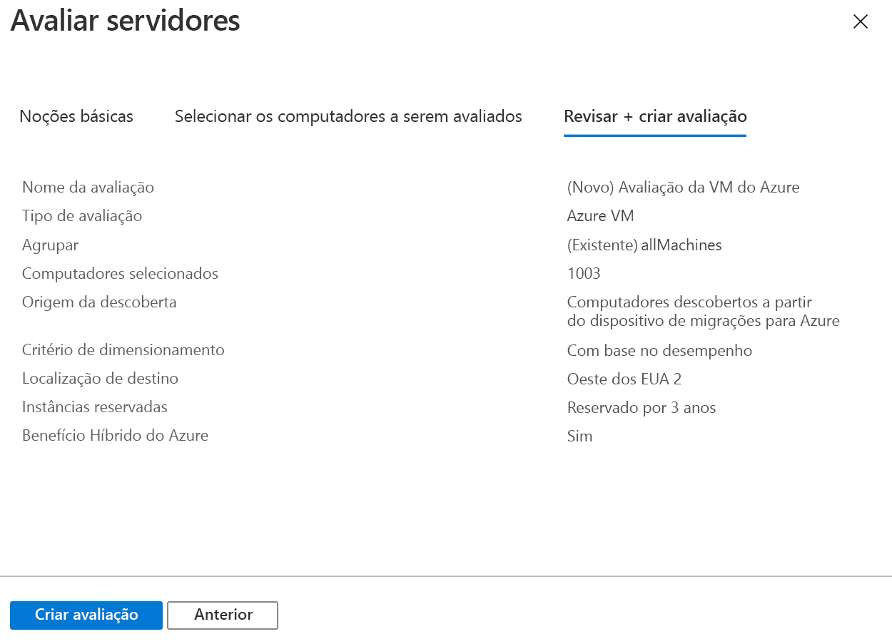

# <a name="assess-vmware-vms-by-using-azure-migrate-server-assessment"></a>Avaliar as VMs do VMware usando a Avaliação de Servidor das Migrações para Azure

Este artigo mostra como avaliar as VMs (máquinas virtuais) VMware locais usando a ferramenta de Avaliação de Servidor nas Migrações para Azure.

As [Migrações para Azure](migrate-services-overview.md) fornecem um hub de ferramentas que ajudam você a descobrir, avaliar e migrar aplicativos, a infraestrutura e cargas de trabalho para o Microsoft Azure. O hub inclui ferramentas de Migrações para Azure e ofertas de ISV (fornecedor independente de software) de parceiros da Microsoft.

Este tutorial é o segundo de uma série que demonstra como avaliar e migrar VMs do VMware para o Azure. Neste tutorial, você aprenderá como:
> [!div class="checklist"]
> * Configurar um projeto das Migrações para Azure.
> * Configurar um dispositivo das Migrações para Azure que é executado localmente para avaliar as VMs.
> * Iniciar a descoberta contínua de VMs locais. O dispositivo envia dados de desempenho e configuração para as VMs descobertas ao Azure.
> * Agrupar as VMs descobertas e avaliar o grupo de VMs.
> * Examinar a avaliação.

> [!NOTE]
> Os tutoriais mostram o caminho de implantação mais simples para um cenário para que você possa configurar rapidamente uma prova de conceito. Os tutoriais usam opções padrão quando possível e não mostram todas as configurações e todos os caminhos possíveis. Para obter instruções detalhadas, examine os artigos de instruções.

Se você não tiver uma assinatura do Azure, crie uma [conta gratuita](https://azure.microsoft.com/pricing/free-trial/) antes de começar.

## <a name="prerequisites"></a>Prerequisites

[Conclua o primeiro tutorial](tutorial-prepare-vmware.md) desta série. Caso contrário, as instruções deste tutorial não funcionarão.

Veja o que você deve ter feito no primeiro tutorial:

- [Configurar as permissões do Azure](tutorial-prepare-vmware.md#prepare-azure) para as Migrações para Azure.
- [Preparar o VMware](tutorial-prepare-vmware.md#prepare-for-vmware-vm-assessment) para avaliação:
   - [Verificar](migrate-support-matrix-vmware.md#vmware-requirements) as configurações do VMware.
   - Configurar permissões no VMware para criar uma VM do VMware com um modelo OVA.
   - Configurar uma [conta para descoberta da VM](migrate-support-matrix-vmware.md#vmware-requirements). 
   - Disponibilizar as [portas necessárias](migrate-support-matrix-vmware.md#port-access).
   - Lembre-se das [URLs necessárias](migrate-replication-appliance.md#url-access) para o acesso ao Azure.

## <a name="set-up-an-azure-migrate-project"></a>Configurar um projeto das Migrações para Azure

Configure um novo projeto das Migrações para Azure, conforme descrito a seguir:

1. No portal do Azure > **Todos os serviços**, pesquise **Migrações para Azure**.
1. Em **Serviços**, selecione **Migrações para Azure**.
1. Em **Visão Geral**, em **Descobrir, avaliar e migrar servidores**, selecione **Avaliar e migrar servidores**.

   

1. Em **Introdução**, selecione **Adicionar ferramentas**.
1. Em **Migrar projeto**, selecione sua assinatura do Azure e crie um grupo de recursos, caso não tenha um.     
1. Em **Detalhes do Projeto**, especifique o nome do projeto e a geografia em que deseja criá-lo. Há suporte para Ásia, Europa, Reino Unido e Estados Unidos.

   A geografia do projeto é usada apenas para armazenar os metadados coletados das VMs locais. Você pode selecionar qualquer região de destino ao executar uma migração.

   

1. Selecione **Avançar**.
1. Em **Selecionar ferramenta de avaliação**, selecione **Migrações para Azure: Avaliação de Servidor** > **Avançar**.

   

1. Em **Selecionar ferramenta de migração**, selecione **Ignorar a adição de uma ferramenta de migração por enquanto** > **Avançar**.
1. Em **Examinar + adicionar ferramentas**, examine as configurações e selecione **Adicionar ferramentas**.
1. Aguarde alguns minutos até que o projeto das Migrações para Azure seja implantado. Você será levado para a página do projeto. Caso não veja o projeto, acesse-o em **Servidores** no painel das Migrações para Azure.

## <a name="set-up-the-appliance-vm"></a>Configurar a VM do dispositivo

A Avaliação de Servidor das Migrações para Azure executa um dispositivo leve de VM VMware. Esse dispositivo executa a descoberta de VM e reúne os metadados de VM e os dados de desempenho.

Para configurar o dispositivo:

- Baixe um arquivo de modelo OVA e importe-o para o vCenter Server.
- Crie o dispositivo e verifique se ele pode se conectar à Avaliação de Servidor das Migrações para Azure.
- Configure o dispositivo pela primeira vez e registre-o com o projeto de Migrações para Azure.

Você pode configurar vários dispositivos para um único projeto das Migrações para Azure. Em todos os dispositivos, a Avaliação de Servidor é compatível com a descoberta de até 35.000 VMs. Ela pode descobrir o máximo de 10.000 servidores por dispositivo.

### <a name="download-the-ova-template"></a>Baixar o modelo OVA

1. Em **Metas de Migração** > **Servidores** > **Migrações para Azure: Avaliação de Servidor**, selecione **Descobrir**.
1. Em **Descobrir computadores** > **Os computadores estão virtualizados?** , selecione **Sim, com o hipervisor do VMware vSphere**.
1. Selecione **Baixar** para baixar o arquivo de modelo OVA.

   

### <a name="verify-security"></a>Verificar a segurança

Verifique se o arquivo OVA é seguro antes de implantá-lo:

1. No computador no qual você baixou o arquivo, abra uma janela de comando do administrador.
1. Execute o seguinte comando para gerar o hash para o arquivo OVA:
  
   ```C:\>CertUtil -HashFile <file_location> [Hashing Algorithm]```
   
   Exemplo de uso: ```C:\>CertUtil -HashFile C:\AzureMigrate\AzureMigrate.ova SHA256```

Para a versão 2.19.07.30, o hash gerado deve corresponder a esses valores:

**Algoritmo** | **Valor de hash**
--- | ---
MD5 | c06ac2a2c0f870d3b274a0b7a73b78b1
SHA256 | 4ce4faa3a78189a09a26bfa5b817c7afcf5b555eb46999c2fad9d2ebc808540c

### <a name="create-the-appliance-vm"></a>Criar a VM do dispositivo

Importe o arquivo baixado e crie uma VM:

1. No console do cliente do vSphere, selecione **Arquivo** > **Implantar o Modelo de OVF**.

   

1. No Assistente do Modelo de Implantação de OVF > **Origem**, especifique o local do arquivo OVA.
1. Em **Nome** e **Local**, especifique um nome amigável para a VM. Selecione o objeto de inventário no qual a VM será hospedada.
1. Em **Host/Cluster**, especifique o host ou o cluster no qual a VM será executada.
1. Em **Armazenamento**, especifique o destino de armazenamento para a VM.
1. Em **Formato de Disco**, especifique o tipo e o tamanho do disco.
1. Em **Mapeamento de Rede**, especifique a rede à qual a VM se conectará. A rede precisa ter conectividade com a Internet para enviar metadados para a Avaliação de Servidor das Migrações para Azure.
1. Examine e confirme as configurações e selecione **Concluir**.

### <a name="verify-appliance-access-to-azure"></a>Verificar o acesso do dispositivo ao Azure

Verifique se a VM do dispositivo pode se conectar às [URLs do Azure](migrate-appliance.md#url-access).

### <a name="configure-the-appliance"></a>Configurar o dispositivo

Configure o dispositivo usando as seguintes etapas:

1. No console do cliente do vSphere, clique com o botão direito do mouse na VM e selecione **Abrir console**.
1. Forneça o idioma, o fuso horário e a senha do dispositivo.
1. Abra um navegador em qualquer computador que possa se conectar à VM e abra a URL do aplicativo Web do dispositivo: **https://*nome do dispositivo ou endereço IP*: 44368**.

   Como alternativa, você pode abrir o aplicativo na área de trabalho do dispositivo selecionando o atalho do aplicativo.
1. No aplicativo Web > **Configurar os pré-requisitos**, faça o seguinte:
   - **Licença**: Aceite os termos de licença e leia as informações de terceiros.
   - **Conectividade**: o aplicativo verifica se a VM tem acesso à Internet. Se a VM usar um proxy:
     - Selecione **Configurações de proxy** e especifique o endereço proxy e a porta de escuta, no formato http://ProxyIPAddress ou http://ProxyFQDN.
     - Especifique as credenciais caso o proxy exija autenticação.
     - Observe que apenas o proxy HTTP é compatível.
   - **Sincronização do horário**: O horário no dispositivo deve ser sincronizado com o horário na Internet para que a descoberta funcione corretamente.
   - **Instalar as atualizações**: O dispositivo garante que as atualizações mais recentes serão instaladas.
   - **Instalar o VDDK**: O dispositivo verifica se o VDDK (Kit de Desenvolvimento de Disco Virtual) do VMware vSphere está instalado. Se ele não estiver instalado, baixe o VDDK 6.7 da VMware e extraia o conteúdo do zip baixado para a localização especificada no dispositivo.

     A Migração de Servidor de Migrações para Azure usa o VDDK para replicar computadores durante a migração para o Azure.       

### <a name="register-the-appliance-with-azure-migrate"></a>Registrar o dispositivo nas Migrações para Azure

1. Selecione **Fazer logon**. Se essa opção não for exibida, verifique se você desabilitou o bloqueador de pop-ups no navegador.
1. Na nova guia, entre usando seu nome de usuário e senha do Azure.
   
   Não há suporte para a entrada com um PIN.
1. Depois de entrar com êxito, volte para o aplicativo Web.
1. Selecione a assinatura na qual o projeto das Migrações para Azure foi criado e, em seguida, selecione o projeto.
1. Especifique um nome para o dispositivo. O nome deve ser alfanumérico com 14 caracteres ou menos.
1. Selecione **Registrar**.

## <a name="start-continuous-discovery"></a>Iniciar a descoberta contínua

O dispositivo precisa se conectar ao vCenter Server para descobrir a configuração e os dados de desempenho das VMs.

### <a name="specify-vcenter-server-details"></a>Especificar detalhes do vCenter Server
1. Em **Especificar detalhes do vCenter Server**, especifique o nome (FQDN) ou o endereço IP da instância do vCenter Server. Você pode manter a porta padrão ou especificar uma porta personalizada na qual o vCenter Server escutará.
1. Em **Nome de usuário** e **Senha**, especifique as credenciais de conta do vCenter Server que o dispositivo usará para descobrir VMs na instância do vCenter Server. 

   Verifique se a conta tem as [permissões necessárias para a descoberta](migrate-support-matrix-vmware.md#vmware-requirements). Você pode [definir o escopo da descoberta](tutorial-assess-vmware.md#set-the-scope-of-discovery) limitando o acesso à conta do vCenter.
1. Selecione **Validar conexão** para garantir que o dispositivo possa se conectar ao vCenter Server.

### <a name="specify-vm-credentials"></a>Especificar credenciais de VM
Para a descoberta de aplicativos, funções e recursos e para visualizar dependências das VMs, você pode fornecer credenciais de VM que tenham acesso às VMs VMware. Você pode adicionar uma credencial para VMs do Windows e uma credencial para VMs do Linux. [Saiba mais](https://docs.microsoft.com/azure/migrate/migrate-support-matrix-vmware#assessment-vcenter-server-permissions) sobre as permissões de acesso necessárias.

> [!NOTE]
> Essa entrada é opcional, mas você precisará dela caso deseje habilitar a descoberta de aplicativos e a visualização de dependência sem agente.

1. Em **Descobrir aplicativos e dependências em VMs**, selecione **Adicionar credenciais**.
1. Faça uma seleção para **Sistema Operacional**.
1. Informar um nome amigável para a credencial.
1. Em **Nome de usuário** e **Senha**, especifique uma conta que tenha pelo menos acesso de convidado nas VMs.
1. Selecione **Adicionar**.

Depois de especificar a instância do vCenter Server e as credenciais de VM (opcionais), selecione **Salvar e iniciar a descoberta** para iniciar a descoberta do ambiente local.

São necessários cerca de 15 minutos para que os metadados das VMs descobertas sejam exibidos no portal. A descoberta de aplicativos, funções e recursos instalados leva algum tempo. A duração depende do número de VMs sendo descobertas. Para as VMs 500, leva aproximadamente 1 hora para o inventário de aplicativos aparecer no portal de Migrações para Azure.

### <a name="set-the-scope-of-discovery"></a>Definir o escopo da descoberta

O escopo da descoberta pode ser definido limitando o acesso da conta do vCenter usada para a descoberta. Você pode definir o escopo para datacenters, clusters, uma pasta de clusters, hosts, uma pasta de hosts ou VMs individuais do vCenter Server.

Para definir o escopo, execute os procedimentos a seguir.

#### <a name="1-create-a-vcenter-user-account"></a>1. Criar uma conta de usuário do vCenter
1.  Faça logon no cliente Web vSphere como o administrador do vCenter Server.
1.  Selecione **Administração** > **Usuários e grupos de SSO** e, em seguida, selecione a guia **Usuários**.
1.  Selecione o ícone **Novo Usuário**.
1.  Preencha as informações necessárias para criar um usuário e selecione **OK**.

#### <a name="2-define-a-new-role-with-required-permission"></a>2. Definir uma nova função com a permissão necessária
Esse procedimento é necessário para a migração de servidor sem agente.
1.  Faça logon no cliente Web vSphere como o administrador do vCenter Server.
1.  Navegue até **Administração** > **Gerenciador de Funções**.
1.  Selecione a instância do vCenter Server no menu suspenso.
1.  Selecione **Criar função**.
1.  Insira um nome para a nova função (como <em>Azure_Migrate</em>).
1.  Atribua [permissões](https://docs.microsoft.com/azure/migrate/migrate-support-matrix-vmware#agentless-migration-vcenter-server-permissions) à função recém-definida.
1.  Selecione **OK**.

#### <a name="3-assign-permissions-on-vcenter-objects"></a>3. Atribuir permissões em objetos do vCenter

Há duas abordagens para atribuir permissões em objetos de inventário no vCenter à conta de usuário do vCenter com uma função atribuída a ela.

Para a Avaliação do Servidor, você deve aplicar a função **Somente leitura** à conta de usuário do vCenter para todos os objetos pai em que as VMs a serem descobertas estão hospedadas. Todos os objetos pai serão incluídos: host, pasta de hosts, cluster e pasta de clusters na hierarquia até o datacenter. Essas permissões serão propagadas para objetos filho na hierarquia.

Da mesma forma que para a Migração do Servidor, você deve aplicar uma função definida pelo usuário com [permissões](https://docs.microsoft.com/azure/migrate/migrate-support-matrix-vmware#agentless-migration-vcenter-server-permissions) para a conta de usuário do vCenter para todos os objetos pai em que as VMs a serem migradas são hospedadas. Essa função pode ser nomeada como  <em>Azure _Migrate</em>.


A abordagem alternativa deve receber a conta e a função do usuário no nível do datacenter e propagá-las para os objetos filho. Depois, forneça à conta uma função **Sem acesso** para todos os objetos (como uma VM) que você não deseja descobrir/migrar. 

Essa configuração alternativa é complicada. Ela expõe controles de acesso acidentais, pois cada novo objeto filho também recebe automaticamente o acesso herdado do pai. Portanto, é recomendável usar a primeira abordagem.

> [!NOTE]
> No momento, a Avaliação de Servidor não poderá descobrir VMs se a conta do vCenter tiver acesso concedido no nível de pasta da VM do vCenter. Se você quiser definir o escopo de sua descoberta por pastas de VM, poderá fazê-lo usando o procedimento a seguir. Ele garante que a conta do vCenter tenha acesso somente leitura atribuído em um nível de VM.
>
> 1. Atribua permissões somente leitura em todas as VMs nas pastas de VM em que você deseja definir o escopo da descoberta.
> 1. Permita acesso somente leitura a todos os objetos pai nos quais as VMs estão hospedadas. Todos os objetos pai (host, pasta de hosts, cluster, pasta de clusters) na hierarquia até o datacenter serão incluídos. Não é necessário propagar as permissões para todos os objetos filho.
> 1. Use as credenciais para descoberta selecionando o datacenter como **Escopo da Coleção**. O controle de acesso baseado em função configurado garante que o usuário do vCenter correspondente tenha acesso apenas às VMs específicas do locatário.
>
> Observe que as pastas de hosts e clusters são compatíveis.

### <a name="verify-vms-in-the-portal"></a>Verifique as VMs no portal

Após a descoberta, você poderá verificar se as VMs são exibidas no portal do Azure:

1. Abra o painel das Migrações para Azure.
1. Na página **Migrações para Azure – Servidores** > **Migrações para Azure: Avaliação de Servidor**, selecione o ícone que exibe a contagem de **Servidores descobertos**.

## <a name="set-up-an-assessment"></a>Configurar uma avaliação

Você pode criar dois tipos de avaliações usando a Avaliação de Servidor das Migrações para Azure:

**Avaliação** | **Detalhes** | **Dados**
--- | --- | ---
**Com base no desempenho** | Avaliações com base nos dados de desempenho coletados | **Tamanho de VM recomendado**: com base nos dados de utilização da CPU e de memória.<br/><br/> **Tipo de disco recomendado (disco gerenciado Standard ou Premium)** : com base na IOPS e na taxa de transferência dos discos locais.
**Como local** | Avaliações com base no dimensionamento local | **Tamanho de VM recomendado**: Com base no tamanho da VM local.<br/><br> **Tipo de disco recomendado**: Com base na configuração de tipo de armazenamento selecionada para a avaliação.

## <a name="run-an-assessment"></a>Ler uma avaliação

Execute uma avaliação da seguinte maneira:

1. Examine as [melhores práticas](best-practices-assessment.md) para a criação de avaliações.
1. Na guia **Servidores**, no bloco **Migrações para Azure: Avaliação de Servidor**, selecione **Avaliar**.

   

1. Em **Avaliar servidores**, especifique um nome para a avaliação.
1. Selecione **Exibir tudo** e examine as propriedades da avaliação.

   

1. Em **Selecionar ou criar um grupo**, selecione **Criar** e especifique um nome de grupo. Um grupo reúne uma ou mais VMs para avaliação.
1. Em **Adicionar computadores ao grupo**, selecione as VMs a serem adicionadas ao grupo.
1. Selecione **Criar Avaliação** para criar o grupo e executar a avaliação.

   

1. Após a criação da avaliação, veja-a em **Servidores** > **Migrações para Azure: Avaliação de Servidor** > **Avaliações**.
1. Selecione **Exportar avaliação** para baixá-la como um arquivo do Excel.

## <a name="review-an-assessment"></a>Examinar uma avaliação

Uma avaliação descreve:

- **Preparação para o Azure**: indica se as VMs são adequadas para a migração para o Azure.
- **Estimativa de custo mensal**: os custos mensais estimados de computação e armazenamento para execução das VMs no Azure.
- **Estimativa de custo de armazenamento mensal**: custos estimados para o armazenamento em disco após a migração.

Para exibir uma avaliação:

1. Em **Metas de migração** > **Servidores**, selecione **Avaliações** em **Migrações para Azure: Avaliação de Servidor**.
1. Em **Avaliações**, selecione uma avaliação para abri-la.

   

### <a name="review-azure-readiness"></a>Examinar a Preparação para o Azure

1. Em **Preparação para o Azure**, verifique se as VMs estão prontas para a migração para o Azure.
1. Examine o status da VM:
    - **Pronto para o Azure**: Usado quando as Migrações para Azure recomendam um tamanho de VM e estimativas de custo para as VMs na avaliação.
    - **Pronto com condições**: mostra os problemas e a correção sugerida.
    - **Não está pronto para o Azure**: mostra os problemas e a correção sugerida.
    - **Preparação desconhecida**: Usada quando as Migrações para Azure não podem avaliar a preparação devido a problemas de disponibilidade de dados.

1. Selecione um status de **Preparação para o Azure**. Você pode exibir os detalhes de preparação da VM. Você também pode fazer drill down para ver os detalhes da VM, incluindo as configurações de computação, armazenamento e rede.

### <a name="review-cost-details"></a>Examinar os detalhes de custo

O resumo da avaliação mostra o custo estimado de computação e armazenamento da execução das VMs no Azure. Os custos são agregados para todas as VMs no grupo avaliado. Você pode fazer drill down para ver os detalhes de custo de VMs específicas.

> [!NOTE]
> As estimativas de custo são baseadas nas recomendações de tamanho para um computador, seus discos e suas propriedades. As estimativas referem-se à execução das VMs locais como VMs de IaaS. A Avaliação de Servidor das Migrações para Azure não considera os custos de PaaS ou SaaS.

Os custos de armazenamento agregados para o grupo avaliado são divididos em diferentes tipos de discos de armazenamento. 

### <a name="review-confidence-rating"></a>Revisar classificação de confiança

A Avaliação de Servidor de Migrações para Azure atribui uma classificação de confiança a uma avaliação baseada em desempenho, de 1 estrela (a mais baixa) a 5 estrelas (a mais alta).


A classificação de confiança ajuda você a estimar a confiabilidade das recomendações de tamanho da avaliação. A classificação é baseada na disponibilidade dos pontos de dados necessários para calcular a avaliação:

**Disponibilidade do ponto de dados** | **Classificação de confiança**
--- | ---
0%-20% | 1 estrela
21%-40% | 2 estrelas
41%-60% | 3 estrelas
61%-80% | 4 estrelas
81%-100% | 5 estrelas

[Saiba mais sobre as melhores práticas](best-practices-assessment.md#best-practices-for-confidence-ratings) de classificações de confiança.

## <a name="next-steps"></a>Próximas etapas

Neste tutorial, você configurou um dispositivo das Migrações para Azure. Você também criou e examinou uma avaliação.

Para saber como migrar VMs VMware para o Azure usando a Migração de Servidor de Migrações para Azure, continue para o terceiro tutorial na série:

> [!div class="nextstepaction"]
> [Migrar VMs do VMware](./tutorial-migrate-vmware.md)
