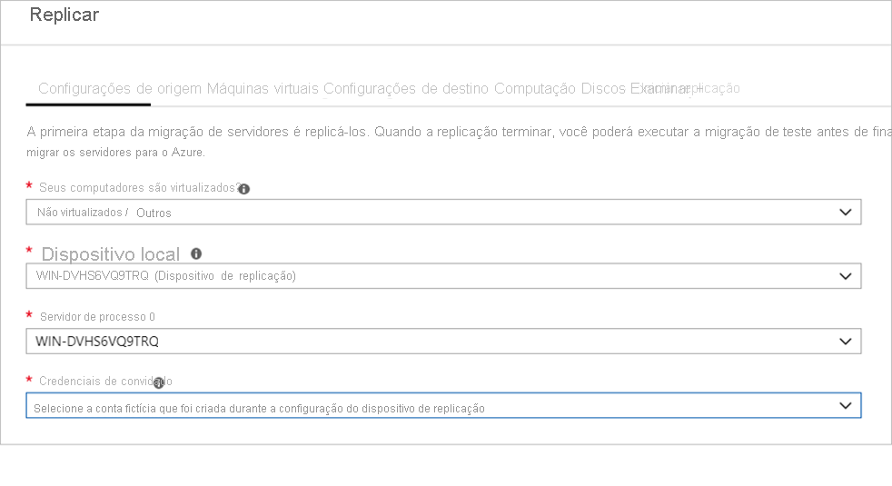

# <a name="migrate-machines-as-physical-servers-to-azure"></a>Migrar computadores como servidores físicos para o Azure

Este artigo mostra como migrar computadores como servidores físicos para o Azure usando a ferramenta Migrações para Azure: Ferramenta de migração de servidor. Migrar computadores tratando-os como servidores físicos é útil em vários cenários:

- Migrar servidores físicos locais.
- Migrar VMs virtualizadas por plataformas, como Xen, KVM.
- Migre VMs do Hyper-V ou do VMware se por algum motivo você não conseguir usar o processo de migração padrão para migração do [Hyper-V](tutorial-migrate-hyper-v.md) ou do [VMware](server-migrate-overview.md).
- Migre VMs em execução em nuvens privadas.
- Migre VMs em execução em nuvens públicas, como AWS (Amazon Web Services) ou GCP (Google Cloud Platform).


Este tutorial é o terceiro de uma série que demonstra como avaliar e migrar servidores físicos para o Azure. Neste tutorial, você aprenderá como:

> [!div class="checklist"]
> * Prepare-se para usar o Azure com a ferramenta Migrações para Azure: Migração de Servidor.
> * Verificar os requisitos de computadores que você deseja migrar e prepare um computador para o dispositivo de replicação de Migrações para Azure usado para descobrir e migrar computadores para o Azure.
> * Adicionar a ferramenta Migrações para Azure: Migração de Servidor no hub de Migrações para Azure.
> * Configurar o dispositivo de replicação.
> * Instalar o serviço de mobilidade nos computadores que você deseja migrar.
> * Habilitar a replicação.
> * Executar uma migração de teste para verificar se tudo está funcionando conforme o esperado.
> * Executar uma migração completa para o Azure.

> [!NOTE]
> Os tutoriais mostram o caminho de implantação mais simples para um cenário para que você possa configurar rapidamente uma prova de conceito. Os tutoriais usam opções padrão quando possível e não mostram todas as configurações e todos os caminhos possíveis. Para obter informações detalhadas, examine as instruções para Migrações para Azure.

Se você não tiver uma assinatura do Azure, crie uma [conta gratuita](https://azure.microsoft.com/pricing/free-trial/) antes de começar.


## <a name="prerequisites"></a>Pré-requisitos

Antes de iniciar este tutorial, você deverá:

[Examinar](./agent-based-migration-architecture.md) a arquitetura de migração.

## <a name="prepare-azure"></a>Preparar o Azure

Preparar o Azure para a migração com a ferramenta Migrações para Azure: Migração de Servidor.

**Tarefa** | **Detalhes**
--- | ---
**Criar um projeto de Migrações para Azure** | Sua conta do Azure precisa de permissões de Colaborador ou de Proprietário para [criar um projeto](./create-manage-projects.md).
**Verificar as permissões para sua conta do Azure** | Sua conta do Azure precisa de permissões para criar uma VM e gravar em um disco gerenciado do Azure.


### <a name="assign-permissions-to-create-project"></a>Atribuir permissões para criar o projeto

1. No portal do Azure, abra a assinatura e selecione **Controle de acesso (IAM).**
2. Em **Verificar acesso**, localize a conta relevante e clique nela para exibir as permissões.
3. Você deve ter permissões de **Colaborador** e **Proprietário**.
    - Se você acaba de criar uma conta gratuita do Azure, você é o proprietário da assinatura.
    - Se você não for o proprietário da assinatura, trabalhe com o proprietário para atribuir a função.


### <a name="assign-azure-account-permissions"></a>Atribuir permissões de conta do Azure

Atribua a função Colaborador da Máquina Virtual à conta do Azure. Isso fornece permissões para:

- Criar uma VM no grupo de recursos selecionado.
- Criar uma VM na rede virtual selecionada.
- Gravar em um disco gerenciado do Azure. 

### <a name="create-an-azure-network"></a>Criar uma rede do Azure

[Configurar](../virtual-network/manage-virtual-network.md#create-a-virtual-network) uma VNet (rede virtual) do Azure. Quando você replica para o Azure, as VMs do Azure são criadas e ingressadas na VNet do Azure que você especifica ao configurar a migração.

## <a name="prepare-for-migration"></a>Preparar para a migração

Para se preparar para a migração do servidor físico, você precisa verificar as configurações do servidor físico e preparar-se para implantar um dispositivo de replicação.

### <a name="check-machine-requirements-for-migration"></a>Verificar os requisitos do computador para a migração

Verifique se os computadores estão em conformidade com os requisitos da migração para o Azure. 

> [!NOTE]
> Ao migrar computadores físicos, a ferramenta Migrações para Azure: Migração de Servidor usa a mesma arquitetura de replicação que a recuperação de desastre baseada em agente do serviço de Azure Site Recovery e alguns dos componentes compartilham a mesma base de código. Alguns conteúdos podem ser vinculados à documentação do Site Recovery.

1. [Verificar](migrate-support-matrix-physical-migration.md#physical-server-requirements) os requisitos do servidor físico.
2. Verifique se as máquinas locais que você replica para o Azure estão em conformidade com os [requisitos de VM do Azure](migrate-support-matrix-physical-migration.md#azure-vm-requirements).
3. Há algumas alterações necessárias nas VMs antes de migrá-las para o Azure.
    - Para alguns sistemas operacionais, as Migrações para Azure fazem essas alterações automaticamente. 
    - É importante fazer essas alterações antes de iniciar a migração. Se você migrar a VM antes de fazer a alteração, ela não poderá ser inicializada no Azure. Examine as alterações para [Windows](prepare-for-migration.md#windows-machines) e [Linux](prepare-for-migration.md#linux-machines) que você precisa fazer.

### <a name="prepare-a-machine-for-the-replication-appliance"></a>Preparar um computador para o dispositivo de replicação

Migrações para Azure: Migração de Servidor usa um dispositivo de replicação para replicar computadores para o Azure. O dispositivo de replicação executa os seguintes componentes.

- **Servidor de configuração**: O servidor de configuração coordena a comunicação entre o ambiente local e o Azure e gerencia a replicação de dados.
- **Servidor de processo**: O servidor de processo atua como um gateway de replicação. Ele recebe dados de replicação, otimiza-os com caching, compactação e criptografia e os envia para uma conta de armazenamento em cache no Azure. 

Prepare-se para implantação do dispositivo, conforme mostrado a seguir:

- Você prepara um computador para hospedar o dispositivo de replicação. [Examine](migrate-replication-appliance.md#appliance-requirements) os requisitos do computador.
- O dispositivo de replicação usa o MySQL. Examine as [opções](migrate-replication-appliance.md#mysql-installation) para instalar o MySQL no dispositivo.
- Examine as URLs do Azure necessárias para que o dispositivo de replicação acesse as nuvens [públicas](migrate-replication-appliance.md#url-access) e [governamentais](migrate-replication-appliance.md#azure-government-url-access).
- Examine os requisitos de acesso à [porta](migrate-replication-appliance.md#port-access) para o dispositivo de replicação.

> [!NOTE]
> O dispositivo de replicação não deve ser instalado em um computador de origem que você deseja replicar nem no dispositivo de avaliação e descoberta das Migrações para Azure que pode ter sido instalado antes.

## <a name="set-up-the-replication-appliance"></a>Configurar o dispositivo de replicação

A primeira etapa da migração é configurar o dispositivo de replicação. Para configurar o dispositivo para migração de servidor físico, baixe o arquivo do instalador do dispositivo e execute-o no [computador que você preparou](#prepare-a-machine-for-the-replication-appliance). Depois de instalar o dispositivo, registre-o com as Migrações para Azure: Migração de Servidor.


### <a name="download-the-replication-appliance-installer"></a>Baixar o instalador do dispositivo de replicação

1. No projeto das Migrações para Azure > **Servidores**, em **Migrações para Azure: Migração de Servidor**, clique em **Descobrir**.

    

3. Em **Descobrir computadores** > **São seus computadores virtualizados?** , clique em **Não virtualizado/outro.**
4. Em **Região de destino**, selecione a região do Azure para a qual deseja migrar os computadores.
5. Selecione **Confirme se a região de destino da migração é nome-da-região**.
6. Clique em **Criar recursos**. Isso criará um cofre do Azure Site Recovery em segundo plano.
    - Se você já configurou a migração com a ferramenta Migrações para Azure: Migração de Servidor, a opção de destino não poderá ser configurada, pois os recursos foram configurados anteriormente.    
    - Você não poderá alterar a região de destino desse projeto depois de clicar nesse botão.
    - Todas as migrações seguintes serão feitas para essa região.

7. Em **Deseja instalar um novo dispositivo de replicação?** , selecione **Instalar um dispositivo de replicação**.
9. Em **baixar e instalar o software do dispositivo de replicação**, baixe o instalador do dispositivo e a chave de registro. Você precisa da chave para registrar o dispositivo. A chave é válida por cinco dias após ser baixada.

    

10. Copie o arquivo de instalação do dispositivo e o arquivo de chave para o computador Windows Server 2016 que você criou para o dispositivo.
11. Após a conclusão da instalação, o Assistente de configuração de dispositivo será iniciado automaticamente (você também poderá iniciar o assistente manualmente usando o atalho cspsconfigtool criado na área de trabalho do dispositivo). Use a guia Gerenciar Contas do assistente para adicionar detalhes de conta a serem usados para a instalação por push do serviço de Mobilidade. Neste tutorial, vamos instalar manualmente o Serviço de Mobilidade nas VMs de origem a serem replicadas, portanto, crie uma conta fictícia nesta etapa e continue. É possível fornecer os seguintes detalhes para criação de uma conta fictícia: "convidado" como o nome amigável, "nome de usuário" como o nome de usuário e "senha" como a senha da conta. Você usará essa conta fictícia no estágio Habilitar Replicação. 

12. Depois que o dispositivo for reiniciado após a instalação, em **Descobrir computadores**, selecione o novo dispositivo em **Selecionar Servidor de Configuração** e clique em **Finalizar o registro**. Finalizar o registro executa algumas tarefas finais para preparar o dispositivo de replicação.

    

Pode levar algum tempo após a finalização do registro até que os computadores descobertos sejam exibidos na ferramenta Migrações para Azure: Migração de Servidor. À medida que as VMs são descobertas, a contagem de **Servidores descobertos** aumenta.


## <a name="install-the-mobility-service"></a>Instalar o serviço de Mobilidade

Nos computadores que você deseja migrar, você precisa instalar o agente do serviço de Mobilidade. Os instaladores do agente estão disponíveis no dispositivo de replicação. Você encontra o instalador correto e instala o agente em cada computador que deseja migrar. Faça isso da seguinte forma:

1. Entre no dispositivo de replicação.
2. Navegue até **%ProgramData%\ASR\home\svsystems\pushinstallsvc\repository**.
3. Localize o instalador para a versão e o sistema operacional do computador. Examine os [sistemas operacionais compatíveis](../site-recovery/vmware-physical-azure-support-matrix.md#replicated-machines). 
4. Copie o arquivo do instalador para o computador que você deseja migrar.
5. Verifique se você tem a frase secreta gerada ao implantar o dispositivo.
    - Armazene o arquivo em um arquivo de texto temporário no computador.
    - Você pode obter a frase secreta no dispositivo de replicação. Na linha de comando, execute **C:\ProgramData\ASR\home\svsystems\bin\genpassphrase.exe-v** para exibir a frase secreta atual.
    - Não gere novamente a frase secreta. Isso interromperá a conectividade e você precisará registrar o dispositivo de replicação novamente.

> [!NOTE]
> No parâmetro */Platform*, você especifica o *VMware* se você migrar VMs do VMware ou máquinas físicas.

### <a name="install-on-windows"></a>Instalar no Windows

1. Extraia o conteúdo do arquivo do instalador para uma pasta local (por exemplo, C:\Temp) no computador da seguinte maneira:

    ```
    ren Microsoft-ASR_UA*Windows*release.exe MobilityServiceInstaller.exe
    MobilityServiceInstaller.exe /q /x:C:\Temp\Extracted
    cd C:\Temp\Extracted
    ```
2. Execute o Instalador do Serviço de Mobilidade:
    ```
   UnifiedAgent.exe /Role "MS" /Platform "VmWare" /Silent
    ```
3. Registre o agente com o dispositivo de replicação:
    ```
    cd C:\Program Files (x86)\Microsoft Azure Site Recovery\agent
    UnifiedAgentConfigurator.exe  /CSEndPoint <replication appliance IP address> /PassphraseFilePath <Passphrase File Path>
    ```

### <a name="install-on-linux"></a>Instalar no Linux

1. Extraia o conteúdo do tarball do instalador para uma pasta local (por exemplo, /tmp/MobSvcInstaller) no computador da seguinte maneira:
    ```
    mkdir /tmp/MobSvcInstaller
    tar -C /tmp/MobSvcInstaller -xvf <Installer tarball>
    cd /tmp/MobSvcInstaller
    ```
2. Execute o script do instalador:
    ```
    sudo ./install -r MS -v VmWare -q
    ```
3. Registre o agente com o dispositivo de replicação:
    ```
    /usr/local/ASR/Vx/bin/UnifiedAgentConfigurator.sh -i <replication appliance IP address> -P <Passphrase File Path>
    ```

## <a name="replicate-machines"></a>Replicar computadores

Agora, selecione os computadores para migração. 

> [!NOTE]
> Você pode replicar até 10 computadores juntos. Se precisar replicar mais, replique-os simultaneamente em lotes de 10.

1. No projeto das Migrações para Azure > **Servidores**, **Migrações para Azure: Migração de Servidor**, clique em **Replicar**.

    

2. Em **Replicar**, > **Configurações de origem** > **Os computadores estão virtualizados?** , selecione **Não virtualizados/Outro**.
3. Em **Dispositivo local**, selecione o nome do dispositivo de Migrações para Azure que você configurou.
4. Em **Servidor de Processo**, selecione o nome do dispositivo de replicação.
6. Em **Credenciais de convidado**, selecione a conta fictícia criada anteriormente durante a [configuração do instalador de replicação](#download-the-replication-appliance-installer) para instalar o serviço Mobilidade manualmente (a instalação por push não é compatível). Em seguida, clique em **Próximo: Máquinas virtuais**.   

    

7. Em **Máquinas Virtuais**, em **Importar configurações de migração de uma avaliação?** , deixe a configuração padrão, **Não, vou especificar as configurações de migração manualmente**.
8. Verifique cada VM que você deseja migrar. Em seguida, clique em **Próximo: configurações de destino**.

    


9. Em **Configurações de destino**, selecione a assinatura e a região de destino para a qual você migrará e especifique o grupo de recursos no qual as VMs do Azure residirão após a migração.
10. Em **Rede Virtual**, selecione a VNet/sub-rede do Azure na qual as VMs do Azure serão ingressadas após a migração.
11. Em **Opções de disponibilidade**, selecione:
    -  Zona de Disponibilidade para fixar o computador migrado para uma Zona de Disponibilidade específica na região. Use essa opção para distribuir servidores que formam uma camada de aplicativo de vários nós entre Zonas de Disponibilidade diferentes. Se você selecionar essa opção, precisará especificar a zona de disponibilidade a ser usada para cada computador selecionado na guia Computação. Essa opção só estará disponível se a região de destino selecionada para a migração der suporte a Zonas de Disponibilidade
    -  Conjunto de Disponibilidade para colocar o computador migrado em um conjunto de disponibilidade. O grupo de recursos de destino selecionado precisa ter um ou mais conjuntos de disponibilidade para que possa usar essa opção.
    - Nenhuma opção de redundância de infraestrutura será necessária se você não precisar de nenhuma dessas configurações de disponibilidade para os computadores migrados.
    
12. Em **Tipo de criptografia de disco**, selecione:
    - Criptografia em repouso com chave de criptografia gerenciada pela plataforma
    - Criptografia em repouso com a chave gerenciada pelo cliente
    - Criptografia dupla com chaves gerenciadas por plataforma e gerenciadas pelo cliente

   > [!NOTE]
   > Para replicar VMs com a CMK, você precisará [criar um conjunto de criptografia de disco](../virtual-machines/disks-enable-customer-managed-keys-portal.md#set-up-your-disk-encryption-set) no grupo de recursos de destino. Um objeto de conjunto de criptografia de disco mapeia o Managed Disks para um Key Vault que contém a CMK a ser usada para a SSE.
  
13. Em **Benefício Híbrido do Azure**:

    - Selecione **Não** se não desejar aplicar o Benefício Híbrido do Azure. Em seguida, clique em **Próximo**.
    - Selecione **Sim** se você tiver computadores Windows Server cobertos com assinaturas ativas do Software Assurance ou do Windows Server e quiser aplicar o benefício aos computadores que estão sendo migrados. Em seguida, clique em **Próximo**.

    

14. Em **Computação**, examine o nome da VM, o tamanho, o tipo de disco do SO e a configuração de disponibilidade (se selecionado na etapa anterior). As VMs devem estar em conformidade com os [requisitos do Azure](migrate-support-matrix-physical-migration.md#azure-vm-requirements).

    - **Tamanho da VM**: se você estiver usando recomendações de avaliação, o menu suspenso de tamanho da VM mostrará o tamanho recomendado. Caso contrário, as Migrações para Azure escolherão um tamanho com base na correspondência mais próxima na assinatura do Azure. Como alternativa, escolha um tamanho manual em **Tamanho da VM do Azure**.
    - **Disco do SO**: especifique o disco do sistema operacional (inicialização) para a VM. O disco do sistema operacional é o disco que tem o carregador de inicialização e o instalador do sistema operacional.
    - **Zona de Disponibilidade**: especifique a zona de disponibilidade a ser usada.
    - **Conjunto de disponibilidade**: especifique o conjunto de disponibilidade a ser usado.


15. Em **Discos**, especifique se os discos da VM devem ser replicados para o Azure e selecione o tipo de disco (discos gerenciados HDD/SSD standard ou premium) no Azure. Em seguida, clique em **Próximo**.
    - Você pode excluir discos da replicação.
    - Se você excluir os discos, eles não estarão presentes na VM do Azure após a migração. 

    

16. Em **Examinar e iniciar a replicação**, examine as configurações e clique em **Replicar** para iniciar a replicação inicial dos servidores.

> [!NOTE]
> É possível atualizar as configurações de replicação a qualquer momento antes do início da replicação em **Gerenciar** > **Computadores em replicação**. Não é possível alterar as configurações após o início da replicação.

## <a name="track-and-monitor"></a>Acompanhar e monitorar

- Quando você clica em **Replicar**, um trabalho Iniciar Replicação é iniciado. 
- Quando o trabalho Iniciar Replicação é concluído com êxito, os computadores começam sua replicação inicial para o Azure.
- Depois que a replicação inicial é concluída, a replicação delta é iniciada. As alterações incrementais em discos locais são replicadas periodicamente para os discos de réplica no Azure.


É possível acompanhar o status do trabalho nas notificações do portal.

É possível monitorar o status de replicação clicando em **Replicando servidores** em **Migrações para Azure: Migração de Servidor**.


## <a name="run-a-test-migration"></a>Execute um teste de migração


Quando a replicação delta é iniciada, é possível executar uma migração de teste para as VMs antes de executar uma migração completa para o Azure. É altamente recomendável que você faça isso pelo menos uma vez para cada computador antes de migrá-lo.

- A execução de uma migração de teste verifica se a migração funcionará conforme o esperado, sem afetar os computadores locais, que permanecem operacionais e continuam sendo replicados. 
- A migração de teste simula a migração criando uma VM do Azure com o uso dos dados replicados (geralmente, fazendo a migração para uma VNet de não produção em sua assinatura do Azure).
- É possível usar a VM do Azure de teste replicada para validar a migração, executar testes de aplicativo e resolver problemas antes da migração completa.

Faça uma migração de teste da seguinte maneira:


1. Em **Metas de migração** > **Servidores** > **Migrações para Azure: Migração de Servidor**, clique em **Testar servidores migrados**.

     

2. Clique com o botão direito do mouse na VM a ser testada e clique em **Migração de teste**.

    

3. Em **Migração de Teste**, selecione a VNet do Azure na qual a VM do Azure estará localizada após a migração. Recomendamos que você use uma VNet que não seja de produção.
4. O trabalho **Migração de teste** é iniciado. Monitore o trabalho nas notificações do portal.
5. Após a conclusão da migração, veja a VM do Azure migrada em **Máquinas Virtuais** no portal do Azure. O nome do computador tem o sufixo **-Test**.
6. Depois que o teste for realizado, clique com o botão direito do mouse na VM do Azure em **Replicando computadores** e clique em **Limpar migração de teste**.

    


## <a name="migrate-vms"></a>Migrar VMs

Depois de verificar se a migração de teste funciona conforme o esperado, você poderá migrar os computadores locais.

1. No projeto das Migrações para Azure > **Servidores** > **Migrações para Azure: Migração de Servidor**, clique em **Replicando servidores**.

    

2. Em **Replicando computadores**, clique com o botão direito do mouse na VM > **Migrar**.
3. Em **Migrar** > **Desligar máquinas virtuais e realizar uma migração planejada sem perda de dados**, selecione **Sim** > **OK**.
    - Se você não quiser desligar a VM, selecione **Não**
    
    Observação: para a migração de servidor físico, a recomendação é colocar o aplicativo como parte da janela de migração (não permitir que os aplicativos aceitem conexões) e, em seguida, iniciar a migração (o servidor precisa ser mantido em execução e, portanto, as alterações restantes podem ser sincronizadas) antes da conclusão da migração.

4. Um trabalho de migração é iniciado para a VM. Acompanhe o trabalho nas notificações do Azure.
5. Após a conclusão do trabalho, você poderá exibir e gerenciar a VM na página **Máquinas Virtuais**.

## <a name="complete-the-migration"></a>Concluir a migração

1. Depois que a migração for concluída, clique com o botão direito do mouse na VM > **Interromper migração**. Isso faz o seguinte:
    - Interrompe a replicação no computador local.
    - Remove o computador da contagem de **Servidores de replicação** nas Migrações para Azure: Migração de Servidor.
    - Limpa as informações de estado de replicação do computador.
2. Instale o agente do [Windows](../virtual-machines/extensions/agent-windows.md) ou do [Linux](../virtual-machines/extensions/agent-linux.md) da VM do Azure nos computadores migrados.
3. Execute todos os ajustes no aplicativo após a migração, como atualizar as cadeias de conexão de banco de dados e as configurações do servidor Web.
4. Execute o aplicativo final e o teste de aceitação da migração no aplicativo migrado que está sendo executado no Azure.
5. Transfira o tráfego para a instância migrada da VM do Azure.
6. Remova as VMs locais do inventário local de VMs.
7. Remova as VMs locais dos backups locais.
8. Atualize todas as documentações internas para mostrar o novo local e o endereço IP das VMs do Azure. 

## <a name="post-migration-best-practices"></a>Melhores práticas pós-migração

- Para aumentar a resiliência:
    - Proteja os dados fazendo backup das VMs do Azure por meio do serviço Backup do Azure. [Saiba mais](../backup/quick-backup-vm-portal.md).
    - Mantenha as cargas de trabalho em execução e continuamente disponíveis ao replicar as VMs do Azure em uma região secundária com o Site Recovery. [Saiba mais](../site-recovery/azure-to-azure-tutorial-enable-replication.md).
- Para aumentar a segurança:
    - Bloqueie e limite o acesso ao tráfego de entrada com a [Central de Segurança do Azure – Administração just-in-time](../security-center/security-center-just-in-time.md).
    - Restrinja o tráfego de rede a pontos de extremidade com os [Grupos de Segurança de Rede](../virtual-network/network-security-groups-overview.md).
    - Implante o [Azure Disk Encryption](../security/fundamentals/azure-disk-encryption-vms-vmss.md) para manter os discos em segurança e proteger os dados contra roubo e acesso não autorizado.
    - Leia mais sobre [como proteger recursos IaaS](https://azure.microsoft.com/services/virtual-machines/secure-well-managed-iaas/) e acesse a [Central de Segurança do Azure](https://azure.microsoft.com/services/security-center/).
- Para monitoramento e gerenciamento:
    - Considere implantar o [Gerenciamento de Custos do Azure](../cost-management-billing/cloudyn/overview.md) para monitorar o uso de recursos e os gastos.


## <a name="next-steps"></a>Próximas etapas

Investigue a [jornada de migração na nuvem](/azure/architecture/cloud-adoption/getting-started/migrate) no Cloud Adoption Framework do Azure.
