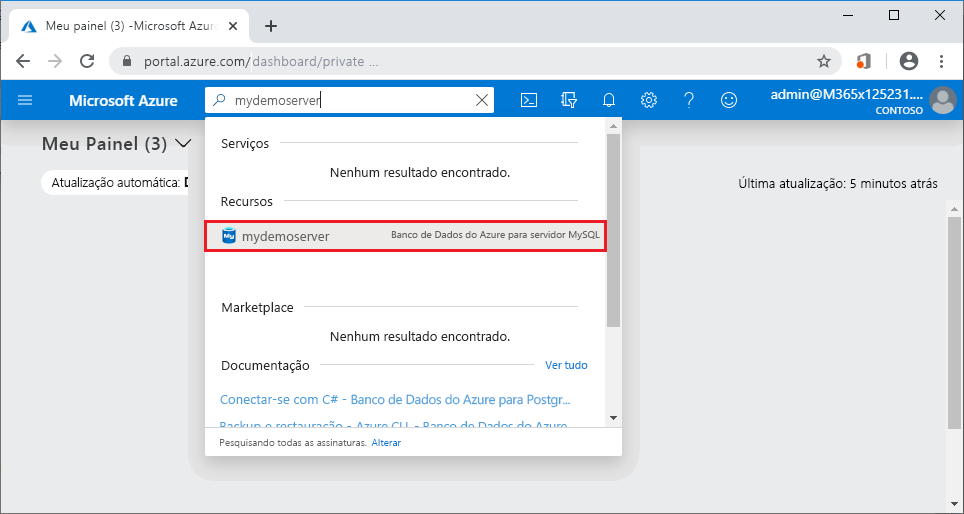
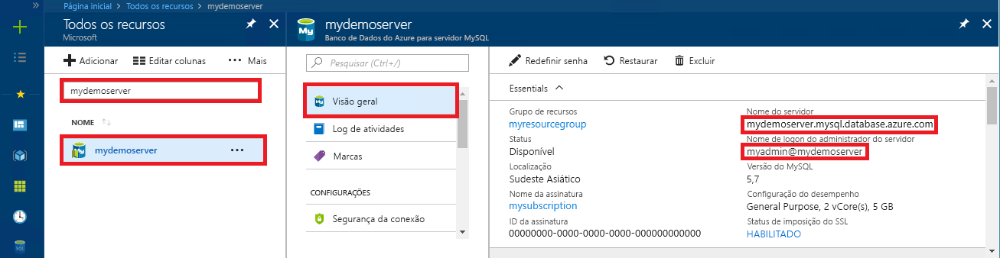

# <a name="quickstart-use-python-to-connect-and-query-data-with-azure-database-for-mysql"></a>Início Rápido: usar Python para se conectar e consultar dados com o Banco de Dados do Azure para MySQL

Neste início rápido, você se conectará a um Banco de Dados do Azure para MySQL usando o Python. Você usará instruções SQL para consultar, inserir, atualizar e excluir dados no banco de dados de plataformas Windows, Ubuntu Linux e Mac. 

Este tópico pressupõe que você está familiarizado com o desenvolvimento usando Python, mas começou recentemente a trabalhar com o Banco de Dados do Azure para MySQL.

## <a name="prerequisites"></a>Pré-requisitos

- Uma conta do Azure com uma assinatura ativa. [Crie uma conta gratuitamente](https://azure.microsoft.com/free/?ref=microsoft.com&utm_source=microsoft.com&utm_medium=docs&utm_campaign=visualstudio).
- Um servidor do Banco de Dados do Azure para MySQL. [Criar um servidor do Banco de Dados do Azure para MySQL usando o portal do Azure](quickstart-create-mysql-server-database-using-azure-portal.md) ou [Criar um servidor do Banco de Dados do Azure para MySQL usando a CLI do Azure](quickstart-create-mysql-server-database-using-azure-cli.md).

> [!IMPORTANT] 
> Verifique se o endereço IP do qual você está se conectando foi adicionado às regras de firewall do servidor usando o [portal do Azure](./howto-manage-firewall-using-portal.md) ou a [CLI do Azure](./howto-manage-firewall-using-cli.md)

## <a name="install-python-and-the-mysql-connector"></a>Instalar o conector MySQL e Python

Instale o Python e o conector MySQL para Python em seu computador usando as seguintes etapas: 

> [!NOTE]
> Este início rápido usa uma abordagem de consulta SQL bruta para se conectar ao MySQL. Se você estiver usando uma estrutura da Web, use o conector recomendado para essas estruturas, por exemplo, [mysqlclient](https://pypi.org/project/mysqlclient/) para o Django.

1. Baixe e instale o [Python 3.7 ou superior](https://www.python.org/downloads/) para o seu sistema operacional. É necessário que você adicione o Python ao seu `PATH`, pois o conector do MySQL exige isso.
   
1. Abra um prompt de comando ou shell do `bash` e verifique sua versão do Python, executando `python -V` com a opção V em maiúscula.
   
1. O instalador do pacote `pip` está incluído nas versões mais recentes do Python. Executando `pip install -U pip`, atualize o `pip` para a versão mais recente. 
   
   Se o `pip` não estiver instalado, você poderá baixá-lo e instalá-lo com `get-pip.py`. Para obter mais informações, confira [Instalação](https://pip.pypa.io/en/stable/installing/). 
   
1. Use o `pip` para instalar o conector do MySQL para Python e as respectivas dependências:
   
   ```bash
   pip install mysql-connector-python
   ```
   
   Você também pode instalar o conector do Python para MySQL de [mysql.com](https://dev.mysql.com/downloads/connector/python/). Para obter mais informações sobre o conector do MySQL para Python, confira o [Guia do desenvolvedor do conector do MySQL/Python](https://dev.mysql.com/doc/connector-python/en/). 

## <a name="get-connection-information"></a>Obter informações de conexão

Obtenha as informações de conexão das quais precisa para se conectar ao Banco de Dados do Azure para MySQL do portal do Azure. Você precisa das credenciais de logon, do nome do servidor e do nome do banco de dados.

1. Entre no [portal do Azure](https://portal.azure.com/).
   
1. Na barra de pesquisa do portal, procure pelo servidor de Banco de Dados do Azure para MySQL que você criou (com o nome que você deu a ele, como **mydemoserver**) e selecione-o.
   
   
   
1. Na página de **Visão geral** do servidor, anote o **Nome do servidor** e o **Nome de logon do administrador do servidor**. Se você esquecer sua senha, também poderá redefini-la dessa página.
   
   

## <a name="run-the-python-examples"></a>Executar os exemplos de Python

Para cada exemplo de código neste artigo:

1. Crie um arquivo em um editor de texto.
1. Adicione o exemplo de código ao arquivo. No código, substitua os espaços reservados `<mydemoserver>`, `<myadmin>`, `<mypassword>` e `<mydatabase>` pelos valores do servidor e do banco de dados MySQL.
1. Salve o arquivo em uma pasta de projeto usando a extensão de arquivo *.py*, como *C:\pythonmysql\createtable.py* ou */home/username/pythonmysql/createtable.py*.
1. Para executar o código, abra um prompt de comando ou shell do `bash` e altere o diretório para a pasta do projeto, por exemplo, `cd pythonmysql`. Digite o comando `python` seguido pelo nome do arquivo (por exemplo, `python createtable.py`) e pressione Enter. 
   
   > [!NOTE]
   > No Windows, se *python.exe* não for encontrado, poderá ser necessário adicionar o caminho do Python à sua variável de ambiente PATH ou fornecer o caminho completo para *python.exe*, por exemplo, `C:\python27\python.exe createtable.py`.

## <a name="create-a-table-and-insert-data"></a>Criar uma tabela e inserir dados

Use o código a seguir para se conectar ao servidor e ao banco de dados, criar uma tabela e carregar dados usando uma instrução SQL **INSERT**. 

O código importa a biblioteca mysql.connector e usa a função [connect()](https://dev.mysql.com/doc/connector-python/en/connector-python-api-mysql-connector-connect.html) para se conectar ao Banco de Dados do Azure para MySQL usando os [argumentos](https://dev.mysql.com/doc/connector-python/en/connector-python-connectargs.html) na coleção de configuração. O código usa um cursor na conexão e o método [cursor.execute()](https://dev.mysql.com/doc/connector-python/en/connector-python-api-mysqlcursor-execute.html) executa a consulta SQL no banco de dados MySQL. 

```python
import mysql.connector
from mysql.connector import errorcode

# Obtain connection string information from the portal
config = {
  'host':'<mydemoserver>.mysql.database.azure.com',
  'user':'<myadmin>@<mydemoserver>',
  'password':'<mypassword>',
  'database':'<mydatabase>'
}

# Construct connection string
try:
   conn = mysql.connector.connect(**config)
   print("Connection established")
except mysql.connector.Error as err:
  if err.errno == errorcode.ER_ACCESS_DENIED_ERROR:
    print("Something is wrong with the user name or password")
  elif err.errno == errorcode.ER_BAD_DB_ERROR:
    print("Database does not exist")
  else:
    print(err)
else:
  cursor = conn.cursor()

  # Drop previous table of same name if one exists
  cursor.execute("DROP TABLE IF EXISTS inventory;")
  print("Finished dropping table (if existed).")

  # Create table
  cursor.execute("CREATE TABLE inventory (id serial PRIMARY KEY, name VARCHAR(50), quantity INTEGER);")
  print("Finished creating table.")

  # Insert some data into table
  cursor.execute("INSERT INTO inventory (name, quantity) VALUES (%s, %s);", ("banana", 150))
  print("Inserted",cursor.rowcount,"row(s) of data.")
  cursor.execute("INSERT INTO inventory (name, quantity) VALUES (%s, %s);", ("orange", 154))
  print("Inserted",cursor.rowcount,"row(s) of data.")
  cursor.execute("INSERT INTO inventory (name, quantity) VALUES (%s, %s);", ("apple", 100))
  print("Inserted",cursor.rowcount,"row(s) of data.")

  # Cleanup
  conn.commit()
  cursor.close()
  conn.close()
  print("Done.")
```

## <a name="read-data"></a>Ler dados

Use o código a seguir para conectar-se e ler os dados usando uma instrução SQL **SELECT**. 

O código importa a biblioteca mysql.connector e usa a função [connect()](https://dev.mysql.com/doc/connector-python/en/connector-python-api-mysql-connector-connect.html) para se conectar ao Banco de Dados do Azure para MySQL usando os [argumentos](https://dev.mysql.com/doc/connector-python/en/connector-python-connectargs.html) na coleção de configuração. O código usa um cursor na conexão e o método [cursor.execute()](https://dev.mysql.com/doc/connector-python/en/connector-python-api-mysqlcursor-execute.html) executa a consulta SQL no banco de dados MySQL. 

O código lê as linhas de dados usando o método [fetchall()](https://dev.mysql.com/doc/connector-python/en/connector-python-api-mysqlcursor-fetchall.html), mantém o conjunto de resultados em uma linha de coleção e usa um iterador `for` para executar um loop nas linhas.

```python
import mysql.connector
from mysql.connector import errorcode

# Obtain connection string information from the portal
config = {
  'host':'<mydemoserver>.mysql.database.azure.com',
  'user':'<myadmin>@<mydemoserver>',
  'password':'<mypassword>',
  'database':'<mydatabase>'
}

# Construct connection string
try:
   conn = mysql.connector.connect(**config)
   print("Connection established")
except mysql.connector.Error as err:
  if err.errno == errorcode.ER_ACCESS_DENIED_ERROR:
    print("Something is wrong with the user name or password")
  elif err.errno == errorcode.ER_BAD_DB_ERROR:
    print("Database does not exist")
  else:
    print(err)
else:
  cursor = conn.cursor()

  # Read data
  cursor.execute("SELECT * FROM inventory;")
  rows = cursor.fetchall()
  print("Read",cursor.rowcount,"row(s) of data.")

  # Print all rows
  for row in rows:
    print("Data row = (%s, %s, %s)" %(str(row[0]), str(row[1]), str(row[2])))

  # Cleanup
  conn.commit()
  cursor.close()
  conn.close()
  print("Done.")
```

## <a name="update-data"></a>Atualizar dados

Use o código a seguir para conectar-se e atualizar os dados usando uma instrução SQL **UPDATE**. 

O código importa a biblioteca mysql.connector e usa a função [connect()](https://dev.mysql.com/doc/connector-python/en/connector-python-api-mysql-connector-connect.html) para se conectar ao Banco de Dados do Azure para MySQL usando os [argumentos](https://dev.mysql.com/doc/connector-python/en/connector-python-connectargs.html) na coleção de configuração. O código usa um cursor na conexão e o método [cursor.execute()](https://dev.mysql.com/doc/connector-python/en/connector-python-api-mysqlcursor-execute.html) executa a consulta SQL no banco de dados MySQL. 

```python
import mysql.connector
from mysql.connector import errorcode

# Obtain connection string information from the portal
config = {
  'host':'<mydemoserver>.mysql.database.azure.com',
  'user':'<myadmin>@<mydemoserver>',
  'password':'<mypassword>',
  'database':'<mydatabase>'
}

# Construct connection string
try:
   conn = mysql.connector.connect(**config)
   print("Connection established")
except mysql.connector.Error as err:
  if err.errno == errorcode.ER_ACCESS_DENIED_ERROR:
    print("Something is wrong with the user name or password")
  elif err.errno == errorcode.ER_BAD_DB_ERROR:
    print("Database does not exist")
  else:
    print(err)
else:
  cursor = conn.cursor()

  # Update a data row in the table
  cursor.execute("UPDATE inventory SET quantity = %s WHERE name = %s;", (200, "banana"))
  print("Updated",cursor.rowcount,"row(s) of data.")

  # Cleanup
  conn.commit()
  cursor.close()
  conn.close()
  print("Done.")
```

## <a name="delete-data"></a>Excluir dados

Use o código a seguir para conectar-se e remover os dados usando uma instrução SQL **DELETE**. 

O código importa a biblioteca mysql.connector e usa a função [connect()](https://dev.mysql.com/doc/connector-python/en/connector-python-api-mysql-connector-connect.html) para se conectar ao Banco de Dados do Azure para MySQL usando os [argumentos](https://dev.mysql.com/doc/connector-python/en/connector-python-connectargs.html) na coleção de configuração. O código usa um cursor na conexão e o método [cursor.execute()](https://dev.mysql.com/doc/connector-python/en/connector-python-api-mysqlcursor-execute.html) executa a consulta SQL no banco de dados MySQL. 

```python
import mysql.connector
from mysql.connector import errorcode

# Obtain connection string information from the portal
config = {
  'host':'<mydemoserver>.mysql.database.azure.com',
  'user':'<myadmin>@<mydemoserver>',
  'password':'<mypassword>',
  'database':'<mydatabase>'
}

# Construct connection string
try:
   conn = mysql.connector.connect(**config)
   print("Connection established.")
except mysql.connector.Error as err:
  if err.errno == errorcode.ER_ACCESS_DENIED_ERROR:
    print("Something is wrong with the user name or password.")
  elif err.errno == errorcode.ER_BAD_DB_ERROR:
    print("Database does not exist.")
  else:
    print(err)
else:
  cursor = conn.cursor()

  # Delete a data row in the table
  cursor.execute("DELETE FROM inventory WHERE name=%(param1)s;", {'param1':"orange"})
  print("Deleted",cursor.rowcount,"row(s) of data.")

  # Cleanup
  conn.commit()
  cursor.close()
  conn.close()
  print("Done.")
```

## <a name="next-steps"></a>Próximas etapas

> [!div class="nextstepaction"]
> [Migre seu banco de dados usando Exportar e Importar](./concepts-migrate-import-export.md)
