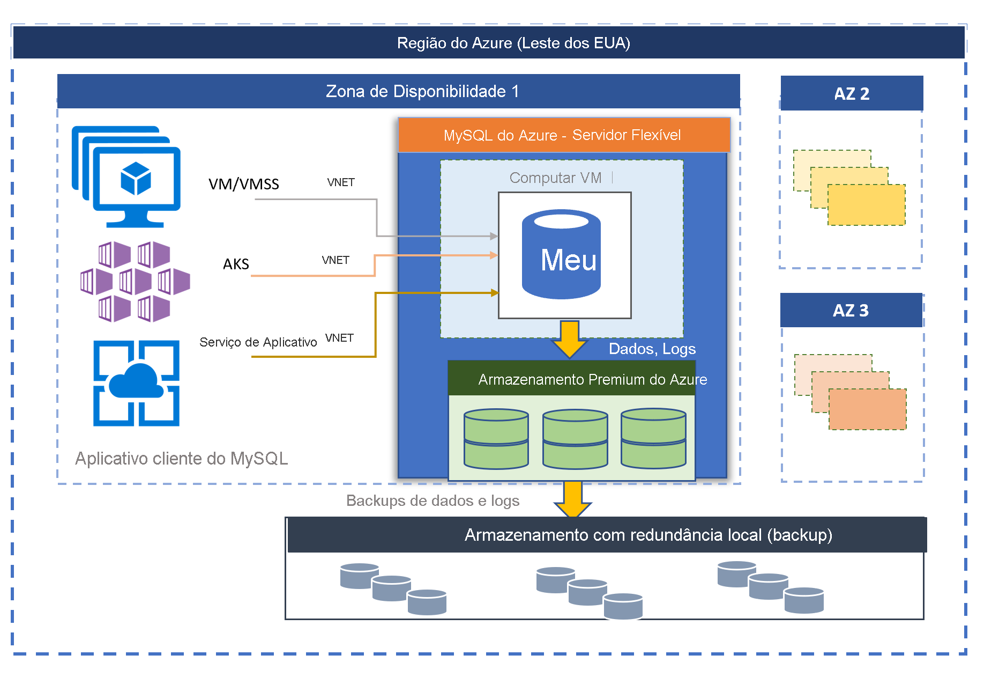

# Banco de Dados do Azure para MySQL – Servidor Flexível (versão prévia)

O Banco de Dados do Azure para MySQL da plataforma MySQL Community Edition está disponível em dois modos de implantação:
- Servidor único 
- Servidor Flexível (versão prévia)

Neste artigo, forneceremos uma visão geral e uma introdução aos principais conceitos do modelo de implantação de servidor flexível. Para saber mais sobre como decidir a melhor opção de implantação para a sua carga de trabalho, confira [Escolher a opção correta de servidor MySQL no Azure](./../select-right-deployment-type.md).

## Visão geral

O Servidor Flexível do Banco de Dados do Azure para MySQL é um serviço de banco de dados totalmente gerenciado projetado para fornecer controle e flexibilidade mais granulares nas funções de gerenciamento de banco de dados e definições de configuração. Em geral, o serviço oferece mais flexibilidade e personalizações de configuração do servidor com base nos requisitos do usuário. A arquitetura de servidor flexível permite que os usuários optem por alta disponibilidade dentro de uma zona de disponibilidade única e entre várias zonas de disponibilidade. Os servidores flexíveis também oferecem melhores controles de otimização de custos com a capacidade de parar/iniciar o servidor e SKUs expansíveis, ideais para cargas de trabalho que não precisam de capacidade de computação completa continuamente. No momento, o serviço dá suporte à versão da comunidade do MySQL 5.7 e 8.0. No momento, o serviço está em versão prévia, disponível hoje mesmo em uma ampla variedade de [regiões do Azure](https://azure.microsoft.com/global-infrastructure/services/).

Os servidores flexíveis são mais adequados para 
- Desenvolvimentos de aplicativos que exigem controle e personalizações melhores.
- Alta disponibilidade com redundância de zona
- Janelas de manutenção gerenciadas

 

## Alta disponibilidade dentro e entre zonas de disponibilidade

O modelo de implantação de servidor flexível foi projetado para dar suporte à alta disponibilidade em uma só zona de disponibilidade e em várias zonas de disponibilidade. A arquitetura separa a computação do armazenamento. O mecanismo de banco de dados é executado em uma máquina virtual, enquanto os arquivos residem no Armazenamento do Azure. O armazenamento mantém três cópias síncronas com redundância local dos arquivos de banco de dados, garantindo a durabilidade dos dados sempre. 

Em uma zona de disponibilidade, se o servidor ficar inativo devido a eventos planejados ou não planejados, o serviço manterá a alta disponibilidade dos servidores usando o seguinte procedimento automatizado:

1. Uma nova VM de computação é provisionada.
2. O armazenamento com os arquivos de dados é mapeado para a nova Máquina Virtual
3. O mecanismo de banco de dados MySQL é colocado online na nova Máquina Virtual.
4. Os aplicativos cliente poderão se reconectar quando o servidor estiver pronto para aceitar conexões.
   
:::image type="content" source="media/overview/2-flexible-server-architecture.png" alt-text="Diagrama conceitual de alta disponibilidade de zona única"::: 

Se a alta disponibilidade com redundância de zona estiver configurada, o serviço provisionará e manterá um servidor em espera ativa na zona de disponibilidade, na mesma região do Azure. As alterações de dados no servidor de origem são replicadas de maneira síncrona para o servidor em espera para garantir zero perda de dados. Com alta disponibilidade com redundância de zona, uma vez que o evento de failover planejado ou não planejado é disparado, o servidor em espera fica online imediatamente e está disponível para processar transações de entrada. O tempo de failover típico varia de 60 a 120 segundos. Isso permite que o serviço dê suporte à alta disponibilidade e forneça resiliência aprimorada com tolerância para falhas de zona de disponibilidade única em uma determinada região do Azure. 

Confira [conceitos de alta disponibilidade](concepts-high-availability.md) para obter mais detalhes.

:::image type="content" source="media/overview/3-flexible-server-overview-zone-redundant-ha.png" alt-text="Diagrama conceitual de alta disponibilidade com redundância de zona"::: 

## Aplicação de patch automatizada com janela de manutenção gerenciada

O serviço executa a aplicação automatizada de patch do hardware, do sistema operacional e do mecanismo de banco de dados subjacentes. A aplicação de patch inclui atualizações de segurança e software. Para o mecanismo MySQL, as atualizações de versão secundárias também são incluídas como parte da versão de manutenção planejada. Os usuários podem configurar o agendamento de aplicação de patch para que ele seja gerenciado pelo sistema ou definir um agendamento personalizado. Durante o agendamento de manutenção, o patch é aplicado e o servidor talvez precisará ser reiniciado como parte do processo de aplicação de patch para concluir a atualização. Com o agendamento personalizado, os usuários podem tornar o ciclo de aplicação de patch previsível e escolher uma janela de manutenção com impacto mínimo sobre os negócios. No geral, o serviço segue a agenda de lançamento mensal como parte do lançamento e da integração contínua.

Confira [Manutenção agendada](concepts-maintenance.md) para obter mais detalhes. 

## Backups automáticos

O serviço de servidor flexível cria backups de servidor automaticamente e os armazena no armazenamento com redundância local ou no armazenamento com redundância geográfica configurado pelo usuário. Os backups podem ser usados para restaurar o servidor em qualquer ponto no tempo dentro do período de retenção de backup. O período de retenção de backup padrão é de sete dias. A retenção pode ser configurada opcionalmente em até 35 dias. Todos os backups são criptografados usando a criptografia AES de 256 bits. 

Confira [Conceitos de backup](concepts-backup-restore.md) para saber mais.

## Isolamento de rede

Você tem duas opções de rede para se conectar ao Servidor Flexível do Banco de Dados do Azure para MySQL. As opções são **acesso privado (integração de VNet)** e **acesso público (endereços IP permitidos)** . 

* **Acesso privado (integração de VNet)** – você pode implantar seu servidor flexível em sua [Rede Virtual do Azure](../../virtual-network/virtual-networks-overview.md). As redes virtuais do Azure fornecem comunicação de rede privada e segura. Os recursos em uma rede virtual podem se comunicar por meio de endereços IP privados.

   Escolha a opção de Integração de VNet se desejar as seguintes funcionalidades:
   * Conectar-se de recursos do Azure na mesma rede virtual com seu servidor flexível usando endereços IP privados
   * Usar a VPN ou o ExpressRoute para se conectar de recursos que não são do Azure com seu servidor flexível
   * Nenhum ponto de extremidade público

* **Acesso público (endereços IP permitidos)** – você pode implantar seu servidor flexível com um ponto de extremidade público. O ponto de extremidade público é um endereço DNS que poderia ser resolvido publicamente. A frase "endereços IP permitidos" refere-se a um intervalo de IPs que você escolhe para conceder permissão de acesso ao servidor. Essas permissões são chamadas **regras de firewall**.

Confira os [Conceitos de rede](concepts-networking.md) para saber mais.

## Ajustar o desempenho e a escala em segundos

O serviço de servidor flexível está disponível em três níveis de SKU: Expansível, Uso Geral e Otimizado para Memória. A camada Expansível é mais adequada para desenvolvimento de baixo custo e cargas de trabalho de simultaneidade baixa que não precisam da capacidade de computação completa continuamente. O Uso Geral e o Otimizado para Memória são mais adequados para cargas de trabalho de produção que exigem alta simultaneidade, escala e desempenho previsível. Você pode criar seu primeiro aplicativo em um banco de dados pequeno por alguns dólares por mês e, então, ajustar a escala para atender às necessidades da sua solução. A escala do armazenamento é online e dá suporte ao crescimento automático do armazenamento. A escalabilidade dinâmica permite que o banco de dados responda de forma transparente a mudanças rápidas nos requisitos de recursos. Você paga somente pelos recursos que consome. 

Confira [Conceitos de computação e armazenamento](concepts-compute-storage.md) para saber mais.

## Expandir sua carga de trabalho de leitura com até 10 réplicas de leitura

O MySQL é um dos mecanismos de banco de dados populares para a execução de aplicativos Web e móveis de escala da Internet. Muitos de nossos clientes o utilizam para os serviços de treinamento online, serviços de streaming de vídeo, soluções de pagamento digital, plataformas de comércio eletrônico, serviços de jogos, portais de notícias, governo e sites de saúde. Esses serviços são necessários para serem fornecidos e dimensionados conforme o tráfego no aplicativo Web ou móvel aumenta.

No lado dos aplicativos, o aplicativo normalmente é desenvolvido em Java ou php e migrado para ser executado em [conjuntos de dimensionamento da máquinas virtuais do Azure](../../virtual-machine-scale-sets/overview.md) ou [Serviço de Aplicativo do Azure](../../app-service/overview.md) ou são colocados em contêineres para serem executados no [AKS (Serviço de Kubernetes do Azure)](../../aks/intro-kubernetes.md). Com o conjunto de dimensionamento de máquinas virtuais, o Serviço de Aplicativo ou o AKS como infraestrutura subjacente, a escala do aplicativo é simplificada provisionando instantaneamente novas VMs e replicando os componentes de aplicativos sem estado para atender às solicitações, mas geralmente o banco de dados acaba sendo um gargalo como componente com estado centralizado.

O recurso de réplica de leitura permite replicar dados de um servidor flexível do Banco de Dados do Azure para MySQL para um servidor somente leitura. Você pode replicar do servidor de origem para **até 10 réplicas**. As réplicas são atualizadas de maneira assíncrona usando a [tecnologia de replicação baseada em posição do arquivo binário nativo (log binário)](https://dev.mysql.com/doc/refman/5.7/en/replication-features.html) do mecanismo MySQL. Você pode usar uma solução de proxy de balanceador de carga como [ProxySQL](https://techcommunity.microsoft.com/t5/azure-database-for-mysql/load-balance-read-replicas-using-proxysql-in-azure-database-for/ba-p/880042) para expandir de modo ininterrupto sua carga de trabalho de aplicativo para réplicas de leitura sem nenhum custo de refatoração de aplicativo. 

Confira [Conceitos de réplica de leitura](concepts-read-replicas.md) para saber mais. 

## Parar/iniciar o servidor para otimizar o custo

O serviço de servidor flexível permite que você pare e inicie o servidor sob demanda para otimizar o custo. A cobrança da camada de computação é interrompida imediatamente quando o servidor é parado. Com isso, você pode ter uma redução de custo significativa durante o desenvolvimento e o teste e para cargas de trabalho de produção previsíveis com limite de tempo. O servidor permanece no estado parado por sete dias, a menos que ele seja reiniciado antes. 

Confira [Conceitos de servidor](concept-servers.md) para saber mais. 

## Segurança de nível empresarial e privacidade

O serviço de servidor flexível usa o módulo de criptografia validado por FIPS 140-2 para a criptografia de armazenamento de dados em repouso. Os dados, incluindo backups, e os arquivos temporários criados durante a execução de consultas são criptografados. O serviço usa a criptografia AES de 256 bits incluída na criptografia de armazenamento do Azure, e as chaves podem ser gerenciadas pelo sistema (padrão). 

O serviço criptografa os dados em movimento com o protocolo TLS imposto por padrão. Os Servidores Flexíveis só dão suporte a conexões criptografadas usando TLS 1.2 e todas as conexões de entrada com TLS 1.0 e TLS 1.1 serão negadas. 

Confira [como usar conexões criptografadas para servidores flexíveis](https://docs.mongodb.com/manual/tutorial/configure-ssl) para saber mais.

Os servidores flexíveis permitem acesso privado completo aos servidores usando a [integração de VNet](../../virtual-network/virtual-networks-overview.md) (rede virtual) do Azure. Os servidores da rede virtual do Azure só podem ser acessados e conectados por meio de endereços IP privados. Com a Integração VNET, o acesso público é negado e os servidores não podem ser acessados por meio de pontos de extremidade públicos. 

Confira os [Conceitos de rede](concepts-networking.md) para saber mais.

## Monitoramento e alertas

O serviço de servidor flexível é equipado com recursos internos de monitoramento e alerta de desempenho. Todas as métricas do Azure têm uma frequência de um minuto e cada uma delas fornece 30 dias de histórico. É possível configurar alertas nas métricas. O serviço expõe as métricas do servidor host para monitorar a utilização de recursos e permite configurar logs de consultas lentas. Usando essas ferramentas, você pode otimizar rapidamente suas cargas de trabalho e configurar seu servidor para ter o melhor desempenho. 

Confira os [Conceitos de monitoramento](concepts-monitoring.md) para saber mais.

## Migração

O serviço executa a versão da comunidade do MySQL. Isso permite a compatibilidade total do aplicativo e exige o mínimo de custo de refatoração para migrar o aplicativo existente desenvolvido no mecanismo MySQL para um serviço de servidor único. A migração para o servidor único pode ser executada usando uma das seguintes opções:

- **Despejo e restauração** – nas migrações offline, em que os usuários podem ter algum tempo de inatividade, realizar o despejo e a restauração com ferramentas da comunidade como mysqldump/mydumper pode fornecer uma forma mais rápida de migração. Confira Migrar usando despejo e restauração para obter detalhes. 
- **Serviço de Migração de Banco de Dados do Azure** – para migrações integradas e simplificadas para o servidor único com um tempo de inatividade mínimo, você pode aproveitar o [Serviço de Migração de Banco de Dados do Azure](../../dms/tutorial-mysql-azure-mysql-online.md). 

## Regiões do Azure

Uma das vantagens de executar sua carga de trabalho no Azure é obter um alcance global. Um servidor flexível para o Banco de Dados do Azure para MySQL está disponível atualmente nas seguintes regiões do Azure:

| Região | Disponibilidade | HA com redundância de zona | 
| --- | --- | --- |
| Europa Ocidental | :heavy_check_mark: | :heavy_check_mark: |
| Norte da Europa | :heavy_check_mark: | :heavy_check_mark: |
| Sul do Reino Unido | :heavy_check_mark: | :x: | 
| Leste dos EUA 2 | :heavy_check_mark: | :heavy_check_mark: |
| Oeste dos EUA 2 | :heavy_check_mark: | :heavy_check_mark: |
| Centro dos EUA | :heavy_check_mark: | :x: | 
| Leste dos EUA | :heavy_check_mark: | :heavy_check_mark: |
| Canadá Central | :heavy_check_mark: | :x: | 
| Sudeste Asiático | :heavy_check_mark: | :heavy_check_mark: |
| Coreia Central | :heavy_check_mark: | :x: | 
| Japan East | :heavy_check_mark: | :x: | 
| Leste da Austrália | :heavy_check_mark: | :heavy_check_mark: |

Estamos trabalhando para adicionar novas regiões em breve.

## Contatos
Para fazer perguntas ou enviar sugestões sobre o servidor flexível do Banco de Dados do Azure para MySQL, envie um email para a Equipe do Banco de Dados do Azure para MySQL ([@Ask BD do Azure para MySQL](mailto:AskAzureDBforMySQL@service.microsoft.com)). Esse endereço de email não é um alias de suporte técnico.

Além disso, considere os seguintes pontos de contato, conforme apropriado:

- Para entrar em contato com o Suporte do Azure, [crie um tíquete no Portal do Azure](https://portal.azure.com/?#blade/Microsoft_Azure_Support/HelpAndSupportBlade).
- Para corrigir um problema com sua conta, apresente uma [solicitação de suporte](https://ms.portal.azure.com/#blade/Microsoft_Azure_Support/HelpAndSupportBlade/newsupportrequest) no portal do Azure.
- Para fornecer comentários ou solicitar novos recursos, crie uma entrada por meio do [UserVoice](https://feedback.azure.com/forums/597982-azure-database-for-mysql).

## Próximas etapas
Agora que você leu a introdução ao modo de implantação do servidor único do Banco de Dados do Azure para MySQL, você está pronto para:

- Criar o seu primeiro servidor. 
  - [Criar um servidor flexível do Banco de Dados do Azure para MySQL usando o portal do Azure](quickstart-create-server-portal.md)
  - [Criar um servidor flexível do Banco de Dados do Azure para MySQL usando a CLI do Azure](quickstart-create-server-cli.md)
  - [Gerenciar um Servidor Flexível do Banco de Dados do Azure para MySQL usando a CLI do Azure](how-to-manage-server-portal.md)

- Crie seu primeiro aplicativo usando sua linguagem preferida:
  - [Python](connect-python.md)
  - [Php](connect-php.md)
