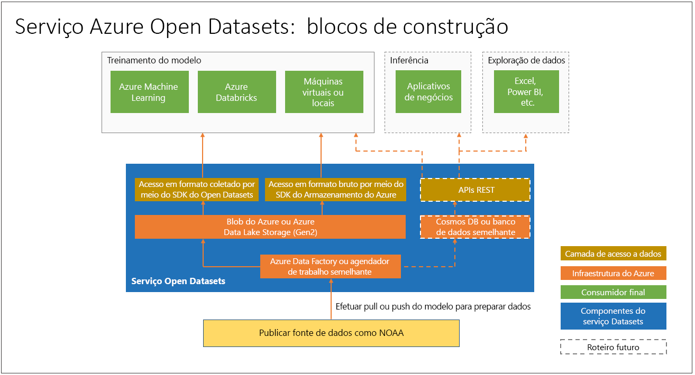

# O que são Conjuntos de dados abertos do Azure e como você pode usá-los?

Os [Conjuntos de dados abertos do Azure](https://azure.microsoft.com/services/open-datasets/) são conjuntos de dados públicos coletados que você pode usar para adicionar recursos específicos do cenário para soluções de aprendizado de máquina para obter modelos mais precisos. Os Conjuntos de dados abertos estão na nuvem no Microsoft Azure e são integrados ao Azure Machine Learning e estão prontamente disponíveis para o Azure Databricks e o Machine Learning Studio (clássico). Você também pode acessar os conjuntos de dados por meio de APIs e usá-los em outros produtos, como o Power BI e o Azure Data Factory.

Os conjuntos de dados incluem dados de domínio público de clima, censo, feriados, segurança pública e localização que ajudam você a treinar os modelos de machine learning e aprimorar as soluções de previsão. Você também pode compartilhar seus conjuntos de dados públicos em Conjuntos de dados abertos do Azure. 

## Coletados, conjuntos de dados preparados
Os conjuntos de dados públicos abertos coletados nos Conjuntos de dados abertos do Azure são otimizados para consumo em fluxos de trabalho de aprendizado de máquina. 

Para ver todos os conjuntos de itens disponíveis, acesse o [Catálogo do Azure Open Datasets](https://azure.microsoft.com/services/open-datasets/catalog/).

Os cientistas de dados geralmente gastam a maior parte do tempo limpando e preparando os dados para análise avançada. Os conjuntos de dados abertos são copiados para a nuvem do Azure e pré-processados para economizar tempo. Em intervalos regulares, os dados são extraídos das fontes, como por uma conexão de FTP para a NOAA (National Oceanic and Atmospheric Administration). Em seguida, os dados são analisados em um formato estruturado e aprimorados conforme apropriado com recursos como CEP ou local da estação meteorológica mais próxima.

Os conjuntos de dados são hospedados em conjunto com a computação de nuvem do Azure facilitando o acesso e a manipulação.  

Estes são exemplos de conjuntos de dados disponíveis. 

### Dados de clima
 
|Dataset         | Notebooks     | Descrição                                    |
|----------------|---------------|------------------------------------------------|
|[ISD (Dados de superfície integrados) da NOAA](https://azure.microsoft.com/services/open-datasets/catalog/noaa-integrated-surface-data/) | [Azure Notebooks](https://azure.microsoft.com/services/open-datasets/catalog/noaa-integrated-surface-data/?tab=data-access#AzureNotebooks)   [Azure Databricks](https://azure.microsoft.com/services/open-datasets/catalog/noaa-integrated-surface-data/?tab=data-access#AzureDatabricks) | Dados meteorológicos globais por hora da NOAA com a melhor cobertura espacial na América do Norte, Europa, Austrália e partes da Ásia. Atualizado diariamente. |
|[GFS (Sistema de previsão global) da NOAA](https://azure.microsoft.com/services/open-datasets/catalog/noaa-global-forecast-system/) | [Azure Notebooks](https://azure.microsoft.com/services/open-datasets/catalog/noaa-global-forecast-system/?tab=data-access#AzureNotebooks)   [Azure Databricks](https://azure.microsoft.com/services/open-datasets/catalog/noaa-global-forecast-system/?tab=data-access#AzureDatabricks) | 15 dias de dados de previsão meteorológica por hora dos EUA da NOAA. Atualizado diariamente. |

### Dados de calendário

|Dataset         | Notebooks     | Descrição                                    |
|----------------|---------------|------------------------------------------------|
|[Feriados](https://azure.microsoft.com/services/open-datasets/catalog/public-holidays/) | [Azure Notebooks](https://azure.microsoft.com/services/open-datasets/catalog/public-holidays/?tab=data-access#AzureNotebooks)   [Azure Databricks](https://azure.microsoft.com/services/open-datasets/catalog/public-holidays/?tab=data-access#AzureDatabricks) | Dados de feriados em todo o mundo, abrangendo 41 países ou regiões de 1970 a 2099. Inclui o país e indica se a maioria das pessoas tem folga naquele dia. |

## Acesso ao conjuntos de dados  
Com uma conta do Azure, você pode acessar os conjuntos de dados abertos usando o código ou por meio da interface de serviço do Azure. Os dados são colocados em uso na sua solução de aprendizado de máquina por meio dos recursos de computação em nuvem do Azure.  

Os Conjuntos de dados abertos estão disponíveis por meio da interface do usuário e do SDK do Azure Machine Learning. Os Conjuntos de dados abertos fornecem notebooks do Azure Notebooks e do Azure Databricks que você pode usar para conectar os dados ao Azure Machine Learning e ao Azure Databricks. Os Conjuntos de dados também podem ser acessados por meio de um SDK de Python. 

No entanto, você não precisa de uma conta do Azure para acessar o Conjunto de Dados em Aberto no Azure. Você pode acessá-lo em qualquer ambiente do Python com ou sem Spark.

## Solicitar ou contribuir com conjuntos de dados

Se você não pode localizar os dados desejados, envie um email para nós para [solicitar um conjunto de dados](mailto:aod@microsoft.com?Subject=Request%20dataset%3A%20%3Creplace%20with%20dataset%20name%3E&Body=%0AYour%20name%20and%20institution%3A%20%0A%0ADataset%20name%3A%0A%20%0ADataset%20description%3A%20%0A%3Cfill%20in%20a%20brief%20description%20and%20share%20any%20web%20links%20of%20the%20dataset%3E%20%0A%0ADataset%20size%3A%20%0A%3Chow%20much%20space%20does%20the%20dataset%20need%20today%20and%20how%20much%20is%20it%20expected%20to%20grow%20each%20year%3E%20%0A%0ADataset%20file%20formats%3A%20%0A%3Ccurrent%20dataset%20file%20formats%2C%20and%20optionally%2C%20any%20formats%20that%20the%20dataset%20must%20be%20transformed%20to%20for%20easy%20access%3E%0A%0ALicense%3A%20%0A%3Cwhat%20is%20the%20license%20or%20terms%20and%20conditions%20governing%20the%20distribution%20of%20this%20dataset%3E%0A%0AUse%20cases%3A%20%0A%3CExplain%20some%20common%20use%20of%20the%20dataset.%20E.g.%20weather%20dataset%20can%20be%20useful%20in%20demand%20forecasting%20and%20predictive%20maintenance%20scenarios%3E%20%0A%0AAny%20additional%20information%20you%20want%20us%20to%20know%3A%0A) ou [contribuir com um conjunto de dados](mailto:aod@microsoft.com?Subject=Contribute%20dataset%3A%20%3Creplace%20with%20dataset%20name%3E&Body=%0AYour%20name%20and%20institution%3A%20%0A%0ADataset%20name%3A%0A%20%0ADataset%20description%3A%20%0A%3Cfill%20in%20a%20brief%20description%20and%20share%20any%20web%20links%20of%20the%20dataset%3E%20%0A%0ADataset%20size%3A%20%0A%3Chow%20much%20space%20does%20the%20dataset%20need%20today%20and%20how%20much%20is%20it%20expected%20to%20grow%20each%20year%3E%20%0A%0ADataset%20file%20formats%3A%20%0A%3Ccurrent%20dataset%20file%20formats%2C%20and%20optionally%2C%20any%20formats%20that%20the%20dataset%20must%20be%20transformed%20to%20for%20easy%20access%3E%0A%0ALicense%3A%20%0A%3Cwhat%20is%20the%20license%20or%20terms%20and%20conditions%20governing%20the%20distribution%20of%20this%20dataset%3E%0A%0AUse%20cases%3A%20%0A%3CExplain%20some%20common%20use%20of%20the%20dataset.%20E.g.%20weather%20dataset%20can%20be%20useful%20in%20demand%20forecasting%20and%20predictive%20maintenance%20scenarios%3E%20%0A%0AAny%20additional%20information%20you%20want%20us%20to%20know%3A%0A). 

## Próximas etapas
* [Exemplo de notebook](samples.md)
* [Tutorial: Modelagem de regressão com os dados de táxi de Nova York](../machine-learning/tutorial-auto-train-models.md?context=azure%2fopen-datasets%2fcontext%2fopen-datasets-context)
* [SDK do Python para conjuntos de dados abertos](/python/api/azureml-opendatasets/)
