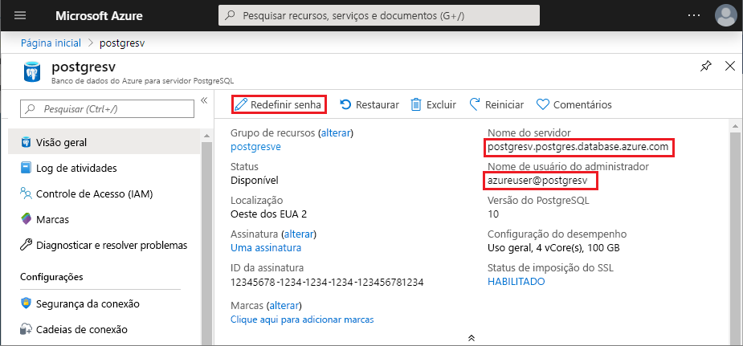

# <a name="quickstart-use-python-to-connect-and-query-data-in-azure-database-for-postgresql---single-server"></a>Início Rápido: Usar o Python para se conectar e consultar dados no Banco de Dados do Azure para PostgreSQL – servidor único

Neste início rápido, você trabalhará com um Banco de Dados do Azure para PostgreSQL usando Python no macOS, Ubuntu Linux ou Windows. O início rápido mostra como se conectar ao banco de dados e usar as instruções SQL para consultar, inserir, atualizar e excluir dados. Este artigo pressupõe que você esteja familiarizado com o Python, mas que não tenha experiência em trabalhar com o Banco de Dados do Azure para PostgreSQL.

> [!TIP]
> Se você estiver procurando criar um aplicativo Django com PostgreSQL, confira o tutorial [Implantar um aplicativo Web Django com PostgreSQL](../app-service/containers/tutorial-python-postgresql-app.md).


## <a name="prerequisites"></a>Pré-requisitos

- Uma conta do Azure com uma assinatura ativa. [Crie uma conta gratuitamente](https://azure.microsoft.com/free/?ref=microsoft.com&utm_source=microsoft.com&utm_medium=docs&utm_campaign=visualstudio).

- Conclusão do [Início Rápido: Criar um servidor de Banco de Dados do Azure para PostgreSQL no portal do Azure](quickstart-create-server-database-portal.md) ou [Início Rápido: Criar um Banco de Dados do Azure para PostgreSQL usando a CLI do Azure](quickstart-create-server-database-azure-cli.md).
  
- [Python](https://www.python.org/downloads/) 2.7.9+ ou 3.4+.
  
- Instalador do pacote [pip](https://pip.pypa.io/en/stable/installing/) mais recente.

## <a name="install-the-python-libraries-for-postgresql"></a>Instalar as bibliotecas do Python para PostgreSQL
O módulo [psycopg2](https://pypi.python.org/pypi/psycopg2/) permite estabelecer conexão e consultar um banco de dados PostgreSQL e está disponível como um pacote [indicador](https://pythonwheels.com/) do Linux, macOS ou Windows. Instale a versão binária do módulo, incluindo todas as dependências. Para saber mais sobre instalação e requisitos de `psycopg2`, confira [Instalação](http://initd.org/psycopg/docs/install.html). 

Para instalar `psycopg2`, abra um terminal ou um prompt de comando e execute o comando `pip install psycopg2`.

## <a name="get-database-connection-information"></a>Obter informações da conexão de banco de dados
A conexão com um Banco de Dados do Azure para PostgreSQL requer o nome do servidor totalmente qualificado e as credenciais de logon. Você pode obter essas informações no portal do Azure.

1. No [portal do Azure](https://portal.azure.com/), procure e selecione o nome do servidor do Banco de Dados do Azure para PostgreSQL. 
1. Na página **Visão Geral** do servidor, copie o **Nome do servidor** totalmente qualificado e o **Nome de usuário do administrador**. O **Nome do servidor** totalmente qualificado sempre está no formato *\<my-server-name>.postgres.database.azure.com* e **Nome do usuário administrador** sempre está no formato *\<my-admin-username>@\<my-server-name>* . 
   
   Você também precisa da sua senha de administrador. Se a esquecer, será possível redefini-la nessa página. 
   
   

## <a name="how-to-run-the-python-examples"></a>Como executar os exemplos de Python

Para cada exemplo de código neste artigo:

1. Crie um arquivo em um editor de texto. 
   
1. Adicione o exemplo de código ao arquivo. No código, substitua:
   - `<server-name>` e `<admin-username>` pelos valores copiados do portal do Azure.
   - `<admin-password>` pela sua senha de servidor.
   - `<database-name>` pelo nome do Banco de Dados do Azure para PostgreSQL. Um banco de dados padrão chamado *postgres* foi criado automaticamente quando você criou seu servidor. É possível renomear esse banco de dados ou criar outro usando os comandos SQL. 
   
1. Salve o arquivo na pasta do seu projeto com uma extensão *.py*, como *postgres-insert.py*. Para Windows, verifique se a codificação UTF-8 está selecionada quando você salvar o arquivo. 
   
1. Para executar o arquivo, altere a pasta do projeto em um interface de linha de comando e digite `python` seguido pelo nome do arquivo, por exemplo `python postgres-insert.py`.

## <a name="create-a-table-and-insert-data"></a>Criar uma tabela e inserir dados
O exemplo de código a seguir conecta-se ao seu Banco de Dados do Azure para PostgreSQL usando a função [psycopg2.connect](http://initd.org/psycopg/docs/connection.html) e carrega os dados com uma instrução **INSERT**. A função [cursor.execute](http://initd.org/psycopg/docs/cursor.html#execute) executa a consulta SQL no banco de dados. 

```Python
import psycopg2

# Update connection string information 
host = "<server-name>"
dbname = "<database-name>"
user = "<admin-username>"
password = "<admin-password>"
sslmode = "require"

# Construct connection string
conn_string = "host={0} user={1} dbname={2} password={3} sslmode={4}".format(host, user, dbname, password, sslmode)
conn = psycopg2.connect(conn_string) 
print("Connection established")

cursor = conn.cursor()

# Drop previous table of same name if one exists
cursor.execute("DROP TABLE IF EXISTS inventory;")
print("Finished dropping table (if existed)")

# Create a table
cursor.execute("CREATE TABLE inventory (id serial PRIMARY KEY, name VARCHAR(50), quantity INTEGER);")
print("Finished creating table")

# Insert some data into the table
cursor.execute("INSERT INTO inventory (name, quantity) VALUES (%s, %s);", ("banana", 150))
cursor.execute("INSERT INTO inventory (name, quantity) VALUES (%s, %s);", ("orange", 154))
cursor.execute("INSERT INTO inventory (name, quantity) VALUES (%s, %s);", ("apple", 100))
print("Inserted 3 rows of data")

# Clean up
conn.commit()
cursor.close()
conn.close()
```

Quando o código é executado com êxito, ele produz a seguinte saída:


## <a name="read-data"></a>Ler dados
O exemplo de código a seguir conecta-se ao seu Banco de Dados do Azure para PostgreSQL e usa [cursor.execute](http://initd.org/psycopg/docs/cursor.html#execute) com a instrução **SELECT** do SQL para leitura de dados. Essa função aceita uma consulta e retorna um conjunto de resultados a ser iterado usando [cursor.fetchall()](http://initd.org/psycopg/docs/cursor.html#cursor.fetchall). 

```Python
import psycopg2

# Update connection string information
host = "<server-name>"
dbname = "<database-name>"
user = "<admin-username>"
password = "<admin-password>"
sslmode = "require"

# Construct connection string
conn_string = "host={0} user={1} dbname={2} password={3} sslmode={4}".format(host, user, dbname, password, sslmode)
conn = psycopg2.connect(conn_string) 
print("Connection established")

cursor = conn.cursor()

# Fetch all rows from table
cursor.execute("SELECT * FROM inventory;")
rows = cursor.fetchall()

# Print all rows
for row in rows:
    print("Data row = (%s, %s, %s)" %(str(row[0]), str(row[1]), str(row[2])))

# Cleanup
conn.commit()
cursor.close()
conn.close()
```

## <a name="update-data"></a>Atualizar dados
O exemplo de código a seguir conecta-se ao seu Banco de Dados do Azure para PostgreSQL e usa [cursor.execute](http://initd.org/psycopg/docs/cursor.html#execute) com a instrução **UPDATE** do SQL para atualização de dados. 

```Python
import psycopg2

# Update connection string information
host = "<server-name>"
dbname = "<database-name>"
user = "<admin-username>"
password = "<admin-password>"
sslmode = "require"

# Construct connection string
conn_string = "host={0} user={1} dbname={2} password={3} sslmode={4}".format(host, user, dbname, password, sslmode)
conn = psycopg2.connect(conn_string) 
print("Connection established")

cursor = conn.cursor()

# Update a data row in the table
cursor.execute("UPDATE inventory SET quantity = %s WHERE name = %s;", (200, "banana"))
print("Updated 1 row of data")

# Cleanup
conn.commit()
cursor.close()
conn.close()
```

## <a name="delete-data"></a>Excluir dados
O exemplo de código a seguir conecta-se ao seu Banco de Dados do Azure para PostgreSQL e usa [cursor.execute](http://initd.org/psycopg/docs/cursor.html#execute) com a instrução **DELETE** do SQL para exclusão de um item de inventário que você inseriu anteriormente. 

```Python
import psycopg2

# Update connection string information
host = "<server-name>"
dbname = "<database-name>"
user = "<admin-username>"
password = "<admin-password>"
sslmode = "require"

# Construct connection string
conn_string = "host={0} user={1} dbname={2} password={3} sslmode={4}".format(host, user, dbname, password, sslmode)
conn = psycopg2.connect(conn_string) 
print("Connection established")

cursor = conn.cursor()

# Delete data row from table
cursor.execute("DELETE FROM inventory WHERE name = %s;", ("orange",))
print("Deleted 1 row of data")

# Cleanup
conn.commit()
cursor.close()
conn.close()
```

## <a name="next-steps"></a>Próximas etapas
> [!div class="nextstepaction"]
> [Migre seu banco de dados usando Exportar e Importar](./howto-migrate-using-export-and-import.md)
