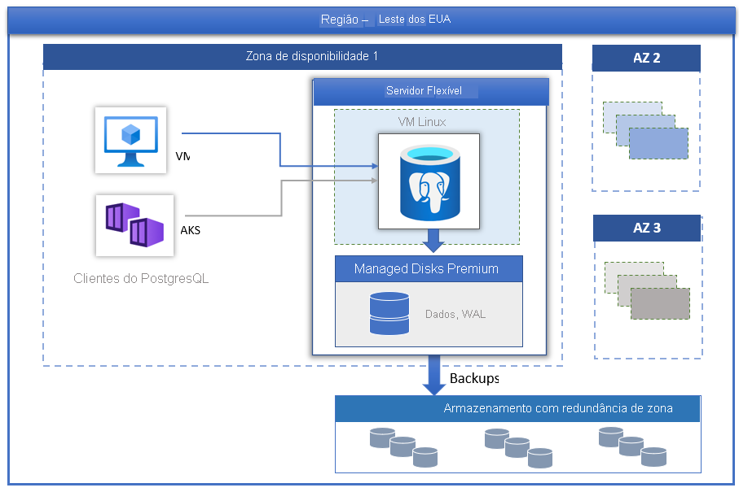

# Servidor Flexível do Banco de Dados do Azure para PostgreSQL

O [Banco de Dados do Azure para PostgreSQL](../overview.md) desenvolvido com o PostgreSQL community edition está disponível em três modos de implantação:

- [Servidor Único](../overview-single-server.md)
- Servidor Flexível (versão prévia)
- Hiperescala (Citus)

Neste artigo, forneceremos uma visão geral e uma introdução aos principais conceitos do modelo de implantação de servidor flexível.

> [!IMPORTANT]
> O Servidor Flexível do Banco de Dados do Azure para PostgreSQL está em versão prévia

## Visão geral

O Servidor Flexível do Banco de Dados do Azure para PostgreSQL é um serviço de banco de dados totalmente gerenciado, projetado para proporcionar um controle mais granular e flexibilidade nas funções de gerenciamento de banco de dados e definições de configuração. Em geral, o serviço oferece mais flexibilidade e personalizações de configuração do servidor com base nos requisitos do usuário. A arquitetura de servidor flexível permite aos usuários colocar o mecanismo de banco de dados com a camada de cliente para uma latência mais baixa, escolher a alta disponibilidade em uma só zona de disponibilidade e em várias zonas de disponibilidade. Os servidores flexíveis também oferecem melhores controles de otimização de custos com a capacidade de parar/iniciar o servidor e a camada de computação expansível, que é ideal para cargas de trabalho que não precisam da capacidade de computação completa continuamente. Atualmente, o serviço dá suporte à versão da comunidade do PostgreSQL 11 e 12. No momento, o serviço está em versão prévia, disponível hoje mesmo em uma ampla variedade de [regiões do Azure](https://azure.microsoft.com/global-infrastructure/services/).

Os servidores flexíveis são mais adequados para

- Desenvolvimentos de aplicativos que exigem controle e personalizações melhores.
- Alta disponibilidade com redundância de zona
- Janelas de manutenção gerenciadas
  
## Alta disponibilidade

O modelo de implantação de servidor flexível foi projetado para dar suporte à alta disponibilidade em uma só zona de disponibilidade e em várias zonas de disponibilidade. A arquitetura separa a computação do armazenamento. O mecanismo de banco de dados é executado em uma máquina virtual do Linux, enquanto os arquivos residem no Armazenamento do Azure. O armazenamento mantém três cópias síncronas localmente redundantes dos arquivos de banco de dados, garantindo a durabilidade dos dados.

Durante eventos de failover planejados ou não planejados, se o servidor ficar inativo, o serviço manterá a alta disponibilidade dos servidores usando o seguinte procedimento automatizado:

1. Uma nova VM de computação do Linux será provisionada.
2. O armazenamento com os arquivos de dados é mapeado para a nova Máquina Virtual
3. O mecanismo de banco de dados PostgreSQL é colocado online na nova Máquina Virtual.

A imagem abaixo mostra a transição para a falha de VM e de armazenamento.

 :::image type="content" source="./media/overview/overview-azure-postgres-flex-virtualmachine.png" alt-text="Servidor flexível – falhas de VM e de armazenamento":::

Se a alta disponibilidade com redundância de zona estiver configurada, o serviço provisionará e manterá um servidor em espera ativa na zona de disponibilidade, na mesma região do Azure. As alterações de dados no servidor de origem são replicadas de maneira síncrona para o servidor em espera para garantir zero perda de dados. Com alta disponibilidade com redundância de zona, uma vez que o evento de failover planejado ou não planejado é disparado, o servidor em espera fica online imediatamente e está disponível para processar transações de entrada. Isso permite a resiliência de serviço de uma falha de zona de disponibilidade em uma região do Azure que dá suporte a várias zonas de disponibilidade, conforme mostrado na imagem abaixo.

 :::image type="content" source="./media/business-continuity/concepts-zone-redundant-high-availability-architecture.png" alt-text="Alta disponibilidade com redundância de zona":::

 Confira o [documento sobre alta disponibilidade](./concepts-high-availability.md) para obter mais detalhes.

## Aplicação de patch automatizada com janela de manutenção gerenciada

O serviço executa a aplicação automatizada de patch do hardware, do sistema operacional e do mecanismo de banco de dados subjacentes. A aplicação de patch inclui atualizações de segurança e software. Para o mecanismo PostgreSQL, as atualizações de versão secundárias também são incluídas como parte da versão de manutenção planejada. Os usuários podem configurar o agendamento de aplicação de patch para que ele seja gerenciado pelo sistema ou definir um agendamento personalizado. Durante o agendamento de manutenção, o patch é aplicado e o servidor pode precisar ser reiniciado como parte do processo de aplicação de patch para concluir a atualização. Com o agendamento personalizado, os usuários podem tornar o ciclo de aplicação de patch previsível e escolher uma janela de manutenção com impacto mínimo sobre os negócios. No geral, o serviço segue a agenda de lançamento mensal como parte do lançamento e da integração contínua.

## Backups automáticos

O serviço de servidor flexível cria automaticamente backups de servidor e os armazena no usuário configurado no local em ZRS (com redundância de zona). Os backups podem ser usados para restaurar o servidor em qualquer ponto no tempo dentro do período de retenção de backup. O período de retenção de backup padrão é de sete dias. A retenção pode ser configurada opcionalmente em até 35 dias. Todos os backups são criptografados usando a criptografia AES de 256 bits. Confira [Backups](./concepts-backup-restore.md) para obter mais detalhes.

## Ajustar o desempenho e a escala em segundos

O serviço de servidor flexível está disponível em três camadas de computação: Expansível, Uso Geral e Otimizado para Memória. A camada Expansível é mais adequada para desenvolvimento de baixo custo e cargas de trabalho de simultaneidade baixa que não precisam da capacidade de computação completa continuamente. O Uso Geral e o Otimizado para Memória são mais adequados para cargas de trabalho de produção que exigem alta simultaneidade, escala e desempenho previsível. Você pode criar seu primeiro aplicativo em um banco de dados pequeno por alguns dólares por mês e, depois, ajustar a escala de acordo com as necessidades da sua solução.

## Parar/iniciar o servidor para reduzir o TCO

O serviço de servidor flexível permite que você pare e inicie o servidor sob demanda para reduzir o TCO. A cobrança da camada de computação é interrompida imediatamente quando o servidor é parado. Com isso, você pode ter uma redução de custo significativa durante o desenvolvimento e o teste e para cargas de trabalho de produção previsíveis com limite de tempo. O servidor permanece no estado parado por sete dias, a menos que ele seja reiniciado antes.

## Segurança de nível empresarial

O serviço de servidor flexível usa o módulo de criptografia validado por FIPS 140-2 para a criptografia de armazenamento de dados em repouso. Os dados, incluindo backups, e os arquivos temporários criados durante a execução de consultas são criptografados. O serviço usa a criptografia AES de 256 bits incluída na criptografia de armazenamento do Azure, e as chaves podem ser gerenciadas pelo sistema (padrão). O serviço criptografa os dados em movimento com o protocolo SSL/TLS imposto por padrão. O serviço só impõe a versão do TLS 1.2 e só dá suporte a ela.

Os servidores flexíveis permitem acesso privado completo aos servidores usando a rede virtual do Azure (Integração VNET). Os servidores da rede virtual do Azure só podem ser acessados e conectados por meio de endereços IP privados. Com a Integração VNET, o acesso público é negado e os servidores não podem ser acessados por meio de pontos de extremidade públicos.

## Monitoramento e alertas

O serviço de servidor flexível é equipado com recursos internos de monitoramento e alerta de desempenho. Todas as métricas do Azure têm uma frequência de um minuto e cada uma delas fornece 30 dias de histórico. É possível configurar alertas nas métricas. O serviço expõe as métricas do servidor host para monitorar a utilização de recursos e permite configurar logs de consultas lentas. Usando essas ferramentas, você pode otimizar rapidamente suas cargas de trabalho e configurar seu servidor para ter o melhor desempenho.

## Regiões do Azure

Uma das vantagens de executar sua carga de trabalho no Azure é obter um alcance global. O servidor flexível está disponível hoje nas seguintes regiões do Azure:

| Região | Disponibilidade | HA com redundância de zona | 
| --- | --- | --- |
| Europa Ocidental | :heavy_check_mark: | :heavy_check_mark: |
| Norte da Europa | :heavy_check_mark: | :heavy_check_mark: |
| Sul do Reino Unido | :heavy_check_mark: | :heavy_check_mark: | 
| Leste dos EUA 2 | :heavy_check_mark: | :heavy_check_mark: |
| Oeste dos EUA 2 | :heavy_check_mark: | :heavy_check_mark: |
| Centro dos EUA | :heavy_check_mark: | :heavy_check_mark: | 
| Leste dos EUA | :heavy_check_mark: | :heavy_check_mark: | 
| Sudeste Asiático | :heavy_check_mark: | :heavy_check_mark: |
| Japan East | :heavy_check_mark: | :heavy_check_mark: | 
| Leste da Austrália | :heavy_check_mark: | :heavy_check_mark: | 
| Canadá Central | :heavy_check_mark: | :heavy_check_mark: | 

Continuamos adicionando mais regiões para o servidor flexível.

## Migração

O serviço executa a versão da comunidade do PostgreSQL. Isso permite a compatibilidade total do aplicativo e exige o mínimo de custo de refatoração para migrar um aplicativo existente desenvolvido no mecanismo PostgreSQL para um Servidor Flexível. 

- **Despejo e restauração**: nas migrações offline, em que os usuários podem ter algum tempo de inatividade, realizar o despejo e a restauração com ferramentas da comunidade, como pg_dump e pg_restore, pode fornecer uma forma mais rápida de migração. Confira [Migrar usando despejo e restauração](../howto-migrate-using-dump-and-restore.md) para obter detalhes.
- **Serviço de Migração de Banco de Dados do Azure**: para migrações diretas e simplificadas para um servidor flexível com tempo de inatividade mínimo, você pode aproveitar o Serviço de Migração de Banco de Dados do Azure. Confira [DMS por meio do portal](../../dms/tutorial-postgresql-azure-postgresql-online-portal.md) e [DMS por meio da CLI](../../dms/tutorial-postgresql-azure-postgresql-online.md). Você pode fazer a migração por meio do Banco de Dados do Azure para PostgreSQL – Servidor Único para Servidor Flexível. Confira este [artigo sobre o DMS](../../dms/tutorial-azure-postgresql-to-azure-postgresql-online-portal.md) para obter detalhes.

## Contatos
Para perguntas ou sugestões sobre o servidor flexível do Banco de Dados do Azure para PostgreSQL, envie um email para a equipe do Banco de Dados do Azure para PostgreSQL ([@Ask BD do Azure para PostgreSQL](mailto:AskAzureDBforPostgreSQL@service.microsoft.com)). Observe que esse endereço de email não é um alias de suporte técnico.

Além disso, considere os seguintes pontos de contato, conforme apropriado:

- Para entrar em contato com o Suporte do Azure, [crie um tíquete no Portal do Azure](https://portal.azure.com/?#blade/Microsoft_Azure_Support/HelpAndSupportBlade).
- Para corrigir um problema com sua conta, apresente uma [solicitação de suporte](https://ms.portal.azure.com/#blade/Microsoft_Azure_Support/HelpAndSupportBlade/newsupportrequest) no portal do Azure.
- Para fornecer comentários ou solicitar novos recursos, crie uma entrada por meio do [UserVoice](https://feedback.azure.com/forums/597976-azure-database-for-postgresql).
  

## Próximas etapas

Agora que você leu uma introdução ao modo de implantação de servidor flexível do Banco de Dados do Azure para PostgreSQL, você está pronto para criar seu primeiro servidor: [Criar um Servidor Flexível do Banco de Dados do Azure para PostgreSQL usando o portal do Azure](./quickstart-create-server-portal.md)