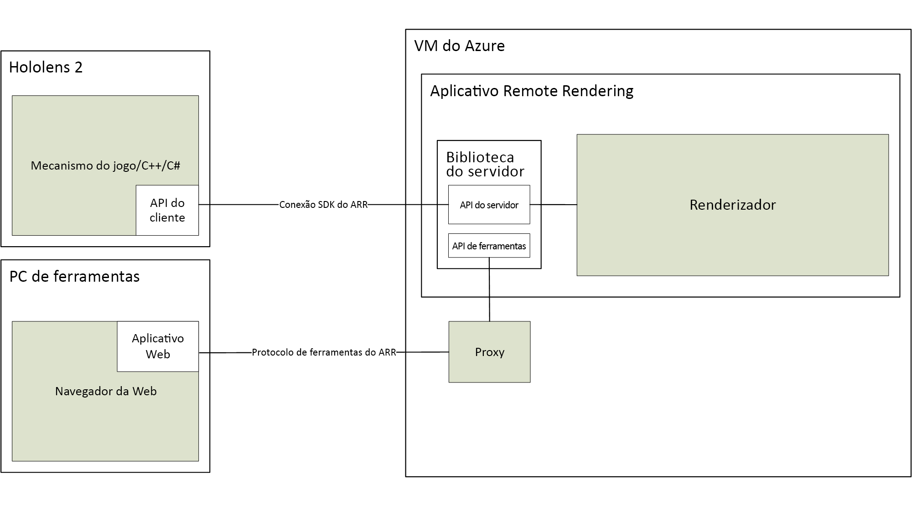

# Sobre o Azure Remote Rendering

> [!IMPORTANT]
> No momento, o **Azure Remote Rendering** está em versão prévia pública.
> Essa versão prévia é fornecida sem um contrato de nível de serviço e não é recomendada para cargas de trabalho de produção. Alguns recursos podem não ter suporte ou podem ter restrição de recursos. Para obter mais informações, consulte [Termos de Uso Complementares de Versões Prévias do Microsoft Azure](https://azure.microsoft.com/support/legal/preview-supplemental-terms/).

O *ARR* (Azure Remote Rendering) é um serviço que permite renderizar conteúdo 3D interativo de alta qualidade na nuvem e transmiti-lo em tempo real para dispositivos, como o HoloLens 2.

Dispositivos não vinculados têm capacidade computacional limitada para renderizar modelos complexos. No entanto, para muitos aplicativos, seria inaceitável reduzir a fidelidade visual de qualquer maneira. A seguinte captura de tela compara o modelo com detalhes completos com um modelo que foi dizimado com uma ferramenta comum de criação de conteúdo:

O modelo reduzido consiste em aproximadamente 200 mil triângulos (incluindo as partes internas detalhadas), comparado a mais de 18 milhões de triângulos no modelo original.

O *Remote Rendering* resolve esse problema movendo a carga de trabalho de renderização para GPUs de alta-extremidade na nuvem. Um mecanismo de gráficos hospedado na nuvem renderiza a imagem, a codifica como um fluxo de vídeo e a transmite para o dispositivo de destino.

## Renderização híbrida

Na maioria dos aplicativos, não é suficiente apenas renderizar um modelo complexo. Você também precisa de uma interface do usuário personalizada para fornecer funcionalidades ao usuário. O Azure Remote Rendering não força você a usar uma estrutura de interface do usuário dedicada, em vez disso, ela dá suporte à *Renderização Híbrida*. Isso significa que você pode renderizar elementos no dispositivo, usando seu método preferencial, como [MRTK](https://microsoft.github.io/MixedRealityToolkit-Unity/Documentation/GettingStartedWithTheMRTK.html).

No final de um quadro, o Azure Remote Rendering combina automaticamente o conteúdo renderizado localmente com a imagem remota. Ele é até mesmo capaz de fazer isso com a oclusão correta.

## Renderização de várias GPUs

Alguns modelos são muito complexos para serem renderizados em taxas de quadros interativas, mesmo para uma GPU de alto nível. Principalmente na visualização industrial, esse é um problema comum. Para aumentar os limites, o Azure Remote Rendering pode distribuir a carga de trabalho em várias GPUs. Os resultados são mesclados em uma só imagem, tornando o processo totalmente transparente para o usuário.

## Arquitetura de alto nível

Este diagrama ilustra a arquitetura de renderização remota:

Um ciclo completo de geração de imagem envolve as seguintes etapas:

1. Lado do cliente: configuração do quadro
    1. Seu código: a entrada do usuário é processada e o grafo de cena é atualizado
    1. Código do ARR: as atualizações do grafo de cena e a pose da cabeça prevista são enviadas ao servidor
1. Lado do servidor: Remote Rendering
    1. O mecanismo de renderização distribui a renderização entre GPUs disponíveis
    1. A saída de várias GPUs é composta em uma só imagem
    1. A imagem é codificada como fluxo de vídeo, enviada de volta ao cliente
1. Lado do cliente: Finalização
    1. Seu código: o conteúdo local opcional (interface do usuário, marcadores...) é renderizado
    1. Código do ARR: em 'Presente', o conteúdo renderizado localmente é mesclado automaticamente com o fluxo de vídeo

A latência de rede é o principal problema. O tempo de mudança entre o envio de uma solicitação e o recebimento do resultado é normalmente muito longo para taxas de quadros interativas. Portanto, mais de um quadro pode estar em trânsito a qualquer momento.

## Próximas etapas

* [Requisitos do sistema](system-requirements.md)
* [Início Rápido: Renderizar um modelo com o Unity](../quickstarts/render-model.md)
