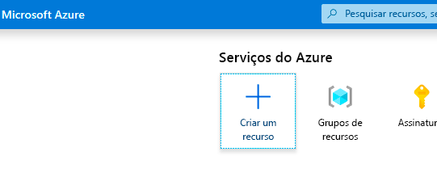
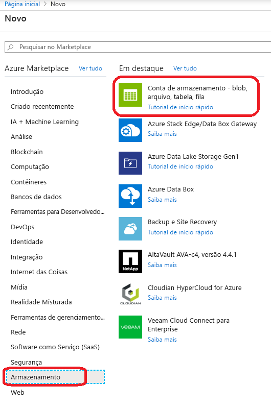
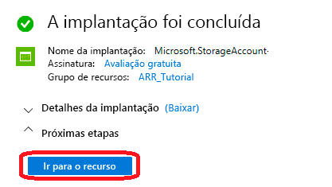
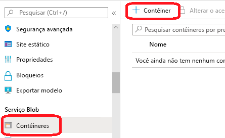
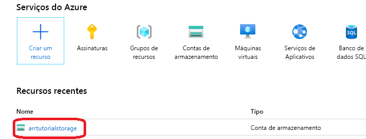

# <a name="quickstart-convert-a-model-for-rendering"></a>Início Rápido: Converter um modelo para renderização

No [Início Rápido: Renderizar um modelo com o Unity](render-model.md), você aprendeu a usar o projeto de exemplo do Unity para renderizar um modelo interno. Este guia mostra como converter seus modelos.

Você aprenderá a:

> [!div class="checklist"]
>
> * Configurar uma conta de Armazenamento de Blobs do Azure para entrada e saída
> * Carregar e converter um modelo 3D para uso com o Azure Remote Rendering
> * Incluir o modelo 3D convertido em um aplicativo para renderização

## <a name="prerequisites"></a>Pré-requisitos

* Concluir [Início Rápido: Renderizar um modelo com o Unity](render-model.md)
* Para a conversão usando o script do PowerShell: Instalar o Azure PowerShell [(documentação)](/powershell/azure/)
  * Abra um PowerShell com direitos de administrador
  * Execute: `Install-Module -Name Az -AllowClobber`

## <a name="overview"></a>Visão geral

O renderizador no servidor não pode trabalhar diretamente com formatos de modelo de origem, como FBX ou GLTF. Em vez disso, ele requer que o modelo esteja em um formato binário proprietário.
O serviço de conversão consome modelos do Armazenamento de Blobs do Azure e grava os modelos convertidos de volta em um contêiner de Armazenamento de Blobs do Azure fornecido.

Você precisa de:

* Uma assinatura do Azure
* Uma conta "StorageV2" em sua assinatura
* Um contêiner de Armazenamento de Blobs para o modelo de entrada
* Um contêiner de Armazenamento de Blobs para os dados de saída
* Um modelo a ser convertido; veja [modelos de exemplo](../samples/sample-model.md)
  * Confira a lista de [formatos de origem compatíveis](../how-tos/conversion/model-conversion.md#supported-source-formats)
  * Para usar o script de conversão de amostra, prepare uma pasta de entrada que contenha o modelo e todas as dependências externas (como texturas externas ou geometria)

## <a name="azure-setup"></a>Configuração do Azure

Se você ainda não tiver uma conta, acesse [https://azure.microsoft.com/get-started/](https://azure.microsoft.com/get-started/), clique na opção conta gratuita e siga as instruções.

Quando você tiver uma conta do Azure, acesse [https://ms.portal.azure.com/#home](https://ms.portal.azure.com/#home).

### <a name="storage-account-creation"></a>Criação da conta de armazenamento

Para criar o Armazenamento de Blobs, primeiro você precisa de uma conta de armazenamento.
Para criar uma, clique no botão "Criar um recurso":



Na nova tela, escolha **Armazenamento** no lado esquerdo e, em seguida, **Conta de armazenamento – -blob, arquivo, tabela, fila** na próxima coluna:



Clicar nesse botão abrirá a seguinte tela com as propriedades do armazenamento para preencher:


Preencha o formulário da seguinte maneira:

* Crie um Grupo de Recursos no link abaixo da caixa suspensa e dê o nome **ARR_Tutorial**
* Para o **Nome da conta de armazenamento**, insira um nome exclusivo. **Esse nome precisa ser globalmente exclusivo**, caso contrário, você verá um aviso informando que o nome já foi usado. No escopo deste início rápido, nós o nomeamos **arrtutorialstorage**. Sendo assim, você precisa substituir esse nome pelo seu nome, para o caso de outra ocorrência neste início rápido.
* Escolha uma **localização** perto de você. O ideal é usar a mesma localização usada para configurar a renderização no outro início rápido.
* **Desempenho** definido como 'Padrão'
* **Tipo de conta** definido como 'StorageV2 (uso geral v2)'
* **Replicação** definida como 'RA-GRS (armazenamento com redundância geográfica com acesso de leitura)'
* **Camada de acesso** definida como 'Frequente'

Nenhuma das propriedades das outras guias precisa ser alterada, portanto você pode prosseguir com **"Examinar + criar"** e, em seguida, seguir as etapas para concluir a configuração.

Agora o site informa sobre o progresso de sua implantação e, eventualmente, informa "Sua implantação foi concluída". Clique no botão de **"Ir para o recurso"** para as próximas etapas:



### <a name="blob-storage-creation"></a>Criação de Armazenamento de Blobs

Em seguida, precisamos de dois contêineres de blobs, um para entrada e outro para saída.

Do botão **"Ir para o recurso"** acima, você chega a uma página com um painel à esquerda que contém um menu de lista. Nessa lista, na categoria **"Serviço Blob"** , clique no botão de **"Contêineres"** :



Pressione o botão **"+ Contêiner"** para criar o contêiner de Armazenamento de Blobs de **entrada**.
Use as seguintes configurações ao criá-lo:
  
* Nome = arrinput
* Nível de acesso público = Privado

Depois que o contêiner tiver sido criado, clique em **+ Contêiner** novamente e repita essas configurações para o contêiner de **saída**:

* Nome = arroutput
* Nível de acesso público = Privado

Agora você deve ter dois contêineres de Armazenamento de Blobs:


## <a name="run-the-conversion"></a>Executar a conversão

Há três maneiras distintas de disparar uma conversão de modelo:

### <a name="1-conversion-via-the-arrt-tool"></a>1. Conversão por meio da ferramenta ARRT

Há uma [ferramenta baseada em interface do usuário chamada ARRT](./../samples/azure-remote-rendering-asset-tool.md) para iniciar conversões e interagir com o resultado renderizado.


### <a name="2-conversion-via-a-powershell-script"></a>2. Conversão por meio de um script do PowerShell

Para facilitar a chamada do serviço de conversão de ativos, fornecemos um script de utilitário. Ele está localizado na pasta *Scripts* e é chamado de **Conversion.ps1**.

Em particular, esse script

1. carrega todos os arquivos de um determinado diretório do disco local para o contêiner de armazenamento de entrada
1. chama a [API REST de conversão de ativos](../how-tos/conversion/conversion-rest-api.md), que vai recuperar os dados do contêiner de armazenamento de entrada e iniciar uma conversão que retornará uma ID de conversão
1. sonda a API de status de conversão com a ID de conversão recuperada até que o processo de conversão seja encerrado com êxito ou falha
1. recupera um link do ativo convertido no armazenamento de saída

O script lê sua configuração no arquivo *Scripts\arrconfig.json*. Abra esse arquivo JSON em um editor de texto.

```json
{
    "accountSettings": {
        "arrAccountId": "8*******-****-****-****-*********d7e",
        "arrAccountKey": "R***************************************l04=",
        "region": "<your-region>"
    },
    "renderingSessionSettings": {
        "vmSize": "standard",
        "maxLeaseTime": "1:00:00"
    },
    "assetConversionSettings": {
        "localAssetDirectoryPath": "D:\\tmp\\robot",
        "resourceGroup": "ARR_Tutorial",
        "storageAccountName": "arrexamplestorage",
        "blobInputContainerName": "arrinput",
        "inputFolderPath": "robotConversion",
        "inputAssetPath": "robot.fbx",
        "blobOutputContainerName": "arroutput",
        "outputFolderPath":"converted/robot",
        "outputAssetFileName": "robot.arrAsset"
    }
}
```

A configuração no grupo **accountSettings** (ID da conta e chave) deve ser preenchida de maneira análoga às credenciais no [Início rápido Renderizar um modelo com o Unity](render-model.md).

Dentro do grupo **assetConversionSettings**, altere **resourceGroup**, **blobInputContainerName** e **blobOutputContainerName** como visto acima.
Observe que o valor **arrtutorialstorage** precisa ser substituído pelo nome exclusivo que você escolheu durante a criação da conta de armazenamento.

Altere **localAssetDirectoryPath** para apontar para o diretório no disco que contém o modelo que você pretende converter. Tenha cuidado para escapar corretamente as barras invertidas ("\\") no caminho, usando barras invertidas duplas ("\\\\").

Todos os dados do caminho fornecido em **localAssetDirectoryPath** serão carregados no contêiner de blob **blobInputContainerName** em um subcaminho fornecido pelo **inputFolderPath**. Portanto, na configuração de exemplo acima, o conteúdo do diretório "D:\\tmp\\robot" será carregado no contêiner de blob "arrinput" da conta de armazenamento "arrtutorialstorage" no caminho "robotConversion". Os arquivos já existentes serão substituídos.

Altere **inputAssetPath** para o caminho do modelo a ser convertido – o caminho é relativo a localAssetDirectoryPath. Use "/" em vez de "\\" como o separador de caminho. Portanto, para um arquivo "robot.fbx" localizado diretamente em "D:\\tmp\\robot", use "robot.fbx".

Depois que o modelo for convertido, ele será gravado no contêiner de armazenamento fornecido por **blobOutputContainerName**. Um subcaminho pode ser especificado fornecendo o **outputFolderPath** opcional. No exemplo acima, o "robot.arrAsset" resultante será copiado para o contêiner de blob de saída em "converted/robot".

A definição de configuração **outputAssetFileName** determina o nome do ativo convertido – o parâmetro é opcional e, nesse caso, o nome de arquivo de saída será deduzido do nome do arquivo de entrada.

Abra um PowerShell, confirme se instalou o *Azure PowerShell* conforme mencionado nos [pré-requisitos](#prerequisites). Em seguida, faça logon em sua assinatura com o seguinte comando e siga as instruções na tela:

```PowerShell
Connect-AzAccount
```

> [!NOTE]
> Caso sua organização tenha mais de uma assinatura, talvez seja necessário especificar os argumentos SubscriptionId e Tenant. Encontre detalhes na [Documentação sobre Connect-AzAccount](/powershell/module/az.accounts/connect-azaccount).

Altere para o diretório `azure-remote-rendering\Scripts` e execute o script de conversão:

```PowerShell
.\Conversion.ps1 -UseContainerSas
```

Você deverá ver algo assim: 

### <a name="3-conversion-via-api-calls"></a>3. Conversão por meio de chamadas à API

Tanto a API do C# quanto a do C++ fornecem um ponto de entrada para interagir com o serviço:
* [C# RemoteRenderingClient.StartAssetConversionAsync()](/dotnet/api/microsoft.azure.remoterendering.remoterenderingclient.startassetconversionasync)
* [C++ RemoteRenderingClient::StartAssetConversionAsync()](/cpp/api/remote-rendering/remoterenderingclient#startassetconversionasync)


## <a name="insert-new-model-into-quickstart-sample-app"></a>Inserir um novo modelo no aplicativo de exemplo do guia de início rápido

O script de conversão gera um URI de *SAS (Assinatura de Acesso Compartilhado)* para o modelo convertido. Agora você pode copiar esse URI como o **Nome do Modelo** no aplicativo de exemplo do início rápido (consulte o [Início Rápido: Renderizar um modelo com o Unity](render-model.md)).


 Agora o exemplo deve carregar e renderizar seu modelo personalizado!

## <a name="optional-re-creating-a-sas-uri"></a>Opcional: Recriando um URI de SAS

O URI de SAS criado pelo script de conversão só será válido por 24 horas. No entanto, depois de expirar, você não precisa converter seu modelo novamente. Em vez disso, você pode criar uma SAS no portal, conforme descrito nas próximas etapas:

1. Vá para o [Portal do Azure](https://www.portal.azure.com)
1. Clique no recurso de **Conta de armazenamento**: 
1. Na tela a seguir, clique em **Gerenciador de armazenamento** no painel esquerdo e localize o modelo de saída (arquivo *.arrAsset*) no contêiner de Armazenamento de Blobs *arroutput*. Clique com o botão direito do mouse no arquivo e selecione **Obter Assinatura de Acesso Compartilhado** no menu de contexto: 
1. Uma nova tela é aberta, em que você pode selecionar uma data de expiração. Pressione **Criar** e copie o URI mostrado na próxima caixa de diálogo. Esse novo URI substitui o URI temporário que o script criou.

## <a name="next-steps"></a>Próximas etapas

Agora que você conhece os conceitos básicos, veja nossos tutoriais para obter um conhecimento mais aprofundado.

Se você quiser aprender os detalhes da conversão de modelo, confira [a API REST de conversão de modelo](../how-tos/conversion/conversion-rest-api.md).

> [!div class="nextstepaction"]
> [Tutorial: Como exibir modelos renderizados remotamente](../tutorials/unity/view-remote-models/view-remote-models.md)