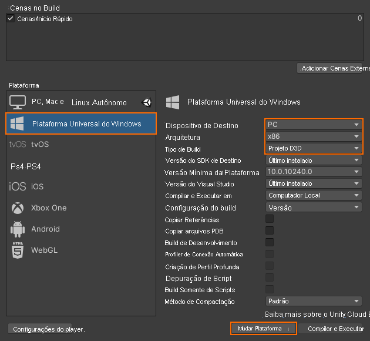
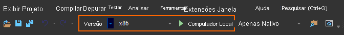

# Início Rápido: Implantar a amostra de Unity na Área de Trabalho

Este início rápido aborda como implantar e executar o aplicativo de exemplo de início rápido para Unity em um PC desktop.

Neste início rápido, você aprenderá a:

> [!div class="checklist"]
>
>* Criar o aplicativo de exemplo de início rápido para desktop
>* Implantar o exemplo em um PC
>* Executar o exemplo em um PC

## Pré-requisitos

Neste início rápido, implantaremos o projeto de exemplo com base em [Início Rápido: Renderizar um modelo com o Unity](render-model.md).

Verifique se suas credenciais foram salvas corretamente com a cena e se você pode se conectar a uma sessão de dentro do editor do Unity.

## Desabilitar o suporte à realidade virtual

No momento, há suporte apenas para aplicativos da área de trabalho simples no desktop, portanto o suporte à VR precisa ser desabilitado.

1. Abra *Editar > Configurações do Projeto...*
1. Selecione **Player** à esquerda.
1. Selecione a guia **Configurações da Plataforma Universal do Windows**.
1. Expanda **Configurações de XR**.
1. Desabilite a **Realidade Virtual com Suporte**.\
    
1. Em cima de *Configurações de XR*, expanda **Configurações de Publicação**.
1. Em **Famílias de Dispositivos com Suporte**, verifique se **Área de Trabalho** está selecionada.

## Criar o projeto de exemplo

1. Abra *Arquivo > Configurações de Build*.
1. Altere a *Plataforma* para a **Plataforma Universal do Windows** (**PC autônomo** também tem suporte, mas não é usado aqui. Consulte as [limitações de plataforma](../reference/limits.md#platform-limitations)).
1. Defina o *Dispositivo de Destino* como **PC**.
1. Defina *Arquitetura* como **x86**.
1. Defina *Tipo de Build* como **Projeto D3D**.\
  
1. Selecione **Alterar para a Plataforma**.
1. Ao pressionar **Criar** (ou 'Criar e Executar'), você deverá selecionar alguma pasta na qual a solução deve ser armazenada.
1. Abra o **Quickstart.sln** gerado com o Visual Studio.
1. Altere a configuração para **Versão** e **x86**.
1. Alterne o modo do depurador para **Computador Local**.\
  
1. Compile a solução.

## Iniciar o projeto de exemplo

Interrompa o Depurador no Visual Studio (F5). Ele implantará automaticamente o aplicativo no PC.

O aplicativo de exemplo deve ser iniciado e, em seguida, iniciar uma nova sessão. Após alguns instantes, a sessão estará pronta e o modelo renderizado remotamente será exibido na frente de você.
Se desejar iniciar o exemplo uma segunda vez mais tarde, você também poderá encontrá-lo no menu iniciar agora.

## Próximas etapas

No próximo início rápido, veremos a conversão de um modelo personalizado.

> [!div class="nextstepaction"]
> [Início Rápido: Converter um modelo para renderização](convert-model.md)
