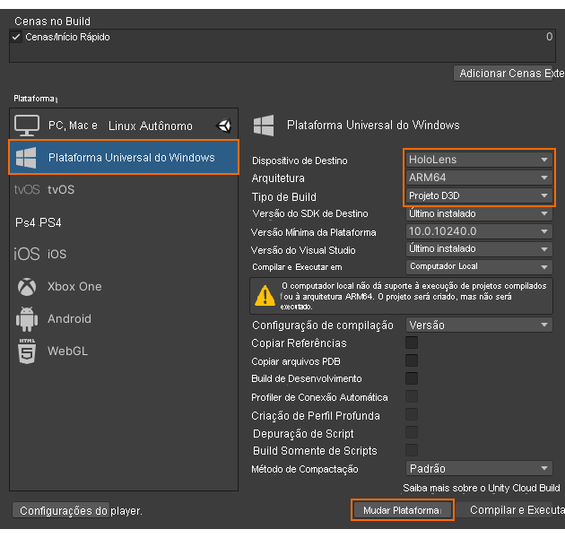
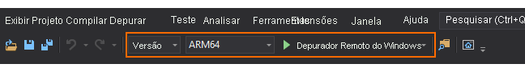

# Início Rápido: Implantar a amostra de Unity no HoloLens

Este início rápido aborda como implantar e executar o aplicativo de exemplo de início rápido para Unity em um HoloLens 2.

Neste início rápido, você aprenderá a:

> [!div class="checklist"]
>
>* Criar o aplicativo de exemplo de início rápido para HoloLens
>* Implantar o exemplo no dispositivo
>* Executar o exemplo no dispositivo

## Pré-requisitos

Neste início rápido, implantaremos o projeto de exemplo com base em [Início Rápido: Renderizar um modelo com o Unity](render-model.md).

Verifique se suas credenciais foram salvas corretamente com a cena e se você pode se conectar a uma sessão de dentro do editor do Unity.

## Criar o projeto de exemplo

1. Abra *Arquivo > Configurações de Build*.
1. Altere *Plataforma* para **Plataforma Universal do Windows**
1. Defina o *Dispositivo de Destino* como **HoloLens**
1. Defina *Arquitetura* como **ARM64**
1. Defina *Tipo de Build* como **Projeto D3D**\
    
1. Selecione **Alterar para a Plataforma**
1. Ao pressionar **Criar** (ou 'Criar e Executar'), você deverá selecionar alguma pasta na qual a solução deve ser armazenada
1. Abra o **Quickstart.sln** gerado com o Visual Studio
1. Altere a configuração para **Versão** e **ARM64**
1. Alterne o modo do depurador para **Computador Remoto**\
    
1. Compilar a solução
1. Para o projeto 'Início Rápido', acesse *Propriedades > Depuração*
    1. Verifique se a configuração *Versão* está ativa
    1. Defina *Depurador a iniciar* como **Computador Remoto**
    1. Altere *Nome do Computador* para o **IP de seu HoloLens**

## Iniciar o projeto de exemplo

1. Conecte o HoloLens com um cabo USB ao seu PC.
1. Interrompa o Depurador no Visual Studio (F5). Ele implantará automaticamente o aplicativo no dispositivo.

O aplicativo de exemplo deve ser iniciado e, em seguida, iniciar uma nova sessão. Após alguns instantes, a sessão estará pronta e o modelo renderizado remotamente será exibido na frente de você.
Se desejar iniciar o exemplo uma segunda vez mais tarde, você também poderá encontrá-lo no menu iniciar do HoloLens agora.

## Próximas etapas

No próximo início rápido, veremos a conversão de um modelo personalizado.

> [!div class="nextstepaction"]
> [Início Rápido: Converter um modelo para renderização](convert-model.md)
