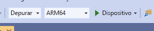

# <a name="quickstart-deploy-native-c-sample-to-hololens"></a>Início Rápido: Implantar exemplo nativo do C++ no HoloLens

Este início rápido aborda como implantar e executar o aplicativo de tutorial nativo do C++ em um HoloLens 2.

Neste início rápido, você aprenderá a:

> [!div class="checklist"]
>
>* Criar o aplicativo de tutorial para o HoloLens.
>* Alterar as credenciais de ARR no código-fonte.
>* Implantar e executar o exemplo no dispositivo.

## <a name="prerequisites"></a>Pré-requisitos

Para obter acesso ao serviço do Azure Remote Rendering, primeiro você precisa [criar uma conta](../../../how-tos/create-an-account.md).

O seguinte software deve ser instalado:

* SDK do Windows 10.0.18362.0 [(baixar)](https://developer.microsoft.com/windows/downloads/windows-10-sdk)
* A versão mais recente do Visual Studio 2019 [(baixar)](https://visualstudio.microsoft.com/vs/older-downloads/)
* [Ferramentas do Visual Studio para Realidade Misturada](/windows/mixed-reality/install-the-tools). Especificamente, as seguintes instalações de *carga de trabalho* são obrigatórias:
  * **Desenvolvimento para desktop com C++**
  * **Desenvolvimento da UWP (Plataforma Universal do Windows)**
* GIT [(baixar)](https://git-scm.com/downloads)

## <a name="clone-the-arr-samples-repository"></a>Clonar o repositório de exemplos do ARR

Como uma primeira etapa, clonamos o repositório Git, que abriga os exemplos globais do Azure Remote Rendering. Abra um prompt de comando (digite `cmd` no menu iniciar do Windows) e mude para um diretório no qual é interessante armazenar o projeto de exemplo do ARR.

Execute os seguintes comandos:

```cmd
mkdir ARR
cd ARR
git clone https://github.com/Azure/azure-remote-rendering
```

O último comando cria um subdiretório no diretório do ARR que contém os vários projetos de exemplo para o Azure Remote Rendering.

O tutorial de C++ do HoloLens pode ser encontrado no subdiretório *NativeCpp/HoloLens*.

## <a name="build-the-project"></a>Compilar o projeto

Abra o arquivo de solução *HolographicApp. sln* localizado no subdiretório *NativeCpp/HoloLens* com o Visual Studio 2019.

Alterne a configuração de Build para *Depuração* (ou *Versão*) e *ARM64*. Verifique também se o modo do depurador está definido como *Dispositivo* em vez de *Computador Remoto*:



Como as credenciais da conta são codificadas no código-fonte do tutorial, altere-as para credenciais válidas. Para isso, abra o arquivo `HolographicAppMain.cpp` dentro do Visual Studio e altere a parte em que o cliente é criado dentro do construtor da classe `HolographicAppMain`:

```cpp
// 2. Create Client
{
    // Users need to fill out the following with their account data and model
    RR::SessionConfiguration init;
    init.AccountId = "00000000-0000-0000-0000-000000000000";
    init.AccountKey = "<account key>";
    init.RemoteRenderingDomain = "westus2.mixedreality.azure.com"; // <change to the region that the rendering session should be created in>
    init.AccountDomain = "westus2.mixedreality.azure.com"; // <change to the region the account was created in>
    m_modelURI = "builtin://Engine";
    m_sessionOverride = ""; // If there is a valid session ID to re-use, put it here. Otherwise a new one is created
    m_client = RR::ApiHandle(RR::RemoteRenderingClient(init));
}
```

Especificamente, altere os seguintes valores:
* `init.AccountId`, `init.AccountKey` e `init.AccountDomain` para usar os dados de sua conta. Veja o parágrafo sobre como [recuperar informações da conta](../../../how-tos/create-an-account.md#retrieve-the-account-information).
* Especifique onde criar a sessão de renderização remota modificando a parte da região da cadeia de caracteres `init.RemoteRenderingDomain` para outras regiões diferentes de `westus2`, por exemplo, `"westeurope.mixedreality.azure.com"`.
* Além disso, `m_sessionOverride` pode ser alterada para uma ID de sessão existente. As sessões podem ser criadas fora deste exemplo, por exemplo, usando [o script do PowerShell](../../../samples/powershell-example-scripts.md#script-renderingsessionps1) ou a [API REST da sessão](../../../how-tos/session-rest-api.md#create-a-session) diretamente.
A criação de uma sessão fora do exemplo é recomendada quando o exemplo deve ser executado várias vezes. Se nenhuma sessão for passada, o exemplo criará uma nova sessão após cada inicialização, o que pode levar vários minutos.

Agora o aplicativo pode ser compilado.

## <a name="launch-the-application"></a>Iniciar o aplicativo

1. Conecte o HoloLens com um cabo USB ao seu PC.
1. Ative o HoloLens e aguarde até que o menu iniciar seja exibido.
1. Interrompa o Depurador no Visual Studio (F5). Ele implantará automaticamente o aplicativo no dispositivo.

O aplicativo de exemplo deve ser iniciado e um painel de texto deve aparecer informando você sobre o estado atual do aplicativo. O status no momento da inicialização é iniciando uma nova sessão ou conectando-se a uma sessão existente. Após a conclusão do carregamento do modelo, o modelo de mecanismo interno aparecerá diretamente na posição da sua cabeça. Em termos de oclusão, o modelo do mecanismo interage corretamente com o cubo giratório que é renderizado localmente.

 Se desejar iniciar o exemplo uma segunda vez mais tarde, você também poderá encontrá-lo no menu iniciar do HoloLens, mas observe que talvez exista uma ID de sessão expirada compilada nele.

## <a name="next-steps"></a>Próximas etapas

Este guia de início rápido se baseia no resultado de um tutorial que explica como integrar todas as peças relacionadas ao Remote Rendering em um *aplicativo holográfico* padrão. Para saber quais etapas são necessárias, siga este tutorial:

> [!div class="nextstepaction"]
> [Tutorial: Integrar o Remote Rendering a um aplicativo holográfico do HoloLens](../../../tutorials/native-cpp/hololens/integrate-remote-rendering-into-holographic-app.md)