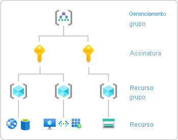
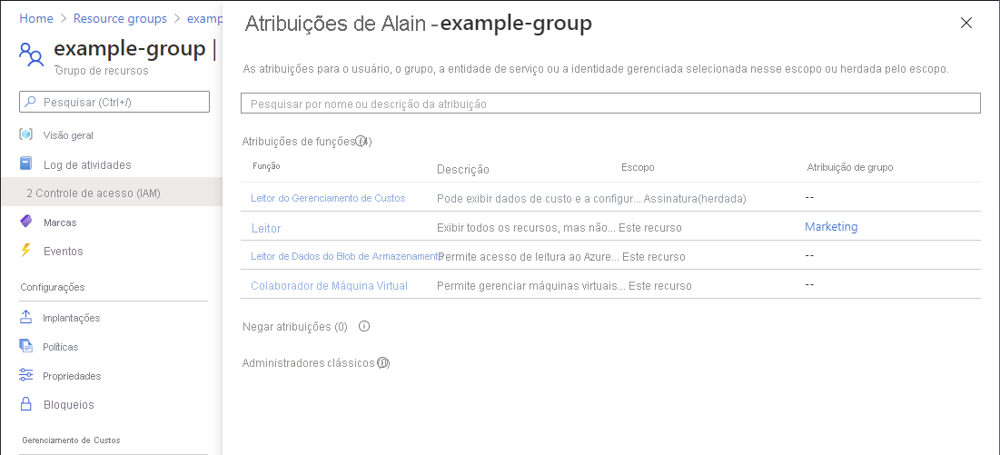

# Início Rápido: Verificar o acesso que um usuário tem aos recursos do Azure

Às vezes, você precisa verificar o acesso que um usuário tem a um conjunto de recursos do Azure. Você verifica o acesso dele listando as atribuições que ele tem. Uma forma rápida de verificar o acesso de um usuário é usar o recurso **Verificar acesso** na página **Controle de acesso (IAM)** .

## Etapa 1: Abrir os recursos do Azure

Para verificar o acesso de um usuário, primeiro você precisa abrir os recursos do Azure para os quais deseja verificar o acesso. Os recursos do Azure são organizados em níveis que normalmente são chamados de *escopo*. No Azure, você pode especificar um escopo em quatro níveis de amplo até restrito: grupo de gerenciamento, assinatura, grupo de recursos e recurso.

Siga estas etapas para abrir o conjunto de recursos do Azure para o qual você deseja verificar o acesso.

1. Abra o [Portal do Azure](https://portal.azure.com).

1. Abra o conjunto de recursos do Azure, como **Grupos de gerenciamento**, **Assinaturas**, **Grupos de recursos** ou um recurso específico.

1. Clique no recurso específico nesse escopo.

    A seguir é mostrado um exemplo de grupo de recursos.

    

## Etapa 2: Verificar o acesso de um usuário

Siga estas etapas para verificar o acesso de um usuário, um grupo, uma entidade de serviço ou uma identidade gerenciada aos recursos do Azure previamente selecionados.

1. Clique em **IAM (Controle de Acesso)**.

    O exemplo a seguir mostra a página Controle de acesso (IAM) para um grupo de recursos.

    

1. Na guia **Verificar acesso**, na lista **Localizar**, selecione o usuário, o grupo, a entidade de serviço ou a identidade gerenciada para o qual você deseja acesso.

1. Na caixa de pesquisa, insira uma cadeia de caracteres para pesquisar no diretório nomes de exibição, endereços de e-mail ou identificadores de objetos.

    

1. Clique na entidade de segurança para abrir o painel **atribuições**.

    Nesse painel, você pode ver o acesso para a entidade de segurança selecionada nesse escopo e herdada para esse escopo. As atribuições em escopos filho não estão listadas. Você verá as seguintes atribuições:

    - Atribuições de função adicionadas com o Azure RBAC.
    - Atribuições de negação adicionadas usando o Azure Blueprints ou os aplicativos gerenciados do Azure.
    - Atribuições de Administrador de serviços ou Coadministrador clássicas para implantações clássicas. 

    

## Etapa 3: Verifique seu acesso

Siga estas etapas para verificar seu acesso aos recursos do Azure selecionados anteriormente.

1. Clique em **IAM (Controle de Acesso)**.

1. Na guia **Verificar acesso**, clique no botão **Exibir meus acessos**.

    Um painel atribuições é exibido para listar seu acesso nesse escopo e herdado para esse escopo. As atribuições em escopos filho não estão listadas.

    

## Próximas etapas

> [!div class="nextstepaction"]
> [Listar atribuições de função do Azure usando o portal do Azure](role-assignments-list-portal.md)
